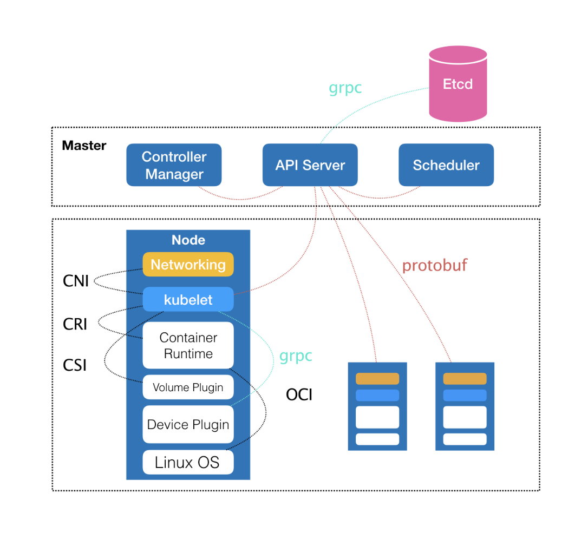
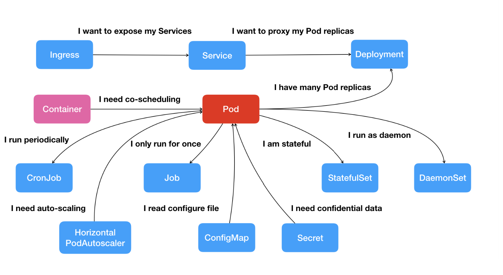

# 自己动手写docker

将应用打包成一个**标准格式**的镜像，并以**容器**的方式的运行。将一系列软件包装在一个完整的文件系统中。

* 轻量级，同一宿主机的容器**共享系统Kernel**。镜像以分层文件系统构造，可以**共享相同的文件**。
* 开放，基于开放标准
* 安全，将各个程序隔离

Docker容器**不与任何基础设施绑定**，可以运行在任何电脑、IDC、云上。

## Go

## Namespace

## Cgroups

## Union File System

## runC

由Docker公司的**libcontainer**项目发展起来，托管于**OCI**组织，是一个轻量级的容器运行引擎，包括所有Docker使用的和容器相关的系统调用的代码：

* 完全支持Linux Namespace
* 原生支持所有Linux安全特性：SElinux、Apparmor 、Seccomp、cgroups、capability、pivot_root。
* 在CRIU项目的支持下原生支持容器热迁移
* 正式的容器标准，由**Open Container Project**管理挂靠在Linux基金会下

构造到处可以运行的标准容器。

### OCI标准包

把容器和它的配置数据存储到磁盘上以便运行时读取。

* config.json,包括容器的配置数据，必须在容器的root文件系统上
* 一个文件夹，代表容器的root文件系统

#### config.json

包含容器必需的元数据信息，主要包括容器需要去运行的进程、环境变量、沙盒环境

```json
ociVersion: "oci容器版本号",
root: {
    path: "root文件系统的路径",
    readonly: "是否只读"
},
//配置额外的挂载点
mounts: {
    destination: "挂载点在容器内的目标位置，必须是绝对路径",
    type: "文件系统类型，必须是linux kernel支持的",
    source: "设备名或文件名",
    options: "挂载点额外需要的信息"
},
//容器进程信息
process: {
    terminal: "是否需要连接一个终端到此进程",
    consoleSize: "terminal连接时，控制台大小",
    cwd: "可执行文件的工作目录，必须绝对路径",
    env: "传递给进程的环境变量，格式必须为Key=value格式",
    args: "传递给可执行文件的参数",
    capabilities: "一系列指定给容器进程的capabilities值",
    rlimits: "限制容器内执行的进程资源使用量"
},
//容器内运行进程的用户信息
user: {
    uid: "",
    gid: "",
    addtionalGids: "附加的groups ID"
},
hostname: "容器主机名",
//容器运行的系统信息
platform: {
    os: "",
    arch: ""
},
//扩展容器运行态的动作
hooks: {
	prestart: {
        path: "/usr/bin/fix-mounts",
        args: ["fix-mounts", "args1", "args2"],
        env: ["key1=value1"]
    },
	postart: "",
	poststop: ""    
}
```

## containerd

管理机器上所有容器的生命周期，开源时为了提供一个更加开放、稳定的容器运行基础设施。

并不是面向最终用户的，而是主要集成到更上层的系统，比如Swarm、Kubernetes、Mesos等**容器编排系统**。

**containerd**以daemon的形式运行在系统上，通过unix domain socket暴露底层的**gRPC API**,上层系统通过这些API管理机器上的容器。每个containerd只负责一台机器，pull镜像、对容器的操作、网络、存储等。

具体容器运行由runC负责，实际上，只要是**符合OCI规范的容器**都可以支持。

[浅谈 containerd 架构及高级技巧 - 知乎 (zhihu.com)](https://zhuanlan.zhihu.com/p/437546569)

## CRI

Container Runtime Interface,**容器运行时接口**，是一组接口规范。这一插件规范让Kubernetes无须重新编译就可以使用更多容器运行时。

Kubernetes通过gRpc框架于**CRI shim**进行通信，CRI shim通过Unix Socket启动一个**gRpc server**提供容器运行时服务，Kubernetes作为**gRpc client**。

**gRpc Server**使用prootcol buffers提供两类gRpc Service：**ImageService、RuntimeService**。前者负责拉取镜像、删除镜像、查询镜像；后者提供容器的相关生命周期管理（创建、销毁）及容器的交互操作（exec/attach/port-forward）

CRI存在之前，容器运行时需要通过实现kubernet里的high-level接口才能集成进来。需要了解整个架构，并且会将代码合并到Kubernets主项目里。而CRI可以做到可插拔的容器运行时。

* 不是所有容器都支持Pod这个概念，为了集成，需要实现一个shim
* 高层次的接口让代码共享和重用变得困难
* Pod Spec演化很快，任何Pod级别修改都会导致容器运行时的修改。

Kubernetes有Pod级别的资源接口，如果直接对Pod做抽象，CRI可以自己实现容器的控制逻辑和状态转换，可以极大简化API，但是：

* Kubernetes有很多Pod级别的功能和机制（如循环崩溃的处理），交给容器运行时实现，会造成很重负担
* Pod标准不断改进，很多新功能都是由Kubernetes直接管理容器，而无需容器运行时进行变更

因此，CRI选择围绕容器实现

# Kubernetes深入剖析

重新定义基础设施对应用编排与管理的种种可能。

## Cloud Foundry

**pass**项目，“应用托管”

Cloud Foundry,**应用的打包和分发机制**。为每种主流编程语言定义一种打包格式。`cf push`的作用，等同于用户把应用的可执行文件和启动该脚本打进一个**压缩包**，上传到Cloud Foundry，接着，cf会通过**调度器**选择一个可以运行这个应用的**虚拟机**，然后通过这个**机器的agent**把应用包下载下来启动。

由于一个虚拟机上会启动多个来自不同用户的应用。**cf**调用操作系统的Cgroups和Namespace机制为每一个应用单独创建一个“**沙盒**”隔离环境。

Docker实际只是一个同样使用Cgroups和Namespace实现的“**沙盒**”。

## Docker

同期**PaaS产品**存在的问题：一旦用上PaaS，就必须为每种语言、每种框架，甚至每个版本的应用**维护一个打好的包**。这个打包过程很**混乱**，要考虑本地和远端pass的适配性。

* 解决了应用打包和发布困扰运维人员多年的技术难题。
* 第一次把一个纯后端的技术概念，通过友好的设计和封装，交到广大开发者群体。

Docker从发布之初就全面发力，从技术、社区、商业、市场全方位争取到的开发者群体。实际上是为了此后吸引整个生态到自家的“PaaS”的**铺垫**。只不过这时，**PaaS**定义已经全然不是Cloud Foundry描述的样子，而是变成了一套以Docker容器为核心技术，以Docker镜像为打包标准的、全新的”**容器化思路**“。

而**Swarm**项目，正是接下来承接Docker公司所有这些努力的关键。

### Docker镜像

比起其他pass压缩包中可执行文件+启动脚本要丰富多。大多数docker镜像直接由一个完整操作系统的所有文件和目录构成，压缩包内容和本地和测试环境的操作系统是完全一样的。

**提供一套非常便利的打包机制，本地环境和云端环境的高度一致**

#### Caas

**Container-as-a-service**,Deis、Flynn在第一时间推出了Docker容器集群管理的开源项目。

Docker自家研发的“Docker原生”容器集群管理项目**Swarm**。

重新定义Pass

2013~2014年，以Cloud Foundry为代表的Pass项目，逐渐完成教育用户和开拓市场的艰巨任务，这个过程中，应用”打包“困难成为一个通病。

Docker项目的出现从根本上提供一个近乎完美的解决方案。

## Swarm

只有那些能够为用户提供平台层能力的应用，才会真正成为开发者关心和愿意付费的产品。

### CoreOS

提供定制化的操作系统，用户可以按分布式集群的方式，管理所有安装了这个操作系统的节点，用户在**集群里部署和管理应用**就像**使用单机**一样方便。

Docker项目发布后，其意识到”容器“的概念无缝集成到自己的方案中，从而为用户提供更高层次的PaaS能力。Docker对项目定位不满足，想让Docker提供更多平台层能力，就和CoreOS发生冲突

CoreOS推出自己研发的Rocket容器

Docker发布**Swarm**

相对于CoreOS依托于一系列开源项目（Container Linux操作系统，Fleet作业调度系统、system进程管理和rkt容器），一层层搭建起来的产品。Swarm项目则是以**一个完整的整体来对外提供集群管理功能**，其最大亮点是完全使用Docker项目原本的**容器管理API**完成集群管理。

### 云计算中编排

通过工具或配置完成一组虚拟机以及关联资源的定义、配置、创建、删除等工作，然后由云计算平台按照这些指定的逻辑来完成的过程。

收购Fig项目，第一个提出“**容器编排**”的概念，对Docker容器的一系列定义、配置和创建动作的管理

比如：需要部署应用容器A、数据库容器B、负载均衡容器C，Fig允许用户把A、B、C三个容器定义在一个配置文件，指定其关联关系。

**Fig**（收购后改名为**Compose**）就会把这些容器的定义和配置交给Docker API依照访问逻辑依次创建；而容器的关联关系，会交给Docker的Link功能写入hosts文件的形式进行配置。在配置文件里，可以定义容器的副本个数等参数，在加上Swarm的集群管理能力，就形成了PaaS。

容器生态中，其他项目：

* 负责处理容器网络的SocketPlane
* 负责容器存储的Flocker项目
* 给Docker集群做图形化管理界面和对外提供云服务的Tutum

### Mesos

Marathon项目，其竞争力：超大规模集群的管理经验

## OCI

将容器运行时和镜像的实现从Docker项目中完全剥离。

## CNCF

以Kubernetes为基础，建立一个由开源基础设施领域厂商主导的、按照独立基金会方式运营的平台级社区，来对抗以Docker公司为核心的容器商业生态。

Borg

早期特性大多来自于Borg和Omega系统的内部特性，落地到Kubernetes上，就是Pod、Sidecar等功能和设计模式。Google公司在容器化基础设施领域多年实践经验的沉淀，避免和Swarm、Mesos社区同质化。

在已经囊括了容器监控事实标准的Prometheus项目后，CNCF社区迅速在成员项目中添加了Fluentd、OpenTracing、CNI等一系列容器生态的知名工具和项目。

面对此种竞争态势，Docker决定放弃Swarm项目，将容器编排和集群管理功能全部内置到Docker项目。

而Kubernetes，”**民主化**“架构，从API到容器运行时的每一层，都为开发者暴露了可以扩展的插件机制，因此容器社区中催生了大量的**基于Kubernetes API和扩展接口**的二次创新工作：

* 微服务治理项目**lstio**
* 状态应用部署矿建**Operator**
* Rook这种开源创业项目

2017开始，Docker公司将Docker项目的容器运行时部分Containerd捐赠给CNCF，将Docker项目改名为Moby，然后交由社区维护，而Docker公司的商业产品将占有Docker这个商标。

2017年，Docker宣布在企业版中内置Kubernetes。

## 容器技术基础

### Namespace

容器技术的核心功能:通过约束和修改进程的动态表现，从而为其创造出一个”**边界**“。

跟真实存在的虚拟机不同，使用Docker时，Docker项目帮助用户启动的还是原来的应用进程，只不过创建这些进程时加上了各种各样的**Namespace参数**。

**Namespace**技术修改了应用进程看待整个计算机的”视图“


**Docker Engine**不像**Hypervisor**那样对应用进程的隔离环境负责，也不会创建任何实体，真正对隔离环境负责的**宿主机操作系统**本身。Docker Engine在这里更多负责旁路式的辅助和管理工作。

使用**Hypervisor**作为应用沙盒，必须由Hypervisor负责创建虚拟机，这个虚拟机是真实存在的，必须运行一个完整的GuestOs。

”**敏捷**“、”**高性能**“是容器相较于虚拟机最大的优势，Linux Namespace相较于虚拟化技术有不足之处，**隔离的不彻底**

* 多个容器之间使用的还是同一个宿主机的操作系统内核。虽然可以通过Mount Namespace单独挂载其他不同版本的操作系统文件，但是仍共享宿主机内核。意味着，低版本Linux宿主机不能运行高版本的Linux容器。
* Linux中，很多资源和对象不能被Namespace化的，比如**时间**。实践中可以使用**Seccomp**等技术，对容器内部所有系统调用进行过滤和甄别来进行安全加固，但会拖累容器性能。

### Cgroups

**Linux Cgroups**，内核用来为进程设置资源限制的一个重要功能。能对进程进行优先级设置、审计，以及进程挂起和恢复等操作。

**/sys/fs/group**用文件形式暴露给用户，其中目录代表能被Cgroups限制的资源种类。

对于Docker等Linux容器项目来说，只需要在每个子系统下，为每个容器创建一个**控制组**，启动容器后，把进程的PID填写到对应**控制组**的tasks文件夹即可。

因此，容器中没办法同时运行两个不同的应用，除非事先找到一个公共的PID=1的进程来充当两个不同应用的父进程，这也就是很多人都会用**systemd**或**supervisord**这样的软件代替容器本身作为容器的启动进程。

”**单进程**”模型

Mount Namspace修改的，是容器进程对文件系统“**挂载点**”的认知。只有挂载这个操作发生后，进程的视图才会改变。对容器进程视图的改变，一定伴随着**挂载操作**才能生效。

**chroot**，改变进程的根目录到指定位置 TODO：此处实验死活找不到/bin/bash

实际上，**Mount Namspace**正是基于对**chroot的不断改良才发明出来的**,是linux操作系统的第一个namespace。

一般会在容器的根目录挂载一个完整操作系统的文件系统。而这个挂载在容器上，用来为**容器进程提供隔离后执行	环境系统的文件系统**，即所谓的**容器镜像**。**rootfs**（**只是一个操作系统所包含的文件、配置和目录，并不包括操作系统内核**）。

因此对于docker项目来说，最核心的原理实际上就是为待创建的用户进程：

* 启用Linux Namspace配置；
* 设置指定的Cgroups参数；
* 切换进程的根目录。会优先使用pivot_root,如果不支持，才会使用chroot。

### Union File System

将多个**不同位置的目录**联合挂载到**同一个目录**

Docker镜像使用的**rootfs**,往往由**多个层**组成，每层都是一个增俩个rootfs

* 只读层
* 可读可写，最上面一层，没有写入之前，这个目录是空的，删除文件，实际上是在可读写层创建了一个whiteout文件，两个层联合挂载时，被删除的文件就被遮挡了。可以使用docker commit,保存修改
* init层，是Docker单独生成的一个内部层，专门用来存放/etc/hosts等信息。这些文件本来属于只读层的一部分，但用户往往需要在启动容器时写入一些指定的值，但是**又不希望被commit**。

使用dockerfile时，容器启动参数为 ENTRYPOINT CMD，默认会提供一个隐含的entrypoint，即：**/bin/sh -c**

Dockerfile中每个原语执行后，**都会生成一个对应的镜像层**。即使原语本省并没有明显的修改文件的操作。

Docker exec怎么进入容器的？

一个进程的每种Linux namespace，**都在它对应的/proc/[进程号]/ns有一个对应的虚拟文件**，链接到一个真实的Namespace文件上。

这就意味着：一个进程，可以选择加入到某个进程已有的Namespace中，从而达到进入这个容器的目的。**setns**

docker commit,实际上是容器运行起来后，把最上层的“可读写层”，加上原先容器镜像的只读层，打包成一个新的镜像。下面只读层是宿主机共享。

在容器里对镜像rootfs的任何修改，都会被操作系统先复制到这个可读写层，然后在修改。

### Docker Registry

### Docker Volume

允许将宿主机上指定的目录或文件，挂载到容器里面进行读取和修改操作。

只需要在rootfs准备好之后，执行chroot之前，把Volume指定的宿主机目录，挂载到指定的容器目录。


## Kubernetes



**Master节点**：

运行大规模集群的各种任务之间，实际上存在各种各样的关系。这些**关系的处理**，才是作业编排和管理系统最困难的地方。

* kube-apiserver,负责api服务
* kube-scheduler,负责调度
* kube-controller-manager,负责容器编排

整个集群的持久化数据，则由kube-apiserver处理后保存到Etcd

**计算节点**：

kubelet主要负责同容器运行时打交道，依赖CRI（**Container Runtime Interface**）的远程调用接口。

还通过gRPC协议同Device Plugin的插件进行交互。这个插件是用来管理GPU等宿主机物理设备的主要组件。

调用网络插件、存储插件为容器配置网络和持久化存储。

如果只做到“封装微服务、调度单容器”，Docker Swarm + Compose已经足够了。比如，link两个容器，Docker项目会负责维护这个“link关系”，会将一个容器的详细信息注入到另一个容器。

Kubnernets项目**设计思想**：**从更宏观的角度，以统一的方式来定义任务之间的各种关系，并且为将来支持更多种类的关系留有余地**。

比如：

常规环境下，应用往往会被直接部署在同一台机器，通过localhost通信，通过本地磁盘目录交换文件。在k8s项目中，这些容器被划分为一个“**Pod**”，Pod里的容器共享同一个Network namespace、同一组数据卷。

另一种常见需求，Web应用、数据库之间访问关系。往往不部署在同一个机器上。K8s项目做法是给**Pod绑定一个Service服务**,而Service服务声明的IP地址等信息是“终生不变”的。这个**Service**主要作用，就是**作为Pod的代理入口，从而代替Pod对外暴露一个固定的网址**。



### 核心设计理念

“**声明式API**”。这种API对应的”**编排对象**“和“**服务对象**”，都是K8s中的**API对象**。比如：

* 首先，通过一个“编排对象”，比如Pod、Job、CronJob,来描述视图管理的应用。
* 然后，在为它定义一些“服务对象”，比如Service、Secret。这些对象负责具体的平台级功能。

K8s项目的本质，是为用户提供一个具有普遍意义的容器编排工具，更重要的是，它提供了**一套居于容器构建分布式系统的基础依赖**。

### Kubeadm

部署时，K8s的每一个组件都是一个需要被执行的、单独的二进制文件。类似SaltStack这样的运维工具或者由社区维护的脚本的功能，**就是把这些二进制文件传输到指定的机器，然后编写脚本来启停这些组件**。

Kubeadm解决方案：把kubelet直接运行在宿主机上，使用容器部署其他的K8s组件。

[最详细的ubuntu 安装 docker教程 - 知乎 (zhihu.com)](https://zhuanlan.zhihu.com/p/651148141)


# docker容器与容器云

## docker安装

* 只支持64位CPU架构计算机
* 系统Linux版本为3.10及以上
* Linux需开启cgroups、namespace功能
* 对于非linux内核平台，需安装使用Boot2Docker

## docker底层技术+架构

## docker镜像管理

docker镜像是容器的静态视角，docker容器是镜像的运行状态。

传统linux操作系统启动时，首先挂载一个只读的rootfs，当系统检测其完整性后，在将其切换为读写模式。

* 分层
* 写时复制
* 内容寻址，根据文件内容索引镜像层
* 联合挂载


