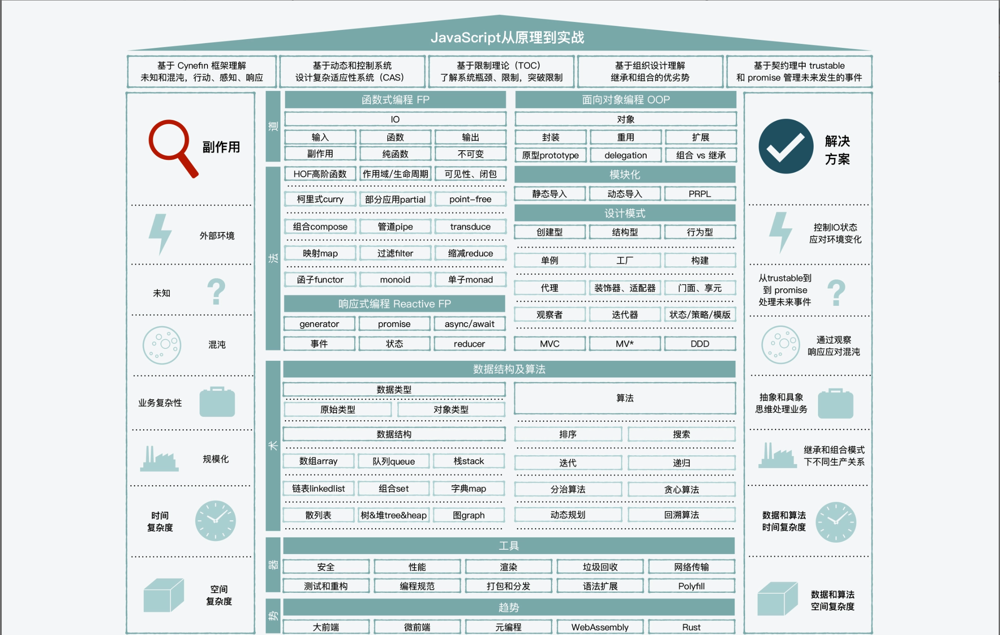

# 《javascript进阶实战》

[HTML5 Boilerplate: The web’s most popular front-end template](https://html5boilerplate.com/)

[JavaScript Patterns (shichuan.github.io)](http://shichuan.github.io/javascript-patterns/)

## Cynefin框架

### Monad

函数式编程的一个概念。

[图解 Monad - 阮一峰的网络日志 (ruanyifeng.com)](https://ruanyifeng.com/blog/2015/07/monad.html)

**围绕一个“值”来组织各种方法**。所以无论是js自身带的array.map,还是React中observer、reducer。都是在复杂系统、不确定性和混沌中，帮助我们去行动、感知和响应，解决各种副作用，提供性能的方法和工具。

## 函数式编程

函数将算法封装了起来，函数里是相对可控的，不可控的是外部的环境

* **全局变量**，函数中修改了全局变量。
* **IO影响**，比如键盘输入输出，服务器端的文件读写
* **网络请求**

减少副作用

* 纯函数，函数返回结果的变化只依赖其参数，并且执行过程没有副作用。**强调自身的稳定性，对结果只影响一次**。
* 不可变，减少程序被外界影响时，也要减少对外部的影响，所以不要改变传入的参数。**强调和外界的交互中，尽量减少相互间负面的影响**。

## 面向对象编程

**工具**和**方法**是服务于**对象**的。

函数和对象组成了**生产力**，那么封装、重用、继承、组合则可以用来组成**生产关系**。

“组合”优于“继承”？？？

### 基于原型的继承

在javascript中，继承更像是一种“授权”，而不是传统意义上的”父子“

### 闭包 vs 对象

闭包能**突破生命周期和作用域的限制**

闭包和对象都可以对一个状态值进行封装处理，两者是同形态的，但是在隐私、状态拷贝和性能上，还是有差别的。

* 属性的查找、修改。闭包只能通过接口，对象也可以通过`freeze`控制不能写。
* 状态的拷贝。闭包方式更难实现拷贝。对象更容易拷贝，如果有大量的拷贝，可以使用immutable.js之类的解决方案。
* 性能。