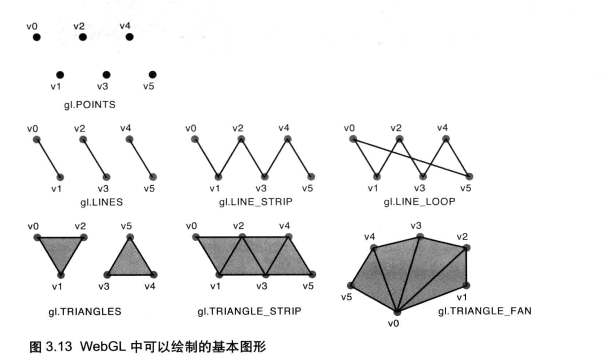

默认情况下，canvas是**透明**的

gl.clearColor()指定背景色之后，就会**常驻**WebGL系统

gl.clear()继承自OpenGL,基于**多基本缓冲区**类型，传递**gl.COLOR_BUFFER_BIT**代表清空**颜色缓冲区**,还有深度缓冲区和模板缓冲区

GLSL ES是一种强类型的语言

**齐次坐标**：（x,y,z,w）,等价于三维坐标（x/w,y/w,z/w）,w的值必须是大于等于0的。齐次坐标的存在，使得用**矩阵乘法来描述顶点变换**成为可能。三维图形系统在计算过程中，通常使用齐次坐标来表示顶点的三维坐标。

顶点着色器控制点的位置和大小，片元着色器控制点的颜色，**vec4 gl_FragColor**是片元着色器的**唯一**内置变量

**WebGL坐标系统**

默认情况下WebGL使用右手坐标系。**实际上，WebGL既不是右手坐标系，又不是左手坐标系**。？？？？

将位置信息从javascript程序中传递给顶点着色器：**attribute**变量和**uniform**变量。attribute传输的是那些与顶点相关的数据，uniform传递的是那些对于所有顶点都相同的数据。

attribute变量**只有在顶点着色器**能使用它

向attribute变量赋值：

​	gl.vertexAttrib1f、gl.vertexAttrib2f、gl.vertexAttrib3f、gl.vertexAttrib4f分别传递1、2、3、4个分量到attribute变量中

类似的也有uniform变量同簇函数

使用**缓冲区**向变量传递的步骤：

* 创建缓冲区gl.creaeBuffer
* 绑定缓冲区gl.bindBuffer，gl.ARRAY_BUFFER表示缓冲区对象中包含了顶点的数据
* 将数据写入缓冲区gl.bufferData
* 将缓冲区对象分配给一个attribute变量gl.vertexAttribPointer
* 开启attribute变量

一旦将一个attribute变量绑定到缓冲区，就不能用gl.vertexAttrib{n}f向其传递数据了

类型化数组：为了绘制三维图形，WebGL通常需要处理大量相同类型的数据，为了优化性能，WebGL为每种基本数据类型引入了一种特殊的数组（**类型化数组**）。浏览器实现知道数组中的数据类型，处理起来更加**有效率**。

**gl.drawArrays**第一个参数的含义

| 点     | gl.points         | 一系列点                                                     |
| ------ | ----------------- | ------------------------------------------------------------ |
| 线段   | gl.LINES          | 一系列单独的线段，（v0,v1）,(v2,v3),如果是奇数，会忽略最后一个 |
| 线条   | gl.LINE_STRIP     | 一系列连接的线段，被绘制在(v0,v1)、(v1,v2)、（v2,v3）        |
| 回路   | gl.LINE_LOOP      | 一系列连接的线段，被绘制在(v0,v1)、(v1,v2)、.....、(vn,v0),闭合图形 |
| 三角形 | gl.TRIANGLES      | 一系列单独的三角形，绘制在(v0,v1,v2)、（v3,v4,v5）,如果点个数不是3的整数倍，会忽 |
| 三角带 | gl.TRIANGLE_STRIP | 一系列带状的三角形，绘制在(v0,v1,v2)、（v2,v1,v3）、（v2,v3,v4），前三个点构成一个三角形，从第2个点开始的三个点构成第二个三角形 |
| 三角扇 | gl.TRIANGLE_FAN   | 一系列三角形组成的类似扇形，绘制在(v0,v1,v2)、（v0,v2,v3）、（v0,v3,v4） |

vec4的变量可以相加

图形常见的变换：

* 平移，顶点的的分量都加上一个值
* 旋转，涉及到旋转轴、旋转方向、旋转角度

变换的坐标可以通过代数计算出来，但是比较繁琐，**变换矩阵**就很合适操作计算机图形

只有矩阵的列数和矩阵的行数相等时才能相乘（矩阵的列数代表有几个基向量、矢量的行数也代表它有几个方向的分量）

三维空间，任何一个点可以由三个分量表示，但是如果是平移，此时会在三个分量的大小加上一个标量，此时就需要四维矩阵来表示这个变换

vec4 * mat4，着色器内部内置常见矢量和变换矩阵的运算

mat类型变量也是通过类型化数组传递给WebGL的，可以用两种方式传递，**按行主序**和**按列主序**。WebGL和OpenGL一样，矩阵元素是按列主序存储在数组中的。

**gl.uniformMatrix4fv(location,Transpose,array)**,其中第二个参数表示矩阵是否转置，因为**WebGL没有提供矩阵转置**的实现，所以必须为false

OpenGL中提供了一系列函数帮助开发者创建变换矩阵，但是WebGL**没有提供**类似的矩阵函数

