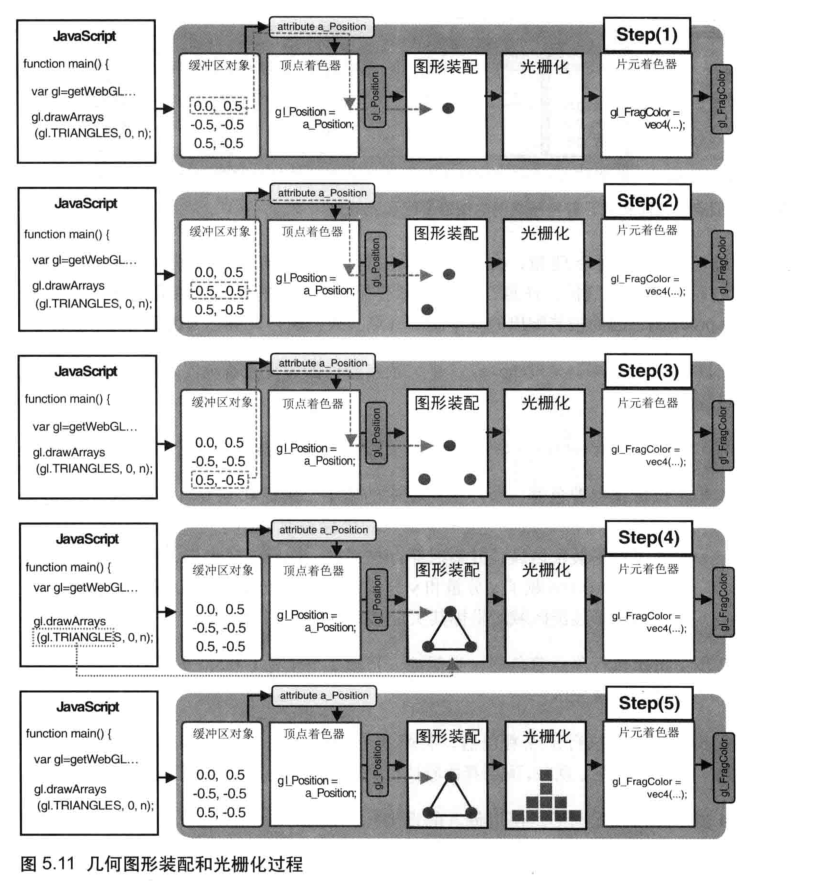

默认情况下，canvas是**透明**的

gl.clearColor()指定背景色之后，就会**常驻**WebGL系统

gl.clear()继承自OpenGL,基于**多基本缓冲区**类型，传递**gl.COLOR_BUFFER_BIT**代表清空**颜色缓冲区**,还有深度缓冲区和模板缓冲区

GLSL ES是一种强类型的语言

**齐次坐标**：（x,y,z,w）,等价于三维坐标（x/w,y/w,z/w）,w的值必须是大于等于0的。齐次坐标的存在，使得用**矩阵乘法来描述顶点变换**成为可能。三维图形系统在计算过程中，通常使用齐次坐标来表示顶点的三维坐标。

顶点着色器控制点的位置和大小，片元着色器控制点的颜色，**vec4 gl_FragColor**是片元着色器的**唯一**内置变量

**WebGL坐标系统**

默认情况下WebGL使用右手坐标系。**实际上，WebGL既不是右手坐标系，又不是左手坐标系**。？？？？

将位置信息从javascript程序中传递给顶点着色器：**attribute**变量和**uniform**变量。attribute传输的是那些与顶点相关的数据，uniform传递的是那些对于所有顶点都相同的数据。

attribute变量**只有在顶点着色器**能使用它

向attribute变量赋值：

​	gl.vertexAttrib1f、gl.vertexAttrib2f、gl.vertexAttrib3f、gl.vertexAttrib4f分别传递1、2、3、4个分量到attribute变量中

类似的也有uniform变量同簇函数

使用**缓冲区**向变量传递的步骤：

* 创建缓冲区gl.creaeBuffer
* 绑定缓冲区gl.bindBuffer，gl.ARRAY_BUFFER表示缓冲区对象中包含了顶点的数据
* 将数据写入缓冲区gl.bufferData
* 将缓冲区对象分配给一个attribute变量gl.vertexAttribPointer
* 开启attribute变量

一旦将一个attribute变量绑定到缓冲区，就不能用gl.vertexAttrib{n}f向其传递数据了

类型化数组：为了绘制三维图形，WebGL通常需要处理大量相同类型的数据，为了优化性能，WebGL为每种基本数据类型引入了一种特殊的数组（**类型化数组**）。浏览器实现知道数组中的数据类型，处理起来更加**有效率**。

**gl.drawArrays**第一个参数的含义

| 点     | gl.points         | 一系列点                                                     |
| ------ | ----------------- | ------------------------------------------------------------ |
| 线段   | gl.LINES          | 一系列单独的线段，（v0,v1）,(v2,v3),如果是奇数，会忽略最后一个 |
| 线条   | gl.LINE_STRIP     | 一系列连接的线段，被绘制在(v0,v1)、(v1,v2)、（v2,v3）        |
| 回路   | gl.LINE_LOOP      | 一系列连接的线段，被绘制在(v0,v1)、(v1,v2)、.....、(vn,v0),闭合图形 |
| 三角形 | gl.TRIANGLES      | 一系列单独的三角形，绘制在(v0,v1,v2)、（v3,v4,v5）,如果点个数不是3的整数倍，会忽 |
| 三角带 | gl.TRIANGLE_STRIP | 一系列带状的三角形，绘制在(v0,v1,v2)、（v2,v1,v3）、（v2,v3,v4），前三个点构成一个三角形，从第2个点开始的三个点构成第二个三角形 |
| 三角扇 | gl.TRIANGLE_FAN   | 一系列三角形组成的类似扇形，绘制在(v0,v1,v2)、（v0,v2,v3）、（v0,v3,v4） |


vec4的变量可以相加

图形常见的变换：

* 平移，顶点的的分量都加上一个值
* 旋转，涉及到旋转轴、旋转方向、旋转角度

变换的坐标可以通过代数计算出来，但是比较繁琐，**变换矩阵**就很合适操作计算机图形

只有矩阵的列数和矩阵的行数相等时才能相乘（矩阵的列数代表有几个基向量、矢量的行数也代表它有几个方向的分量）

三维空间，任何一个点可以由三个分量表示，但是如果是平移，此时会在三个分量的大小加上一个标量，此时就需要四维矩阵来表示这个变换

vec4 * mat4，着色器内部内置常见矢量和变换矩阵的运算

mat类型变量也是通过类型化数组传递给WebGL的，可以用两种方式传递，**按行主序**和**按列主序**。WebGL和OpenGL一样，矩阵元素是按列主序存储在数组中的。

**gl.uniformMatrix4fv(location,Transpose,array)**,其中第二个参数表示矩阵是否转置，因为**WebGL没有提供矩阵转置**的实现，所以必须为false

OpenGL中提供了一系列函数帮助开发者创建变换矩阵，但是WebGL**没有提供**类似的矩阵函数

现代浏览器都支持多个标签页，每个标签页具有单独的js运行环境，但是setInterval函数诞生之初，浏览器还没支持多标签页

**图形系统是如何绘图的：**

* **光栅**：几乎所有现代图形系统都是基于光栅来绘制图形的，光栅是**指构成图像的像素阵列**

数据经过**CPU**处理，成为具有**特定几何结构的几何信息**  **==>**  这些信息会被送到**GPU**中进行处理，在GPU中经过两个步骤生成**光栅信息**  **==>**  **光栅信息**会输出到**帧缓存**中，最后渲染到屏幕上 

对**给定的数据**结合绘图的**场景要素**（例如相机、光源、遮挡物体等）进行**计算**。为屏幕空间的**每个像素点**进行**着色**，把最终完成的图形输出到显示设备上。

**顶点着色器**：处理顶点的GPU代码，可以改变**顶点的信息**（如顶点坐标、法线方向、材质等），从而改变绘制出的图形的形状或大小

​			顶点处理完成后，WebGL会根据**顶点**的和绘图模式指定的**图元**，计算出需要**着色的像素点**，然后对它们执行片元着色器程序

​			WebGL从**顶点着色器**和**图元**提取**像素点**给**片元着色器**执行代码的过程，成为光栅化过程。

**片元着色器**：处理**光栅化**后的**像素信息**

可以通过为顶点的**每种数据**建立一个缓冲区，然后分配给对应的attribute变量，就可以向顶点着色器**传递多份**逐顶点的数据信息。比如顶点尺寸、顶点颜色、顶点纹理坐标

gl.vertexAttribPointer的**步进**和**偏移参数**

​	使用多个缓冲区对象向着色器传递多种数据，适合**数据量不大**的情况。WebGL允许把顶点的坐标和尺寸数据打包到**同一个缓冲区对象**，并通过某种机制**分别访问**缓冲区对象中**不同种类**的数据。

**varying变量**：从顶点着色器向片元着色器传输数据

varying变量只能是**float**(以及相关的vec2，vec3，vec4，mat2，mat3，mat4变量)

在WebGL中，如果顶点着色器与片元着色器中有**类型和命名都相同**的varying变量，那么顶点着色器赋给该变量的值就会被**自动地传入**片元着色器

在顶点着色器和片元着色器之间地步骤：

* 图形装配过程，将孤立地顶点坐标装配成几何图形
* 光栅化过程，将装配好地几何图形转化为片元




显示在屏幕上地三角形是由片元（像素）组成，将图形转化为片元的过程被成为**光栅化**，片元数目就是这个三角形最终在**屏幕上所覆盖的像素数**。

一旦光栅化过程结束后，**片元着色器**就开始**逐片元**调用着色器，对于每个片元，片元着色器**计算**出该片元的颜色，并**写入**颜色缓冲区。

顶点着色器中的v_color变量在传入片元着色器之前经过了**内插过程**,这就是将这种变量成为“varying”的原因

**内插过程**  《计算机图形学》

**纹理映射**：根据纹理图像，为之前光栅化后的每个片元涂上合适的颜色，组成纹理图像的像素又被称为**纹素**，每一个纹素的颜色都使用RGB或RGBA格式编码

WebGL纹理映射的步骤：

* 准备好纹理图像
* 为几何图形配置纹理映射方式
* 加载纹理图像，对其进行一些配置
* 在片元着色器中将相应的纹素从纹理中抽取出来，并将纹素的颜色赋给片元

**纹理坐标**：纹理图像上的坐标，通过纹理坐标可以在纹理图像上获取纹素颜色。WebGL系统中的纹理系统是二维，**st坐标系**。坐标值与图像自身的尺寸无关。

纹理坐标的t轴与JPG这些图像坐标的y轴**相反**

在WebGL中，**无法直接操作纹理对象**，必须通过将纹理对象**绑定**到**纹理单元**上，然后通过**操作纹理单元**操作纹理对象

Buffer和Texture是WebGL的两大数据来源

**纹理图像**--**纹理对象**--**纹理单元**      创建纹理对象，绑定纹理对象，激活纹理单元，设置纹理对象参数，将纹理图像分配给纹理对象

**配置纹理对象的参数**

​     以此来设置纹理图像映射到图形上的具体方式，如，如何根据纹理坐标来获取纹素颜色、按那种方式重复填充纹理

**gl.texParameteri(target,pname,param)**

**pname**

* **gl.TEXTURE_MAG__FILTER**：当纹理的绘制范围比纹理本身更大时，如何获取纹素。如，将16 x 16的纹理图像映射到32 x 32的像素空间时，纹理尺寸就变为了原来的两倍。WebGL需要填充由于放大而造成的像素间的空隙，该参数就表示填充这些空隙的方法。默认值**gl.LINEAR**
* **gl.TEXTURE_MIN__FILTER**：当纹理的绘制范围比纹理本身更小时，如何获取纹素。如，将32 x 32的纹理图像映射到16 x 16的像素空间时，纹理尺寸就只有原来的一半。为了将纹理缩小，WebGL就需要剔除纹理图像中部分像素，该参数就表示具体的剔除像素的方法。默认值**gl.NEAREST_MIPMAP_LINEAR**
* **gl.TEXTURE_WRAP_S**:如何对纹理图像左侧或右侧的区域填充。默认值**gl.REPEAT**
* **gl.TEXTURE_WRAP_T**:如何对纹理图像上或下的区域进行填充。默认值**gl.REPEAT**

gl.TEXTURE_MAG_FILTER 和 gl.TEXTURE_MIN_FILTER可用：

* gl.NEAREST:使用原纹理上距离映射后像素中心最近的哪个像素的值，曼哈顿距离
* gl.LINEAR:使用距离新中心最近的四个像素的颜色值的加权平均

gl.TEXTURE_WRAP_S和gl.TEXTURE_WRAP_T可用：

* gl.REPEAT：平铺式重复纹理
* gl.MIRRORED_REPEAT:镜像对称式的重复纹理
* gl.CLAMP_TO_EDGE:使用纹理图像边缘值

**gl.textImage2D(target,level,internalformat,format,type,image)**

level在使用金字塔纹理时用到，

internalformat图像的内部格式，format的纹理数据的格式，两者需要根据图像格式指定，**webgl中两者要保持一致**

type指定了纹理数据类型，通常用gl.UNSIGNED_BYTE数据类型（无符号整型，每个颜色分量占据一 字节）

**OpenGL ES着色器语言**

程序大小写敏感

每一个语句都应该以英文分号结尾

GLSL支持数值类型（整型、浮点型）、布尔值类型，不支持字符串类型

变量名数字母不能是数字，不能以gl_   、webgl_  、_webgl\_   开头

强类型语言

[VsCode安装shader glsl环境 - 知乎 (zhihu.com)](https://zhuanlan.zhihu.com/p/151384233)

**支持矢量和矩阵**

分别使用矢量构造函数、矩阵构造函数构造这两种类型数据

```glsl
vec3 v3=vec3(1.0,0.0,0.5);
vec2 v2=vec3(vec2);
vec4 v4=vec(1.0);
vec4 v4b=vec4(v2,v4);//先把v2的所有元素填进来，如果没填满，就继续用第二个参数填充
//存储在矩阵中的元素是按照列主序的
mat4 m4=(	1.0,2.0,3.0,4.0,
    		5.0,6.0,7.0,8.0,
		    9.0,10.0,11.0,12.0,
		    13.0,14.0,15.0,16.0);

vec2 v2_1 = vec2(1.0,3.0);
vec2 v2_2 = vec2(2.0,4.0);
mat2 m2_1 = mat2(v2_1,v2_2);

vec4 v4 = vec4(1.0,3.0,2.0,4.0);
mat2 m2_2=mat2(v4);

mat2 m2 = mat2(1.0,3.0,v2_2);

mat4 m4 = mat4(1.0);//对角线都是该元素

//顶点坐标：x、y、z、w；
//颜色坐标：r、g、b、a；
//纹理坐标分量：s、t、p、q；
vec2 v2 = v3.xy;//混合，从矢量中同时抽取出多个分量
//也可以用作左值
v2.xy=vec2(1.0,2.0);

//[]运算符:通过数组下标来访问矢量或矩阵的元素，索引值只能是常量索引值（整型字面量；const修饰的全局或局部变量，不包含函数参数；循环索引）

//TODO:
//矢量 + 浮点数
//矢量 + 矢量
//矩阵 * 浮点数
//矩阵右乘矢量
//矩阵左乘矢量
//矩阵 * 矩阵
```

结构体

数组，只支持一维数组，数组对象不支持pop、push

**取样器（纹理）**

内置类型-取样器(sampler),必须通过该类型变量访问纹理，sampler2D、samplerCube。取样器只能是uniform变量，唯一能赋值给取样器变量的就是纹理单元编号，必须使用gl.uniform1i进行赋值。

**discard**，只能在片元着色器中使用，表示放弃当前片元直接处理下一个片元。

**函数**：不能在函数内部调用它本身，目的也是为了便于编译器对函数进行内联展开。

**规范声明**：如果函数定义在其调用之后，必须在进行调用之前先声明该函数的规范。

**参数限定字**：in  out   inout   其中in是默认的、

**attribute变量**：只能出现在顶点着色器中，**只能是全局变量**，类型只能是float、vec2/3/4、mat2/3/4。顶点着色器能够容纳attribute变量的最大数目与设备有关，可以通过访问内置的全局变量来获取该值。不管设备配置如何，支持WebGL环境都支持**至少8个**attribute变量。

**uniform变量**：可以用在顶点着色器和片元着色器中，**必须是全局变量**。**只读**，可以是除了数组或结构体之外的任意类型。如果顶点和片元着色器声明了**同名**的uniform变量，会被两种着色器**共享**。**”一致“**（非逐顶点/逐片元的，各顶点或各片元共享）的数据。

**varying变量**：**必须是**全局变量，它的任务是**从顶点着色器向片元着色器传输数据**。必须在**两个着色器**中声明**同名、同类型**的varying变量。只能是float、vec2/3/4、mat2/3/4。

**精度限定字**：目的是帮助着色器程序提高运行效率，削减内存开支。**precision**声明着色器的默认精度

**数据类型的默认精度**：

| 着色器类型 | 数据类型    | 默认精度 |
| ---------- | ----------- | -------- |
| 顶点       | int         | highp    |
|            | float       | highp    |
|            | sampler2D   | lowp     |
|            | samplerCube | lowp     |
| 片元       | int         | mediump  |
|            | float       | **无**   |
|            | sampler2D   | lowp     |
|            | samplerCube | lowp     |

**预处理指令**

**三维**

**视点**:观察者所处的位置

**视线**：从视点出发沿着观察方向的射线

WebGL系统中，视点默认（0，0，0），视线为Z轴负半轴

**视点与物体是相对的，将视点移到远点，将视线移到z负方向，上方向向上，那么物体也要做相同的变换**

“**根据自定义的观察者状态，绘制观察者看到的景象**”==“**使用默认的观察状态，但是对三维对象进行平移、旋转等变换，再绘制观察者看到的景象**”

**模型矩阵**：平移、旋转、伸缩等矩阵

模型视图矩阵 = 视图矩阵 X 模型矩阵

虽然可以将三维物体放在三维空间中的任何地方，但是只有当它在**可视范围**内，WebGL才会绘制它。

除了水平和垂直范围内的限制，WebGL还限制观察者的可视深度。**可视空间**

**长方体可视空间**：正射投影，用户可以方便地比较场景中物体的大小，建筑平面图等技术何绘图场合

**四棱锥/金字塔可视空间**：透视投影，观察真实世界

canvas上显示就是可视空间中物体在**近裁剪面**上的投影。如果裁剪面的宽高比和canvas不一样，那么画面会被按照canvas的宽高比进行压缩，物体会被扭曲。近裁剪面与远裁剪面之间的盒型空间就是可视空间，只有在此空间内的物体会被显示出来。

**默认情况下**，WebGL为了加速绘图操作，是按照顶点在缓冲区的顺序处理它们的，后绘制的图形会覆盖先绘制

为了解决这个问题，WebGL提供了**隐藏面消除**，这个功能内嵌在WebGL，只需要简单开启。

gl.enable(gl.DEPTH_TEST)-->开启隐藏面消除功能，绘制之前清楚深度缓冲区gl.clear(gl.DEPTH_BUFFER_BIT)。

在任何三维场景都应该开启隐藏面消除，并在适当的时刻清空深度缓冲区（通常在绘制**每一帧之前**）

隐藏面消除的前提是正确设置可视空间。

**深度冲突**：当两个物体表面极为接近时，深度缓冲区有限的精度已经不能区分哪个在前、哪个在后。WebGL提供一种**多边形偏移**的机制解决这个问题。

通过**顶点索引**绘制物体:

gl.drawArrays--通过顶点绘制，gl.ARRAY_BUFFER

gl.drawElements--通过顶点索引绘制,gl.ELEMENT_ARRAY_BUFFER,管理具有索引结构的三维模型数据

通常不用手动创建顶点和索引数据，通过三维建模工具创建。

**光照原理**

点光源、平行光、环境光

漫反射

[webGL、webGPU、封装、渲染引擎 three.js、游戏引擎，定位是游戏开发，在前面的渲染引擎基础上，还提供了骨骼动画、物理引擎、AI、GUI 等功能，以及可视化编辑器来设计关卡，支撑大型游戏_红尘修心，三生有幸。的博客-CSDN博客_webgl能做大型游戏么](https://blog.csdn.net/weixin_35597398/article/details/119362035)


### 这些矩阵的推导，数学原理的学习

计算的目的不在于数学本身，而在于洞察其背后的意义。

向量的点乘

向量的叉乘

矩阵转置的性质

矩阵的逆

行列式

二维仿射变换

齐次坐标

三维仿射变换

​	绕x、y、轴旋转

​	绕任意轴旋转：先把轴平移大原点，然后对过原点的轴做旋转变换，最后平移变换在移回去

### 这些矩阵的推导，数学原理的学习

**翻译**：\<Fundamentals of computer grapahics fourth edition\>

可以等有一定的实践之后，在开始深入学习数学原理，而且学习这些数学原理时，要有目的性，不然很容易陷入恶性循环中

**关于图形学的下一步目标**：夯实webgl基础 => 阅读mapbox开源源码 => 使用学习ThreeJS，阅读其源码，做出更加酷炫的东西


