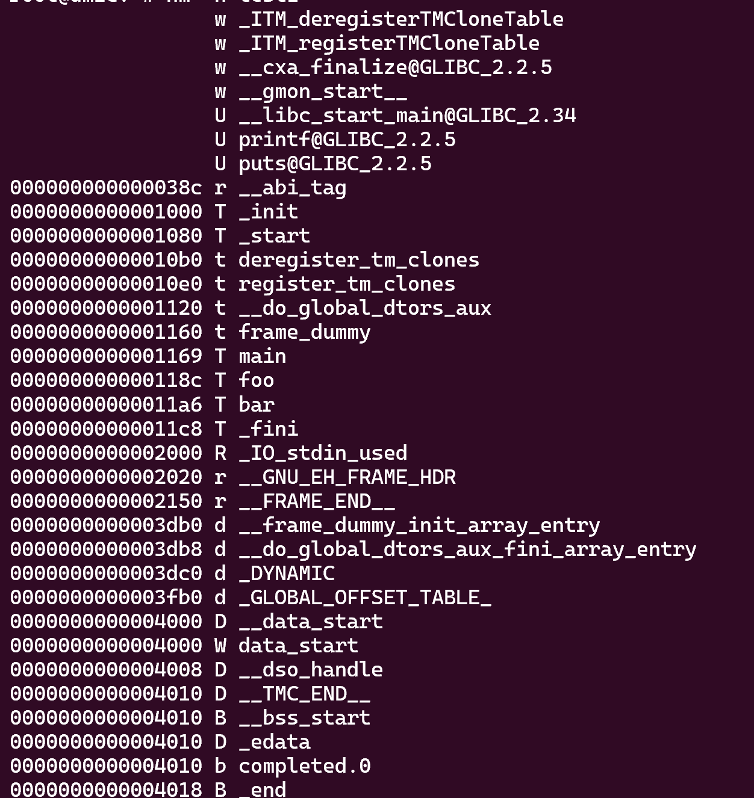
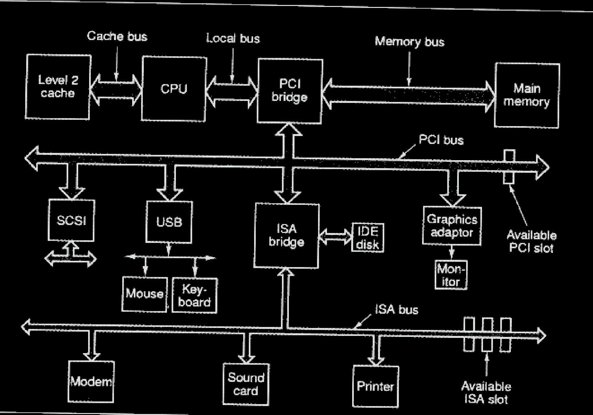
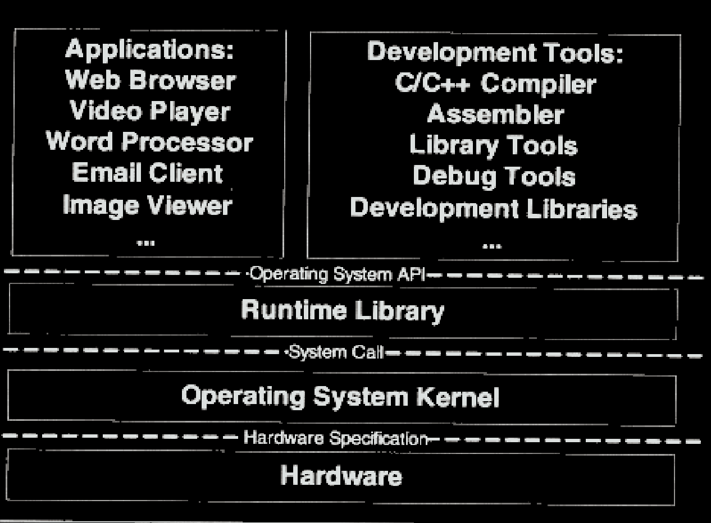
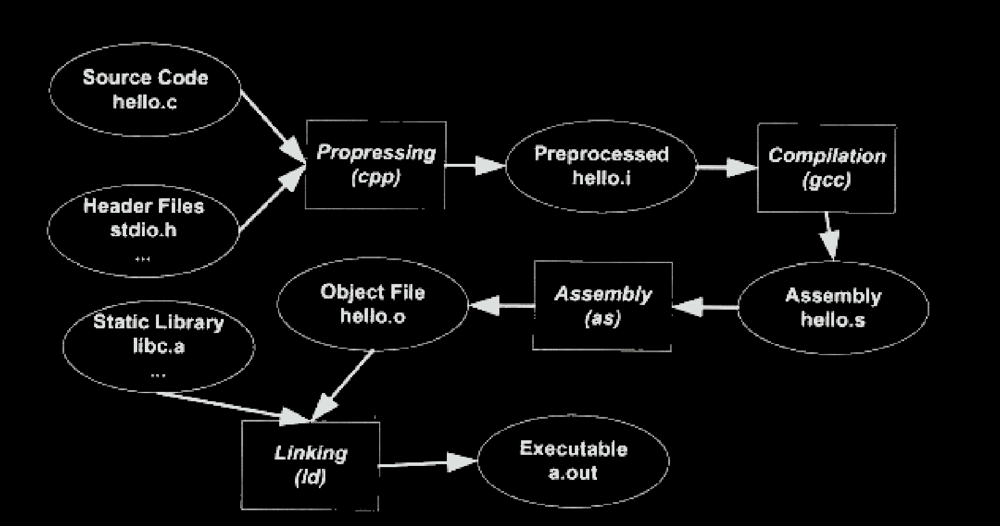
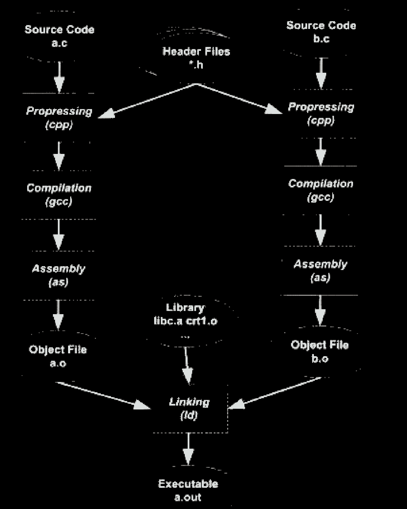
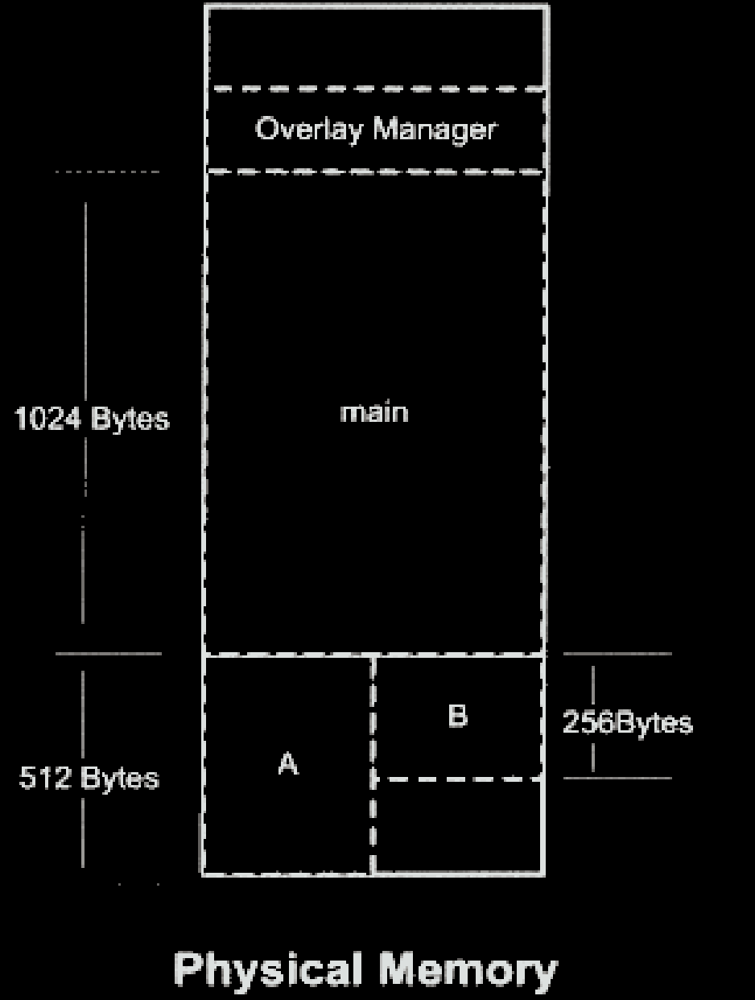
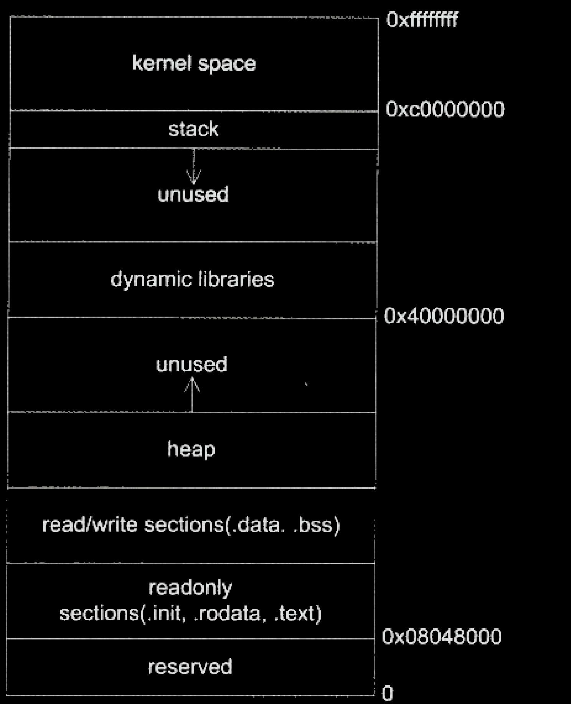
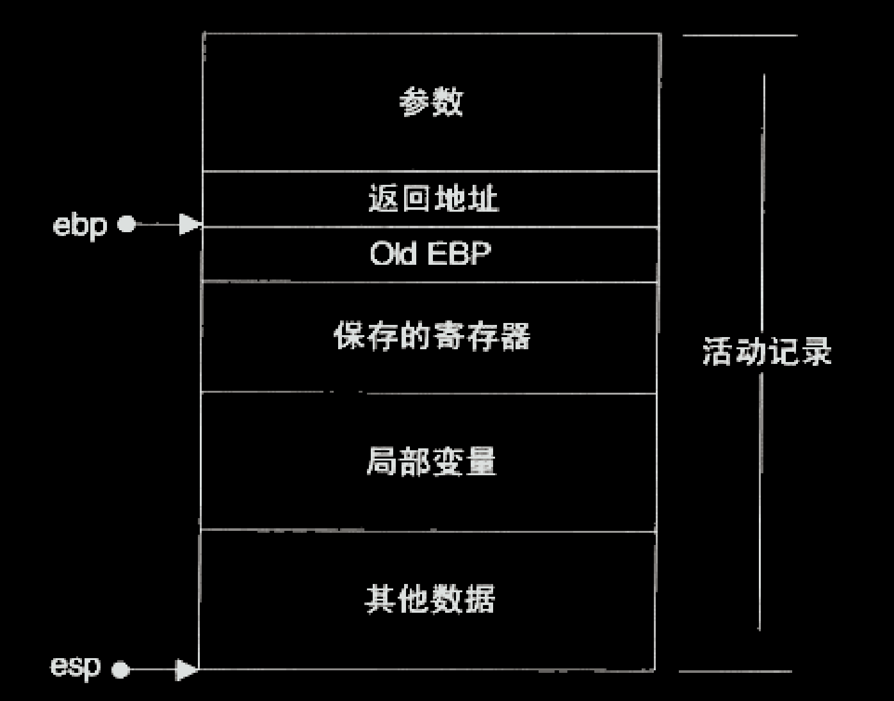

# binutils

## ar

静态库管理工具

## nm

列出程序文件中的符号。



第一列是符号所对应的地址。

第二列指对应符号在哪一个段。比如A表示符号值是绝对的，B表示bbs段，D表示.data段。

第三列就是符号名称。

* 静态变量不论是定义在函数内的，还是函数外，初始化号的就在.data段，否则在.bss段
* 非静态全局变量，其分配方式也只与其是否被初始化有关，初始化了就在.data段，否则是.bss段
* 函数无论静态还是非静态，总是被分在了.text段，但是T(t)揭示了其是静态还是动态。

## objdump

查看目标程序中段信息和调试信息，也可以对目标程序进行反汇编。

-W可以查看调试信息，DWARF格式。

-d可以查看文件汇编代码。

-f可以显示目标文件的入口。

-j可以只查看某个段的信息。

-s可以以16进制形式展示每个段的内容

-r查看重定位表

## objcopy

对目标文件进行编辑。可以新增、复制、删除一个段。

## readelf

和objdump类似，侧重elf格式文件。

## size

显示段的大小。

## strings

查看文件中可显示字符。

# 程序员的自我修养-链接、装载与库

## 概述

### 硬件



多cpu计算机（Symmetrical Multi-Processing），对称多处理器

多核心计算机（Multi-core Processor）,是SMP的简化版，多核处理器

### 软件

#### 分层



计算机科学领域的任何问题都可以通过增加一个间接的中间层来解决。

**应用程序**接口的提供者是**运行库**，什么样的运行库提供什么样的API。比如Linux下Glibc库提供POSIX的API;Windows运行库提供WindowsAPI。

**运行库**使用**操作系统**提供的系统调用接口，系统调用接口在实现时往往以软件中断的方式提供，比如Linux使用0x80号中断作为系统调用接口。

操作系统**内核层**通过**驱动程序**操作硬件，硬件厂商规定硬件规格，并且根据硬件规格提供驱动程序。

#### 任务调度

多道程序（监控程序检测）-分时系统（程序无需cpu时yeild通知）-多任务系统（操作系统根据算法调度）

#### 抽象

##### I/O设备

硬件被抽象为一系列概念。在Unix中，硬件设备的访问方式和普通文件方式形式一致；在windows系统中，图形硬件被抽象为GDI,声音和多媒体被抽象为DirectX对象。硬盘被抽象为文件系统，与硬件相关的细节都交给了**硬件驱动程序**。

##### 内存

用户程序需要的是一个单独的执行环境，比如有单一的地址空间、有自己的CPU，这就要求隔离。

虚拟地址-进程的隔离

分段，为程序划分一段物理内存，针对于整个程序，但是一个程序并不需要都提前装入内存。

分页，将程序虚拟内存和物理内存分为若干大小的页，只装入需要的页。硬件本身支持以页为单位的操作方式。

**虚拟存储**需要依靠硬件，几乎所有的硬件都采用了**MMU**（Memory Management Unit）的部件来进行映射，一般MMU都集成在CPU内部。

#### 线程

Linux中并不存在真正意义上的线程，所有执行实体都称为任务，具有内存空间、执行实体、文件资源等，不过多个任务间可以选择共享内存空间。

##### 线程安全

原子API

锁

编译器优化可能会破坏加了锁的同步。

## 编译器概述

### gcc



```c
#include<stdio.h>

int main(){
    printf("hello World");
    return 0;
}
```

#### 预处理

hello.c和相关的头文件被**cpp**预编译成一个.i文件，主要是以“#”开始的预编译指令

gcc -E hello.c -o hello.i 或cpp hello.c>hello.i

#### 编译

对预处理后的文件进行词法分析、语法分析和优化，最后生成汇编代码。

gcc -S hello.i -o hello.s   或cc1 hello.c

gcc把预编译和编译两个步骤合并成一个步骤，使用一个内部程序cc1。对于C++，对应程序为cc1plus，java为jc1。**所以gcc这个命令只是这些后台程序的包装**，它会根据不同的参数去调用预编译程序ccp、编译器cc、汇编器as、链接器ld。

#### 汇编

gcc -c hello.s -o hello.o或as hellos -o hello.o

将汇编代码翻译成机器码。

#### 链接




#### 

把各个模块之间相互引用的部分都处理好，使得各个模块之间能够正常的衔接。

链接过程，对引用的函数、变量的指令，都要进行调整，这个地址调整的过程称为重定位，每个要被调整的地方叫一个重定位入口。

### 编译器


```c
array[index] = (index + 4) * (2 + 6)
```

#### 词法分析

扫描器（scanner）进行词法分析，运用一种类似**有限状态机**的算法将源码分析成一系列**Token**。**lex**可以根据**用户自定义**的词法规则将字符串分割成token。对于一些有预处理的语言，比如c，预处理一般不归于这个过程。

#### 语法分析

对tokens进行语法分析，从而产生语法树（以**表达式**为节点的树，c语言一个语句是一个表达式，而复杂的语句是很多表达式的组合），分析过程采用了**上下文无关语法**。**yacc**(Yet Another Compiler Compiler)类似**lex**。

#### 语义分析

静态语义：比如两个指针做乘法是否有意义，在语法上是合法，但在语义上不一定。

动态语义：只有运行才能确定的语义，编译器无法分析，比如if条件中的表达式。

经过语义分析后，整个语法树的表达式都被标识了类型，如果有些类型需要隐式转换，会在语法树中插入相应的转换节点。

#### 中间语言生成

源码：

```c
array[index] = (index + 4) * (2 + 6);
```

中间代码:

```
t1 = 2 + 6
t2 = index + 4
t3 = t2 * t1
array[index] = t3
```

中间代码是语法树的**顺序表示**（语法树是一个树，直接在树上优化比较困难）。跟目标机器和运行时环境是无关。

中间代码使得编译器可以被分成**前端、后端**。编译器前端负责产生机器无关的中间代码，编译器后端将中间代码转换成目标机器代码。对一些跨平台的编译器而言，可以针对不同的平台使用同一个前端和针对不同机器平台的数个后端。

#### 目标代码生成

编译器后端，主要包含代码生成器、目标代码优化器。根据不同CPU规格（硬件规格、指令集），生成不同的指令序列。根据不同CPU特性对指令码进行优化。

定义在其他模块的变量、函数在最终运行时的绝对地址都是要在最终链接时确定。所以编译器可以将一个源文件编译成一个未链接的目标文件，然后由链接器链接这些目标文件，最后形成可执行文件。

## 目标文件

### 概述

PC平台流行的可执行文件格式主流的有Windows下的PE和Linux的ELF。它们都是**COFF**格式的变种。目标文件是源代码编译但是未编译的的中间文件，和可执行文件格式类似，一般采用一种格式存储。

不光是可执行文件，动态链接库（windows-dll,linux-so）和静态链接库（windows-lib,linux-a）都可以按可执行文件格式存储。

目标文件和可执行文件格式和操作系统、编译系统密切相关。不同系统平台下有不同的格式，但是这些格式又大同小异。**COFF**是Unix System V Release3首先提出并使用的格式规范。

Unix最早的可执行文件为a.out，设计很简单，以至于后来共享库概念出现时，out格式就变得捉襟见肘了，于是就设计了COFF格式来解决这些问题。

COFF主要贡献实在目标文件加入了"段"的机制，不同目标文件可以拥有不同数量及不同类型的“段”，另外还定义了调试数据格式。

#### 分段

* 数据和指令属性不同，数据是可读写，指令是只读的。
* CPU设计了强大的缓存机制，指令区和数据的分离有利于局部性，而现代CPU缓存一般也被设计为数据缓存、指令缓存。
* 当运行一个程序的多个副本时，指令是可以共享的
* 分段也更易于横向扩展，比如要加调试信息，不用改整个文件结构，专注于_debug段即可。

##### bbs段

Block Started by Symbol,最初由UA-SAP汇编器（为IBM704大型机所开发）中一个伪指令，用于**为符号预留一块内存空间**。

后BSS被作为关键词引入到IBM709和7090/94机型上的标准汇编器FAP（Fortran Assembly Program）,用于定义符号并且为该符号预留给定数量的未初始化空间。

bbs本身没有数据，只有描述信息。

### ELF

* 可重定位文件，.o文件。包含代码和数据，可以被链接成可执行文件或共享目标文件。
* 可执行文件，/bin/bash。
* 共享目标文件，.so文件。包含代码数据，**链接器**将其与其它可重定位文件链接，产生新的可执行文件；动态链接器可以将此文件与可执行文件结合，作为进程映像的一部分。
* 核心转储文件，core dump

file可以指示出类型。

/usr/include/elf.h定义了elf结构

#### 文件头

readelf -h 读取文件头

##### 魔数

a.out的魔数为0x01、0x07

Unix早年在PDP小型机上诞生，当时系统加载一个可执行文件后直接从文件的第一个字节开始执行，一般都在最开始放置一条jmp指令，这个指令负责跳过接下来的7个机器字的文件头,而0x01、0x07正好是PDP-11机器的跳转指令，为了兼容，这条跳转就被当作了魔数。

#### 段表

objdump -h只是把elf文件中关键段列举出来，而忽略了其他辅助性的段，比如：符号表、字符串表等。

readelf -S 则会列出所有段

##### 重定位表

对于每个需要**重定位的代码段或数据段**，都会有一个相应的重定位表。类型为SHT_REL，.rel.text。

##### 字符串表

类型为SHT_STRTAB。

.strtab-普通字符串，比如符号的名字。

.shstrtab-段表中用到的字符串。

为什么要有两个呢？有点搞不懂。

##### 符号表

每个函数、变量都有一个独一无二的名字，将其称为符号。每个定义的符号都有一个对应的值，对于函数/变量符号来说，值就是它们的地址。.symtab

* 全局符号，本目标文件定义的全局符号。
* 外部符号，本目标文件引用的全局符号。
* 段名，编译器产生.
* 局部符号，只在编译单元内部可见，如函数中局部变量，对链接无用，调试器用这些符号分析程序。
* 行号信息，目标文件指令和源代码代码行对应关系，可选。

##### 符号表项

* st_name,符号名在字符串中下标
* st_value,符号对应值
  * 在目标文件中且不是SHN_COMMAN，表示符号在段中的偏移
  * 在目标文件中是SHN_COMMON,符号的对其属性
  * 可执行文件中，符号的虚拟地址。
* st_size,符号大小，对于包含数据的符号，值就是数据类型大小，如果为0表示符号大小为0或未知。
* st_info,低4位表示符号类型（未知、变量、代码等），高28位为符号绑定信息（局部、全局）。
* st_other,没有在用。
* st_shndx,符号所在段，定义在本目标文件中，表示符号所在段的下标。对于特殊符号
  * SHN_ABS，符号包含一个绝对值，比如文件名
  * SHN_COMMAN,比如未初始化的全局符号
  * SHN_UNDEF,未定义，引用的外部符号。

##### 特殊符号

定义在ld链接器的链接脚本中，可直接使用。

如：__etext或,此符号为代码段结束地址。在c语言中直接声明使用。

```c
extern char __etext[]
```

##### 强符号/弱符号

* 强符号，对于c/c++，编译器默认函数、初始化了的全局变量为强描述符
* 弱符号，未初始化的全局变量

**强/弱符号都是针对定义来说的，不是针对符号引用**。

```c
extern int ext;
int weak;
int strong=1;
__attribute__((weak)) weak2=2;

int main(){
    return 0;
}
//weak、weak2是弱符号，strong、main是强符号，ext既非强符号、又非弱符号。
```

* 强符号不允许被多次定义
* 如果一个符号在一个文件为强，其他文件为弱，则选择强符号
* 如果一个在所有目标文件中都是弱符号（尽量不要定义多个），则取占用空间最大的。

强引用/弱引用：弱引用未定义时链接不会报错。这对库的开发比较有用，比如库中定义的弱符号可以被用户定义的强符号覆盖

##### 符号修饰

不同编译器厂商的符号修饰方法不同，主要是为了符号冲突，比如c++中函数重载、命名空间。

extern "C"用法，在c++表示是c变量或函数，c变量、函数一般不会有复杂的符号修饰，c++同时提供__cplusplus宏，表示编译c++程序。

#### 调试信息

gcc -g,会有很多与调试相关的段，ELF采用一种叫DWARF(Debug With Arbitrary Record Format)标准的调试信息格式。

### PE/COFF

与ELF同源，都是源自COFF格式（源自DEC的VAX/VMS上的COFF文件格式）。

目标文件格式位COFF,可执行文件格式为PE，比COFF多了几个结构。

## 静态链接

### 空间与地址分配

地址空间有两个含义：一是在输出的**可执行文件中的空间**；第二个是在装载后的虚拟地址中的**虚拟地址空间**。对于有实际数据的段，比如.text、.data,在文件中和虚拟地址中都要分配空间，而对于.bbs段，分配空间的意义只局限于虚拟地址空间。

现在的链接器都会对相似段进行合并，整个链接过程分为两步：

* 空间、地址分配。扫描输入，获得所有段的长度、属性和位置，并将输入中所有符号定义和符号引用收集起来。这一步中，链接器能够将段进行合并，计算出输出文件各个段合并后的长度与位置，并建立映射关系。
* 符号解析和重定位。使用上一步收集到的信息，读取输入文件中段的数据、重定位信息。并且进行符号解析和重定位、调整代码中的地址。

ld链接器默认程序入口为_start,可以用-e参数指定。

### 重定位表

重定位表专门保存重定位相关信息。对于每个需要被重定位的段，都需要有一个对应的重定位表。

```c
typedef struct {
    //重定位入口偏移，要修正位置第一个字节相对于段的偏移
    Elf32_Addr r_offset;
    //重定位入口类型和符号。低8位表示类型，高24位表示重定位符号在符号表中下标。
    //因为各种处理器的指令格式不一样，所以重定位所修正的指令地址格式也不一样。每种处理器都有自己的一套重定位入口类型。
    Elf32_Addr r_info;
} Elf32_Rel;
```

每个重定位的入口都是对一个符号的引用.

### 指令修正

链接前，外部变量、函数都是一个不准确的值（比如变量为0，函数为fffffffc），链接时会将**指令修正**。

不同处理器指令对于地址的格式和方式都不一样。比如32位intel x86处理器，jmp、call、mov寻址方式千差万别。直至2006年为止，Intel x86系列cpu的jmp指令有11种寻址模式，call有10种，mov指令则有多达34种。这些寻址方式有一些区别：

* 近址寻址或原址寻址
* 绝对寻址或相对寻址
* 寻址长度为8位、16位、32位或64位

但对于32位x86平台下的elf文件的重定位入口所修正的指令寻址方式只有：绝对近址32位寻址、相对近址32位寻址。（TODO:还要详细了解下）。

### common块

针对于多个文件中同时定义了一个未初始化的全局变量（未初始化的为弱符号），以类型最大的为准。之所以不在.bss段分配大小，是因为链接时才知道有多少重名的弱符号，所以要有common的机制，链接后分配到.bbs段。

gcc10默认开启common块，gcc11默认不开启。没有开启common块时，如果定义了同名未初始化全局变量，这就相当于强符号，有重复就会报错。

### ABI

Application Binary Interface。

两个目标文件编译出来的文件要能相互链接，需要满足：通用文件格式、同样符号修饰标准、同样变量内存分布方式、同样的调用方式等等。这些称为**ABI**。

c进制兼容要素：

* 内置类型大小和存储器中放置方式（大端/小端序、对齐方式）
* 组合类型存储方式和内存分布
* 外部符号和自定义符号的命令、解析方式
* 函数调用方式，参数入栈顺序、返回值
* 堆栈分布方式，比如参数和局部变量在堆栈里的位置、参数传递方法等。
* 寄存器使用约定
* ....

c++增加的一些特性更为复杂了

### 实例分析

```bash
gcc -static --verbose -fno-builtin -fno-lto hello.c

# 输出：
Using built-in specs.
COLLECT_GCC=gcc
COLLECT_LTO_WRAPPER=/usr/lib/gcc/x86_64-linux-gnu/11/lto-wrapper
OFFLOAD_TARGET_NAMES=nvptx-none:amdgcn-amdhsa
OFFLOAD_TARGET_DEFAULT=1
Target=x86_64-linux-gnu
Configured with:../src/configure 
 -v 
 --with-pkgversion='Ubuntu 11.4.0-1ubuntu1~22.04'
 --with-bugurl=file:///usr/share/doc/gcc-11/README.Bugs
 --enable-languages=c,ada,c++,go,brig,d,fortran,objc,obj-c++,m2
 --prefix=/usr
 --with-gcc-major-version-only
 --program-suffix=-11
 --program-prefix=x86_64-linux-gnu-
 --enable-shared
 --enable-linker-build-id
 --libexecdir=/usr/lib
 --without-included-gettext
 --enable-threads=posix
 --libdir=/usr/lib
 --enable-nls
 --enable-bootstrap
 --enable-clocale=gnu
 --enable-libstdcxx-debug
 --enable-libstdcxx-time=yes
 --with-default-libstdcxx-abi=new
 --enable-gnu-unique-object
 --disable-vtable-verify
 --enable-plugin
 --enable-default-pie
 --with-system-zlib
 --enable-libphobos-checking=release
 --with-target-system-zlib=auto
 --enable-objc-gc=auto
 --enable-multiarch
 --disable-werror
 --enable-cet
 --with-arch-32=i686
 --with-abi=m64
 --with-multilib-list=m32,m64,mx32
 --enable-multilib
 --with-tune=generic
 --enable-offload-targets=nvptx-none=/build/gcc-11-XeT9lY/gcc-11-11.4.0/debian/tmp-nvptx/usr
 --enable-offload-targets=amdgcn-amdhsa=/build/gcc-11-XeT9lY/gcc-11-11.4.0/debian/tmp-gcn/usr
 --without-cuda-driver
 --enable-checking=release
 --build=x86_64-linux-gnu
 --host=x86_64-linux-gnu
 --target=x86_64-linux-gnu
 --with-build-config=bootstrap-lto-lean
 --enable-link-serialization=2
Thread model=posix
Supported LTO compression algorithms=zlib zstd
gcc version 11.4.0 (Ubuntu 11.4.0-1ubuntu1~22.04)

COLLECT_GCC_OPTIONS='-static' '-v' '-fno-builtin' '-mtune=generic' '-march=x86-64' '-dumpdir' 'a-'
/usr/lib/gcc/x86_64-linux-gnu/11/cc1
-quiet
-v
-imultiarch x86_64-linux-gnu
hello.c
-quiet
-dumpdir a-
-dumpbase hello.c
-dumpbase-ext.c
-mtune=generic
-march=x86-64
-version
-fno-builtin
-fasynchronous-unwind-tables
-fstack-protector-strong
-Wformat
-Wformat-security
-fstack-clash-protection
-fcf-protection
-o /tmp/ccUjr7LB.s

GNU C17 (Ubuntu 11.4.0-1ubuntu1~22.04) version 11.4.0 (x86_64-linux-gnu)
compiled by GNU C version 11.4.0, GMP version 6.2.1, MPFR version 4.1.0, MPC version 1.2.1, isl version isl-0.24-GMP
GGC heuristics: --param ggc-min-expand=100 --param ggc-min-heapsize=131072
ignoring nonexistent directory "/usr/local/include/x86_64-linux-gnu"
ignoring nonexistent directory "/usr/lib/gcc/x86_64-linux-gnu/11/include-fixed"
ignoring nonexistent directory "/usr/lib/gcc/x86_64-linux-gnu/11/../../../../x86_64-linux-gnu/include"
#include "..." search starts here:
#include <...> search starts here:
/usr/lib/gcc/x86_64-linux-gnu/11/include
/usr/local/include
/usr/include/x86_64-linux-gnu
/usr/include
End of search list.
GNU C17 (Ubuntu 11.4.0-1ubuntu1~22.04) version 11.4.0 (x86_64-linux-gnu)
compiled by GNU C version 11.4.0, GMP version 6.2.1, MPFR version 4.1.0, MPC version 1.2.1, isl version isl-0.24-GMP

GGC heuristics: --param ggc-min-expand=100 --param ggc-min-heapsize=131072
Compiler executable checksum: 50eaa2331df977b8016186198deb2d18
COLLECT_GCC_OPTIONS='-static'
'-v'
'-fno-builtin'
'-mtune=generic'
'-march=x86-64'
'-dumpdir'
'a-'
as
-v
--64
-o /tmp/ccmp14tv.o
/tmp/ccUjr7LB.s
GNU assembler version 2.38 (x86_64-linux-gnu) using BFD version (GNU Binutils for Ubuntu) 2.38
COMPILER_PATH=/usr/lib/gcc/x86_64-linux-gnu/11/:/usr/lib/gcc/x86_64-linux-gnu/11/:/usr/lib/gcc/x86_64-linux-gnu/:/usr/lib/gcc/x86_64-linux-gnu/11/:/usr/lib/gcc/x86_64-linux-gnu/
LIBRARY_PATH=/usr/lib/gcc/x86_64-linux-gnu/11/:/usr/lib/gcc/x86_64-linux-gnu/11/../../../x86_64-linux-gnu/:/usr/lib/gcc/x86_64-linux-gnu/11/../../../../lib/:/lib/x86_64-linux-gnu/:/lib/../lib/:/usr/lib/x86_64-linux-gnu/:/usr/lib/../lib/:/usr/lib/gcc/x86_64-linux-gnu/11/../../../:/lib/:/usr/lib/

COLLECT_GCC_OPTIONS='-static'
'-v'
'-fno-builtin'
'-mtune=generic'
'-march=x86-64'
'-dumpdir'
'a.'

/usr/lib/gcc/x86_64-linux-gnu/11/collect2
-plugin /usr/lib/gcc/x86_64-linux-gnu/11/liblto_plugin.so
-plugin-opt=/usr/lib/gcc/x86_64-linux-gnu/11/lto-wrapper
-plugin-opt=-fresolution=/tmp/ccubmQxt.res
-plugin-opt=-pass-through=-lgcc
-plugin-opt=-pass-through=-lgcc_eh
-plugin-opt=-pass-through=-lc
--build-id
-m elf_x86_64
--hash-style=gnu
--as-needed
-static
-z relro
/usr/lib/gcc/x86_64-linux-gnu/11/../../../x86_64-linux-gnu/crt1.o
/usr/lib/gcc/x86_64-linux-gnu/11/../../../x86_64-linux-gnu/crti.o
/usr/lib/gcc/x86_64-linux-gnu/11/crtbeginT.o
-L/usr/lib/gcc/x86_64-linux-gnu/11
-L/usr/lib/gcc/x86_64-linux-gnu/11/../../../x86_64-linux-gnu
-L/usr/lib/gcc/x86_64-linux-gnu/11/../../../../lib
-L/lib/x86_64-linux-gnu
-L/lib/../lib
-L/usr/lib/x86_64-linux-gnu
-L/usr/lib/../lib
-L/usr/lib/gcc/x86_64-linux-gnu/11/../../..
/tmp/ccmp14tv.o
--start-group
-lgcc
-lgcc_eh
-lc
--end-group
/usr/lib/gcc/x86_64-linux-gnu/11/crtend.o
/usr/lib/gcc/x86_64-linux-gnu/11/../../../x86_64-linux-gnu/crtn.o

COLLECT_GCC_OPTIONS='-static'
'-v'
'-fno-builtin'
'-mtune=generic'
'-march=x86-64'
'-dumpdir'
'a.'
```

上述为最简单的一个hello world程序，至少有这几个库：

* crt1.o
* ctri.o
* crtbeginT.o
* libgcc.a
* libgcc_eh.a
* libc.a
* crtend.o
* crtn.o

静态运行库里一个目标文件只包含一个函数，因为链接静态库时是以目标文件为单位的，主要是为了按需链接，如果一个目标文件有多个函数，那么会导致不必要的函数也被链接进来。

### 链接过程控制

绝大部分情况下，使用链接器提供的默认链接规则。但是存在一些特殊情况，比如：

*  操作系统内核（windows内核就是ntoskrnl.exe，但是无法被直接点击运行）、BIOS
* Boot Loader、嵌入式系统程序。
* 硬盘分区软件，如PQMagic
* 一些内核驱动程序。
* ...

往往受限于一些特殊条件，比如需要指定输出文件各个段虚拟地址、段名称、段存放顺序等（特别是硬件环境对程序的段有特殊需求）。

而整个链接过程，有很多内容需要确定，比如：使用那些目标文件？使用那些库文件？是否保留调试信息？输出文件格式？是否导出某些符号以供调试器或程序或其他程序使用。

#### 命令行控制

命令行传递参数

#### 目标文件

将链接指令存放在目标文件，编译器经常会通过这种方法向链接器传递指令。比如Visual c++编译器会把链接参数在PE目标文件的.drectve段以传递参数。

猜测这里应该是通过\_\_attibute\_\_声明特殊变量，这个变量放到特殊段，然后通过链接脚本取用吧。

#### 链接脚本

没有指定链接脚本时，会使用默认链接脚本。使用ld \-verbose可以查看默认链接脚本,实际存放在/usr/lib/ldscripts下

```shell
 ENTRY(nomain)
 SECTIONS
 {
      . = 0x08048000 + SIZEOF_HEADERS;
      tinytext : {*(.text) *(.data) *(.rodata)}
      /DISCARD/ : {*(*.comment)}
 }
```

链接脚本由一系列语句组成，语句分为：**命令语句**、**赋值语句**。

* 语句间由;分割，但是命令语句也可以用换行来结束，赋值语句不行。
* 可以使用与C语言类似的表达式和运算操作符。
* 注释写法和C语言类似。

### BFD库

现代硬件和软件平台种类繁多。比如：

硬件：

* CPU有8位的、16位的、一直到64位的；
* 字节序有大端、小端；
* 有些有MCU,有些没有
* 有些对内存地址访问有特殊要求，比如MIPS，有些没有，比如x86

软件：

* 有些支持动态链接，有些不支持
* 有些支持调试，有些不支持

这些差异导致每个平台都有独特的目标文件格式，即使同一个格式比如ELF在不同软硬件平台都有不同的变种。

BFD库（BInary File Descriptor library）的目标就是希望通过统一的接口来处理不同的目标文件格式。其本身是binutils项目的子项目，其把目标文件抽象成一个统一模型。

现在GCC都通过BFD库来处理目标文件，这样就把编译器和链接器本身同具体目标文件格式隔离开了。截至gcc11，支持大约25种处理器平台，50种目标文件格式。

## 动态链接

静态链接的坏处：

* 浪费磁盘、内存。
* 对程序的更新、部署和发布带来麻烦。

不在编译期对目标文件进行链接，而是在运行时才链接，即**动态链接**。

程序被装载时，系统的**动态链接器**会将程序所需要的所有动态连接库装载到进程的地址空间，并且将程序中所有未决议的符号绑定到对应的动态链接库，并进行重定位工作。

### 装载时重定位

**基址重置**

链接时，所有绝对地址的引用不作重定位，而是推迟到装载。一旦模块装载地址被确定，系统就对所有绝对地址引用进行重定位。

Linux和GCC支持这种方法，只使用**-shared**参数，输出的共享对象就是这种方法。

缺点：指令部分无法在多个进程之间共享。

### 地址无关代码

-**fPIC**参数

需要解决装载时重定位的问题，程序模块中共享指令部分在装载时不要因为**装载地址的改变而改变**。

解决方案：将指令中需要被修改部分分离，跟数据放在一起，指令部分就保持不变，即**地址无关代码技术**。

#### 模块内部函数调用

被调用函数、调用者处于同一模块，相对位置固定，这种指令是不需要重定位的（这种指令就是地址无关的）。

#### 模块内部数据访问

任何一条指令与它需要访问模块内部数据之间的相对位置是固定的，则只需要相对于当前指令加上固定的偏移量即可访问模块内部数据。

```asm
call 494 <__i686.get_pc_trunk.cx>
add $0x118c,%ecx
movl $0x1,0x28(%ecx)
```

上述代码实现了a=1，其中a是模块内变量，get_pc_trunk将当前指令地址当道ecx，后续可以通过相对寻址方式访问到同模块内变量a。

#### 模块间数据访问

数据段建立一个指向这些变量的指针数组，即全局偏移表（Global Offset Table）。链接器装载模块时会填充这个GOT表。

#### 模块间函数调用

也可以got的方式解决。

PIC产生的so是不包含任何代码段重定位表，可以以此作为判断是不是地址无关的共享代码。

也可以用-fPIE编译出地址无关执行文件。

### 数据段地址无关性

对于数据段，每个进程都有一个独立的副本，并不担心被进程改变，因此可以选择装载时重定位的方式解决绝对地址引用问题。

### 延迟绑定

函数第一次被用到时才进行绑定（符号查找、重定位等）。ELF采用PLT的方法实现延迟绑定，

当调用某个外部模块函数时，按照通常的做法是通过GOT中对应的项进行跳转。为了实现延迟绑定，函数通过**PLT项**进行跳转。类似：

```assembly
bar@plt:
jmp *(bar@GOT)
psuh n
push moduleID
jump _dl_runtime_resolve
```

bar@GOT表示GOT中保存bar()函数地址，但是初始化阶段链接器并没有将bar地址填好，而是将push n的地址填到表项。**push n中n是bar这个符号引用在重定位表".rel.plt"中下标**，

ELF将GOT拆分为.got、.got.plt。其中.got用来保存全局变量引用的地址，.got.plt保存函数引用的地址，.got.plt的前三项有特殊意义：

* 第一项保存“.dynamic”段地址，这个段描述了本模块动态链接相关信息.
* 第二项保存本模块ID。
* 第三项保存"_dl_runtime_resolve"的地址。

其余项分别对应每个外部函数的引用。实际动态实现代码：

```assembly
PLT0:
push *(GOT + 4)
jmp *(GOT + 8)
...
PLT4:
	bat@plt:
	jmp *(bar@GOT)
	push n
	jmp PLT0
```

PLT在elf文件中以独立的段存放，此段的功能就是为了解析并填充外部函数的地址。

比如调用bar函数时，直接跳转到PLT4处执行，.got.plt没有被填充，则相关参数压栈，跳到PLT0项解析并填充。

### 动态链接结构

在动态链接情况下，在映射完可执行文件后，还会启动一个**动态链接器**。

在Linux下，动态链接器ld.so实际上是一个共享对象，操作系统同样通过映射的方式将它加载到进程的地址空间。操作系统在加载完动态链接器之后，就将控制权交给动态链接器的入口地址。当动态链接器得到控制权之后，开始执行一系列自身的初始化操作，然后根据当前的环境参数，开始对可执行文件进行动态链接工作.

#### .interp

保存动态链接器的位置。动态链接器在Linux下是Glibc的一部分，它的版本号往往跟系统中Glibc版本号一样。

#### .dynamic

保存动态链接器所需要基本信息比如依赖那些共享对象、动态链接符号表的位置、动态链接重定位表的位置、共享对象初始化代码的地址。

```c
typedef struct {
    Elf32_Sword d_tag;
    union {
        Elf32_Word d_val;
        Elf32_Addr d_ptr;
    } d_un;
} Elf32_Dyn;
```

readelf -d Lib.so查看dynamic段内容。

ldd 查看程序主模块或一个共享库依赖于那些共享库。

#### .dynsym

为了表示动态链接这些模块之间的符号导入导出关系，定义**动态符号表**,段名通常为.dynsym,只保存与动态链接相关符号。.symtab往往保存所有符号，包括.dynsym中符号。

#### .dynstr

动态符号字符串表,和静态链接时.strtab相对。

#### .hash

动态链接下，需要在运行时查找符号,因此还有辅助的符号哈希表.

#### 重定位表

.rel.dyn是对数据引用的修正，它所修正位置位于.got以及数据段；.rel.plt是对函数的修正,它修正位置位于.got.plt。

### 动态链接步骤

#### 动态链接器自举

自举代码首先找到自己的GOT,根据这些信息对自己进行重定位。

#### 装载共享对象

根据可执行文件的.dynamic段，找到依赖的共享对象，根据共享对象名字找到文件读取文件头和其.dynamic段,将其映射进进程空间。当新的共享对象装载进来时，它的符号表被合并全局符号表中.

如果一个符号需要被加入全局符号表，如果相同符号名已经存在，则会被忽略，所以如果有多个共享对象有相同符号，则跟装载顺序有关。

#### 重定位和初始化

上述步骤完成后，链接器重新遍历可执行文件和共享对象的重定位表,将它们的GOT/PLT进行修正。

重定位完成后，如果某个共享对象有.init段,那么动态链接器会执行.init段。但是不会执行可执行文件中.init、.finit段（由程序初始化部分代码执行）。

### 动态链接器

动态链接器本身是静态链接的。其代码也是PIC的，其装载地址是内核选定的。

### 显式运行时链接

Explicit Run-time Linking。程序在运行时控制加载指定的模块，并且可以在不需要该模块时将其卸载。这样会使得程序的模块组织很灵活，可以用来实现诸如插件、驱动的功能。

在Linux中，从文件本身格式来看，动态库实际跟一般共享对象没区别。主要区别是，共享对象由动态链接器在程序启动之前负责装载和链接；而动态库的装载则是通过一系列动态链接器提供的API完成的。dlopen-打开动态库，dlsym-查找符号、dlerror-错误处理、dlclose-关闭动态库。

## 装载

### 进程虚拟地址空间

大小取决于CPU位数，一般可以通过判断指针所占空间来计算虚拟地址空间大小。

对于32位CPU：

Linux将0xC0000000~0xFFFFFF,共1GB保留为操作系统本身使用内存。

Windows默认会占用2G.可配置启动参数修改。

### 装载方式

最简单的方式便是静态装载（将程序运行所需指令、数据全部装入内存），但是太浪费空间，且程序运行时有局部性原理。

因此只将程序最常用的部分装载进内存，即动态装载。

#### 覆盖装载

虚拟内存发明之前使用比较广泛。程序员在编写程序时手动将程序分割成若干模块，然后编写辅助代码（Overlay Manager）管理模块的装载时机。



需要手动管理模块间的依赖关系。

#### 页映射

虚拟内存的一部分。将程序分为若干页，按需装载，动态换出不需要的页（操作系统的内存管理）。

#### 进程与可执行文件

从操作系统角度，一个进程最关键特征就是拥有**独立的虚拟地址空间**。

* 创建一个独立的虚拟地址空间。在linux i386下其实只是分配一个页目录。
* 读取可执行文件头，建立虚拟空间与可执行文件的**映射关系**。
* 将cpu的指令寄存器设置为可执行文件入口地址，启动运行。

建立进程只不过是为了建立elf文件、虚拟地址空间、物理地址空间的映射。指令执行时，产生页错误时，操作系统会根据进程的映射结构，动态分配物理页，然后将控制权交换给程序。

#### elf链接视图和执行视图

linux将进程虚拟空间中一个段叫做虚拟内存区域（VMA，Virtual Memory Area）。而一个VMA容量是系统页长度的整数倍，当段零碎的时候，会产生不必要的内存浪费。

而站在操作系统角度，实际并不关心各个段所包含实际内容，只关心一些跟装载相关的问题，比如段的权限。因此，对于相同权限的段，就将其合并到一个段映射。即elf的**装载视图**

#### 进程空间分布

##### 段

##### 堆栈

VMA除了被用来映射可执行文件的各个段，操作系统通过使用VMA来对进程的地址空间进行管理。进程的堆、栈等空间，在进程的虚拟空间中表现也是以VMA形式存在的。

```shell
# 查看进程内存分布
cat /proc/718/maps;
```

一个段对应一个物理页，如果段长度不超过4096，会浪费空间，所以一个物理页可以映射多个段。

### linux elf装载

do_execve读取文件前128个字节的文件头部，然后调用search_binary_handle去搜索匹配合适可执行文件装载处理过程。

比如:load_elf_binary装载可执行文件，load_aout_binary装载a.out可执行文件，load_script装载可执行脚本。

load_elf_binary过程：

* 检查文件格式有效性
* 寻找动态链接的“.interp”段，设置动态链接器路径。
* 根据ELF程序头表，对elf文件进行映射。
* 初始化进程环境
* 将系统调用返回地址修改为elf可执行文件的入口点。

### windows pe装载

Relative Virtual Address。

## Linux共享库

### 版本命名

libname.so.x.y.z

* 主版本号，重大升级，不同主版本号的库之间是不兼容的。
* 次版本号，增量升级，增加一些新的符号，保持原来符号不变。
* 发布版本号，库的一些错误修正、性能改进,并不添加任何新的接口，也不对接口进行更改。

### SO-NAME

共享库文件名去掉次版本号和发布版本号。比如：共享库libfoo.so.2.6.1，其SO-NAME为libfoo.so.2。LInux系统中,系统会为每个共享库在它所在的目录创建一个跟“SO-NAME”相同的并且指向它的软链接。这个软连接会指向目录中主版本号相同、次版本号和发布版本号最新的共享库。

**SO-NAME**表示一个库的接口，接口不向后兼容，其就会发生变化。在linux中，安装或更新一个共享库时，可以使用ldconfig更新所有软链接。

### 链接名

比如要链接libXXX.so.2.6.1共享库，只需要指定-lXXX即可(链接名)。编译器会根据当前环境，在系统相关路径查找最新版本XXX库。

不同类型的库可能有同样的链接名，比如C语言运行库有静态版本（libc.a）和动态版本（libc.so.x.y.z）,链接器会根据输出文件情况来选择合适版本。比如ld使用-static参数时，-lc会查找libc.a,使用-Bdynamic(默认情况)，会查找最新版本的libc.so.x.y.z。

### 次版本号交会问题

实际依赖高次版本号，但是实际次版本号低。

### 基于符号的版本机制

每个导入、导出的符号都有一个关联的版本号,比如Glibc从版本2.1开始就支持。

### 共享库路径

FHS标准

* /lib,存放系统最关键和基础的共享库，比如动态链接器、c语言运行库、数学库等。主要是/bin,/sbin下程序用到的库，还有系统启动时需要的库。
* /usr/lib,存放一些非系统运行时所需要的关键性共享库。主要是一些开发时用到共享库,这些共享库一般不会被用户程序或shell脚本直接用到。这个目录下还包含了开发时可能会用到的静态库、目标文件等。
* /usr/local/lib,存放一些跟操作系统本身并不十分相关的库,主要是一些第三方应用程序的库

### 共享库查找

.dynamic段中,DT_NEED项如果保存的是绝对路径,动态链接器会在/lib、/usr/lib和由/etc/ld.so.conf配置文件指定目录中查找共享库。

ldconfig除了为共享库生成SO-NAME，程序会将这些SO-NAME收集起来，存放在/etc/ld.so.cache中。

如果在cache中没有找到，会继续遍历/lib，/usr/llib两个目录。

### 环境变量

#### LD_LIBRARY_PATH

相当于链接时GCC的“-L”参数。

#### LD_PRELOAD

比LD_LIBRARY_PATH更优先，并且无论程序是否依赖它们，LD_PRELOAD指定的共享库或目标文件都会被装载。

#### LD_DEBUG

开启动态链接调试功能.

### 共享库创建安装

#### 创建

-shared表示输出结果是共享库类型的，-fPIC表示使用地址无关代码技术产生输出文件。还可以通过-Wl将指定参数传递给链接器。比如：

```shell
gcc -shared -W1,-soname,my_soname -o library_name source_files
```

如果创建共享库时不使用-soname指定，那么该共享库默认没有SO-NAME。

#### 共享库构造和析构函数

\_\_attribute((constructor))\_\_

\_\_attribute((destructor))\_\_

在共享库装载、卸载时执行。如果使用了这种构造、析构函数，就必须使用系统默认的标准运行库和启动文件，gcc不可以使用-nostartfiles或-nostdlib参数。

#### 共享库脚本

和LD链接脚本从语法和命令上讲没有区别。通过脚本文件，可以把几个现有的共享库通过一定方式组合起来。

## 程序内存布局




* 栈，用于维护函数调用上下文，通常在用户空间最高地址分配。
* 堆，用于应用程序动态分配的内存区域，当程序使用malloc或new分配内存时，通常来自次区域。
* 可执行文件映像
* 保留区。对内存中受到保护而禁止访问内存区域总称。例如，在大多数操作系统中，极小的地址通常不允许访问,如NULL，通常c语言将无效指针赋值为0也是出于这个考虑。
* 动态链接库映射区。在Linux下，如果可执行文件依赖其他共享库,系统就会为它在从0x40000000开始地址分配相应空间。

### 栈



i386函数调用：

* 把所有或一部分参数入栈，如果由参数没入栈，则使用特定寄存器传递。
* 将当前指令的下一条指令地址入栈。
* 跳转函数体执行。

第2步、第3步由指令call一起执行，而i386函数体标准开头：

* push ebp。
* mov ebp,esp。
* sub esp,XXX，在栈上分配XXX字节临时空间，可选。
* push XXX,保存寄存器，可选。

#### 调用惯例

* 函数参数传递顺序、方式。
* 栈的维护方式。
* 名称修饰策略。gcc中可以通过\_\_attribute((cdecl))\_\_显示指定调用惯例，c语言中默认调用惯例就是cdecl。

 cdecl调用惯例：参数从右至左入栈，由函数调用方出栈

#### 函数返回值

TODO：

### 堆

栈上数据在函数返回时会被释放掉，所以无法将数据传递至函数外部，而全局变量没有办法动态产生，只能在编译时产生。因此需要堆，堆是一块巨大的内存空间，这片空间中，程序可以请求一块连续的内存，并自由使用，这块内存在程序主动放弃之前都会一直抱持有效。

````c
int main(){
    char *p=(char *)malloc(1000);
    free(p);
}
````

malloc分配内存内存可以由操作系统管理,但是每次申请/释放内存都要通过系统调用，比较耗费性能。因此一般都是程序自己进行堆内存管理，更具体来讲，是程序运行库。

#### Linux进程堆管理

```c
// 设置进程数据段的结束地址，即可以扩大或缩小数据段。
int brk(void* end_data_segment);
// 向操作系统申请一段虚拟空间，这块虚拟空间可以映射到文件，如果不映射则是匿名空间，您名空间可以用作堆空间。
void* mmap(void* start,size_t length,int prot,int flags,int fd,off_t offset);
```

glibc的malloc函数：对于小于128KB的请求，会在现有堆空间按照堆分配算法分配一块空间返回；对于大于128KB的请求，会用mmap函数分配一块匿名空间,然后在这个匿名空间为用户分配空间。

#### windows进程堆管理

### 运行库

#### 入口函数

程序的入口点实际是一个程序的初始化和结束部分，它往往是运行库的一部分，一个典型的程序运行步骤：

* 操作系统创建进程后，将控制权交给程序入口，这个入口往往是运行库的一部分。
* 入口函数对运行库和运行环境初始化，包括堆、I/O、线程、全局变量构造等。
* 完成初始化后，跳转至main函数
* main执行完，返回入口函数，进行清理工作，包括全局变量析构、堆销毁、关闭I/O等，然后进行系统调用结束进程。

##### Gllibc入口函数

#### 程序IO

指代了程序与外界的交互：文件、管道、网络、命令行、信号等。更加广义来讲，I/O指代任何操作系统理解为"文件"的事务。

内核中，每个进程都记录一个"打开文件表"，为一个指针数组，每个元素都指向一个内核中打开的文件对象,例如在linux中0、1、2分别代表标准输入、标准输出、标准错误输出。

#### c语言运行库(CRT)

一个c语言库大致包含以下功能：

* 入口函数及入口函数所依赖的其他函数等。
* c语言标准规定的API实现（C语言标准库）。
* I/O功能的封装与实现。
* 堆的封装与实现。
* 语言中一些特殊功能实现。
* 实现调试功能的代码。

##### c语言标准库

ANSI C标准库由24个头文件组成，仅仅包含了数学函数、字符/字符串处理、I/O等。

变长参数

非局部跳转

setjmp longjmp

#### glibc

早期，从Linux内核代码里分离出一部分代码，即是早期Linux下的c运行库，被称为Linux libc，从2版本一直到5版本。96年FSF发布了glibc2，这个版本的glibc开始支持多种特性,比如：完全支持POSIX标准、国际化、IPV6、64位数据访问、多线程以及改进了代码可移植性。glibc替代libc，也被称为libc6。

glibc发布版本由两部分组成，一部分是头文件，比如stdio.h、stdlib.h等；另一部分则是库的二进制部分，主要是c语言标准库。除了c标准库，还有几个辅助程序运行的运行库,比如:

```shell
/usr/lib/crt1.o
/usr/lib/crti.o
/usr/lib/crtn.o
```

##### crt1.o

包含程序入口函数_start，由它负责调用__libc_start_main初始化libc并调用main函数。

实际最开始叫**crt.o**,包含了基本的启动、退出代码。由于当时有些链接器对目标文件和库的顺序有依赖性，**crt.o**必须放在第一个,所以改名为**crt0.o**。

crt0.o不支持".init"、".finit"的启动代码，而crt11.o支持。

##### crti.o、crtn.o

链接器会将所有.init段、.finit段按顺序收集并合并输出。但是这两个段所包含指令还需要一些辅助代码帮助启动(比如**计算GOT**等)，于是引入了ctri.o、crtn.o。这两个文件包含代码实际上是_init()函数和\_finit()函数的**开始和结尾**部分。

```shell
ld crt1.o crti.o user_objs _libraries crtn.o
```

```c
__attribute__((section(".init")))
# 可以将普通函数放在.init段，但是不能让编译器产生ret指令
```

##### gcc平台相关目标文件

crtbeginT.o、crtend.o，真正用于实现c++全局构造和析构的目标文件。C++这种语言相关的特性（全局构造、析构）的实现与编译器密切相关,而glibc只是一个c语言库,它对c++并不了解，gcc是真正实现者。

由于gcc支持诸多平台，能够正确处理不同平台之间的差异性。libgcc就是为了处理这些差异，libgcc_eh则包含了支持C++的异常处理。


