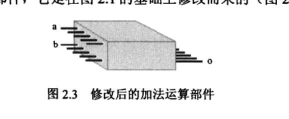

**《穿越计算机的迷雾》**

**1.**计算机最初被制造的目的--**数学计算**

**2.****怎么用电表示一个数字**：

直观想法，将不同的数表示为不同的电压（**不切实际**，电压、精度）

将不同的数分解，由基础数字组成，多根导线不同电压，共同表示（**可以表示小数，小数的精度与电压精度无关**。**模拟计算机**的概念，**1940年**）

十进制的核心在于组合，用十个符号拼凑出不同的数

用开关表示二进制数，按照之前的思路，必须制作一大堆电路，为了是生成不同的电压。现在只需要准备一个**合适的电源和开关**即可，而且也不存在精度问题，使用的电压大小也没有限制。之前的方案还涉及到如何检验计算是否正确（也即是表征输出，电压这个因素受影响太多，**不好表征**）。而二进制的开关只有二态能很好解决这个问题。

**为什么莱布尼茨发明的符号学要由于牛顿的？**

尽管莱布尼茨发明了二进制，并非源于他意识到二进制对计算机多么重要。尽管他曾经热衷于研究如何知道计算机，而且也确实发明了一台**机械计算机**，但那台计算机**根本不使用二进制工作**，也跟二进制毫不相干。

**3.**用二进制方案表示数之后，**全加器**的电路构造

**A、B**分别表示来自加数和被加数的一个比特，正好位于同一列。**Ci**表示来自**右边一列**的进位

**S**为本列的和，**C0**表示本列产生的进位

因此串联一系列全加器,可以组成**不同位数的加法机**

**4.电流磁效应**

磁针**电抗**作用实验

导线上漆制作漆包线--**匝与匝之间可以紧挨在一起而不至于短路**。

电流速度极快的特点，传递信息，**莫尔斯、杰尔逊**

**5.磁生电**

法拉第，只有导体在磁场种运动的时候才会产生电流

**6.电话的发明**

声音的本质是一种振动。

**人的耳朵之所以能够听到声音，是因为耳膜将声波的震动转换为了生物电，生物电刺激大脑中负责听觉的区域**

为了用电流传递声音，需要将声音转换为电流，**话筒**

**话筒的构造**：一个线圈和一个磁场，线圈位于磁场中，并于一个纸片或者塑料片相连。由于声波的作用，纸片也被迫振动，从而带动线圈在磁场中运动，产生强弱不等的电流

话筒产生的电流，其波形和声波一致，所以称为**音频电流**

**扬声器**：将电流还原成声音，话筒本身就可以当扬声器用（逆过程）。当**音频电流**通过线圈的时候，线圈就会产生**或强或弱的磁场**，而线圈本身就位于磁场中，产生相互作用，线圈运动使纸片制动。

贝尔，产生的电流很微弱，爱迪生发明的**碳精送话器**更流行，类似一个碗，中间填充优质无烟煤提炼的碳精砂，碗口有一层金属膜，金属膜振动，内部碳精粒会随着声波的变化时而紧密、时而疏松，从而使整个装置的电阻不停变化。

**7.交流电**

爱迪生发明电灯，采用**直流电**供电，如干电池就是，

特斯拉，交流电，方向、大小是时刻变化的，交流电通常是在大型发电厂用电磁感应的方式产生的。**让导线在磁场中不停的旋转**

**变压器：**

为了远距离输送电力，首先升压，减少传送损耗，到了真正使用的地方降压

**他不发明历史，却为历史锦上添花**

**8.无线电通信**

**收音机的原理？？？**

**麦克斯韦**，电磁波的存在，断电自感，打雷

我国规定，交流电的频率必须是**50HZ**，它只能在导线周围产生变化的磁场，根本辐射不出去。要向远距离辐射电磁波，除了加大能量，还需要提高频率。

用收音机听到无线电广播，频率在**500000**HZ以上，发送和接受手机的频率在**800 000 000HZ**以上

**9.逻辑学**

形象思维和抽象思维

**白马非马**

历史上，各门学科的交叉和融合是一种常态。

数学是一种强有力的工具，**几乎所有学科要达到完善的地步，都应当能用数学进行完美的描述**。而对于数学本身，**简捷的、能够恰当地描述各种事务内在本质的符号至关重要**。

**莱布尼茨有了一些奇特的想法，觉得人类需要一种普遍的、恰当的符号，普世的所有问题和思想都可以归结为这些符号，然后用一套计算来代替人类的思考和推理过程。而且希望人类能够发明这样一种机器，能够自动代替大脑的逻辑思考过程。**

**乔治.布尔**，把逻辑学和数学相结合，创立数理逻辑，逻辑代数。

对于传统的形式逻辑，三段论，布尔用集合这个数学工具来研究三段论。

布尔割下了逻辑学这条泥鳅的头，使它固定，不再滑来滑去

布尔的丰功伟绩不只是受到逻辑学者的敬仰。**伟大理论就像天上明亮的星星，会给所有注视它的人以启迪**

香农，将布尔代数和电路结合在一起---**开关电路**  《继电器和开关电路的符号化分析》

**联言**命题演算---两个开关**X和Y**的串联

**选言**问题演算---两个开关的并联

所有的布尔代数基本规则都非常完美适用于继电器和开关的电路。

开关电路的意义：自动化，要是利用电压、电流来代替人手控制一些开关，就一样能改变电路的通断状态。

莎士比亚电路

再用逻辑门构造电路时，可以化简逻辑表达式

**2个异或门**、**2个与门**，外加**1个或门**， 使得继电器的总数减少到22个

把一个非门的输出取出一部分，同时有作为它的输入，就形成了一个反馈

发明振荡器在，最早的目的是为了向天空杨撒电磁波（要向产生电磁波，必须使电流以极高的速度不断变化）

世界上第一个振荡器出自赫兹之手

电磁波能不能传递声音。遇到的问题，第一，没有一种好的方法把来自话筒的声音电流加载到电磁波上，而接收方也没有办法将微弱的信号放大；第二，当时的电磁发生装置都很原始，电流通过空气放电时，是一个没有规律的导电过程，这意味着，不规则的急速变化的电流，将产生包含各种频率成分的电磁波。

**灯丝发光时**，真空中隔着一段距离的两个导线中竟然由电流通过。“**真空驯电子**”

**如果把电源的正负极对调下，电流却消失了**

**单向导电性**，电子二极管，为了使阴极能更有效地被灯丝加热，把它做成一个**筒形**，像小桶一样把灯丝罩在里面，而且小桶底部，涂了一层氧化物，比如氧化铜（在加热之后，发送电子的本领更高）。

通过改变**栅极**上电压的大小和极性，可以改变阳极上电流的强弱，甚至切断它。（**令人意想不到的是，只要栅极上的电流发生一点变化，阳极上的电流就会大幅度地跟着改变**，这个放大后地能量来源于电源，它只是一个转换器）。这意味着电子三极管有**放大**作用。

除了有线中电话信号可以放大，无线的东西也能排上用场。利用它地放大作用，再加上适当地反馈，就可以形成一个振荡器，能够产生**固定频率**的振荡电流。

如果它的振荡频率足够高，就能向很远的地方发射无线电波，它的优势是可以获得**极高的振荡频率**，因为电子管的**开关速度**很快

这是真正优美的振荡，不但辐射的电磁波频率变高了，而且只在固定的频率上工作，从这个时候开始，利用**电磁波进行语音和电报通信**的时代开始了。

福斯雷特，“**无线电之父**”

长久以来，制造振荡器的方法就是在电路中加上反馈（**TODO:???**）

**触发器**的工作状态依赖两个开关**S**和**R**,闭合一个，断开另一个，总会得到两个相反的输出Q、Q‘。如果两个都断开，取决于Q、Q'刚才位于什么状态。

闭合两个开关，属于暴力干涉，两个都不会亮。**通常情况下**，Q和Q’是**互补**的，互为依托、互相制约，能达到稳定状态。

电路刚刚通电时，谁亮？会引发**竞争**（这个电路中，就是零件的参数和工作速度）

最早、最基本的触发器，R-S触发器.Q的输出总是和S的输入是一致的(**Set的由来**),不管Q是什么,总可以通过设置R,将Q打回原形(**Reset**的由来)

普通的电路,以及常规的逻辑门都有一个共性,那就是输出依赖于输入,当输入消失时,输出也就**不复存在**.触发器不同,当触发时,输出会改变,输入撤销时,输出依然能保持.

通常情况下,**CP=0**,意思是现在不保存数据,因为与门的性质,不管D的输出,触发器都会保持原有性质.

**CP=1**时,D的变化才会影响触发器,影响完之后,CP为0,后面触发器就能保存数据了.

**D触发器**

**循环移位寄存器TODO:???**每个寄存器都会保存上一个寄存器的输出,按一次开关等于移位一次

**T触发器**Toggle,类似开关电路.

世界上第一只电子二极管发明于1904年,1906年才发明三极管,这两者的发明不是因为要制造计算机,而是被广泛应用于**电话 电报和无线通信**.

<**继电器和开关电路的符号化分析**>,香农的工作是基础的,特别是对于制造现代电子计算机.但是,数字电路的第一个应用并不是电子计算机,而是被用作电话交换,而这也是香农本来的目标.**(**所有电话**公用**一些有限的电路,只有当两个电话互相通话时,才临时接通,**因此当开关电路建立之后,接线员的工作就能自动化了)**.

用继电器制造的运算电路是一个名副其实的**怪胎**(它的工作需要**电流的驱动**,吸合和释放却是一个**机械过程**) .

**晶体管**---20世纪最重要的发明,**硅锗**

电子管体积大,电子管依赖灯丝发热把阴极烤的能发射电子,所以有点慢,最后,电子管怕振(灯丝在灼热的时候容易因为振动断掉)

所有的金属都是晶体

制造晶体管,需要**纯净的硅和锗**.纯净的硅叫本征硅,和金属比,硅和锗的导电性能很差,**半导体**.

晶体二极管

如果在半导体中掺砷 镓等原子,制作出来的晶体二极管还会发光,经过一些特殊处理,还会控制光的颜色.发光二极管体积小,不需要高热灯丝就能发光,耗电量非常小.

**晶体三极管**

不像电子管,晶体管可以做的很小巧,不需要很高电压,不需要发热.晶体管的工作原理和一块硅的实际大小没关系,可以将晶体管做的很小,**但丝毫不影响它的单向导电性**,也照样可以放大信号.

**计数器**

在逻辑电路中,公用的线路称为**总线**,为了放置总线冲突,可以使用电子开关(**传输门**).

**TODO:还是需要有些写写画画的,这样能加深印象**

**《穿越计算机的迷雾》**

**《编码：隐匿在计算机背后的语言》**

**《编码：隐匿在计算机背后的语言》**

