**《汇编语言-王爽》**

**实现部分可以专门留在后面**

汇编语言由以下3类指令组成：

* 汇编指令：机器码的助记符，有对应的机器码
* 伪指令：没有对应机器码，由编译器执行，计算器不执行
* 其他符号：如+、-、*等，由编译器识别，没有对应机器码

CPU要想进行数据的读写，必须和外部器件有以下3类交互：

* 存储单元的地址（地址信息）
* 器件的选择，读或写的命令（控制信息）
* 读或写的数据（数据信息）

CPU从内存3号单元读取内容：

* 通过**地址线**将地址信息3发出
* 通过**控制线**发出内存读命令，选中存储器芯片，并通知它，将要从中读取数据
* 存储器将3单元中的数据通过**数据线**送入CPU

CPU对外部器件的控制是通过控制总线进行的。**控制总线**是一些不同控制线的集合。有多少根控制总线，就代表CPU提供了对外部器件的多少种控制。

CPU可以用不同的段地址和偏移地址形成一个同一个物理地址

8086CPU加电启动或复位后，CS和IP被设置为CS=FFFF。H，IP=0000H

mov指令可以修改通用寄存器的值，但是不能用来修改CS、IP的值。能够改变CS、IP内容的指令被统称为转移指令

mov指令支持的格式：（TODO:）

```assembly
mov 寄存器，数据
mov 寄存器，寄存器
mov 寄存器，内存单元
mov 内存单元，寄存器
mov 段寄存器，寄存器
mov 寄存器，段寄存器
//可以将直接数、寄存器、内存单元传送到通用寄存器
//可以将寄存器内容传送到内存单元、段寄存器
```

8086CPU不支持将数据直接送到段寄存器

现今的CPU中都有栈的设计，**任意时刻SS:SP指向栈顶元素**

现代CPU如何保证栈不会越界呢？TODO:

mov  ax,[bx]   把内存中的一个地址送到ax，偏移地址在ds:bx

loop指令：执行此指令时进行两步操作，cx=cx-1,cx值不为0则转至标号处执行程序，如果为0则向下执行

**段前缀**：

mov ax,cs:[0]

这些出现在访问内存单元的指令中，用于显式地指明内存单元地段地址地“ds:”,"cs:","ss:","es:",在汇编语言中称为段前缀，默认为ds

在纯DOS方式（实模式）下，没有能力对硬件系统进行全面、严格地管理。DOS方式下，DOS和其他合法程序一般都不会使用**0:200~0:2ff**地256个字节的空间。

在操作系统环境中，合法通过操作系统获取的空间都是安全的，因为操作系统不会让一个程序所用的空间和其他程序以及系统自己的空间相冲突。

程序取得空间的方法有两种，一种是在加载程序的时候为程序分配，在就是程序在执行过程中像系统申请。

汇编语言伪指令中，end指定指令入口地址

mov ax ,[bx+200]  = mov ax,200[bx]           [bx+idata]进行数组的处理   这种形式为[bx+idata]

mov ax,[bx+si] 地址为：(ds) * 16 + (bx)+(si)

mov ax,[bi+si+idata]

不同的寻址方式的灵活应用：

*  **[idata]**用一个常量表示地址，可直接定位一个内存单元
* **[bx]**用一个变量表示内存地址，可用于间接定位一个内存单元
* **[bx + idata]**用一个变量和常量表示地址，可以在一个起始地址的基础上用变量间接定位一个内存单元
* **[bx + si]**用两个变量表示地址
* **[bx + si + idata]**

计算机是进行数据处理、运算的机器，有两个基本问题包含在其中：

* 处理的数据在什么地方
* 要处理的数据有多长

reg（寄存器）的集合包括：ax、bx、cx、dx、si、di、sp、bp

sreg（段寄存器）的集合包括：ds、ss、cs、es

对于bx、si、di和bp：

* 8086CPU只有这四个寄存器可以用在[....]进行内存单元的寻址
* [....]这4个寄存器可以单个出现，或只能以4种组合出现：bx和si，bx+di, bp+si, bp+di
* [....]出现bp，就会使用ss，否则使用ds

| 机器码   | 汇编指令   | 指令执行前数据的位置 |
| -------- | ---------- | -------------------- |
| 8E1E0000 | mov bx,[0] | 内存单元，ds:0       |
| 89C3     | mox bx,ax  | CPU内部，ax寄存器    |
| BB0100   | mox bxc,1  | CPU内部，指令缓冲器  |

立即数对于直接包含在机器指令种的数据（执行前在CPU的指令缓冲器）

| 寻址方式      | 含义                  | 名称             | 常用举例                                                     |
| ------------- | --------------------- | ---------------- | ------------------------------------------------------------ |
| [idata]       | EA=idata,SA=(ds)      | 直接寻址         | [idata]                                                      |
| [bx]          | EA=(bx),SA=(ds)       | 寄存器间接寻址   | [bx]                                                         |
| [si]          | EA=(si),SA=(ds)       | 寄存器间接寻址   |                                                              |
| [di]          | EA=(di),SA=(ds)       | 寄存器间接寻址   |                                                              |
| [bp]          | EA=(bp),SA=(ss)       | 寄存器间接寻址   |                                                              |
| [bx+idata]    | EA=(bx)+idata,SA=(ds) | 寄存器相对寻址   | 用于结构体：[bx].idata<br />用于数组：idata[si],idata[di]<br />用于二维数组：\[bx][idata] |
| [si+idata]    | EA=(si)+idata,SA=(ds) | 寄存器相对寻址   |                                                              |
| [di+idata]    | EA=(di)+idata,SA=(ds) | 寄存器相对寻址   |                                                              |
| [bp+idata]    | EA=(bp)+idata,SA=(ss) | 寄存器相对寻址   |                                                              |
| [bx+si]       | .....                 | 基址变址寻址     | 用于二维数组：\[bx][si]                                      |
| [bx+di]       | .....                 | 基址变址寻址     |                                                              |
| [bp+si]       | .....                 | 基址变址寻址     |                                                              |
| [bp+di]       | .....                 | 基址变址寻址     |                                                              |
| [bx+si+idata] | .....                 | 相对基址变址寻址 | 用于表格（结构）中的数组项：\[bx].idata[si]<br />用于二维数组：idata\[bx][si] |
| [bx+di+idata] | .....                 | 相对基址变址寻址 |                                                              |
| [bp+si+idata] | .....                 | 相对基址变址寻址 |                                                              |
| [bp+di+data]  | .....                 | 相对基址变址寻址 |                                                              |

指令要处理的数据有多长：

* 通过通用寄存器自动推断,例：mov ax,[12H]
* 操作符X ptr指示，例：mov word ptr ds:[0],1
* 有些指令默认了访问的字单元还是字节单元，例：push指令只进行字操作

8086CPU提供的如[bx + si + idata]的寻址方式为结构化数据的处理提供了方便

div指令：

* 除数，有8位和16位两种，在一个reg或内存单元中
* 被除数，默认放在ax或dx和ax中，如果除数为8位，被除数则为16位；如果除数是16位，被除数则为32位
* 结果，如果除数为8位，则AL存储商，AH存储余数；如果除数位16位，则AX存储上，DX存储余数

伪指令：

db-定义字节型数据，dw-定义字型数据，dd-定义双字型数据

dup，进行数据的重复  db 2 dup(1,2,3),定义6个字节数据，分别为1，2，3，1，2，3

#### 转移指令

操作符offset，offset start,取得标号start的偏移地址

jmp指令，无条件转移指令，可以只修改IP，也可以同时修改CS和IP

* 依据位移进行转移，jmp short 标号，段内短转移，对IP修改范围为-128~127。jmp short s 被翻译成jmp 0008，机器码为**EB03**

  EB03没有指定转移地址，但是03却指明了要跳往数据的位移

  jmp near ptr 标号，段内近转移-32768~32767

* jmp far ptr 标号，段间转移，EA 0B 01 BD 0B，高地址是转移的段地址，低地址是偏移地址

* jmp 16位reg，修改ip为reg中的值

* jmp word ptr 内存单元地址（段内转移）、jmp dword ptr 内存单元地址（段间转移）

jcxz指令，有条件转移指令，所有有条件转移指令都是短转移，在对应机器码中包含转移的位移，而不是目的地址，对IP修改范围为-128-127

如果(cx)=0,则转移到标号处执行

loop指令，循环指令，所有的循环指令都是**短转移**，在对应的机器码中包含转移的位移，对ip修改范围都为-128~127

**编译器对转移位移超界的检测：**

call和ret指令都是转移指令，都修改IP，或同时修改CS和IP

ret指令用栈中的数据，修改IP，实现近转移

retf指令用栈中的数据，修改CS、IP，实现远转移

CPU执行call指令时，进行两步操作：

* 将当前的ip或cs和ip压入栈中
* 转移

call指令不能实现短转移

call 标号   相当于 push ip  jmp near ptr 标号

call far ptr 标号 进行的段间转移

call 16位reg

call word ptr 内存单元地址

call dword ptr 内存单元地址

mul指令：

* 两个相乘的数，要么都是8位，要么都是16位。如果是8位，一个默认放在AL中，一个放在8位reg或内存单元中；如果是16位，一个默认在AX中，一个默认在16位reg或内存单元
* 结果，如果是8位乘法，结果默认放在AX中；如果是16位乘法，高位默认放在DX中，低位在AX中放

call与ret指令共同支持了汇编语言编程中的模块化设计

除了用寄存器传递参数外，还有一个通用的方法是用栈来传递参数

如何避免寄存器的使用冲突，例如cx，通常用来记录循环次数，方案：

* 在子程序的开始，将子程序中所有用到的寄存器中的内容都保存起来，在子程序返回前恢复，可以用栈保存寄存器的内容。

###### 标志寄存器

CPU内部的寄存器，有一种特殊的寄存器，具有以下3种作用：

* 用来存储相关指令的某些执行结果；
* 用来为CPU执行相关指令提供行为依据；
* 用来控制CPU的相关工作方式。

这种特殊的寄存器在8086CPU中，被称为标志寄存器。8086CPU的标志寄存器有16位，其中存储的信息通常被称为程序状态字(PSW)。

flag寄存器（标志寄存器）是按位起作用的，每一位都有专门的含义


**ZF标志：**

零标志位，记录相关指令执行后，其结果是否为0

8086CPU的指令集中，有的指令的执行是影响标志寄存器的，比如add、sub、mul、div、inc、or、add，它们大都是运算指令；有的指令的执行对标志寄存器没有影响，比如mov、push、pop等，它们大多是传送指令。

**PF标志**：

奇偶标志位,它记录相关指令执行后，其结果的所有bit位中1的个数是否为偶数

**SF标志**：

符号标志位，它记录相关指令执行后，结果是否为负

**CF标志：**

进位标志位。一般情况下，在进行无符号数运算时，它记录了运算结果的最高有效位向更高位的进位值，或从更高位的借位值。

**OF标志：**

溢出标志位，一般情况下，OF记录了有符号数运算的结果是否发生了溢出

```assembly
mov al,98
add al,99
add指令执行后：CF=0,OF=1,CPU执行add等指令时，就包含了两种含义：无符号数运算和有符号数运算。对于无符号数运算，CF标志记录是否进位；对于有符号数运算，用OF标志位标识是否溢出
```

**abc指令**

常进位加法指令，利用CF位上记录值

abc 操作对象1，操作对象2    =>   操作对象1 = 操作对象1  + 操作对象2  + CF

**sbb指令**

带借位减法，利用了CF位上记录的借位值

sbb 操作对象1，操作对象2    =>   操作对象1 = 操作对象1  - 操作对象2  - CF

TODO:多位的加减法实验？？？

**cmp指令**：

比较指令，功能相当于减法指令，只是不保存结果。指令执行后会对标志寄存器产生影响

**检测比较结果的条件转移指令**：

例如：jcxz就是一个条件转移指令，检测cx中的值，决定是否转移

CPU还提供了其他条件转移指令，大多数条件转移指令都检测标志寄存器的相关标志位，根据检测的结果决定是否修改IP


**DF标志**：

方向标志位，在串处理指令中，控制每次操作后si、di的增减。

df=0 每次操作后si、di递增；反之递减

movsb movsw，只是串传送操作的一个步骤，一般来说和rep配合使用

rep movsb   =>   s:movsb   loop s

**rep**的作用就是根据cx的值，重复执行后面的串传送指令

**cld指令**：将标志位df置为0

**std指令**：将标志位df置为1

**pushf、popf**的功能是将标志寄存器的值压栈、出栈

TODO:

[真正用来学习微机原理及汇编的好书!_xkf321的博客-CSDN博客_微机原理书籍推荐](https://blog.csdn.net/xkf321/article/details/64947747)

#### 内中断

任何一个通用的CPU，都具备一种能力，可以在执行完当前正在执行的指令之后，检测到从CPU外部发送过来的或内部产生的一种特殊信息，并且可以立即对所接受到的信息进行处理。这种特殊的信息，可以称其为：**中断信息**

对于8086CPU，内部有以下情况发生时，将产生相应的中断信息：

* 除法错误，中断源0
* 单步执行，中断源1
* 执行into指令，中断源4
* 执行int指令，指令格式为int n,其中n为字节型立即数，是中断源

中断类型码是一个字节型数据，可以表示256种中断信息的来源

###### 中断向量表

中断处理程序入口地址的列表，在内存中存放，对于8086PC机，中断向量表指定放在内存地址0处，即00000~003ff

一个表项占两个字节

**中断过程**：由中断类型码找到中断向量，并用它设置CS、IP，这个工作是由CPU的硬件自动完成的

8086CPU收到中断信息后，所引发的中断过程：

* 取得中断类型码
* 标志寄存器入栈
* 设置标志寄存器的第8位TF和第9位IF的值为0
* CS的内容入栈、IP内容入栈
* 设置中断处理程序的CS、IP

由于CPU随时都可能检测到中断信息，也就是说，CPU随时都可能执行中断处理程序，所以中断处理程序必须一直存储到内存某段空间

中断处理程序的编写方法和子程序的相似：

* 保存用到的寄存器
* 处理中断
* 恢复用到的寄存器
* 用iret指令返回

**iret**指令通常和硬件自动完成的中断过程配合使用。恢复cs、ip，标志寄存器

一般情况下，CPU在执行完一条指令后，如果检测到标志寄存器的TF位为1，则产生单步中断，引发中断过程。单步中断的类型码为1

CPU提供单步中断功能的原因，为单步跟踪程序的执行过程，提供了实现机制

响应中断的特殊情况：

执行完向ss寄存器传输数据的指令后，即便发生中断，CPU也不会响应。

BIOS内容：

* 硬件系统的检测和初始化程序
* 外部中断和内部中断的例程
* 用于对硬件设备进行I/O的中断例程
* 其他和硬件相关的中断例程

BIOS、DOS例程的安装：

* 开机后，CPU加电，CS=0ffffh,ip=0,此处为一个跳转指令，CPU执行该指令后，转去执行BIOS中的硬件系统检测和初始化程序
* 初始化程序将建立BIOS所支持的中断向量，（只需将对应中断例程的地址登记都中断向量表即可）
* 硬件检测和初始化完成后，调用int 19h进行操作系统的引导
* dos启动后，除了完成其他工作，还将它所提供的中断例程装入内存，并建立相应的中断向量

BIOS和DOS所提供的中断例程，都用ah传递内部子程序的编号

```assembly
mov ah,2 //置光标
mov bh,0 //第0页
mov dh,5 //dh中放行号
mov dl,12 //dl中放列号
int 10h

```

bh中页号的含义：内存地址空间中，B8000H~BFFFFH共32kb空间，为80*25彩色字符模式的显示缓冲区。一屏的内容在显示缓冲区共占4000字节，显示缓冲区分8页，显示器可以显示任意一页的内容

在PC机系统中，和CPU通过总线相连的芯片除各种存储器外，还有以下三种芯片：

* 各种接口卡上的接口芯片，它们控制接口卡进行工作
* 主板上的接口芯片，CPU通过它们对部分外设进行访问
* 其他芯片，用来存储相关的系统信息，或进行相关的输入输出处理

在这些芯片中，都有一组可以由CPU读写的寄存器

从CPU角度，将这些寄存器都当作端口，对它们进行统一编址，从而建立一个统一的端口地址空间。

CPU可以直接读写以下三个地方的数据：

* CPU内部的寄存器
* 内存单元
* 端口

在PC系统中，CPU最多可以定位64KB个不同的端口，则端口地址范围为0~65535

对端口读写指令有两条：in和out，分别用于从端口读取数据和往端口写入数据

在in和out指令中，只能使用ax或al来存放从端口中读入的数据或要发送到端口中的数据

对0~255以内的端口进行读写时：用ax或al

对256~65535的端口进行读写时，端口号放到dx中

```assembly
mov dx,3f8h
in al,dx
out dx,al
```

**CMOS RAM芯片**：

* 包含一个**实时钟**（TODO:是什么？？？）和一个有128个存储单元的RAM存储器
* 该芯片靠电池供电
* 128字节的RAM中，内部实时钟占用0~0dh单元保存时钟信息，其余大部分用于保存系统配置信息，供系统启动时BIOS程序读取。BIOS也提供了相关的程序，使我们可以在开机的时候配置CMOS RAM中的系统信息
* 该芯片内部有两个端口，端口地址为70h和71h，CPU通过这两个端口读写
* 70h为地址端口，存放要访问的CMOS RAM单元的地址；71h为数据端口，存放从选定的CMOS RAM中读取的数据

**shl指令**：

逻辑左移，它的功能：

* 将一个寄存器或内存单元中的数据向左移位
* 将最后移出的一位写入到CF
* 最低位用0补充

如果移动位数大于0，必须将移动位数放在cl中

**shr指令**：逻辑右移，与shl操作相反

##### 外中断

CPU通过端口和外部设备进行联系

相关芯片要向CPU发出相应的中断信息，CPU在执行完当前指令后，可以检测发送过来的中断信息，引发中断过程，处理外设的输入

在PC系统中，外中断源一共有以下两类：

可屏蔽中断：是CPU可以不响应的中断，是否响应，要看标志寄存位IF设置

sti,设置IF=1;cli,设置IF=0

不可屏蔽中断：CPU必须响应的外中断，对于8086CPU，不可屏蔽的中断类型码固定为2。几乎所有由外设引发的中断，都是可屏蔽中断。不可屏蔽中断是在系统中有必须处理的紧急情况发生时用来通知CPU的中断信息。

**《 x86汇编语言-从实模式到保护模式》**

masm  nasm  gcc内联汇编的区别  TODO:

采用开源的nasm和VirtualBox，以个人计算机广泛采用的**Intel处理器**为基础，详细讲解了Intel处理器的**指令系统**和**工作模式**

如何**直接控制硬件**，不借助BIOS、DOS、Windows、Linux或者其他任何软件的支持下来显示字符、读取硬盘数据、控制其他硬件

处理器的底部或四周，有大量的**引脚**，可以接受外面来的信号，或者向外发出电信号

一旦加数通过引脚送入处理器，代表这个二进制数字的一组信号就会出现在与**引脚相连的内部线路**（处理器内部总线）上。这是一组高低电平的组合，代表二进制数中的每一位。此时，必须用寄存器电路**锁住**。之所以要这么做，是因为相同的引脚和线路马上还要用于输入加数。此后寄存器的内容不受外部数据线的影响。

**寄存器**是双向器件，可以在一端接受输入并加以锁存，会在另一端产生一摸一样的输出。

**内存**：保存很多数字的电路，通常只与处理器相连，内存的最小组成单位是字节。但是经过精心的设计和安排，能够按照字节、字、双字和四字进行访问（单次访问）。

**处理器**：目标之一就是使它可以称为一种可以**自动进行操作**的器件，还需要提供一种机制，允许工程人员决定进行何种操作。

**Intel处理器**：**低端字节序**，低字节位于低地址处，高字节位于高地址处。

8086处理器：ax bx cx dx si di bp sp,8个通用寄存器，前四个可以拆分成两个寄存器来使用。

程序重定位，使用**内存分段机制**，逻辑地址

逻辑地址**==>**物理地址：处理器访问内存时，把指令中指定的内存地址看成段内的偏移地址，而不是物理地址。会把DS中数据段起始地址和指令中提供的段内偏移相加，得到真正的物理地址。使得程序的运行和它在内存中的**位置无关**。

为了加快指令执行速度，8086内部有一个6字节的**指令预取队列**，在处理器忙着执行那些**不需要访问内存的指令**时，**指令预取部件**可以趁机访问**内存预取指令**，这时，多达6个字节的指令流可以排队等待解码和执行。

CS IP共同形成逻辑地址，并由**总线接口部件**变换成物理地址来取得指令。然后，处理器会自动根据当前指令的长度改变**IP**的值。（只有处理器才能直接改变**IP**的值，是否在所有处理器里都是如此TODO:）

程序的任务就是定义段地址并设置处理器的段寄存器。8086的逻辑分段，起始地址都是16的倍数，称为按照16字节对齐。段的长度可以是任意字节，只要不超过64KB。

**NASM**(Netwide Assember)

《**360° 剖析 Linux ELF**》

在处理器众多的引脚中，有一个是**RESET**，用于**接受复位信号**。每当处理器加电，或者RESET引脚的电平由低变高时，处理器都会执行一个**硬件初始化**，以及一个可选的内部自测BIST，然后将内部所有寄存器的内容初始化到一个**预置**的状态。

为了节约成本，并提高容量和集成度，在内存中，每个比特的存储都是靠一个极其微小的晶体管，外加一个同样极其微小的电容完成。（TODO:）这样微小的电容，其泄露电荷的速度很快，所以需要定期补充电荷，称为刷新。

Intel 8086处理器：

​		**0xF0000~0xFFFFF:固化开机时执行的指令顶端64KB**

​		**0x00000~0x9FFFF：DRAM占据较低端的640KB**

实模式下内存总结 **TODO:**

ROM芯片：硬件诊断、检测和初始化。提供了一套软件例程，在不了解硬件的情况下从外围设备获取输入数据，或者向外围设备输出数据（BIOS中断）。

**机械硬盘**：盘片、磁头组成。每个磁头不是单独移动，每个盘片分为两面。磁头旋转一周，会在盘面形成一个圆（**磁道**），所有盘面磁道组成圆柱面（**柱面**）。

为了尽量减少磁头的移动，硬盘上数据的访问是以**柱面组织**的，尽量先往同一磁道上填充数据。磁道还可以进一步划分为扇区，每条磁道划分为多少个扇区，取决于制造者，通常是**63**个。扇区的编号从1开始的。扇区和扇区之间以间隙间隔开来。每个扇区以**扇区头**（每个扇区自己的信息，主要由本扇区磁道号、磁头号、扇区号等）开始，然后是512字节的**数据区**。现代的磁盘还会在扇区头部包括一个指示扇区是否健康的标志，以及用来替换该扇区的扇区地址。用于替换扇区的，是一些保留和隐藏的磁道。

主引导扇区，BIOS会读取硬盘主引导扇区的内容，将他加载到内存地址0x0000:0x7c00处，然后用一个jmp指令跳转到此处。

每种虚拟机软件都企图指定自己的虚拟硬盘标准。VHD--Microsoft Virtual PC,VDI--VirtualBox,VMDK--VMWare

**虚拟硬盘**：采用VHD格式，是因为其简单，前面是数据区，用来模拟实际的硬盘空间，后面跟着一个512字节的结尾。

可以采用**VBoxManage**这个VirtualBox这个自带的将编译好的bin程序写入到虚拟硬盘。

采用磁头、磁道和扇区这种模式访问硬盘的方法称为**CHS**模式，不是很方便。后来引入逻辑块地址（**LBA**），现在市场上生产的，都支持**LBA**模式。

**LBA**模式是由硬盘控制器在硬件一级上提供控制。不考虑扇区的物理位置（磁头、磁道），而是将其全部组织起来同一编号，原来的物理扇区被组织为逻辑扇区

**VHD**文件就是采取**LBA**方式组织的。

**处理器加电或复位之后，如果硬盘是首选的启动设备，那么ROM-BIOS程序将试图读取硬盘的第一个扇区（MBR）。读取的主引导扇区有512字节，将其加载逻辑地址0x0000:0x7c00处。**

**一个有效的主引导扇区有512字节，最后两字节应当是0x55和0xAA。首先检查这两个标志，如果有效，则以一个段间转移指令跳到0x07c00处执行。**

正常情况下，一段精心编写的主引导扇区代码将检测用来启动计算机的操作系统，计算出它所在的硬盘位置，然后，它把操作系统的自举代码加载到内存，也用jmp指令跳转到哪里执行。

**显卡**：为显示器提供内容，并控制显示器的显示模式和状态。显卡都是独立生产、销售的部件。为了节省成本，有的显卡会直接做到显卡上（**集成显卡**）

显卡控制显示器的最小单位是像素，要显示的内容预先写入显存。显卡的工作就是周期性的从显存中提取显存中内容，按顺序显示在屏幕上。

不管是显示文字还是图片，对显卡都是没有区别。但是操作显存，是屏幕显示字符形状，是非常麻烦的工作，必须计算该字符所对应比特位于现存的什么位置。

为了方便，每个字符可映射为一个数，针对每一个数（代码），如果将代码转换为像素，使它们或明或暗构成字符的轮廓，是**字符发生器和控制电路**的职责了。

传统上，这种专门用于显示字符串的工作方式称为文本模式。**文本模式和图形模式**是显卡的两种基本工作模式，可以用指令访问显卡，设置它的显示模式。在不同的工作模式下，显卡对显存内容的解释方式是不同的。

显存是位于显卡上的，如果访问显存通过显卡这个外围设备，会影响效率，因此，把显存映射到处理器可以直接访问的地址空间。

8086可以访问**1M**内存，**0x00000-9FFFF**属于常规内存（**640KB**）；**0xF0000~0xFFFFF**（**64KB**）由主板上ROM-BIOS提供

中间还有一大块，被映射到了各种RAM

由于历史原因，个人计算机使用的显卡，加电自检后都会将自己初始化到**80x25**的文本模式，可以显示25行，每行80个字符，每屏总共**2000**个字符。

**0xB8000~0xBFFFF**,是留给显卡的

ASCLL码是7位代码，最高位通常置为0

屏幕上，每个字符对应显存中两个连续字节，前一个是字符的ASCLL码，后面是字符的显示属性，包括前景色和背景色

**K**RGB**I**RGB  其中**K**是闪烁位，为0时不闪烁，**I**是亮度位，为0时表示正常亮度。

当显存里什么都没有时，屏幕显示的全是黑底白字的空白字符，也叫空白字符

NASM汇编语言里，每条指令前面都可以拥有一个标号。

DB、DW、DD和DQ不是处理指令，是汇编器提供的伪指令

**div**指令：

* 16位的二进制数除以8位的除数。**除数**（8位）可以由**通用寄存器或者内存单元**提供，**被除数**必须由放在**寄存器AX**（16位）中

​		**商**寄存在**AL**中，**余数**寄存在**AH**中

* 32位进制除以16位进制，要求被除数高16位在**DX**中，低16位在**AX**中，除数可以由通用寄存器或内存提供

​		**商**在AX中，**余数**在DX中

NASM允许用下划线分割，以便观察比特位

mov ax,0000_0000_0000_0010B

xor ax,1111_0000_1111_0001B


**movsb、movsw指令**：把数据才能内存中的一个地方批量的传送到另一个地方。

**DS:SI**指定原始数据串地址；**ES:DI**指定传送到的目的地址；传送字节数或者字数由**CX**指定。除此之外还要指定传送方向（可以通过控制Flags寄存器）

不管传送方向，也不管传送的是字还是字节。每传送一次，cx的内容自动减一

**cld**指令将**DF**标志清零，以指示传送是正方向，与其相反的是**std**

**rep指令**：**CX**不为0，则重复执行

**8086**处理器中，如果要用寄存器来提供偏移地址，只能使用BX SI DI BP,不能使用其他寄存器

寄存器**BX**最初的功能就是用来提供数据访问的基地址，又叫**基址寄存器**（Base Address Register）。而且在最初设计8086时，每个寄存器都有自己的用途，比如**AX**是累加器（**Accumulator**），与它相关的指令会做指令长度上的优化；**CX**是计数器（Counter）；**DX**是数据寄存器，除了作为通用寄存器使用外，还专门用于和外设之间进行数据传递；**SI**（Source Index）,**DI**（Destinatino Index），用于数据传送操作

**有符号数和无符号数**：

**neg指令**，用0减去指定的操作数

32位有符号数是16位和8位有符号数的超集；16位有符号数又是8位有符号的超集

**一个8位的有符号数，要想用16位的形式表示，只需要将其最高位扩展到高8位即可？？？**。专门设计cbw、cwd两个指令完成这个操作。

对于处理器的多数指令，执行的结果**操作数的类型没有关系**，运算的过程，**数的视角**要统一（比如add指令要么**都为符号数，要么都为非符号数**）。

正是因为这个原因，很多处理器内部不构造减法电路，**而是使用加法电路做减法**。

//**TODO**:电子电路基础，特别是计算机部件的实现电路 全加器、半加器

**sub**指令：类似加法指令，目的操作数可以是8位或16位通用寄存器，也可以是8位或16位的内存单元；源操作数可以是通用寄存器，也可以是内存单元或者立即数 （不允许两个操作同时为内存单元）。

因为处理器没有减法运算电路，sub ah,al等效于：neg al;add ah al

几乎所有处理器指令既能操作有符号数，又能操作无符号数，有几条指令除外，如：除法指令和乘法指令

idiv指令-有符号数除法指令

**条件转移指令**：

jz的意思是ZF标志为1则转移，jnz意思是ZF标志不为1则转移；

其他jo、jc、jp类似

**cmp**比较指令在功能上和sub指令相同，唯一差别在，cmp指令仅仅根据计算的结果设置相应的标志位，而不保留计算结果，因此也就不会改变两个操作数的原有内容。cmp将会影响到CF、OF、SF、ZF、AF和PF标志位。因此可以可以与一系列条件转移指令相配合。

**jxcz**（**jump if CX is zero**）,当CX寄存器的内容为零时则转移。

[systemtap从入门到放弃（一） - 知乎 (zhihu.com)](https://zhuanlan.zhihu.com/p/347313289)

```
nasm -f bin ch06_mbr.asm -o ch06_mbr.bin
VBoxManage convertfromraw ch06_mbr.bin ch06_mbr.vhd --format VHD
```

 **push**指令：只接受16位的操作数，8086处理器只能压入一个字，其后的处理器允许压入字、双字或四字。执行命令时，首先将**sp**中的值减去字长，然后将要压入堆栈的数据存放到ss:sp指示的位置。

**寻址方式**

寄存器寻址，立即数寻址

内存寻址，又分为：

​	直接寻址,mov ax,[0x5c0f],将ds + 0x5c0f处值移动到ax处

​	基址寻址，在指令的地址部分使用基址寄存器BX（默认段前缀**DS**）或BP(默认段前缀**SS**)来提供偏移地址，mov [bx],dx。基址寻址允许在基址寄存器的基础上使用一个偏移量。

​	变址寻址，类似基址寻址，但是使用索引寄存器SI、DI（默认段前缀DS），mov [si + 0x100],al

​	基址变址寻址，让处理器支持多种寻址方式会增加硬件上的**复杂性**，但可以增强它的**数据处理能力**。

**段的定义**

一旦定义段，后面的内容就都属于该段，除非出现另一个段的定义。有时程序并不以段定义语句开始，这种情况下，这些内容默认自动生成一个段。

NASM对段的数量没有限制，一些大的程序，可能拥有不止一个代码段和数据段。

Intel处理器要求段在内存中起始物理地址是16字节对齐的，align

如果在某个段设置vstart=0,那么别的段引用该段内标号，此标号就相对于段开始计算，否则就相对于整个程序

**扬声器需要模拟信号，每个扬声器需要两根线，用的插头也是无线电行业的标准，话筒也是如此；**

**老式键盘只用一根线向主机发送按键的ASCLL码，一直采用PS/2标准**

**新式的USB键盘尽管也使用串行方式工作，但信号却和老式键盘完全不同**

**网络设施，流行的是里面有8根线芯的五类双绞线，里面的信号也有专门的标准**

不同的外围设备，都要有各自不同的I/O接口

I/O接口可以是一个电路板，也可能是一块小芯片。在一边，按处理器的信号规程工作，负责把处理器的信号转换为外围信号设备能接受的另一种信号；在另一边，把外围设备的信号变换成处理器可以接受的形式。

**总线技术**：可以认为是一排电线，所有的外围设备，包括处理器，都连接在这排电线上。但是，每个连接到这排电线上的器件都必须拥有电子开关，以使它们能够同这排电线连接，或者从这牌电线上脱离。

**输入输出设备集中器芯片**（I/O Controller Hub），连接不同的总线，并协调各个I/O接口对处理器的访问。如南桥。

在ICH内部，集成了一些常规的外围设备接口（如USB、PATA(IDE)、SATA，时钟等）。不管什么设备，都必须通过它自己的I/O接口电路同ICH相连。为了方便，最好是在主板上做一些插槽，同时，每个设备的I/O接口电路都设计成插卡。为了实现这个目的，或者说为了支持更多设备，**ICH**还提供了对**PCI**或**PCI Express**总线的支持，还总线向外延伸，连接主板上若干个扩展槽。

除了局部总线和PCI总线，每个I/O接口卡可能连接不止一个设备，如USB接口，可能连接 鼠标、键盘、u盘等。因为同类型的设备较多，也涉及线路复用和仲裁的问题，故它们也有自己的总线体系，称为通信总线或者设备总线。

具体来说，处理器是通过**端口**来和外围设备打交道的。本质上，**端口就是一些寄存器**，只是位于I/O接口电路中。

每一个I/O接口都可能有好几个端口，分别用于不同的目的，比如，连接硬盘的**PATA/SATA**接口：**命令端口**（当向该端口写入0x20时，表示是从硬盘读数据，写入0x30时，表明向硬盘写数据）、**状态端口**（处理器根据这个端口的数据判断硬盘是否工作正常，操作是否成功，发生了那种错误）、**参数端口**（读写的扇区数量，以及起始的逻辑扇区号）、**数据端口**（取出和写入数据）

端口在不同的计算机系统中有着不同的实现方式：

* 一些计算机系统中，端口号是**映射到内存地址空间**的。

* 另一些计算机系统中，端口是**独立编址**的，不和内存发生关系。这种计算机中，处理器的**地址线**既连接内存，也连接每一个I/O接口。但是，处理器还有一个特殊的引脚**M/IO#**,这里**#**表示低电平有效，也就是说，当处理器访问内存时，会让**M/IO#**引脚呈高电平，和内存的电路就会打开；否则内存电路被禁止，与此同时，处理器发出的地址和**M/IO#**信号一起用于打开某个I/O端口。

Intel处理器，早期是**独立编址**的，现在**既有**内存映射的，**也有**独立编址的。

所有接口都是统一编号的，每个I/O接口电路都分配了若干个端口号。

**PATA/SATA**接口：都分配了8个端口，但是**ICH**芯片内部通常都集成了两个**PATA/SATA**接口，分别是主硬盘接口和副硬盘接口，这样一来，主硬盘接口分配的端口号是0x1f0~0x1f7,副硬盘接口分配的端口号是0x170~0x177

在Intel的系统中，只允许65536个端口（因为是独立编址，所以端口的访问不能使用类似mov这样的指令TODO:？？？取而代之的是**in**和**out**指令）。

**in指令**：从端口读，in al,dx (指令码为**0xEC**)， in ax,dx（指令码为**0xED**）;目的操作数必须是寄存器**AL或AX**，源操作数应当是**DX**。以上是一字节形式，不允许使用别的通用寄存器，也不允许使用内存单元作为操作数。还有两字节的形式，此时前一个字节的操作码是**0xE4**或**0xE5**，用于指示8位或者16位端口访问，后一字节是**立即数**，指示端口号。

**in指令不影响标志位**

**out指令**：与in指令相反，通过端口向外围设备发送数据

**通过磁盘控制器端口读取扇区数据**：

硬盘读写的基本单位是扇区。

从硬盘读写数据，最经典的方式是向硬盘控制器分别发送磁头号、柱面号和扇区号，**CHS**模式

**LBA模式**，最早的逻辑扇区编址方法是**LBA28**，用28个比特表示逻辑扇区号，可以管理128GB的硬盘。

随着硬盘容量的增大，现在业界推出了**LBA48**，可以管理131072TB

因此：

​	个人计算机的主硬盘控制器被分配了8位端口，端口号从0x1f0~0x1f7

* 设置要读取的扇区数，写入0x1f2端口（8位端口，一次最多读255个扇区），如果写入的值为0表示要读取256个扇区。每读取一个扇区，**数值减一**，如果读写过程中发生错误，该端口包含**尚未读取的扇区数**。

  ```assembly
  mov dx,0x1f2
  mov al,0x01
  out dx,al
  ```

* 设置起始**LBA**扇区号。28位的扇区号太长，分为四段写入到0x1f3、0x1f4、0x1f5、0x1f6端口

  ```assembly
  mov dx,0x1f3
  mov al,0x02
  out dx,al
  
  inc dx  ;0x1f4
  mov al,0x00
  out dx,al
  inc dx  ;0x1f5
  out dx,al
  inc dx  ;0x1f6
  mov al,11100000
  out dx,al
  ```

  最后0x1f6，低四位存储着逻辑扇区号24-27，第5位用于指示硬盘号，**0表示主盘**，高三位是”111“，表示**LBA**模式

* 向端口0x1f7写入0x20，请求硬盘读

  ```assembly
  mov dx,0x1f7
  mov al,0x20
  out dx,al
  ```

* 等待读写操作完成，**端口0x1f7**既是命令端口，又是状态端口。通过这个端口发送完命令后，硬盘内部开始操作，在其内部操作期间，将0x1f7端口的第7位置1，表示正在”忙“，一旦硬盘准备就绪，就将此位清零，同时将第3位置”1“，请求主机发送或接受数据

  ```assembly
  mov dx,0x1f7
  .waits:
  	in al,dx
  	and al,0x88
  	cmp al,0x08
  	jnz .waits
  	
  ```

* 连续取出数据。0x1f0是硬盘接口的数据端口（16位），一旦硬盘控制器空闲。且准备就绪，就可以连续从这个端口写入或读取数据

  ```assembly
  	mov cx,256
  	mov dx,0x1f0
  .readw:
  	in ax,dx
  	mov [bx],ax
  	add bx,2
  	loop .readw
  ```

  0x1f1端口是错误寄存器，包含硬盘驱动器最后一次执行命令后的状态。

**call指令**，8086处理器支持4种调用方式：

* 16相对近调用，被调用的过程位于当前代码段，只需偏移地址；三字节指令，操作码位0xE8,后跟16位的操作数（偏移量），偏移量计算规则：目标过程的汇编地址  **减去**  当前call指令汇编地址；再减去当前call指令以字节为单位的长度。默认为尽调用。被调用过程的首地址必须位于-32768~32767
* 16位间接绝对近调用，指令种操作数不是偏移量，而是被调用过程的真实偏移地址，不过这个偏移地址不是直接出现在指令中，而是由16位的通用寄存器或者16位的内存单元给出。
* 16位直接绝对远调用。属于段间调用，call 0x2000:0x0030,偏移地址在前，段地址在后
* 16间接绝对远调用，必须使用far关键字，call far [0x2000]、call far [proc_1]、call far [bx]、call far [bx+si]  (取ds + [0x2000]处的值)

resb、resw、resd:伪指令，从当前位置开始，保留指定数量的字节，但不初始化它们的值。

0终止的字符串：在所有要显示内容最后，用数值0，用于标志字符串的结束。

光标在屏幕的位置保存在显卡内部的两个**光标寄存器**，每个寄存器都是8位的，合起来形成一个16位的数值。是可读可写的，可以从中读出光标的位置，也可以通过它设置光标的位置。**显卡从不自动移动光标位置**。

显卡的操作很复杂，内部的寄存器也很多，为了不过多占用主机的I/O空间，很多寄存器都只能通过**索引寄存器**间接访问。

**索引寄存器**：端口号是0x3d4,可以向它写入一个值，用于指定内部的某个寄存器。比如，两个8位的光标寄存器，索引值分别为14（**0x0e**）和15（**0x0f**）。

可以通过数据端口**0x3d5**来进行读写

尽管call和call far指令分别依赖于ret、retf指令，但是后者并不依赖前者。

**TODO**:本章程序已大概弄懂，暂时没有找到windows上类似dd的工具，后续linux补充

通过VBoxManage工具转换的VHD，第一个扇区似乎位于00000A00   TODO:

**中断**:为了多用户 多任务,处理器提供硬件级别的控制

从处理器外面来的中断信号，8086处理器通过**NMI**(Non Maskable Interrupt)和**INTR**()两根信号线引入外部中断信号。

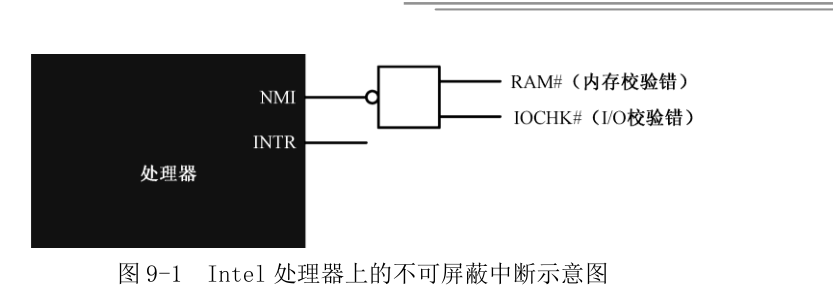

**NMI**,非屏蔽中断，在**实模式**下，NMI被赋予了**统一的中断号2**，不再进行细分。

(**NMI**的中断源通过一个与非门连接到处理器,处理器的NMI引脚是高电平有效,中断源是低电平有效的,当任何一个非屏蔽中断产生时,与非门的输出为高.**Intel处理器规定**,NMI中断信号由0跳到1后,至少维持**4个周期以上才有效**,才能被识别)

**INTR**，可屏蔽中断，通过INTR引脚进入处理器内部。不可能为每一个中断都提供一个引脚，并且处理器每次只能处理一个中断。所以，需要一个代理，接受外部设备发出的中断信号，还要对多个中断信号进行仲裁，决定哪一个优先向处理器提出服务请求。

个人计算机中，用的最多的**中断代理**就是**8259**芯片，中断控制器芯片，即使是现在,**绝大多数单处理器计算机**中,也依然存在

Intel处理器允许**256**个中断，中断号的范围是0~255，**8259芯片**负责提供其中的15个，但中断号不固定。之所以不固定，是因为当初设计的时候，**允许软件根据自己的需要灵活设置中断号**，以防止发生冲突。

**中断控制器芯片**有自己的端口号，可以向访问其他外部设备一样用**in**和**out**指令来改变它的状态，包括各引脚的中断号。所以又称可编程中断控制器(**PIC**)。

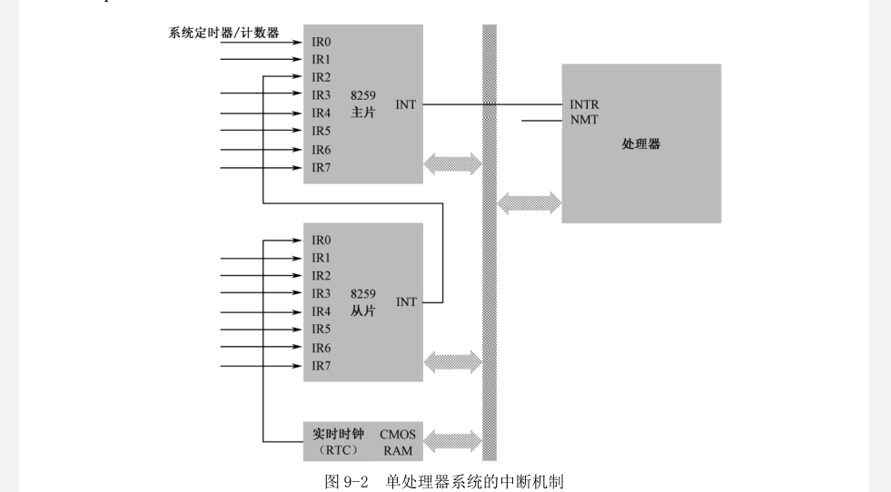


8259的主片引脚0（**IR0**）接的是**系统定时器/计数器芯片**；从片的引脚0（IR0）接的是实时时钟芯片**RTC**。**这两块芯片的固定连接即使是在硬件更新换代非常频繁的今天，也依然没有改变**。

8259芯片内部，有中断屏蔽寄存器（Interrupt Mask Register）,**8位寄存器，对应该芯片的的8个中断输入引脚**，对应的位是0还是1，决定从该引脚来的中断信号是否能通过8259送往处理器。

当外部设备通过某个引脚送来一个中断请求信号时，如果没有被IMR阻断，则可以被送往处理器。8259芯片是可编程的，主片的端口号是0x20和0x21，从片的端口号是0xa0和0xa1，可以通过这些端口访问8259芯片，设置它的工作方式，包括IMR的内容。

处理器内部，标志寄存器**IF**，就是中断标志，当IF为0时，所有从**处理器INTR引脚来的中断都被忽略掉**。

IF标志位可以通过两条指令**cli**和**sti**来改变。

多个中断同时发生时，8259芯片会记住它们，并按一定的策略决定先为谁服务（TODO:）

当一个中断事件正在处理时，如果来了一个优先级更高的中断事件时，允许暂时中止当前的中断处理，先为优先级更高的中断事件服务，称为**中断嵌套**（TODO:怎么实现？？）

**实模式下**，处理器要求将中断处理程序的入口点，集中存放到内存中从物理内存**0x00000~0x003ff**,共1KB的空间内，即IVT(**interruput Vector Table**)中断向量表

每个中断在中断向量表中占两个字，分别是中断处理程序的段地址和偏移地址

8259芯片，每个引脚都赋予了一个中断号，并且中断号是可以改变的，可以通过对8259编程来灵活设置，**但不能单独进行，只能以芯片为单位**。如，可以指定主片的中断号从0x08开始，那么它每个引脚IR0~IR7所对应的中断号分别是0x08~0x0e

处理器拿到中断号之后，要按顺序做以下几件事：

* 保护断点的现场，标志寄存器压栈，然后清除它的**IF**位和**TF**位（TODO:）；将CS、IP压栈
* 执行中断处理程序，由于IF标志被清除，中断处理过程，处理器将不再相应硬件中断。如果希望优先级更高的中断嵌套，可以在编写中断处理程序时，适时用sti指令开放中断
* 返回断点接着执行，所有中断处理程序最后一条指令必须是中断返回指令**iret**,着导致处理器依次弹出ip、cs、flags的原始内容。

和可屏蔽中断不同，NMI发生时，**处理器不会从外部获得中断号**，会自动生成**中断号码2**。（所以中断向量表，2号中断是固定的.TODO:）

在计算机启动时，BIOS为每个中断号填写入口地址，初始时，指向一个相同的入口地址，哪里只有一条指令：iret(这里是哪里呢TODO:???)

之后，操作系统和用户程序根据自己需要，来修改某些中断的入口地址，使它指向自己的代码。

在外围设备控制器芯片(**ICH**      **TODO:**)内部，集成了实时时钟电路（**RTC**），和两小块互补的金属氧化物（CMOS）材料组成的静态存储器（**CMOS RAM**）。RTC负责计时，时间的数值则存储在CMOS RAM中。

**RTC**是全天候跳动的，由主板上一个小电池供电。早期的计算没有ICH芯片，各个接口单元都是分立的，单独的焊在主板上，并彼此连接。早期的**RTC**芯片是摩托罗拉MS146818B，现在直接集成在ICH内，并且在信号上与其兼容。除了日期和时间的保存功能外，**RTC芯片也可以提供闹钟和周期性的中断功能**。

日期和时间信心保存在CMOS RAM中，通常是**128**个字节，而日期和时间信息只占了一小部分容量，其他空间则用于保存整机的配置信息，比如**硬件的类型和工作参数、开机密码和辅助存储设备的启动顺序**等。这些参数的修改通常在**BIOS SETUP**开机程序中进行。

RTC芯片由一个振荡频率为32.768kHz的**石英晶体振荡器**驱动(与CPU时钟周期wuguan)，经分频后，**用于对CMOS RAM进行每秒一次的时间刷新**。

CMOS RAM的访问，需要通过两个端口访问。0x70或者0x74是索引端口，用来执行CMOS RAM中的内存单元；0x71或0x75是数据端口，用来读写相应内存单元的数据。

| 偏移地址 | 内容   | 偏移地址 | 内容        |
| -------- | ------ | -------- | ----------- |
| 0x00     | 秒     | 0x07     | 日          |
| 0x01     | 闹钟秒 | 0x08     | 月          |
| 0x02     | 分     | 0x09     | 年          |
| 0x03     | 闹钟分 | 0x0A     | **寄存器A** |
| 0x04     | 时     | 0x0B     | **寄存器B** |
| 0x05     | 闹钟时 | 0x0C     | **寄存器C** |
| 0x06     | 星期   | 0x0D     | **寄存器D** |

很早的时候，端口0x70最高位是控制NMI中断的开关。当它为0时，允许NMI中断到达处理器，为1时，则阻断所有NMI信号，阻断所有NMI信号，其他7个比特实际用于指定CMOS RAM单元的索引号（这种规定到现在也没有改变）。

早期CMOS RAM只有64字节，而最新的ICH芯片则可能集成了256字节，新增的128字节称为扩展的CMOS RAM。

CMOS RAM中保存的日期和时间，通保存为BCD码（二进制编码的十进制数，**十进制数25表示为0010 0101**）

单元**0x0A~0x0D**不是普通的存储单元，而被定义成4个寄存器的索引号，这四个寄存器用于设置**时钟电路的参数和工作状态。**

寄存器**A**和**B**用于对RTC的功能进行整体设置，都是**8位的寄存器，可读可写**。

寄存器**C**和**D**是标志寄存器，反映了RTC的工作状态，寄存器C是**只读的**，寄存器D则**可读可写**，都是**8位寄存器**。

当处理器执行任何一条改变堆栈寄存器ss的指令时，会在下一个执行执行完期间禁止中断

RTC芯片的中断信号，通向中断控制器8259从片的第1个中断引脚IR0。在计算机启动期间，BIOS会初始化中断控制器，将主片的中断号设为从**0x08**开始，将从片的中断号设为从**0x07**开始(**默认值**)。

RTC的计时（更新周期）是独立的，**产生中断信号只是它的一个赠品**，所以如果希望它产生中断，需要额外设置。

正常情况下，8259是不会允许RTC中断的，所以，需要修改它内部的中断屏蔽寄存器IMR。IMR是一个8位寄存器，位0时对应着中断输入引脚IR0，位7对应引脚IR7。

**hlt指令**：使处理器停止执行指令，并处于停机状态，这将**降低处理器的功耗**。**处于停机状态的处理器可以被外部中断唤醒并恢复执行，而且会继续执行hlt后的指令**

**test**指令：测试某个寄存器，或者内存单元里的内容是否带有某个特征。功能上和and指令一样。都是将两个操作数按位进行逻辑“与”，并根据结果设置相应的标志位。但是test指令执行后，运算结果被丢弃（不改变或破坏操作数的内容）。跟and指令一样，test指令执行后，OF=CF=0（为什么？？？），对ZF、SF和PF的影响视测试结果而定，对AF影响未定义。

在8259芯片内部，有一个中断服务寄存器（**Interrupt Service Register**）。这是一个8位寄存器，**每一位对应一个中断输入引脚**，在中断处理过程，8259芯片会将对应的位置置1，表示正在服务从该引脚来的中断。

一旦响应了中断，8259中断控制器无法知道该中断什么时候才能处理结束。如果不清楚相应的位，**下次同一个引脚出现的中断将得不到处理**。因此，需要程序在中断处理的结尾，显示对8259芯片编程来清除该标志。

中断结束命令的代码是0x20,如果外部中断是主片处理，**EOI**命令仅发送给主片即可，端口号**0x20**;如果外部中断是从片处理，既要发送主片，也要发送从片（**0x0a**）

ch09_1.asm的字符显示在virtualBox下显示还是有问题，和08，待用bochs调试排查原因。**TODO:???**

**内部中断**：

和硬件中断不同，内部中断发生在处理器内部，由执行的指令引起。如div指令的除数为0时，将产生**0号中断**，处理器遇到非法指令时，将产生**中断6**。**内部中断不受标志寄存器IF位的影响，也不需要中断识别总线周期，它们的中断类型是固定的，可以立即转入相应的处理过程**。

**软中断**：

由**int**指令引起的，**不需要中断识别总线周期**（这个是什么意思）。中断号在指令中给出。

**int3** 断点中断指令，机器指令码位CC。指令是连续存放的，所谓的断点，就是某条指令的起始地址。**int3是单字节指令，这是有意设计的**。当需要设置断点的时候，可以将断点处那条指令的第一字节改成0xcc,原字节予以保存，当处理器执行到int3时，即发生发生3号中断。

**int n**  操作码是0xCD,第2字节的操作数给出了中断号。

**into**是溢出中断指令，机器码为0xCE，也是单字节指令。

**BIOS中断**：是计算机加电之后，BIOS程序执行期间建立起来的。主要是为了方便的使用最基本的硬件访问功能。不同的硬件使用不同的中断号。**通常，为了区分针对同一硬件的不同功能，使用寄存器ah指定具体的功能编号**。

BIOS会为一些简单的外围设备提供初始化代码和功能调用代码，并填写中断向量表，但是也有一些BIOS中断是由外部设备接口建立。

每个外部设备接口，包括各种板卡，如网卡、显卡、键盘接口电路、硬件控制器等，都有自己的只读存储器（**ROM**），类似于BIOS芯片。这些ROM中提供了自己的功能调用例程，以及本设备的初始化代码。按规范，前两个单元的内容为0x55和0xAA，第三个单元是本ROM中以512个字节为单位的代码长度，从第四个单元开始，就是实际的ROM代码。

在计算机启动期间，BIOS程序会以2KB单位为单位搜索内存地址C0000~E0000之间的区域。当发现某个区域的头两个字节是0x55和0xAA时，就意味着该区域有rom代码存在，是有效的。接着，对该区域做累加和检查，看结果是否和第三个单元相符，如果相符，就从第四个单元进入，这时，处理器执行的是硬件自带的程序指令，这些指令初始化外部设备的相关寄存器和工作状态，最后填写相关的中断向量表。

使用BIOS中断，第二个程序有些地方每搞懂。**TODO:???**

### 保护模式

处理器架构：**一整套的硬件结构，以及与之相适应的工作状态**。其中灵魂是一种设计理念，决定了**处理器的应用环境和工作模式**，也决定了开发人员如何在这种模式下解决实际问题。

**寄存器的扩展**：

* eax、ecx、edx、esi、edi、esp、ebp。32位的高16位不可独立使用，但低16位保持同16位处理器的兼容性。

​	可以在32位处理器上运行16位处理器的软件，但是并不是16位处理器的简单增强。

​	**32位处理器有自己的32工作模式**，在这种模式下，可以完全、充分地发挥处理器的性能，可以使用它全部的32根地址线，访问4GB内存。

*  为了生成32位物理地址，处理器需要使用32位的指令指针寄存器**cip**。

*  标志寄存器也扩充到32位，**eflags**

* 在32模式下，理论上是不需要分段的，因为有32根地址线。但是IA-32架构的处理器是基于分段模型的。不过，提供一种变通方案，只分一个段，段的基址为	0x00000000，段的长度为4GB，即**平坦模型**。

​	每个程序都有属于自己的内存空间。在16位模式下，一个程序可以自由的访问不属于它的内存位置，甚至可以对那些地方的内容进行修改，这是**不安全的，也不合法**，没有任何机制来限制这种情况。

​	32位模式下，处理器要求在**加载程序时**，先定义程序所拥有的段，然后允许使用那些段。定义段时，处理基地址外，还附加了段界限、特权级别、类型等属性。当程序访问一个段时，处理器将用**固件实施各种检查工作**，以防止对内存的违规访问（怎么用固件实施检查工作？？？TODO:）

​	32位模式下，传统的段寄存器保存的就不是段基址，而是段的选择子（**段选择器**）。除了**段选择器**，每个寄存器还包括了一个**64位的不可见部分**，称为描述符高速缓存器，里面有段的基址和各种访问属性，**这部分内容程序不可访问，由处理器自动使用**。

* 增加了两个额外的段寄存器FS、DS。

**1982年**，Intel推出**80286处理器**，有24根地址线，理论上可以访问16MB的内存，但依然只能分段访问。**80286处理器**与8086不一样的地方在于，第一次提出保护模式的概念。保护模式下，段寄存器中保存的不再是段地址，而是段选择子，**真正的段地址位于段寄存器的描述符高速缓存中**，是24位的。因此运行在保护模式的80286可以访问全部内存16MB。

**80286处理器**访问内存时，不再需要将段地址左移，**因为在段寄存器的描述符高速缓存中由24位的段物理基地址**。这样一来，段可以位于16MB内存空间的任何位置，而不是在限于低端1MB，也不必16字节对齐（8086为什么要求16位对齐**TODO:???**）。但是，即使运行在保护模式下，一个段大小还是只能时64KB(TODO：为什么？？？)。

**1985年**，80386处理器是Intel公司的第一款32位产品，是后续所有32位产品的基础。寄存器都是32位的，而且拥有32根地址线，可以访问4GB的内存。80386，以及后续所有32位产品都兼容实模式，可以运行实模式下的8086程序，而且在刚加电时，这些处理器都自动处于实模式之下。**只有在进行一番设置之后，才能运行在保护模式之下**。

除了保护模式，32位处理器还提供虚拟8086模式（v86模式），这种模式下，IA-32处理器被模拟成多个8086处理器并行工作。V86模式是保护模式的一种，可以在保护模式下执行多个8086程序。传统上，要执行8086程序，处理器必须工作在实模式。在这种情况下，32位程序就不能执行了，**v86模式提供了让它们一起同时运行的条件**。（曾经很有用，哪个时候8086程序很多，32位应用程序很少）。

**线性地址**：

**IA-32处理器**，访问内存时，需要在程序中给出**段地址和偏移量**，因为分段是IA-32架构的**基本特征**之一。传统上，段地址和偏移地址称为逻辑地址，**偏移地址叫做有效地址**。在指令中给出有效地址的方式称为寻址方式。

段的管理是由处理器的段部件负责进行的，段部件将段地址和偏移地址相加，得到访问内存的地址。**一般来说段地址产生的就是物理地址**。

**IA-32处理器支持多任务**。在多任务环境下，任务的创建需要分配内存空间；当任务终止后，还要回收它所占用的内存空间。在分段模型下，内存的分配不是定长的，程序大时，可能分配就是一大块，时间长了，内存空间就会碎片化。为了解决这个问题，**IA-32处理器**支持分页功能，分页功能将物理内存空间划分为逻辑上的页，页的大小是固定的，一般4KB。

**当页功能开启时**（怎么开启TODO:???）,段部件产生的就**不再是物理地址**，**而是线性地址**，线性地址需要经页部件的转换后，才是物理地址。

**线性地址**的概念是用来描述**任务的地址空间**。**IA-32处理器的每个任务都拥有4GB的虚拟内存空间**（线性地址空间）。相应的，由段部件产生的地址，就对应线性地址空间的每一个点，就是**线性地址**

**段部件、页部件**（TODO:???）

**流水线技术**：为了提高处理器的执行效率和速度，可以把一条指令的执行过程分解成若干个步骤，并分配给相应单元来完成。各个单元的执行是独立的、并行的。

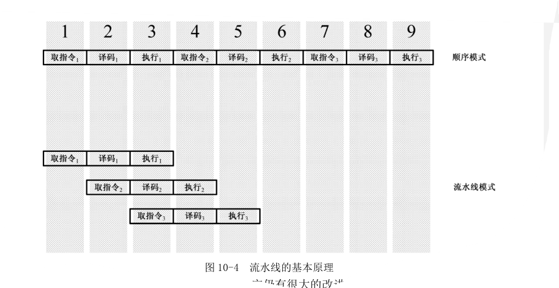

一般来说，流水线的效率受执行时间**最长的那一级**的限制，要缩短各级的执行时间，就必须让每一级的任务减少，因此，就需要把一些复杂的任务在进行分解。

**Pentium4处理器**采用了**NetBurst**微结构，进一步分解指令的执行过程，采用了31级超深流水线。

**高速缓存**：

寄存器，使用了触发器（利用反馈原理制作的**存储电路**，工作速度是**纳秒**级别的），触发器也可以用来做内存的基本单元，即**SRAM**，但是价格太高。所以制作内存芯片的材料一般是电容和单个的晶体管，由于电容需要定时刷新（**DRAM**），使得访问速度很慢，通常**几十纳秒**。硬盘是机械和电子的混合，速度在**毫秒级**。

由于存储设备的速率问题，有了高速缓存，是处理器和内存之间的一个静态存储器，容量小，利用程序在运行时所具有的局部性规律。

**乱序执行：**为了实现流水线技术，一旦将指令拆分成微操作，处理器就可以在必要的时候乱序执行

**寄存器重命名**：

```assembly
mov eax,[mem1]
mov ebx,[mem2]
add ebx,eax
shl eax,3
mov [mem3],eax
mov [mem4],ebx
```

假定mem1的内容在高速缓存中，mem2不在，这意味着**左移操作完全可以在加法之前操作**。此时可以为左移的结果使用一个**临时寄存器**，其好处就是eax中将一直保持原来的值，知道ebx中值就绪。（**如果寄存器重命名机制，左移操作将不得不等待加法操作完成**）。所有操作完成后，代表eax的临时寄存器中的值会被写入到真正的eax寄存器。

**所有通用寄存器、堆栈指针、标志、浮点寄存器，甚至段寄存器都有可能被重命名**


**分支目标预测**：

有很多潜在的因素使得流水线不能达到最佳的效率。在现代处理器中，流水线分为很多步骤，包括**取指令、译码、寄存器分配和重名、微操作排序、执行和引退**。指令的流水线处理方式允许处理器同时做很多事，在一条指令执行时，下一条指令正在获取和译码。

流水线最大的问题就是分支，如果只有一个流水线，那么，知道哪个分支开始执行，在此之前，处理器将不知道用哪个分支填充流水线。

1996年，Pentium Pro处理器引入分支预测技术，处理器内存有一个高速缓存器---**分支目标缓存器**（BTB），当处理器执行完一条分支语句后，会在BTB记录当前的指令的地址、分支目标地址，以及本次分支预测的结果。


保护模式下，当访问的偏移地址超出段的界限时，处理器就会阻止这种访问，并产生一个内部异常的中断。

和一个段有关的信息需要**8个字节**来描述，称为段描述符(**Segment Descriptor**),**每个段都需要有一个描述符**。为了存放这些描述符，需要在内存中开辟一段内存空间。这段空间里，所有的描述符都是挨在一起，集中存放的，即**描述符表**。

**最主要**的描述符表就是**全局描述符表**（Global Descriptor Table），为整个软硬件系统服务。在进入保护模式之前，必须定义全局描述表。

为了跟踪全局描述符表，处理器内部有一个48位的寄存器GDTR。**32位保存全局描述符表在内存中的起始线性地址**，**16位边界保存全局描述符的边界**（表内最后一个描述符的偏移）。

一个描述符占8个字节，最多可以定义8192个描述符，因为界限值最大为64KB。

理论上，全局描述符表的位置可以位于内存中的任何地方。由于在进入保护模式之后，处理器立即按新的内存访问模式工作，所以，必须在进入保护模式之前定义GDT。但是，由于在实模式下只能访问1MB的内存，所以GDT通常都定义在1MB以下的内存范围中。允许在进入保护模式后换个位置重新定义GDT。

**描述符不是用户建立的，而是在加载时，由操作系统根据程序结构而建立的。**

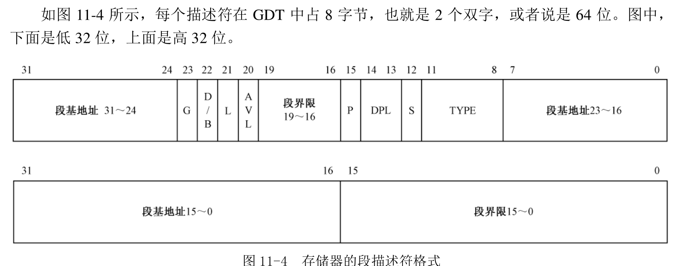

16 + 8 + 8 =**32位段基址**，以及16 + 4=**20位段界限**。描述符中的**段基址**和**段界限**都不是连续的，是为了兼容80286的保护模式（24根地址线，允许访问最多16MB内存），因此只能在80286的基础上扩充。（TODO:80286是一个什么样的结构呢？？？）

对于向上扩展的段，如数据段和代码段，偏移量从0开始递增，决定了偏移量的最大值，对于向下扩展的段，如堆栈段，决定偏移量最小值。

* **G位**:粒度位（**Granularity**），用来阐释段界限含义，为0时，段界限以字节为单位，此时，段的扩展范围从1B到1MB，因为描述符的界限值为20位。如果该位是1，段界限以4KB为单位，扩展范围从4KB到4GB。

* **S位**：描述符类型，为0时表示是系统段，为1时表示是一个代码段或数据段。

* **DPL位**：描述符的特权级（**Descriptor Privilege Level**），共有4种处理器支持的特权级别，0最高，3最低。**不同特权级别的程序是相互隔离的，其互访都是严格限制的，而有些处理器指令只能由0特权级的程序来执行**。描述符的特权64级用于指定要访问该段所必须具有的最低特权级。

* **p位**：段存在位（**Segment Present**），用于指示描述符所对应的段是否存在。一般来说，描述符所指示的段都位于内存中。但是当内存紧张时，有可能只建立了段描述符，很少用到的段也会被唤出到硬盘。P位是由处理器负责检查的。

* **D/B位**：默认的操作数大小 或 默认的堆栈指针大小 或 上部边界标志。

  设立此标志位，主要是为了32位处理上兼容16位保护程序。该标志位对不同的段有不同的效果，对于代码段，此位称为“D”位，用于指示指令中默认的 	偏移地址和操作数尺寸，D为0表示16位。

  对于堆栈段，该位被叫做“B”位，用于隐式的堆栈操作时，是使用sp还是esp寄存器。同时b位的值也决定了堆栈的上部边界，为0，堆栈上部边界为0xFFFF，否则为0xFFFFFFFF

* **L位**：64位代码段标志，保留此位给64位处理器使用。

* **TYPE**：用于指示描述的子类型，用于描述是可写还是可读，扩展方向，特权级。

* **AVL位**：软件可以使用的位，通常由操作系统使用。

**lgdt**：加载描述符表的线性基地址和界限到GDTR寄存器。指令操作数是一个包含额48位数据的内存区域。在实模式和保护模式，都可以使用。在这6字节的内存区域中，前16位GDT的界限值，高32位是GDT的基地址。初始状态，GDTR基地址被初始化为0x00000000,界限值为0xFFFF。

80286处理器可以维持24位的地址数据，进位不会被丢弃。为了能在80286机器上运行8086程序而不会因为地址线产生问题，决定在主板上动一动手脚。**只需强制21根地址线恒为“0”即可**。这样就永远和实模式一样。

因此，IBM使用一个**与门**来控制第21根地址线**A20**，并把这个与门的控制阀门放在键盘控制器内，端口号是0x60。

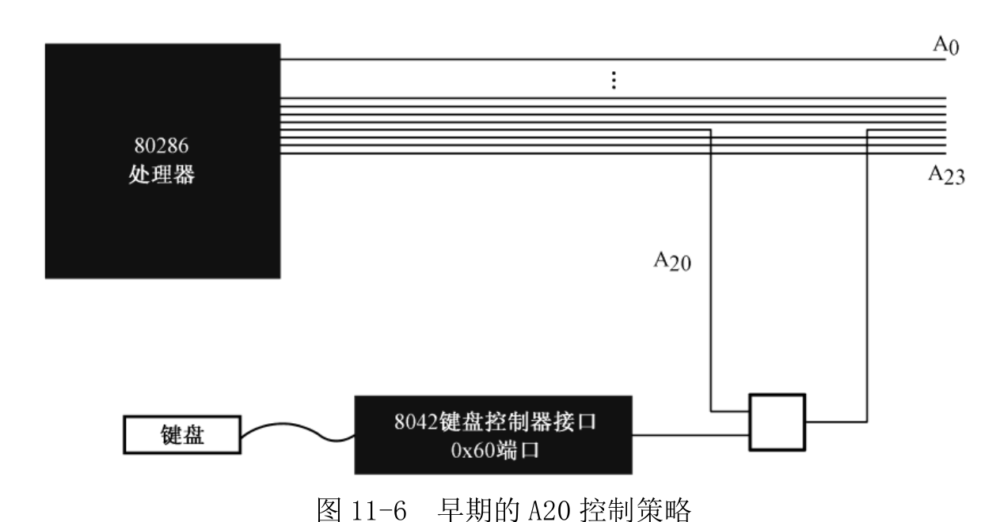


这种做法很繁琐，因为要访问键盘控制器，需要先判断状态，要等待键盘控制器不忙

直到	80486，处理器本身就有A20M#引脚，即A20屏蔽，是低电平有效的。

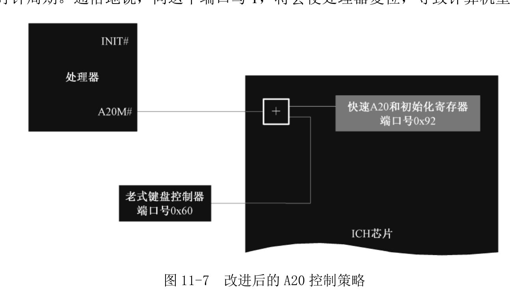

ICH处理器接口部分，有一个用于兼容老式设备的端口0x92，第7~2位保留未用，第0位叫做INIT_NOW，第1位用于控制A20，它和来自键盘控制器的A20控制线一起，通过**或门**连接到处理器的A20#引脚。当INIT_NOW从0过渡到1时，ALT_A20_GATE将被设置为1，即计算机启动时，第21根地址线是自动启用的。**但A20M#信号仅用于单处理器系统，多核处理器一般不用**（那他用什么机制）。

CR0是处理器内部的控制寄存器（**Control Register**），还有CR1、...CR8。CR0是32位的寄存器，**包含一系列用于控制处理器操作模式和运行状态的标志位**。第一位是保护模式允许位（**Protection Enable**）。

在保护模式下，BIOS中断都不能在用，在重新设置保护模式下的中断环境之前，必须先关中断。

在32位处理器下，段寄存器是80位的（16位段选择器和 64位描述符高速缓存器）。在原先寄存器基础上又增加了两个段寄存器FS、GS

**尊严只在剑锋之上，自尊留给自己，卑劣留给世界**

保护模式访问一个段时，传送到段选择器的是**段选择子**，第一部分是描述符的索引号

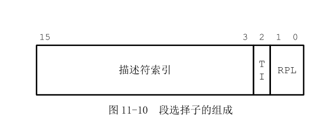


TI=0时，表示描述符在GDT，TI=1时在LDT，RPL是特权级设置。

当处理器在执行任何改变段选择器的指令时（如pop、mov、jmp far、call far、iret、retf），就将指令中提供的索引号乘以8作为偏移地址，同GDTR中提供的线性基地址相加，以访问GDT，如果没有问题，就自动将找到的描述符加载到不可见的描述符高速缓存部分（64位）。**加载的部分包括段的线性基地址、段界限和段的访问属性**。此后，每当有访问内存的指令时，就不再访问GDT中的描述符，直接用当前段寄存器描述符高速缓存。

即使在实模式下，段寄存器的描述符高速缓存器也被用于访问内存，仅低20位有效。当处理器进入保护模式之后，对段的解释是不同的，处理器会把段选择器里的内容看成是描述符选择子。比较安全的做法就是尽快刷新CS、SS、DS、ES、FS和GS的内容，包括它们的段选择器和描述符高速缓存器。进入保护模式前，有很多指令都进入了流水线。因为处理器工作在实模式之下，所以，都是按16位操作数和16位地址长度进行译码的，在进入保护模式之后，所以必须清空流水线和乱序执行得到的中间结果。

可以使用32位远转移指令或远过程调用指令call。处理器最怕这类指令，遇到这类指令，一般会清空流水线，并串行化执行；另外远转移会重新加载 段选择器CS，并刷新高速缓存器中的内容。**唯一的问题**，这条指令必须在**bits 16**下编译，使得处理器能够在16位模式下正确译码；同时，还必须编译成32位操作数的指令，使处理器在刚进入保护模式时能正确执行。

jmp dword 0x0008:flush

这条指令是用“**bits 16**”编译的，而且使用了关键字“dword”，该关键字修饰偏移地址，意思就是使用32位的偏移量。因此会有指令前缀0x66

66 EA 80 00 00 00 08 00  如果去掉前缀0x66，对应一条32位指令

在刚进入保护模式是时，cs描述符高速缓存寄存器D位仍然是0，在16位保护模式下执行带前缀0x66的指令，处理器会按32位的方式执行，使用32位的偏移量。于是，将0x0008加载到CS选择器，并从GDT中取对应的描述符，加载CS描述符高速缓存器，同时把指令中给出的32位偏移量传送到EIP，处理器就从新的指令开始执行。

伪指令[bits 32],执行到这里时，会按32位操作数模式进行译码

**处理器模式的变化对外围设备没有影响，它们是无法感知的，只按自己的方式工作**。

11章中程序程序超过了512个字节（TODO：莫名奇妙变成了518字节，最后该用db的 地方用成了dd）

处理器引入保护模式的目的就是**提供保护功能**。

保护模式下，代码段是不可写入的（通过该段的描述符访问时，处理器不允许向里面写入数据或更改数据）。但是很多时候，有需要对对代码进行修改（调试程序时，需要加入断点指令int3）。此时，只能重新为该段安装一个描述符，并将其定义为可读可写的数据段，然后通过这个描述符。这样，当两个以上的描述符都描述和指向同一段时，把另外的描述符称为别名。如果想要共享内存，既可以使用这种别名技术。

处理器在变更段寄存器以及隐藏的描述符高速缓存器的内容时，要检查其代入值的合法性。涉及到修改段寄存器的指令执行时，处理器会把指令中的段选择子传送到段寄存器的的选择器部分。处理器的固件完成传送之前，**要确认选择子是正确的，描述符也是正确的**

如果检查指定的段描述符，位置超出表的边界时，处理器产生异常中断13，同时段寄存器的原值不变。

紧接着，对从表中取出的描述符进行检查

一旦检查全部通过，处理器就将选择子加载到段寄存器的选择器。只有可以写入的数据段才能加载到SS的选择器，CS寄存器只允许加载代码段描述符。

可以向DS、ES、FS和GS的加载器加载数值为0的选择子。加载的时候不会有问题，真正用来访问内存时，就会导致一个异常中断（**这是一个特殊的设计，用它来保证系统安全**  **TODO:**怎么保证系统安全）。

每个代码段都有自己的段界限，实际使用的段界限，其数值和粒度位有关。执行指令时，**指令长度 - 1 + EIP值**，结果必须小于或等于实际使用的段界限，否则引发处理器异常。

对应堆栈的设置要加深理解（**TODO:**）

用户程序只关心问题的解，就是采用各种算法来解决实际问题。至于软件怎么加载带内存，怎么定位的，是操作系统的事，但是它**有义务提供一些必要的信息**，来帮助操作系统将自己加载到内存中。相反，操作系统必须考虑采用什么方法加载用户程序，并在适当的时候将处理器的执行流程转移到用户代码中去。同时，为了减轻用户程序的工作量，操作系统还应该管理硬件，并提供大量的例程供用户程序使用（**库代码**，此时操作系统和用户程序应当协商一种机制，让用户程序能够在使用这些例程时，**不必关心它们的位置**，静态链接和动态链接）。

**bswap指令**：只能是32位寄存器，以字节为单位两两交互。[32~23]->[7~0]、[24,16]->[15,8]

**cpuid**指令:用于返回处理器的标识和特性信息。**EAX**用于指定返回什么样的信息，有时候要用到**ECX**。返回的信息存放在**EAX**、**EBX**、**ECX** 或者**EDX**中。80486引入

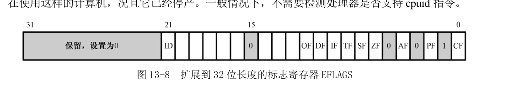

**id标志位如果为0，则不支持cpuid指令**

```assembly
为了探测处理器最大可以支持的功能号，用0号功能来执行cpuid指令
mov eax,0
cpuid
执行完后，eax寄存器返回最大可以支持的功能号。同时在EBX、ECX和EDX中返回处理器供应商的信息。
要返回处理器的品牌信息，需要使用0x80000002~0x80000004号功能，分三次执行，仅被Pentium 4之后的处理器支持
```

**cpu指令集架构补充**

计算机早期**没有CISC和RISC之分**，都是CISC

早期，计算机慢，存储空间小（**IBM 360**，每秒执行34500条指令，只有8k的内存）

所以cpu指令集的设计，需要仔细考虑硬件限制，**为了性能考虑，很多功能都是通过硬件电路来完成。为了少用内存，指令的长度也是可变的。**常用的指令要短一些，不常用的指令可以长一些。

70年代末，RISC出现（实际CPU运行中，**80%的时间都在使用20%的简单指令**）

| CSIC                                 | RISC                                       |
| ------------------------------------ | ------------------------------------------ |
| 以硬件为中心的指令集设计             | 以软件为中心的指令设计                     |
| 通过硬件实现各类程序指令             | 通过编译器实现简单指令集组合，完成复杂功能 |
| 更高效的使用寄存器和内存             | 需要更大的内存和寄存器，并更频繁的使用     |
| 可变的指令长度，支持更复杂的指令长度 | 简单、定长的指令                           |
| 大量指令数                           | 少量指令数                                 |

**RISC CPU设计理念**：既然**80%**时间都在使用**20%**的指令，就只要20%的指令。

​	指令数量多，在软硬件方面都受到很多挑战。

​	在硬件层面，要像支持更多的复杂指令，cpu的电路就要复杂，设计起来也更困难。更复杂的电路，在散热和功耗层面，也面临更多挑战。

​	在软件层面，支持更多的复杂指令，编译器的优化更加困难。

因此，RSIC架构中，选择把指令精简到“**20%**”，而原先的复杂指令，则通过简单指令**组合**起来实现，让软件来实现硬件的功能（**组合优于继承，解耦的思想**）。**LLVM**TODO:

完成指令的电路变得更简单了，于是腾出更多的空间，常常被拿来放通用寄存器。因为RISC完成同样的功能，执行的指令数量要比CSIC多，**所以，如果需要反复从内存里面读取指令或数据到寄存器，很多时间都花在访问内存上，所以RISC架构的CPU往往有更多的通用寄存器**

除了更多的寄存器，RISC的CPU也可以把更多的晶体管，用来实现更好的分支预测等相关功能，进一步提升CPU的工作效率

​				程序的CPU执行时间 = 指令数 * CPI * Clock Cycle Time

CISC架构，通过优化指令数，来减少CPU的执行时间。

RISC架构，其实是在优化**CPI**（指令的时钟周期），指令简单，需要的时钟周期就少。

**Risc降低了CPU硬件设计和开发难度，所以从80年代开始，大部分新的CPU架构都开始采用Risc架构。从IBM的PowerPC,到sun的SPARC，都是Risc架构**

**Intel的改进：微指令架构**

x86指令集架构的很大一个考量，就是**指令集的向前兼容性**（因为x86太成功了）。

如果Intel要放弃x86的架构和指令集，开发一个RISC架构的CPU，面临的第一个问题就是所有软件都是不兼容的。事实上，Intel尝试过在x86之外另起炉灶（**安腾处理器**）。Intel想在CPU进入64位的时代时候，丢掉**x86的历史包袱**，所以推出了**IA-64的架构**，但是却因为不兼容x86的指令集，遭遇失败。

而AMD，趁着Intel研发**安腾**的时候，推出了兼容32位x86指令集的64位架构（**AMD64**）,呵呵

Intel在开发安腾处理器时，也在不断借鉴其他**RISC处理器的设计思想**（既然核心问题是要**向前兼容x86的指令集**，能不能不修改指令集，但是让CISC风格的指令集，用RISC的形式在CPU里运行？）

于是，从**Pentium Pro时代**，Intel就开始在处理器引入了**微指令架构**，**让CISC和RISC的分界变得模糊**。

微指令架构的CPU中，编译器编译出来的机器码和汇编代码没有什么不同，但是指令译码阶段，指令译码器“翻译”出来的，不再是某一条CPU指令，译码器会把一条机器码，“**翻译**”成好几条“**微指令**”。这里一条条微指令，不再是CISC风格，而是变成了**固定长度**的RISC风格。这些RISC风格的**微指令**，会被放到一个微指令缓冲区里，然后从缓冲区里，分发给后面的**超标量**（什么意思？TODO:），并且是乱序执行的流水线架构。这个流水线架构接受的就是精简之后的微指令（这个架构中，指令译码器相当于变成了适配器，**填平CISC和RSIC的指令差异**）

如此一来，指令译码器要有**更复杂的电路**和**更长的译码时间**。Intel在CPU的加了一层L0 Cache，这个Cache保存的微指令。大部分情况下，CPU都可以从cache里拿到译码结果（局部性原理）。不仅优化了性能，因为译码器的晶体开关动作变少了，还减少了功耗。

因此，“微指令”架构的存在，从**Pentium Pro**k开始，Intel处理器就不再一个纯粹的CISC处理器了，同样融合了大量RISC的处理器设计。但是，由于Intel本身在CPU层面做的大量优化，比如乱序执行、分支预测等相关工作，x86的CPU始终在功耗上还是要远远超过RSIC架构的**ARM**。

**ARM**（**Advanced RISC Machines**），基础RISC架构

* 功耗优先的设计，在移动设备上，**功耗是一个远比性能更重要的指标**（4核Intel i7的CPU，设计功率就是130W，一块ARM A8的单个核心CPU，设计功率只有2W）。ARM的CPU，主频更低，晶体管更少，高速缓存更小，乱序执行的能力更弱，都是为了功耗做出的妥协。
* 低价，ARM没有自己垄断CPU的生产和制造，只进行**CPU设计**，然后把对应的知识产权授权出去，让其他厂商来生产ARM架构的CPU。像三星、华为

但是ARM不是开源的，所以在ARM逐渐垄断移动端芯片市场的时候，“**开源硬件**”，也慢慢发展起来。一方面**MIPS**在2019年宣布开源，**RISC-V**项目也受到关注。

早先的处理器中，转移指令是影响处理器速度的重大因素之一，因为它会使流水线中那些已经预取和译码的指令失效。较晚的处理器，普遍使用了分支预测技术，但是并不能保证预测是正确的。最好的办法是不使用转移指令。

comovcc指令（**条件转移指令**）是从P6处理器族开始引入的，并非所有处理器都支持它。可以用cpuid指令去探测。

32位的计算机系统建议内存最好是4字节的对齐的，这样做的好处是访问速度快。

sgdt指令：用于将GDTR寄存器的基地址和段界限保存到指定位置，不影响任何标志位

13章的程序有一些暂时未完成，待处理TODO:

**段保护是处理器提供的基本保护功能，但是针对现实需求是不够的。**

**多任务系统**，对于**任务之间**的隔离和保护，以及**任务和操作系统之间**的隔离和保护都提出了要求（可以看作段保护机制的进一步强化）。操作系统居于核心软件的位置，为各个任务服务，负责任务的加载、创建和执行环境的管理，并行任务之间的调度。

**LDT(Local Descriptor Table)**,局部描述符表，每个任务私有的段都应该在LDT中描述.

**LDTR**:局部描述符表寄存器

段选择子是16位的。而且只有**高13位**被用作索引，所以，每个LDT所能容纳的描述符个数是2的13次方（**8192**），LDT最大长度为**64KB**

多任务环境中，当任务切换发生时，必须**保护现场**，保护的内容包括通用寄存器、段寄存器、栈指针ESP、指令寄存器EIP、标志寄存器EFLAGS等。

**为了保存任务的状态**，每个任务都应当用一个**额外的内存区域**保存相关信息,被称为任务状态段（**Task State Segment**）。**TSS具有固定的格式，最小尺寸104字节，处理器固件能识别TSS中的每个元素**，并在任务切换时读取其中的信息。

处理器用**TR寄存器**（**Task Register**）指向当前任务的TSS（发生任务切换时，处理器将**当前任务的现场信息**保存到有TR指向TSS，然后在使TR寄存器指向新任务的TSS，从新任务的TSS中恢复现场）。

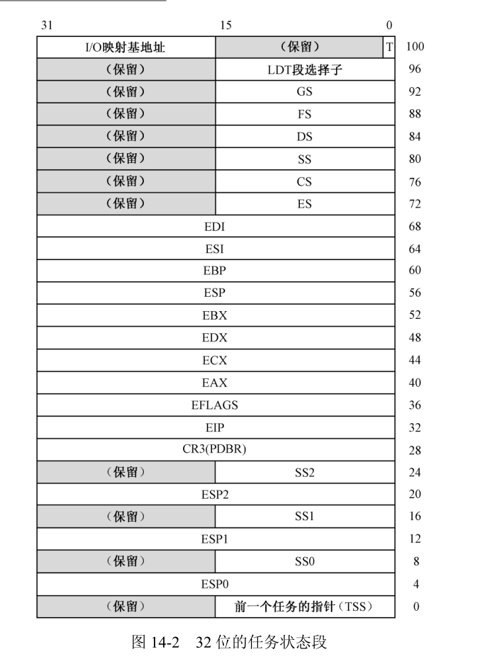

每个段描述符都对应一个内存段，每个段32位偏移地址，最多8192个段 ，所以一个任务的全局地址空间和局部地址空间加起来总共**64TB**

在段机制的基础上，引入了特权级，**并由固件负责实施特权级保护**。

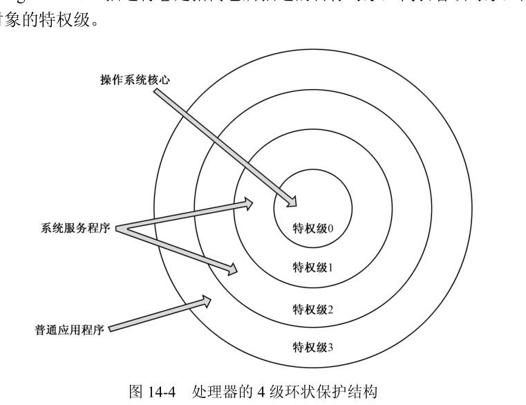

当处理器正在一个代码段中取指令和执行指令时，哪个代码段的特权级叫做当前特权级（**Current Privilege Level**）

**特权指令**：只有在当前特权级CPL为0时才能执行的指令，典型的特权级指令包括lgdt、lldt、ltr、读写控制寄存器的mov指令、停机指令等十几条。

**除了**那些特权级敏感的指令外，处理器**还允许**对各个特权级别所能执行的I/O操作进行控制（EFLAGS中位13、12时**IOPL**位）IO特权级。

处理器**不限制0特权级**的IO访问

代码段的特权级检查是很严格的。一般来说，**控制转移只允许发生在两个特权级相同的代码段之间**。

不过为了让**特权级低的应用程序可以调用高特权级的操作系统例程**，处理器也提供了相应的解决方法：

* 将**高特权级代码段**(高特权级,权限低,符合权限不能从低权限转向高权限)定义为依从的，代码段描述符的TYPE字段有C位，如果C=0,这样的代码段只能供同特权级程序使用，否则**C=1**,这样的代码段称为依从的代码段，可以从特权级比它低的程序调用并进入。（要求**当前特权级CPL必须低于或者和代码段的描述符DPL相同**）。任何时候，都不允许将控制从较高的特权级转移到较低的特权级。

  依从的代码段不是在它的DPL特权级上运行，而是在**调用程序的特权级上运行**，即，当控制转移到依从的代码段上执行时，不改变当前的CPL。

* 使用门。**门是另一种形式的**，称为门描述符，用于描述可执行的代码，比如一段程序、一个过程或者一个任务。

根据不同的用途，门的类型有好几种：

* **不同特权级**之间的过程调用可以使用**调用门**。
* **中断门**是作为中断处理过程使用的。
* **任务门**对应单个的任务，用于执行任务切换。

调用门用于在不同特权级的程序之间进行控制转移,本质上只是一个描述符,**一个不同于代码段和数据段的描述符**,可以安装在GDT或LDT中.

通过调用门实施特权级转移时,可以使用jmp far指令,也可以使用call far指令,后者会改变当前CPL(**为什么后者会改变,前者不会改变???**)

栈段的特权级必须和CPL一致,为了切换栈,每个任务除了自己固有的栈外,还必须额外定义了几套栈,具体数量取决于任务的特权级别.

这些额外的栈,会由操作系统加载程序时自动创建,这些额外创建的栈,其描述符位于任务自己的LDT中,同时,还要在任务的TSS中登记.

学习要有目的,要有边界,如果没有边界的扩展 去学,很容易忘记自己最初的目的.最初为什么要学汇编呢?无非就是遇到其他不是很好的书,发现进行不下去,想要补充相关知识.

因此,电路电子的可以作为一个分支后续了解,但是不要让它作为阻碍.

本星期完结x86的东西,然后做一个总结,然后啃下彭东的两篇专栏

**多任务切换**

从80286开始的处理器就是面向多任务系统设计的.

什么时候切换任务,切换到哪一个任务,由**操作系统**负责.

**处理器**只负责具体的切换过程,包括保护前一个任务的现场

有两种切换任务的方式:

* 协同式,当前任务主动请求暂时放弃执行权,或者通过调用门请求操作系统服务时
* 抢占式,定时器中断,用于执行任务切换

在一个任务内,全局空间和局部空间具有不同的特权级别.使用门,可以在任务内将控制从3特权级的局部空间转移到0特权级的全局空间,以使用内核提供的服务.

处理器没有额外提供指令用于任务切换,扩充了已存在指令的功能,使之除了能够执行原有的功能之外,**也能用于实施任务切换操作**.

* 借助中断,也是现代抢占式多任务的基础

  在实模式下,内存最低地址端的1KB是**中断向量表**(256个,每个4个字节).

  保护模式下,用**中断描述符表**,保存的是门描述符,包括中断门 陷阱门 和任务门(**为什么和调用门不一样TODO:**???),每个描述符占8个字节,

  **调用门**,是从任务的局部空间转移到更高权限的全局空间执行,本质是一种**任务内的控制转移行为**.中断门 陷阱门也是类似(**TODO:哪有什么差别呢??**)

  但是,当中断发生时,中断号对应的门是任务门,就要切换任务

  相对于其他各种描述符,任务门描述符的多数区域没有用,主要成分是任务的TSS选择子.

  p指示该门是否有效,为"0"时,不允许通过此门实施任务切换;DPL对于因中断发起的任务切换不起作用.

  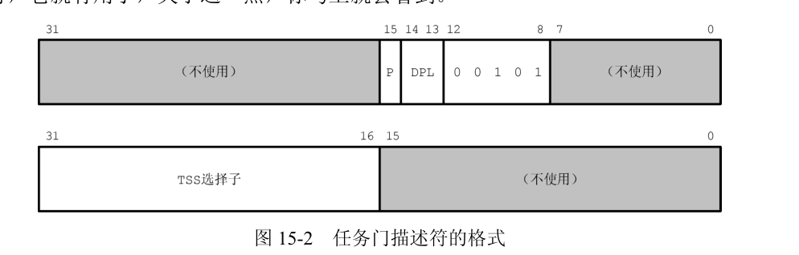

​		中断发生时,处理器用中断号乘以8访问中断描述符表,发现这是一个任务门的时候,就发起任务切换.

​		当中断发生时,可执行常规的中断处理过程,也可以进行任务切换,最后都是通过iret返回,怎么区分呢?

​		(EFLAGS,14位NT位,嵌套任务标志,每个任务的tss都有一个任务链接域(**指向前一个任务的指针**),如果当前NT为1,则表示当前正在执行的任务嵌套于其他任务,此    		时就可以区分了).因此使用iret能返回前一个任务的**前提**是当前任务EFLAGS寄存器的NT位必须是1.

​		无论任何时候处理器碰**iret**指令,都要检查NT位,如果是0,按一般的中断返回;如果是1,表明当前任务能执行,**是因为中断了别的任务**,因此返回

* 使用远过程调用指令call或远跳转指令jmp.此时操作数就是tss描述符段选择子或任务门.

  执行这两条指令时,首先用指令中给出的描述符段选择子访问GDT,分析描述符类型.如果是一般的代码段描述符,就按普通的段间转移规则执行;如果是调用门,按调用门的规则执行;**如果是tss描述符或者任务门,则执行任务切换**,此时指令中32位偏移量被忽略.

  **任务门可以被安装在GDT LDT 或中断描述表中**.

**分页机制和动态页面分配**

​		Intel处理器访问内存的**基本策略**就是**分段**,16位实模式下,段的起始位置必须对齐在16字节边界,而且段的长度最大为64KB.

​		32位保护模式之后,进一步**强化了分段功能**,并提供了保护机制.此时,段可以**起始于任何位置**,段的长度可以扩展到处理器的**最大寻址范围边界**.对段的访问本着"先登记,后访问"的原则进行.每个段描述符,都有**AVL**位,每当访问一个段时,就将其置位,清零由操作系统定时进行,可以借机统计段的**访问频度**,内存不够用时,就执行换出,并设置p为0,如果再次访问则通过缺页中断换进.由于段的长度不固定,会出现**内存碎片**的问题.

​		因此,从**80386**开始,引入分页机制.分页功能从总体上,用**长度固定的页代替了长度不一定的段**(尽管操作系统也可以解决,但是比较复杂).

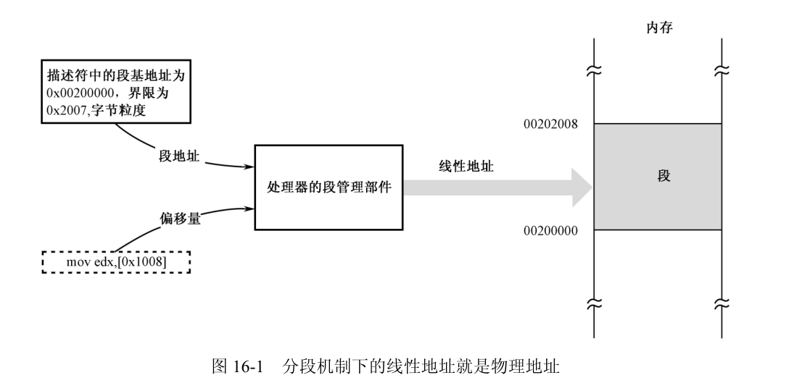

段管理机制对于Intel是最基本的,无法关闭,即使启用了页管理机制,段部件也是工作的.

问题在于,**如何将较大的段,映射到大小相同的页上**?

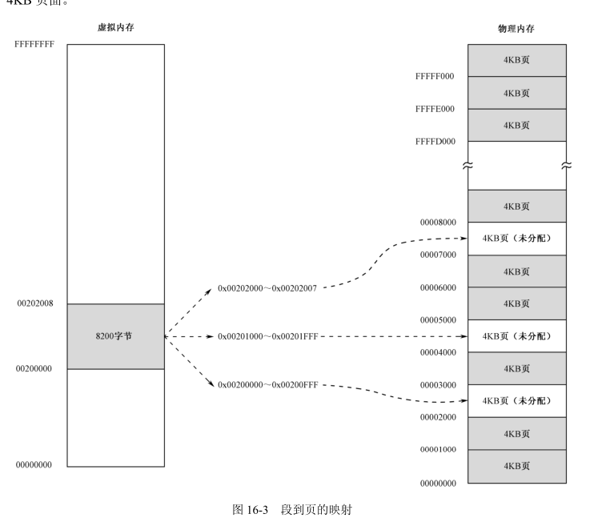

分页结构层次化


https://www.codenong.com/2711044/

linux不使用tss使用硬件上下文切换

* x86 tss对于硬件多任务处理非常慢,与软件相比,没有任何好处
* tss的使用也非常乏味,即使在x86-64上也不便于移植


14~17章的源代码,什么时候有兴趣了,再来读下源代码吧.

**兼顾兴趣的同时,前端 图形学的知识  算法不能丢**

**TODO:**

https://zhuanlan.zhihu.com/p/71379495

https://zhuanlan.zhihu.com/p/65840506

https://zhuanlan.zhihu.com/p/156076495

主板的规范

cpu的规范

**主板结构  cpu结构了解 总结**

**TODO:**


**x64介绍**


