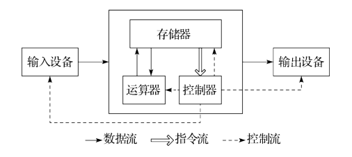
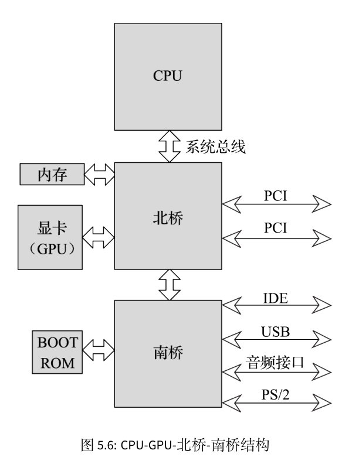
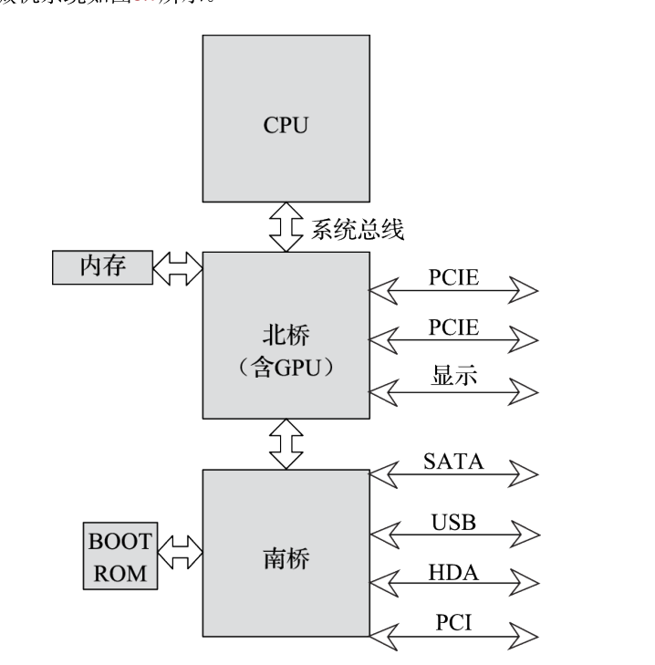
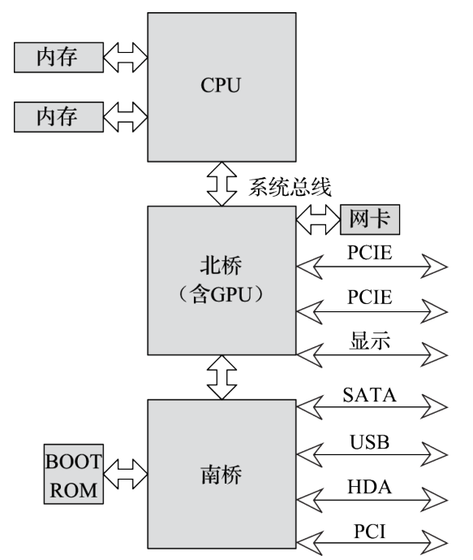
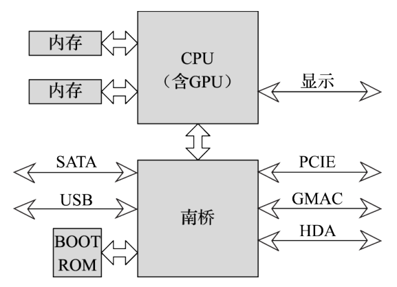
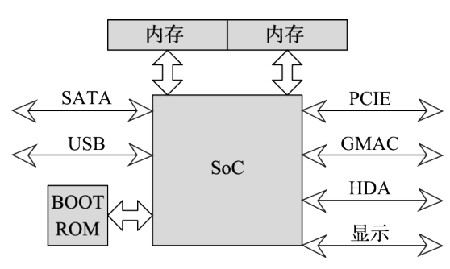
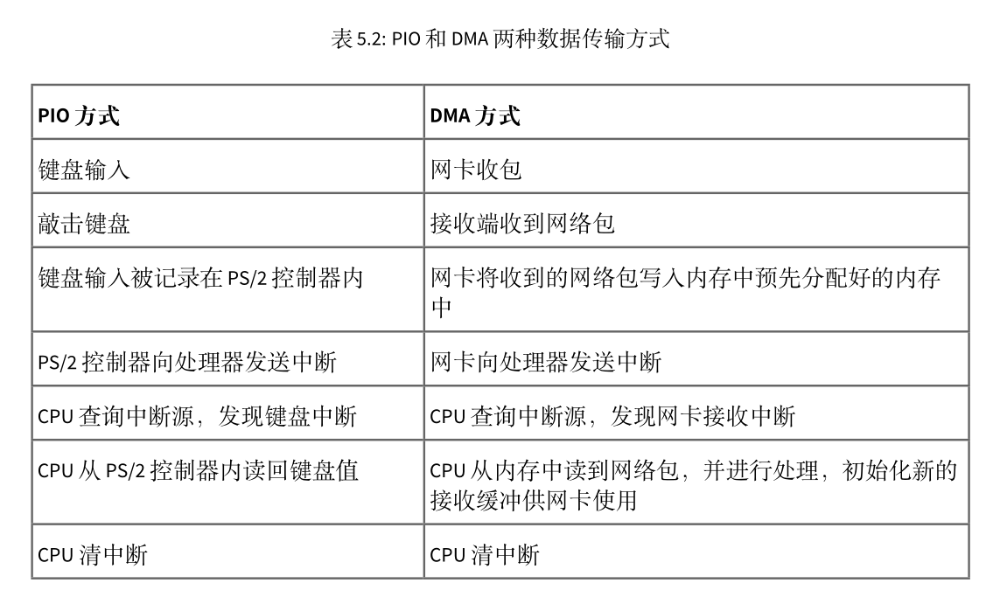
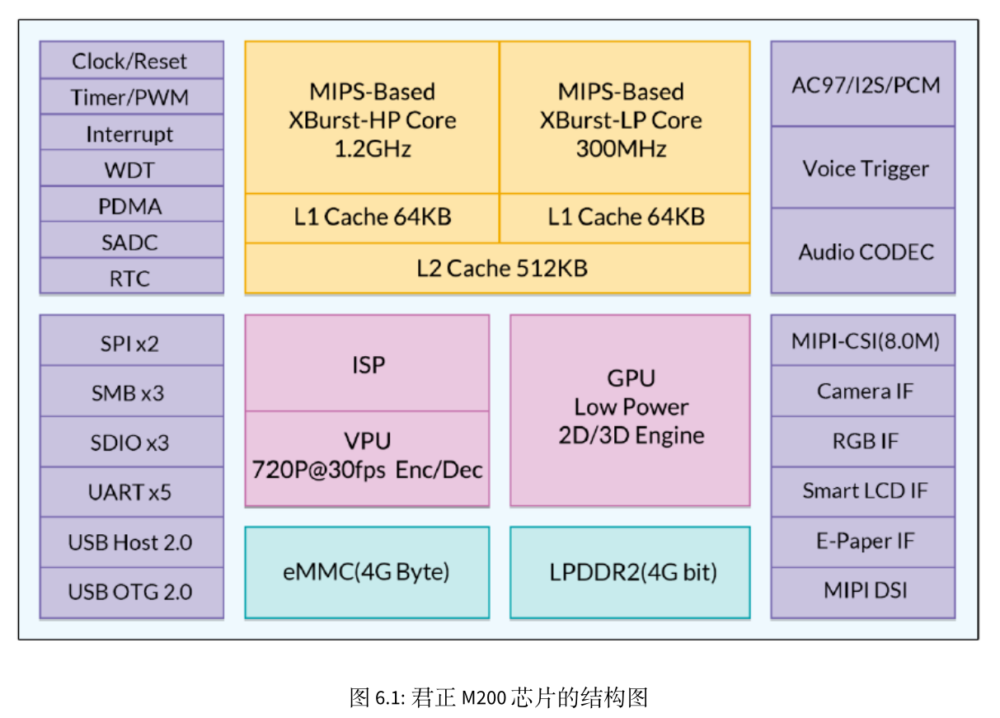

# 计算机体系结构基础

## 计算机指令系统

## 计算机硬件结构

##### 1.冯**.**诺依曼结构

如果说图灵机是现代计算机的**计算理论模型**,冯.诺伊曼结构就是现代计算机的**结构理论模型**.

存储器按地址访问的统一编址的**一维结构**,每个单元位数固定

采用存储程序方式,指令和数据不加区别**混合**存储在同一个存储器

以运算器为中心,输入 输出设备与存储器之间的数据传送都经过运算器

随着技术进步,此结构得到了持续的改进:

* 以运算器为中心改为**以存储器为中心**(**什么叫存储器为中心 TODO:???**).使数据流向更为合理,从而使**运算器,存储器和输入输出设备能过并行**工作
* 由单一的集中控制改为**分散控制**.计算机发展初期,工作速度很低,运算器,存储器,控制器和输出输出设备可以在同一个时钟信号的控制下同步工作.而现在速度差异很大,需要采用异步方式分散控制(**TODO:什么意思???**)
* 从基于串行算法改为适应并行算法(**TODO:什么意思???**).出现流水线处理器,超标量处理器,向量处理器,多核处理器,对称多处理器,大规模并行处理机和机群系统
* 出现为适应特殊需要的专用计算机,如GPU DSP
* 非冯**.**诺伊曼计算机的研究方面,依靠数据驱动的**数据流计算机**,**图归约计算机**

哈佛结构,做为冯....结构的一个变种,将程序和数据**分开存储**.控制器使用**两条独立的总线**读取程序和访问数据,程序空间和数据空间完全分开.

在通用计算机领域,由于应用软件的多样性,要求计算机**不断变化所执行的程序内容**,并且**频繁的对数据和程序占用的存储器资源重新分配**,使用同一编址可以最大限度利用资源(**TODO:为什么统一编址能最大限度利用资源???**).而嵌入式程序相对单一,但是对安全性 可靠性要求更高.

##### 2.计算机系统硬件结构发展

* CPU-GPU-北桥-南桥四片结构.早期的结构.GPU一般以显卡的形式连结北桥.

  

* CPU-北桥-南桥三片结构.GPU功能被集中到北桥(**集成显卡**)

  

* CPU-弱北桥-南桥三片结构.随着工艺和设计水平提高,芯片的集成度不断提高,单一芯片中能够实现的功能越来越复杂.内存接口的带宽需求超过了处理器与北桥之间的里连接的处理器总线接口,导致了内存的实际访问性能受限于处理器总线的性能.**存储墙问题**.因此对计算系统性能影响显著的内存控制器开始被集成到CPU芯片中,从而大幅度降低了内存访问延迟.

  相比Intel,AMD最早将内存控制器集成到处理器芯片

  

* CPU-南桥两片结构

  GPU性能在飞速发展,除了图形加速,对于一些科学计算类的应用,或者一些特定的算法加速程序,GPU发挥的作用越来越大,与CPU之间的数据共享越来越频繁.

  随着芯片集成度进一步提高GPU也开始被集成到CPU芯片中,北桥存在的必要性进一步降低,开始和南桥合二为一.

  

在这个结构中,CPU芯片集成处理器核,内存控制器和GPU等主要部件,对外提供显示接口,内存接口等,并通过处理器总线和南桥相连.南桥芯片则包含硬盘,usb,网络控制器以及PCIE/PCI等总线接口.

* SoC单片结构.**System on Chip**,是一种单片计算机系统解决方案.在单个芯片上集成了处理器,内存控制器,GPU以及硬盘,USB,网络等IO接口.

  

  主要用于**移动处理器**和**工业控制**领域.相较于之上几种,**集成度**更高,**功耗控制方法**更加灵活,有利于系统的小型化和低功耗设计.随着技术的发展,封装基板上的互连技术不断发展和成熟,越来越多的处理器利用多片封装技术在单个芯片上集成多个硅片,以扩展芯片的计算能力或IO能力.

目前,主流商用处理器中面向中高端领域的处理器普遍采用两片结构,面向中低端及嵌入式领域的处理器普遍采用单片结构.

##### 3.处理器与IO设备之间的通信

对存储器的控制是通过读写指令完成的.存储器是存储单元序列,**对某个地址的读写不会影响其他存储单元**.

而IO设备大都是具有特定功能的部件,**不能简单当作存储阵列看待**.由于IO设备底层控制复杂,一般都是由一个**设备控制器**进行控制.设备控制器会提供一组寄存器接口,寄存器(**IO寄存器**)内容的变化会引起**设备控制器执行一系列复杂的动作**.

处理器对内存和IO的访问模式有所不同,对访问的延迟和带宽需求也有较大差异.现代计算机的程序和数据存放在内存中,**内存访问性能直接影响处理器流水线的执行效率**,因此才有各个cache层次的出现.**对内存访问,要求高带宽和低延迟**.

IO设备一般用于外部交互,而IO操作一般会要求顺序的访问控制,导致执行效率低下.

**IO寄存器寻址**:内存映射IO和特殊IO指令

处理器和IO设备之间的同步:**查询和中断**

使用查询方式时,处理器向IO设备发出访问请求后,需要不断读取IO设备的状态寄存器.

为了解决查询效率低的问题,中断方式被引入了计算机系统.中断本质是IO设备对处理器发出的一个信号,让处理器知道此时有数据传输需要或已经发生数据传输.

中断信号可以**是一根信号线,也可以是一个信息包**.这个中断信息会传送到**中断控制器**,中断控制器是负责中断汇集,记录和转发的硬件逻辑,一般具有可编程功能.典型的中断控制器如Intel的8259A,支持中断嵌套和中断优先级,可以支持8个中断源,并可以通过级联的方式进行扩展(**TODO:可以扩展多少???**)

8259A内部包含3个寄存器,**中断请求寄存器**(**Interrupt Request Register**),存放当前中断请求;中断在服务寄存器(**In-Service Register**),用来存放当前正在服务的中断请求;中断Mask寄存器(Inerrupt Mask Register),用来存放中断屏蔽位.

##### 4.存储器和IO设备之间的数据传送

早期,是由处理器完成的,由于存储器和IO设备之间没有直接的数据通路,**Programming Input/Output模式**,一般用于键盘,鼠标等低速设备

DMA(Direct Memory Access),传送的一般过程:

* 处理器为DMA请求预先分配一段地址空间
* 处理器设置DMA控制器参数,包括设备标识,数据传送方向,内存中用于传送的源地址或目标地址,传输的字节数量
* DMA控制器进行数据传输,DMA控制器发起对内存和设备的读写操作,控制数据传出.
* DMA控制器向处理器发出一个中断,通知处理器数据传送的结果.
* 处理器完成本次DMA请求,开始新的DMA请求.

DMA方式对存在大量数据传输的高速设备是一个很好的选择,硬盘,网络,显示等设备普遍都采用DMA方式.一个计算机系统通常包含**多个控制器**,比如有特定设备专用的SATA接口DMA控制器,USB接口DMA控制器,也有通用的DMA控制器用于可编程的源地址和目标地址之间的数据传输.

DMA控制器的功能可以很简单,也可以很复杂.不同的IO设备的DMA行为各不相同,因此现代很多的**IO控制器大多会实现专用的DMA控制器用于自身的数据传输**.

##### 5.计算机总线

计算机内部包含的多个部件往往是由不同的公司生产的,为了让这些**不同的部件组合在一起正常工作**,必须指定一套规格和协议,这就是**总线或接口**.使用某种接口时,必然使用与之相对应的总线.

总线的应用和标准化,降低了计算机设计和应用的复杂度.

总线的本质作用是完成数据交换.总线含义很广,不仅仅是指用于数据交互的通道,有时也包含了软硬件架构,比如PCI总线,USB总线,不仅仅是指主板上的某个接口,**还包含与之相对应的整套硬件模型,软件架构**.

总线的含义可分为以下几个层级:

* 机械层.接口的外形,尺寸,信号排列,连接线的长度范围等
* 电气层,信号描述,电源电压,电平标准,信号质量等
* 协议层,信号时序,握手规范,命令格式,出错处理
* 架构层,硬件模型,软件架构

不同总线包含内容不同,有的包含所有层级,有的可能只包含部分.

##### 6.总线的分类

* 按照数据传递方向,可分为**单向总线和双向总线**.

* 按照总线使用的信号类型,可分为**并行总线和串行总线**.并行总线包含多位传输线,在同一时刻可以传输多位数据,而串行总线只使用一位传输线.同一时刻只传输一位数据.**并行总线在于相同频率下总线的带宽更大**,但正因为采用了同一时刻并行传输多位数据的方法,必须保证多位数据在同一时刻到达.**这样就会对总线的宽度和频率产生限制,同时也对主板设计提出更高要求**.而串行总线只使用一位传输线,使用编码的方式将时钟频率信息编码在传输的数据中,传输频率可以大大提升(**TODO:为什么???**)

​       PCI,DDR总线都是传统的并行总线,而USB,SATA,PCIE都是串行总线.**以串行总线传输方式为基础,使用多条串行总线进行数据传输的方式正在被广泛采用**.

​	**多位串行总线**与**并行总线**根本差别在于:前者的每一个数据通道都是**相对独立传输**的,**独立进行编解码**,在接收端恢复数据后在进行并行数据之间的对齐(**TODO:什么意思**).而并行总线使用同一个时钟对所有的数据线进行同时采样,因此对数据传输线之间的对齐有严格要求.

* 按照总线在计算机所处物理位置,可分为**片上总线,内存总线,系统总线和设备总线**.

  * 片上总线,**芯片片内互连使用**的总线.芯片常常分为多个功能模块,这些功能模块之间的连接采用片上互连总线.一个高性能通用处理器在设计时,常常划分为处理器核,共享高速缓存,内存控制器多个模块.而一个SoC芯片包含更多模块,一个模块可以称之位IP(Intellectual Property).目前业界公开的主流片上互连总线是ARM公式的AMBA系列总线

    

    AMBA(**Advanced Microcontroller Bus Architecture**)系列总线包括AXI,AHB,ASB,APB等总线.

  * 内存总线,

