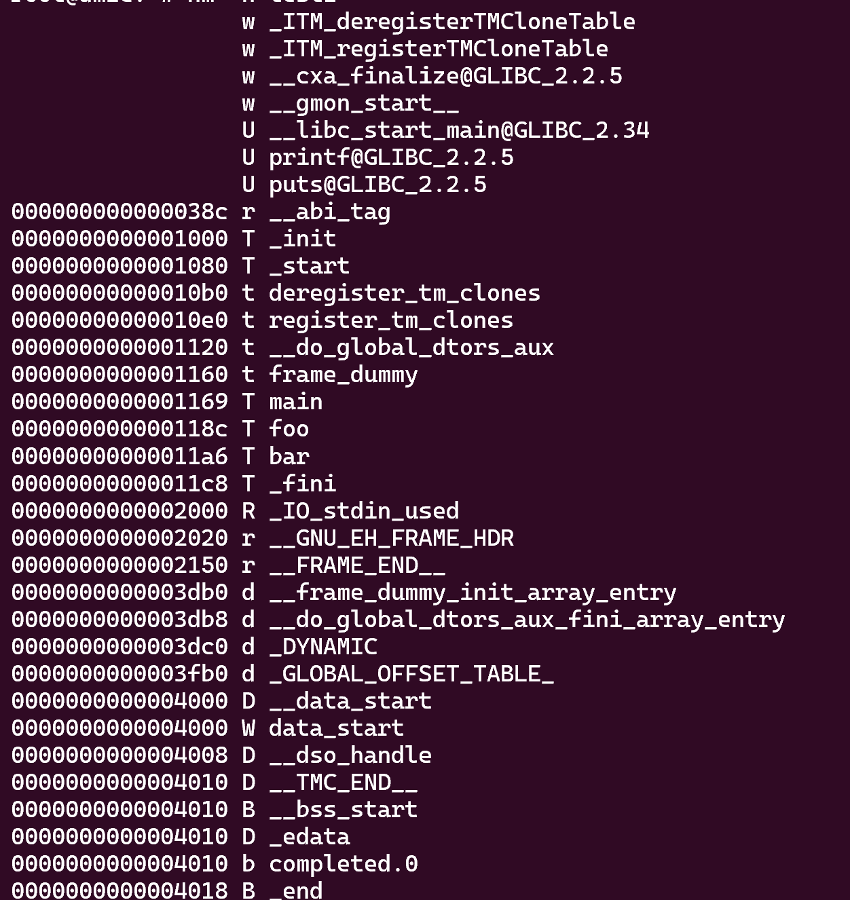
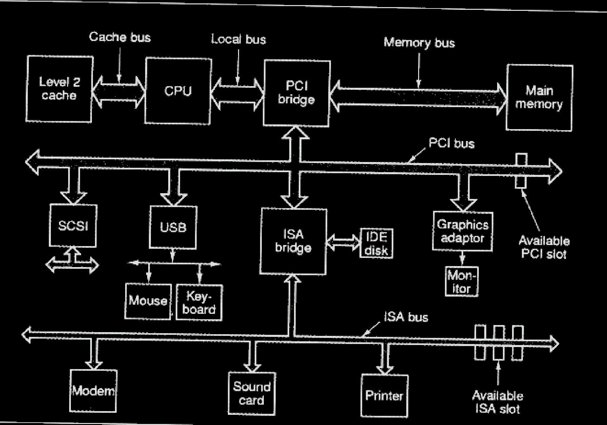
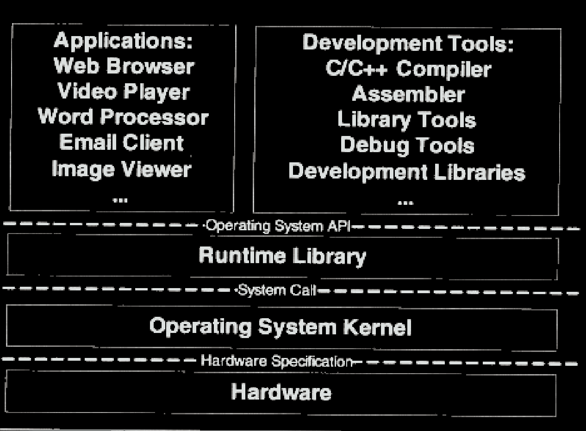
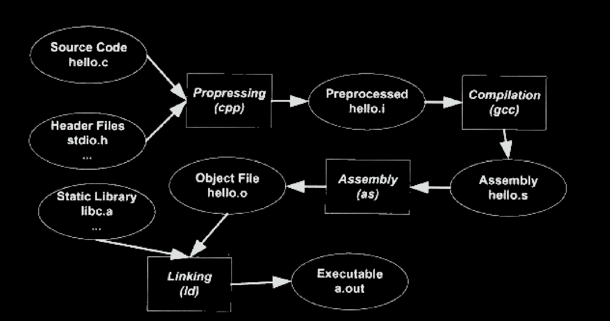
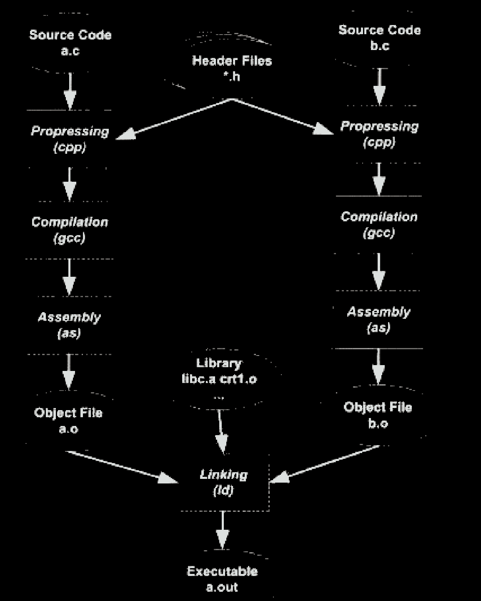
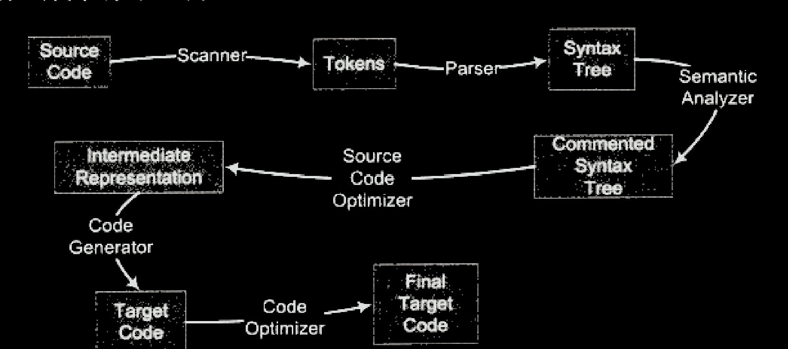

# binutils

## ar

静态库管理工具

## nm

列出程序文件中的符号。



第一列是符号所对应的地址。

第二列指对应符号在哪一个段。比如A表示符号值是绝对的，B表示bbs段，D表示.data段。

第三列就是符号名称。

* 静态变量不论是定义在函数内的，还是函数外，初始化号的就在.data段，否则在.bss段
* 非静态全局变量，其分配方式也只与其是否被初始化有关，初始化了就在.data段，否则是.bss段
* 函数无论静态还是非静态，总是被分在了.text段，但是T(t)揭示了其是静态还是动态。

## objdump

查看目标程序中段信息和调试信息，也可以对目标程序进行反汇编。

-W可以查看调试信息，DWARF格式。

-d可以查看文件汇编代码。

-f可以显示目标文件的入口。

-j可以只查看某个段的信息。

## objcopy

对目标文件进行编辑。可以新增、复制、删除一个段。

## readelf

和objdump类似，侧重elf格式文件。

## size

显示段的大小。

## strings

查看文件中可显示字符。

# 程序员的自我修养-链接、装载与库

## 概述

### 硬件



多cpu计算机（Symmetrical Multi-Processing），对称多处理器

多核心计算机（Multi-core Processor）,是SMP的简化版，多核处理器

### 软件

#### 分层



计算机科学领域的任何问题都可以通过增加一个间接的中间层来解决。

**应用程序**接口的提供者是**运行库**，什么样的运行库提供什么样的API。比如Linux下Glibc库提供POSIX的API;Windows运行库提供WindowsAPI。

**运行库**使用**操作系统**提供的系统调用接口，系统调用接口在实现时往往以软件中断的方式提供，比如Linux使用0x80号中断作为系统调用接口。

操作系统**内核层**通过**驱动程序**操作硬件，硬件厂商规定硬件规格，并且根据硬件规格提供驱动程序。

#### 任务调度

多道程序（监控程序检测）-分时系统（程序无需cpu时yeild通知）-多任务系统（操作系统根据算法调度）

#### 抽象

##### I/O设备

硬件被抽象为一系列概念。在Unix中，硬件设备的访问方式和普通文件方式形式一致；在windows系统中，图形硬件被抽象为GDI,声音和多媒体被抽象为DirectX对象。硬盘被抽象为文件系统，与硬件相关的细节都交给了**硬件驱动程序**。

##### 内存

用户程序需要的是一个单独的执行环境，比如有单一的地址空间、有自己的CPU，这就要求隔离。

虚拟地址-进程的隔离

分段，为程序划分一段物理内存，针对于整个程序，但是一个程序并不需要都提前装入内存。

分页，将程序虚拟内存和物理内存分为若干大小的页，只装入需要的页。硬件本身支持以页为单位的操作方式。

**虚拟存储**需要依靠硬件，几乎所有的硬件都采用了**MMU**（Memory Management Unit）的部件来进行映射，一般MMU都集成在CPU内部。

#### 线程

Linux中并不存在真正意义上的线程，所有执行实体都称为任务，具有内存空间、执行实体、文件资源等，不过多个任务间可以选择共享内存空间。

##### 线程安全

原子API

锁

编译器优化可能会破坏加了锁的同步。

## 编译器概述

### gcc



```c
#include<stdio.h>

int main(){
    printf("hello World");
    return 0;
}
```

#### 预处理

hello.c和相关的头文件被**cpp**预编译成一个.i文件，主要是以“#”开始的预编译指令

gcc -E hello.c -o hello.i 或cpp hello.c>hello.i

#### 编译

对预处理后的文件进行词法分析、语法分析和优化，最后生成汇编代码。

gcc -S hello.i -o hello.s   或cc1 hello.c

gcc把预编译和编译两个步骤合并成一个步骤，使用一个内部程序cc1。对于C++，对应程序为cc1plus，java为jc1。**所以gcc这个命令只是这些后台程序的包装**，它会根据不同的参数去调用预编译程序ccp、编译器cc、汇编器as、链接器ld。

#### 汇编

gcc -c hello.s -o hello.o或as hellos -o hello.o

将汇编代码翻译成机器码。

#### 链接




#### 

把各个模块之间相互引用的部分都处理好，使得各个模块之间能够正常的衔接。

链接过程，对引用的函数、变量的指令，都要进行调整，这个地址调整的过程称为重定位，每个要被调整的地方叫一个重定位入口。

### 编译器



```c
array[index] = (index + 4) * (2 + 6)
```

#### 词法分析

扫描器（scanner）进行词法分析，运用一种类似**有限状态机**的算法将源码分析成一系列**Token**。**lex**可以根据**用户自定义**的词法规则将字符串分割成token。对于一些有预处理的语言，比如c，预处理一般不归于这个过程。

#### 语法分析

对tokens进行语法分析，从而产生语法树（以**表达式**为节点的树，c语言一个语句是一个表达式，而复杂的语句是很多表达式的组合），分析过程采用了**上下文无关语法**。**yacc**(Yet Another Compiler Compiler)类似**lex**。

#### 语义分析

静态语义：比如两个指针做乘法是否有意义，在语法上是合法，但在语义上不一定。

动态语义：只有运行才能确定的语义，编译器无法分析，比如if条件中的表达式。

经过语义分析后，整个语法树的表达式都被标识了类型，如果有些类型需要隐式转换，会在语法树中插入相应的转换节点。

#### 中间语言生成

源码：

```c
array[index] = (index + 4) * (2 + 6);
```

中间代码:

```
t1 = 2 + 6
t2 = index + 4
t3 = t2 * t1
array[index] = t3
```

中间代码是语法树的**顺序表示**（语法树是一个树，直接在树上优化比较困难）。跟目标机器和运行时环境是无关。

中间代码使得编译器可以被分成**前端、后端**。编译器前端负责产生机器无关的中间代码，编译器后端将中间代码转换成目标机器代码。对一些跨平台的编译器而言，可以针对不同的平台使用同一个前端和针对不同机器平台的数个后端。

#### 目标代码生成

编译器后端，主要包含代码生成器、目标代码优化器。根据不同CPU规格（硬件规格、指令集），生成不同的指令序列。根据不同CPU特性对指令码进行优化。

定义在其他模块的变量、函数在最终运行时的绝对地址都是要在最终链接时确定。所以编译器可以将一个源文件编译成一个未链接的目标文件，然后由链接器链接这些目标文件，最后形成可执行文件。

## 目标文件

PC平台流行的可执行文件格式主流的有Windows下的PE和Linux的ELF。它们都是**COFF**格式的变种。目标文件是源代码编译但是未编译的的中间文件，和可执行文件格式类似，一般采用一种格式存储。

不光是可执行文件，动态链接库（windows-dll,linux-so）和静态链接库（windows-lib,linux-a）都可以按可执行文件格式存储。

### ELF文件类型

* 可重定位文件，.o文件。包含代码和数据，可以被链接成可执行文件或共享目标文件。
* 可执行文件，/bin/bash。
* 共享目标文件，.so文件。包含代码数据，**链接器**将其与其它可重定位文件链接，产生新的可执行文件；动态链接器可以将此文件与可执行文件结合，作为进程映像的一部分。
* 核心转储文件，core dump

file可以指示出类型。


