## 《趣谈linux》

#### 大纲

* **初创期**，基于开放的运营商环境（**X86体系架构**），创办一家外包公司（**系统的启动**）。一开始没有其他员工，老板亲自接项目（**实模式**）。
* **发展期**，公司做大，项目变多（**保护模式、多进程**），为了管理各个外包项目，建立了项目管理体系（**进程管理**）、会议室管理体系（**内存管理**）、文档资料管理体系（**文件系统**）、售前售后体系（**输入输出设备管理**）。
* **壮大期**，公司壮大，开始促进内部项目的合作（**进程间通信**）和外部公司合作（**网络通信**）。
* **集团化**，公司壮大，成立多家子公司（**虚拟化**），或者鼓励内部创业（容器化），这个时候公司就变成了集团。大管家的调度能力不再局限于一家公司，而是集团公司（**linux集群**），从而成功上市（**从单机操作系统到数据中心调度**）。

#### 路线

* ##### 第一个坡：熟练的使用linux命令行

  《鸟哥的linux私房菜》、《linux系统管理手册》

* ##### 第二个坡：通过系统调用或glibc编写程序

  《UNIX环境高级编程》

  [别出心裁的Linux系统调用学习法 - 娄老师 - 博客园 (cnblogs.com)](https://www.cnblogs.com/rocedu/p/6016880.html)

  《Unix/Linux编程实践教程》

* ##### 第三个坡：了解linux内核机制

  《深入理解linux内核》

  《庖丁解牛Linux内核分析》

* ##### 第四个坡：阅读linux源码，聚焦核心逻辑和场景

  《linux内核源代码情景分析》

  《linux 驱动开发》

* ##### 第五个坡：实验定制化Linux组件

* ##### **第六个坡：**面向真实场景的开发

#### 想法

* 为什么要学习linux？

* 要有那些前置性的工作？

* 怎么样学习linux？

  先对大致流程原理有个实际性的认识吧。然后一个个爬坡（**一定要有疑问，一定要有产出，一定要有计划**）。做好关键性的笔记（场景用例），以达到更好的效果，对于暂时不懂的东西可以记录，不能浮于表面。

* 时间跨度到底要有多大？

* 涉及到硬件方面相关的东西，该如何兼顾（对机器设施并不了解）？

#### 任务1.跟着专栏熟悉linux各种机制的大体流程

硬件安装-->操作系统安装-->qq安装-->打开qq

输入设备（键盘鼠标），**客户对接员**，把客户需求拿回来，产生中断事件

输出设备（显示器），**交互人员**

鼠标双击qq，os从中断得知是要运行qq，并且qq将会长期运行，需要进行**立项**

立项需要有**项目执行计划书**（qq这个二进制程序），存放在格式化后的硬盘上（格式化的本质在硬盘里设置一些文件系统管理相关的信息）

系统调用会列出那些接口可以调用，进程需要的时候可以去调用。其中，**立项**就是办事大厅提供的关键服务之一。

立项之后，共享资源（人力资源、硬件资源....）在多个项目之间使用，因此需要调用各个项目的使用，**进程管理**

https://github.com/torvalds/linux   **linux项目架构熟悉、其build规范**  **TODO:**

References:
https://www.kernel.org/
https://courses.linuxchix.org/kernel-hacking-2002/08-overview-kernel-source.html


###### **1.常见的系统调用**

**立项服务-创建进程****fork**

linux中，创建一个新的进程，需要一个老的进程调用**fork**实现。当父进程调用fork时，子进程将各个子系统为父进程创建的数据结构全部拷贝一份（甚至连程序代码都拷贝）。

对于**fork**调用返回值，如果当前进程是子进程，返回0；如果是父进程，返回子进程的pid；子进程需要**execve**执行另一个程序

父进程可以调用**waitipid**，将子进程的进程号传递过去，就能获知子进程的运行情况

所以说，所有子进程最终都是老板，也就是**祖宗进程**fork过来的，因此需要对整个公司的项目运行负最终的责任。

**会议室管理-内存管理**

项目启动之后，每个项目组有独立的会议室，存放自己项目相关的数据（进程内存空间）。

**首先**，项目执行计划书要放进去，执行过程肯定要不停的看，**代码段**

项目执行过程中，会产生一些架构图、流程图，这些项目进行的数据可能是即时的（局部变量）和长久些的（全局变量），**数据段**

只有进程使用部分内存的时候，才会使用内存管理系统的系统调用来登记，只有到真正写入数据的时候，发现没有对应物理内存，才会触发中断，现分配物理内存

堆中分配内存的系统调用 **brk**、**mmap**

**档案库管理-文件管理**

项目执行计划书要保存在档案库里，有一些需要长时间保存，这样，哪怕公司暂停营业，再次经营时也可以使用。放到文件系统中。文件之所以能做到这一点，一方面是因为**介质**，另一方面是因为**格式**。公司之所以强调资料库，也是希望将一些知识固化为标准格式，放在一起进行管理。

对于文件的操作：**open、close、create、lsleek、read、write**

linux中**一切皆文件**的体现：

* 启动一个进程，需要一个程序文件，这是一个**二进制文件**；
* 启动的时候，要加载一些配置文件，这是文本文件；启动之后会打印一些日志，如果写到硬盘上，也是**文本文件**；
* 如果想把日志打印到交互控制台，这也是个文件，标准**stdout**文件;
* 这个进程的输入可以作为另一个进程的输入，这种方式称为**管道**，管道也是一个文件；
* 进程可以通过网络和其他进程进行通信，建立的**socket**，也是一个文件；
* 进程需要访问外部设备，**外部设备**也是个文件；
* 文件被存储在文件夹里，**文件夹**也是一个文件；
* 进程运行起来，想要看到进程的运行情况，会在/proc下面有对应的**进程号**，还是一系列文件；

每个文件，linux都会分配一个**文件描述符**，这是一个整数。有了这个文件描述符，我们就可以使用系统调用，查看或干预进程运行的方方面面。

文件描述不是面向操作系统的，而是针对进程的，所以同一个文件在不同的进程可能有不同的fd，一个进程是不需要所有文件的，每当进程用到文件的时候，就向系统来要这个文件。对于进程来说，一个类似数组的东西就可以管理所有系统分配给他的文件，所以fd就是按自然数自增，0-标准输入，1-标准输出，2-标准错误是固定的，后面用到一次递增。

**项目异常处理-信号处理**

当项目遇到异常情况,这时候就需要发送一个**信号**给项目组，当收到信号时，对于一些不严重的信号，可以该干什么就干什么，但是像**SIGKILL**、**SIGSTOP**，可以执行该信号的默认动作。每种信号都定义有默认动作，例如硬件故障、默认终止；也可以提供信号处理函数，可以通过**sigaction**系统调用，注册一个信号处理函数

**项目组间沟通-进程间通信**

有多种不同的通信方式：

* 通过**msgget**在内核创建一个消息队列，**msgsnd**将消息发送到**消息队列**，而消息接收方可以使用**msgrcv**从队列中取消息
* 通过**shmget**创建一个**共享内存**块，通过**shmat**将共享内存映射到自己的内存空间

**共享内存**的方式，就会存在“竞争”，信号量机制**Semaphore**

**公司间沟通-网络通信**

内核里有对网络协议栈的实现，网络服务是通过套接字来提供的，通过**Socket**调用建立一个socket，socket也是一个文件，也是一个文件描述符，可以通过读写函数通信。

https://www.kernel.org

**Glibc**提供了丰富的API，除了提供例如字符串处理、数学运算等用户态服务之外，最重要的是封装了操作系统提供的系统服务，即**系统调用**的封装

每个特定的系统调用对应了至少一个Glibc封装的库函数

Glibc一个单独的API可能调用多个系统调用，多个API也可能对应同一个系统调用

**strace**--用来跟踪进程执行时系统调用和所接受的信号 **TODO:**

[操作系统导论 (豆瓣) (douban.com)](https://book.douban.com/subject/33463930/)

[搭建大型源码阅读环境——使用 OpenGrok - 知乎 (zhihu.com)](https://zhuanlan.zhihu.com/p/24369747)  **TODO:**


###### **2.x86架构**

开放的运营环境


CPU包含3个部分：

**运算单元**：只管算，不知道应该算那些数据，运算结果应该放在那里

**数据单元**：运算单元计算的数据每次都要经过总线，到内存现拿，所以有了数据单元，包括CPU内部的缓存和寄存器组，可以暂时存放数据和运算结果

**控制单元**：是一个统一的指挥中心，可以获得下一条指令，然后执行这个指令

cpu控制单元有个**指令指针寄存器**，它里面存放的是下一条指令在内存中的地址。控制单元会不停的将代码段的指令拿进来，先放入指令寄存器。

总线主要有两类数据，一个是地址数据，也就是想拿内存中哪个位置的数据，**地址总线**；另一类是真正的数据，**数据总线**。

**地址总线**的位数，决定了能访问的地址范围到底有多广，能够访问位置越多，能管理的内存的范围就越广

**数据总线**的位数，决定一次能拿多少数据进来，一次拿的数据越多，访问速度就越快


x86平台的发展历史   **标准**  **开放**  **兼容**

IBM PC，采用英特尔的8080作为CPU，微软的MS-DOS做操作系统

IBM被迫公开一些技术

因此，英特尔的技术成为了行业的开放事实标准，由于这些系列开端于8086，因此称为x86架构


例如8086地址总线就有20位，数据总线只有16位

从8086到32位处理器：

通用寄存器有扩展，8个16位的扩展到8个32位，指令寄存器IP，也扩展成32位

改动比较大的就是**段寄存器**，CS、SS、DS、ES仍然是16位的。但是不再是段的起始地址。段的起始地址放在内存的某个地方。这个地方是一个表格，表格中的一项项是**段描述符**。这里面才是段的起始地址。而段寄存器存放的是这个表格中的哪一项，称为选择子。

因此在32位的系统架构下，前一种模式称为**实模式**，后一种称为**保护模式**


###### **3.系统启动**

BIOS时期


两个16位拼接成20位，最终是得到哪个数即可，最终得到的20位的串，能够标识位于哪个段，哪个单元

x86系统会将1M中最后一段映射到ROM，f0000-fffff

当电脑刚刚加电时，将cs设置为0xffff，将ip设置为0x0000，所以第一条指令就会指向0xffff0,正在ROM的范围。在这里有个JMP命令会跳到ROM中做初始化工作的代码

* 检查硬件是不是都是好的；
* 建立BIOS中断服务程序、中断向量表

BIOS需要从档案库门卫，慢慢打听操作系统的位置

操作系统在哪里呢？一般会安装在硬盘上，在BIOS的界面上可以看到一个启动盘的选项。启动盘有什么选项？它一般在第一个扇区，占512个字节，而且以0xAA55结束，当满足这个条件时，说明这是个启动盘，在512字节以内会启动**相关的代码**。

这些代码在linux里是由Grub2放进去的

grub2第一个安装的就是**boot.img**。它由boot.S编译而成，一共512字节，正式安装到启动盘的第一个扇区。这个扇区就被称为MBR。

BIOS完成任务后，会将**boot.img**从硬盘加载到内存0x7c00运行

由于512字节实在有限，boot.img做不了什么，最重要的一件事就是加载grub2的另一个镜像**core.img**

core.img就是管理处，由lzma_decompress.img、diskboot.img、kernel.img和一系列模块组成


boot.img先加载的是core.img的第一个扇区。如果是从硬盘启动的话，这个扇区就是diskboot.img,对应的代码是diskboot.S

boot.img将控制权交给diskboot之后。diskboot的任务就是将core.img中其他部分加载进来，显示解压缩程序lzma_decompress.img,再往下是kernel.img,最后是各个模块module对应的映像。不是linux的内核，而是grub的内核。

lzma_decompress.img对应的代码是startup_raw.S,本来kernel.img是压缩过的，现在执行的时候，需要解压缩。

在这之前，遇到的程序都非常小，完全可以在实模式下运行，但是随着运行的东西越来越大，lzma_decompress.img做了一个重要的决定，就是调用**real_to_prot**,切换到到保护模式。

切换到保护模式需要做的工作（大部分都与内存的访问相关）：

第一项是**启用分段**，就是在内存中建立起段描述符，将寄存器里的段寄存器变成段选择子，指向某个描述符，这样就能实现不同进程的切换了。

第二项是**启动分页**，能够管理的内存变大了，需要将内存分成相等大小的块

[A20 Gate 的历史原因_BakerTheGreat的博客-CSDN博客](https://blog.csdn.net/BakerTheGreat/article/details/107945857)

保护模式要打开Gate A20,也就是第21地址控制线 **TODO**:

接下来对压缩过的kernel.img解压缩，然后跳转到kernel.img开始运行

kernel.img对应的代码是startup.S以及一堆c文件，在startup.S中会调用grub.main,这是kernel的主函数。

在这个函数里，grub_load_config开始解析grub.conf中的配置信息；如果是正常启动，会调用grub_normal_execute函数，这个函数grub_show_menu会显示出让你选择的系统的列表。

一旦选中一个，就开始调用grub_menu_execute_entry,开始解析并执行选择的一项。

例如里面的linux16命令，表示装载指定的内核文件，并传递内核启动参数。于是，grub_cmd_linux被调用。它会首先读取整个linux内核镜像到内存。

如果配置里还有inittrd命令，用于为即将启动的内核传递init ramdisk路径，于是grub_cmd_initrd会被调用，将**initramfs**加载到内存中

当做完这一切之后，grub_command_execute("boot",0,0)才真正的启动内核。

《一个64位操作系统的设计与实现》

《从实模式到保护模式》

https://opensource.com/article/17/2/linux-boot-and-startup

https://opensource.com/article/17/3/introduction-grub2-configuration-linux

内核初始化

start_kernel,在init/main.c中


操作系统中，先要有个创始进程，有一行指令 set_task_stack_end(&init_task)。它是系统创建的第一个进程，称为**0号进程**，这是唯一一个没有通过fork或者kernel_thread产生的进程

第二个要初始化的是**办事大厅**。trap_init，里面设置了很多**中断门**，用于处理各种中断。其中有一个set_system_intr_gate(IA32_SYSCALL_VECTOR,entry_INT80_32),这是系统调用的中断门。系统调用也是通过发送中断的方式进行的。当然64位的有另外的系统调用方法。

第三个要初始化的是**会议室管理系统**，mm_init用来初始化内存管理模块

项目需要项目管理调度，需要执行一定的调度策略，sched_init用来初始化调度模块

vfs_caches_init会用来初始化基于内存的文件系统的rootfs。在这个函数里，会调用mnt_init()->init_rootfs().其中有一行代码，register_filesystem(&rootfs_fs_type)。在VFS虚拟文件系统里面注册了一种类型，定义为struct file_system_type rootfs_fstype

为了兼容各种各样的文件系统，需要将文件的相关数据结构和操作抽象出来，形成一个抽象对上提供统一的接口，即VFS(虚拟文件系统)。

最后调用的是rest_init(),进行其他方面的初始化

* 初始化**1号进程**，用kernel_thread(kernel_init,NULL,CLONE_FS)创建第二个进程，即1号进程。执行kernel_thread时，还在内核态

kernel_init里面调用kernel_init_freeable,里面有这样代码：

```
if (!ramdisk_execute_command)
    ramdisk_execute_command = "/init";

  if (ramdisk_execute_command) {
    ret = run_init_process(ramdisk_execute_command);
......
  }
......
  if (!try_to_run_init_process("/sbin/init") ||
      !try_to_run_init_process("/etc/init") ||
      !try_to_run_init_process("/bin/init") ||
      !try_to_run_init_process("/bin/sh"))
    return 0;
```

1号进程运行的时一个文件，如果打开run_init_process

```
static int run_init_process(const char *init_filename)
{
  argv_init[0] = init_filename;
  return do_execve(getname_kernel(init_filename),
    (const char __user *const __user *)argv_init,
    (const char __user *const __user *)envp_init);
}

do_execve->do_execveat_common->exec_binprm->searchbinary_handler

int search_binary_handler(struct linux_binprm *bprm)
{
  ......
  struct linux_binfmt *fmt;
  ......
  retval = fmt->load_binary(bprm);
  ......
}

static struct linux_binfmt elf_format = {
.module  = THIS_MODULE,
.load_binary  = load_elf_binary,
.load_shlib  = load_elf_library,
.core_dump  = elf_core_dump,
.min_coredump  = ELF_EXEC_PAGESIZE,
};

void
start_thread(struct pt_regs *regs, unsigned long new_ip, unsigned long new_sp)
{
set_user_gs(regs, 0);
regs->fs  = 0;
regs->ds  = __USER_DS;
regs->es  = __USER_DS;
regs->ss  = __USER_DS;
regs->cs  = __USER_CS;
regs->ip  = new_ip;
regs->sp  = new_sp;
regs->flags  = X86_EFLAGS_IF;
force_iret();
}
EXPORT_SYMBOL_GPL(start_thread);
```

最后做的是start_thread,将pt_regs（内核用来保存用户态运行上下文的），将用户态的代码段cs设置为_USER_CS,将用户态的数据段DS设置为_USER_DS,

这样就可以返回了，1号进程就完成了内核态到用户态的切换

一开始到用户态的是ramdisk的init，后来会启动真正根文件系统的init,成为所有用户态进程的祖先

initrd16 /boot/initramfs-3.10.0-862.e17.x86_64.img，这是一个基于内存的文件系统

init程序实在文件系统上的，文件是在一个存储设备上的。访问存储设备是需要驱动的，如果存储系统数目有限，驱动是可以放到内核里的。

但是存储系统越来越多，如果将所有存储系统的驱动都放到内核，那就太大了，因此只能先弄一个基于内存的文件系统。内存访问是不需要驱动的，就是ramdisk。然后运行ramdisk的/init。等它运行完了就已经在用户态。/init这个程序先根据存储系统的类型加载驱动，有了驱动就可以设置真正的根文件系统。有了真正的根文件系统，ramdisk上的/init会启动文件系统上的init。

* 创建2号进程，kernel_thread(kthread,NULL,CLONE_FS|CLONE_FILES),这里的kthreadadd负责所有的内核态的线程的调度和管理，是内核所有线程运行的祖先。

《庖丁解牛Linux内核分析》

[Source Insight 4.0 安装过程及简单使用_Alan的博客-CSDN博客](https://blog.csdn.net/qq_41290252/article/details/103689626)

[main.c - init/main.c - Linux source code (v5.15.2) - Bootlin](https://elixir.bootlin.com/linux/latest/source/init/main.c)

[Android 8.0 开机流程 (一) Linux内核启动过程_不羁的码农-CSDN博客](https://blog.csdn.net/mahang123456/article/details/88722948)

glibc有个syscalls.list,里面罗列着所有glibc的函数对应的系统调用

[**glibc源码分析**](.\glibc.md)

简单来将，syscall-template.S中定义了系统调用的调用方式

```
#define PSEUDO(name, syscall_name, args)                      \
  .text;                                      \
  ENTRY (name)                                    \
    DO_CALL (syscall_name, args);                         \
    cmpl $-4095, %eax;                               \
    jae SYSCALL_ERROR_LABEL
```

对于任何一个系统调用，最终都会调用DO_CALL

**32位系统调用过程**

i386 目录下的 sysdep.h 文件

```
/* Linux takes system call arguments in registers:
  syscall number  %eax       call-clobbered
  arg 1    %ebx       call-saved
  arg 2    %ecx       call-clobbered
  arg 3    %edx       call-clobbered
  arg 4    %esi       call-saved
  arg 5    %edi       call-saved
  arg 6    %ebp       call-saved
......
*/
#define DO_CALL(syscall_name, args)                           \
    PUSHARGS_##args                               \
    DOARGS_##args                                 \
    movl $SYS_ify (syscall_name), %eax;                          \
    ENTER_KERNEL                                  \
    POPARGS_##args

`# define ENTER_KERNEL int $0x80

ENTRY(entry_INT80_32)
        ASM_CLAC
        pushl   %eax                    /* pt_regs->orig_ax */
        SAVE_ALL pt_regs_ax=$-ENOSYS    /* save rest */
        movl    %esp, %eax
        call    do_syscall_32_irqs_on
.Lsyscall_32_done:
......
.Lirq_return:
  INTERRUPT_RETURN
```

通过push和SAVE_ALL将当前用户态的寄存器，保存到pt_regs结构里。

进入内核前，保存所有寄存器，然后调用do_syscall_32_irqs_on


```
static __always_inline void do_syscall_32_irqs_on(struct pt_regs *regs)
{
  struct thread_info *ti = current_thread_info();
  unsigned int nr = (unsigned int)regs->orig_ax;
......
  if (likely(nr < IA32_NR_syscalls)) {
    regs->ax = ia32_sys_call_table`[nr](
      (unsigned int)regs->bx, (unsigned int)regs->cx,
      (unsigned int)regs->dx, (unsigned int)regs->si,
      (unsigned int)regs->di, (unsigned int)regs->bp);
  }
  syscall_return_slowpath(regs);
}
```

对于系统调用结束之后，在entry_INT80_32之后，紧接着调用的是INTERRUT_RETURN

#define INTERRUPT_RETURN                iret

iret指令将原来用户态保护的现场恢复过来

**64位调用过程**

```
/* The Linux/x86-64 kernel expects the system call parameters in
   registers according to the following table:
    syscall number  rax
    arg 1    rdi
    arg 2    rsi
    arg 3    rdx
    arg 4    r10
    arg 5    r8
    arg 6    r9
......
*/
#define DO_CALL(syscall_name, args)                \
  lea SYS_ify (syscall_name), %rax;                \
  syscall
```

和32位不一样，这里是真正进行调用，而不是中断，改用syscall指令，传递参数的寄存器都变了。

syscall指令使用了一种特殊的寄存器-**特殊模块寄存器**，这种寄存器是CPU为了完成某些特殊控制功能为目的的寄存器。

系统初始化的时候，trap_init除了初始化了上面的中断模式，还会调用cpu_init->syscall_init

```
wrnmsrl(MSR_LSTR,(unsigned long)entry_SYSCALL_64);
```

rdmsr和wrmsr是用来读写特殊模块寄存器的。MSR_LSTAR就是这样一个特殊的寄存器，当syscall指令调用的时候，会从这个寄存器里面拿出函数地址调用，也就是调用entry_SYSCALL_64

在 arch/x86/entry/entry_64.S 中定义了 entry_SYSCALL_64。

```

ENTRY(entry_SYSCALL_64)
        /* Construct struct pt_regs on stack */
        pushq   $__USER_DS                      /* pt_regs->ss */
        pushq   PER_CPU_VAR(rsp_scratch)        /* pt_regs->sp */
        pushq   %r11                            /* pt_regs->flags */
        pushq   $__USER_CS                      /* pt_regs->cs */
        pushq   %rcx                            /* pt_regs->ip */
        pushq   %rax                            /* pt_regs->orig_ax */
        pushq   %rdi                            /* pt_regs->di */
        pushq   %rsi                            /* pt_regs->si */
        pushq   %rdx                            /* pt_regs->dx */
        pushq   %rcx                            /* pt_regs->cx */
        pushq   $-ENOSYS                        /* pt_regs->ax */
        pushq   %r8                             /* pt_regs->r8 */
        pushq   %r9                             /* pt_regs->r9 */
        pushq   %r10                            /* pt_regs->r10 */
        pushq   %r11                            /* pt_regs->r11 */
        sub     $(6*8), %rsp                    /* pt_regs->bp, bx, r12-15 not saved */
        movq    PER_CPU_VAR(current_task), %r11
        testl   $_TIF_WORK_SYSCALL_ENTRY|_TIF_ALLWORK_MASK, TASK_TI_flags(%r11)
        jnz     entry_SYSCALL64_slow_path
......
entry_SYSCALL64_slow_path:
        /* IRQs are off. */
        SAVE_EXTRA_REGS
        movq    %rsp, %rdi
        call    do_syscall_64           /* returns with IRQs disabled */
return_from_SYSCALL_64:
  RESTORE_EXTRA_REGS
  TRACE_IRQS_IRETQ
  movq  RCX(%rsp), %rcx
  movq  RIP(%rsp), %r11
    movq  R11(%rsp), %r11
......
syscall_return_via_sysret:
  /* rcx and r11 are already restored (see code above) */
  RESTORE_C_REGS_EXCEPT_RCX_R11
  movq  RSP(%rsp), %rsp
  USERGS_SYSRET64
```


```

__visible void do_syscall_64(struct pt_regs *regs)
{
        struct thread_info *ti = current_thread_info();
        unsigned long nr = regs->orig_ax;
......
        if (likely((nr & __SYSCALL_MASK) < NR_syscalls)) {
                regs->ax = sys_call_table[nr & __SYSCALL_MASK](
                        regs->di, regs->si, regs->dx,
                        regs->r10, regs->r8, regs->r9);
        }
        syscall_return_slowpath(regs);
}
```

无论32位，还是64位，都会调用到sys_call_table

**系统调用表**

32 位的系统调用表定义在 arch/x86/entry/syscalls/syscall_32.tbl 文件里。例如 open 是这样定义的：

```
5  i386  open      sys_open  compat_sys_open
```

第四列是系统调用在内核中实现的函数，都以sys_开头。

系统调用在内核中的实现函数要有一个声明。声明往往在include/linux/syscalls.h文件，如

```
asmlinkage long sys_open(const char __user *filename,int flags, umode_t mode);
```

而真正实现这个系统调用，一般在.c文件中，例如sys_open的实现在fs/open.c里

```
SYSCALL_DEFINE3(open, const char __user *, filename, int, flags, umode_t, mode)
{
        if (force_o_largefile())
                flags |= O_LARGEFILE;
        return do_sys_open(AT_FDCWD, filename, flags, mode);
}

#define SYSCALL_DEFINE1(name, ...) SYSCALL_DEFINEx(1, _##name, __VA_ARGS__)
#define SYSCALL_DEFINE2(name, ...) SYSCALL_DEFINEx(2, _##name, __VA_ARGS__)
#define SYSCALL_DEFINE3(name, ...) SYSCALL_DEFINEx(3, _##name, __VA_ARGS__)
#define SYSCALL_DEFINE4(name, ...) SYSCALL_DEFINEx(4, _##name, __VA_ARGS__)
#define SYSCALL_DEFINE5(name, ...) SYSCALL_DEFINEx(5, _##name, __VA_ARGS__)
#define SYSCALL_DEFINE6(name, ...) SYSCALL_DEFINEx(6, _##name, __VA_ARGS__)


#define SYSCALL_DEFINEx(x, sname, ...)                          \
        SYSCALL_METADATA(sname, x, __VA_ARGS__)                 \
        __SYSCALL_DEFINEx(x, sname, __VA_ARGS__)


#define __PROTECT(...) asmlinkage_protect(__VA_ARGS__)
#define __SYSCALL_DEFINEx(x, name, ...)                                 \
        asmlinkage long sys##name(__MAP(x,__SC_DECL,__VA_ARGS__))       \
                __attribute__((alias(__stringify(SyS##name))));         \
        static inline long SYSC##name(__MAP(x,__SC_DECL,__VA_ARGS__));  \
        asmlinkage long SyS##name(__MAP(x,__SC_LONG,__VA_ARGS__));      \
        asmlinkage long SyS##name(__MAP(x,__SC_LONG,__VA_ARGS__))       \
        {                                                               \
                long ret = SYSC##name(__MAP(x,__SC_CAST,__VA_ARGS__));  \
                __MAP(x,__SC_TEST,__VA_ARGS__);                         \
                __PROTECT(x, ret,__MAP(x,__SC_ARGS,__VA_ARGS__));       \
                return ret;                                             \
        }                                                               \
        static inline long SYSC##name(__MAP(x,__SC_DECL,__VA_ARGS__)
        
声明实现都有了，在编译的过程中，需要根据syscall_32.tbl和syscall_64.tbl生成自己的unistd_32.h和unistd_64.h.

生成方式在 arch/x86/entry/syscalls/Makefile 中。这里面会使用两个脚本，其中第一个脚本 arch/x86/entry/syscalls/syscallhdr.sh，会在文件中生成 #define __NR_open；第二个脚本 arch/x86/entry/syscalls/syscalltbl.sh，会在文件中生成 __SYSCALL(__NR_open, sys_open)。这样，unistd_32.h 和 unistd_64.h 是对应的系统调用号和系统调用实现函数之间的对应关系。
```

在文件arch/x86/entry/syscall_32.c,定义了这样一个表，里面include了unistd_32.h。从而所有的系统调用都在这个表里

```

__visible const sys_call_ptr_t ia32_sys_call_table[__NR_syscall_compat_max+1] = {
        /*
         * Smells like a compiler bug -- it doesn't work
         * when the & below is removed.
         */
        [0 ... __NR_syscall_compat_max] = &sys_ni_syscall,
#include <asm/syscalls_32.h>
};
```


###### **4.进程管理**

《程序员的自我修养-链接、装载和库》---->resolved 已大概了解,二进制能玩儿的东西还有很多

c语言下的多线程:<Programming with POSIX Threads>

在linux里,无论是进程,还是线程,在内核里统一都叫Task,由一个统一的结构task_struct进行管理

<<浪潮之巅>>

```c
struct task_struct{
    //任何一个进程,如果只有主进程,pid tgid 都是自己,group_header指向自己;如果一个进程创建了其他线程,线程有自己的pid,tgid就是线程的
    //pid,group_header执行进程的主线程
    pid_t pid;
    pid_t tgid;
    struct task_struct* group_header;
    
    //signal_struct里还有一个struct sigpending shared_pending,这个是线程组共享的;下面的sighand是本任务的.
    struct signal_struct* signal;
    //正在通过信号函数进行处理
    struct sighand_struct* sighand;
 	//被阻塞,暂不处理
    sigset_t blocked;
    sigset_t real_blocked;
    sigset saved_sigmask;
    //尚等待待处理
    struct sigpending pending;
    //信号处理函数默认使用用户态的函数栈,当然也可以开辟新的栈专门用于信号处理,sas_ss_xxx这三个变量就起这个作用
    unsigned long sas_ss_sp;
    size_t sas_ss_size;
    unsigned int sas_ss_flags;
    
    //state定义在include/linux/sched.h头文件,state通过bitset设置的
     volatile long state;
    int exit_state;
    //PF_EXITING表示正在退出;PF_VCPU表示进程运行在虚拟CPU;PF_FORKNOEXEC表示fork完了,还没有exec
    unsigned int flags;
    
    //是否在运行队列上
    int on_rq;
    //优先级
    int prio;
    int static_prio;
    int normal_prio;
    unsigned int rt_priority;
    //调度器类
    const struct sched_class* sched_class;
    //调度实体
    struct shced_entity se;
    struct sched_rt_entiy rt;
    struct shced_dl_entity dl;
    //调度策略
    unsigned int policy;
    可以使用那些xpu
    int nr_cpus_allowed;
    cpumask_t cpus_allowed;
    struct sched_info sched_info;
    
    u64 utime;//用户态消耗的cpu时间
    u64 stime;//内核态消耗的cpu时间
    unsigned long nvcsw;//自愿上下文切换计数
    unsigned long nivcsw;//非自愿上下文切换计数
    u64 start_time;//进程启动时间,不包含睡眠时间
    u64 real_start_time;//进程时间,包含睡眠时间
    
    //进程亲缘关系TODO:这种声明是什么意思
    struct task_struct __rcu *real_parent;
    struct task_struct __rcu *parent;
    struct list_head children;
    struct list_haed sibling;
    
    //进程权限,大部分都是用户和用户所属的用户组信息uid gid SUID SGID EUID EGID FSUID FSGID  capabilities
    //谁能操作此进程
    const struct cred __rcu *read_cred;
    //此进程可以操作谁
    const struct cred __rcu *cred;
    
    //内存管理
    struct mm_struct *mm;
    struct mm_struct *active_mm;
    
    //文件与文件系统
    //Filesystem information
    struct fs_struct *fs;
    //Open file information
    struct files_struct *files;
    
    struct thread_info thread_info;
    //内核栈
    void *stack;
}
```


Linux给每个task都分配了内核栈,arch/x86/include/asm/page_32_types.h,arch/x86/include/asm/page_64_types.h


这段空间最低位置,是一个thread_info结构,与体系结构相关的,都放在thread_info里

```c
union thread_union{
    #ifndef CONFIG_THREAD_INFO_IN_TASK
    	struct thread_info thread_info;
    #endif
    unsigned long stack[THREAD_SIZE/sizeof(long)]
}
```

在内核栈的最高地址端,存放pt_regs,保存用户态寄存器值

通过内核栈中thread_info找到task_struct

```C
struct thread_info{
	struct task_struct *task;
    __uu32 flags;
    __uu32 status;
    __uu32 cpu;
    mm_sgement_t addr_limit;
    unsigned int sig_on_uaccess_error:1;
    unsigned intuaccess_err:1;
}
```

常用current_thread_info()->task获取task_struct

新的机制里,每个CPU运行的task_struct不通过thread_info获取,而是直接放到了Per CPU

Per CPU就是为每个CPU构造的一个变量副本,这样多个CPU各自操作自己的副本,当前进程的变量current_task就被声明为Per CPU变量

Per CPU变量使用方式:

* arch/x86/include/asm/current.h中声明:DECALARE_PER_CPU(struct task_struct *,current_task);
* arch/x86/kernel/cpu/common.c中定义:DEFINE_PER_CPU(struct task_struct *,current_task)=&init_task

系统刚初始化时,current_task都指向了init_task   当某个CPU上的进程进行切换时,current_task被修改为将要切换到的目标进程.例如,进程切换函数__switch_to就会改变current_task

要获取当前的运行中的task_struct时,就需要调用this_cpu_read_stable进行读取


**实时调度策略**

SCHED_FIFO:高优先级的进程可以抢占低优先级的进程,相同优先级的进程,遵循先来先得的规则

SCHED_RR:采用时间片,相同优先级的任务当用完时间片会被放到队列尾部,以保证公平性,高优先级的任务可以抢占低优先级的任务

SCHED_DEADLINE:当产生一个调度点时,DL调度器总是选择其deadline距离当前时间点最近的哪个任务,并调度它执行

**普通调用策略**

SCHED_NORMAL:普通进程

SCHED_BATCH:后台进程,几乎不需要和前端进行交互

SCHED_IDLE:特别空闲时才跑的进程

task_struct->sched_class封装了调度策略的执行逻辑

**完全公平调度算法**

在linux里,实现了一个基于CFS的调度算法:

CFS为每个进程安排一个虚拟运行时间vruntime.如果一个进程在运行,随着时间的增长,进程的vruntime将不断增大,没有得到执行的进程vruntime不变.

vruntime=delte_exec*NICE_0_LOAD/权重,选取下一个进程运行的时候,还是按照最小的vruntime来的.

**调度队列与调度实体**

需要一个数据结构来对vruntime排序,为了兼顾频繁的查询和更新,使用红黑树,红黑树的一个节点应该包括vruntime,称为调度实体

完全公平算法调度实体sched_entity

```c
struct sched_entity{
    struct load_weight load;
    struct rb_node run_node;
    struct list_head group_node;
	unsigned int on_rq;
    u64 exec_start;
    u64 sum_exec_runtime;
    u64 vruntime;
    u64 prev_sum_exec_runtime;
    u64 nr_migrations;
    struct shced_statistics statistics;
}
```

**每个CPU都有自己的struct rq结构,其用于描述在此CPU上运行的所有进程,其包括一个实时进程队列rt_rq和一个CFS运行队列cfs_rq,在调度时,调度器首先会先去实时进程队列找是否有实时进程需要运行,如果没有才会去CFS运行队列找是否有进程需要运行.**

```c
struct rq{
    raw_spinlock_t lock;
    unsigned int nr_running;
    unsigned long cpu_load[CPU_LOAD_IDX_MAX];
    struct load_weight load;
    unsigned long nr_load_updates;
    u64 nr_switches;
    struct cfs_rq csf;
    struct rt_rq rt;
    struct dl_rq dl;
    struct task_struct *curr,*idle,*stop;
}
```

对于普通进程公平队列cfs_rq

```c
struct cfs_rq{
    struct load_wieght load;
    unsigned int nr_running,h_nr_running;
    u64 exec_clock;
    u64 min_vruntime;
    #ifndef CONFIG_64BIT
    	u64 min_vruntime_copy
    #endif
      struct rb_root tasks_timeline;
      struct rb_node *rb_leftmost;
      struct shced_entity *curr,*next,*last,*skip;
} 
```

```c++
struct sched_class {
    const struct sched_calss * next;
    void(*enqueue_task) (struct rq *rq,struct task_struct *p,int flags);
    void(*dequeue_task) (struct rq *rq,struct task_struct *p,int flags);
    void(*yeild_task) (struct rq *rq);
    bool(*yeild_to_task) (struct rq *rq,struct task_struct *p,bool preempt);
    void (*check_preempt_curr) (struct rq *rq,struct task_struct *p,int flags);
    struct task_struct * (*pick_next_task) (struct rq *rq,struct task_struct *prev,struct rq_flags *rf);
    void (*put_prev_task) (struct rq *rq,struct task_struct *p);
    
    //修改调度策略
    void (*set_curr_task) (struct rq *rq);
    //每次周期性时钟到,此函数被调用,可能触发调度
    void (*task_tick) (struct rq *rq,struct task_struct *p,int queued);
    void (*task_fork) (struct  *p);
    void (*task_dead) (struct task_struct *p);
    
    void (*switched_from) (struct rq *this_rq,struct task_struct *task);
    void (*switched_to) (struct rq *this_rq,struct task_struct *task);
    void (*prio_changed) (struct rq *this_rq,struct task_struct *task,int oldprio);
    unsigned int(*get_rr_interval) (struct rq *rq,struct task_struct *task);
    void (*update_curr) (struct rq *rq);
}
```

此结构定义了很多方法,用于在队列上操作任务

每个CPU都有一个队列rq，这个队列里面包含多个子队列，例如rt_rq和cfs_rq，不同队列有不同的实现方式，cfs_rq就是用红黑树实现的。

当CPU需要找下一个任务执行时，会按照优先级依次调用调度类，不同的调度类操作不同的队列

**主动调度**

计算主要是CPU和内存的合作；网络和存储则多是和外部设备的合作；操作外部设备时，往往需要让出CPU，此时就会选择调用schedule函数

```c++
asmlinkage __visible void __sched schedule(void){
  struct task_struct *tsk = current;
  sched_submit_work(tsk);
  do{
    preempt_disable();
    __schedule(false);
    sched_preempt_enable_no_resched();
  }while(need_resched());
}
```

主要逻辑在__schedule函数

```c++
static void __sched notrace __schedule(bool preempt){
  struct task_struct *prev,*next;
  unsigned long *switch_count;
  struct rq_flags rf;
  struct rq *rq;
  int cpu;
  
  cpu=smp_processor_id();
  rq=cpu_rq();
  prev=rq->curr;
  
  next=pick_next_task(rq,prev,&rf);
  clear_tsk_need_resched(prev);
  clear_preempt_need_resched();
}
```

```c++
static inline struct task_struct * pick_next_task(struct rq *rq,struct task_struct *prev,struct rq_flags *rf,){
  const struct sched_class *class;
  struct task_struct *p;
  if(likely((prev->sched_class==&idle_sched_class||
           prev->sched_class==&fair_sched_class)&&
    	rq->nr_running==rq->cfs.h_nr_running){
    	p=fair_sched_class.pick_next_task(rq,prev,rf);
    	if(unlikely(p==RETRY_TASK))
          goto again;
    	if(unlikely(!p))
      		p=idle_sched_class.pick_next_task(rq,prev,rf);
         return p；
  }
  again:
     for_each_class(class){
       p=class->pick_next_task(rq,prev,rf);
       if(p){
         if(unlikely(p==RETRY_TASK))
           goto again;
         return p;
       }
     }
}
```

fair_sched_class.pick_next_task调用pick_next_task_fair

取出当前的正在运行的任务curr，如果依然是可运行状态，则调用update_curr更新vruntime。

接着pick_next_entity从红黑树里，去取最左边的一个节点。如果发现继任和前任不一样，说明有一个需要运行的进程，就需要更新红黑树，前面前任的已经更新过，只需要调用put_prev_entity将其放回红黑树，然后调用set_next_entity将继任者设置为当前任务。

当选出的继任和前任不同，就要进行上下文切换,继任者进程正式进入运行

```c++
if(likely(prev!=next)){
  rq->nr_switches++;
  rq->curr=next;
  ++*switch_count;
  
  rq=context_switch(rq,prev,next,&rf);
}
```

**进程下上下切换**

切换进程空间（虚拟内存）；切换寄存器和CPU上下文

```c++
static __always_inline struct rq *context_switch(struct *rq,struct task_struct *prev,struct task_struct *next,struct rq_flags *rf){
	struct mm_struct *mm,*oldmm;
  	mm=next->mm;
  	oldmm=prev->active_mm;
  	switch_mm_irqs_off(oldmm,mm,next);
  	switch_to(prev,next,prev);
  	barrier();
  return finish_task_switch(prev);
}
```

```assembly
ENTRY(__switch_to_asm)
	.......
	movl %esp,TASK_threadsp(%eax)
	movl TASK_threadsp(%edx),%esp
	.......
	jmp __switch_to
END(__switch_asm_to)
```


x86体系结构中，提供一种以硬件的方式进行进程切换的模式，对于每个进程，**x86希望在内存里维护一个TSS**（Task State Segment,任务状态段）结构。这里有所有的寄存器。

还有一个特殊的**寄存器TR(Task Register,任务寄存器)，指向某个进程的TSS。**更改TR的值，将会触发硬件保存CPU所有寄存器的值到当前进程的TSS，然后从**新进程的TSS**中读出所有寄存值，加载到CPU对应的寄存器中。

但是这样做进程切换时，都会全量切换和保存

linux操作系统的解决方法：cpu_init给每一个CPU关联一个TSS，然后将TR指向这个TSS，然后在操作系统的运行过程中，TR就不切换了，永远指向这个TSS。

```c++
void cpu_init(void){
  int cpu = smp_processor_id();
  struct task_struct *curr = current;
  struct tss_struct *t = &per_cpu(cpu_tss,cpu);
  load_sp0(t,thread);
  set_tss_desc(cpu,t);
  load_TR_desc(); 
}
struct tss_struct{
  struct x86_hw_tss x86_tss;
  unsigned long io_bitmap[IO_BITMAP_LONGS + 1];
}
```

task_struct中有一个thread_struct变量，这里保留了要进程切换的时候需要修改的值****

**进程A切换到进程B的过程：**

进程A在用户态写一个文件，通过系统调用陷入内核，这个切换的过程，用户态的指令寄存器是保存在内核栈的pt_regs里。

到了内核态，就开始沿着写文件的逻辑一步一步执行，发现需要等待，就调用__schedule函数，此时，进程A在内核态的指令指针是指向 _schedule。

_schedule经过层层调用，到达了context_switch的最后三条指令（其中barrier语句是一个编译器指令，用于保证switch_to和finish_task_switch的执行顺序，不会因为编译阶段优化而改变）

当进程A在内核里执行switch_to的时候，内核态的指令指针也是指向这一行的。但是在switch_to里面，将寄存器和栈都切换成了进程B的，唯一没有变的就是指令指针寄存器。当switch_to返回的时候，指令指针寄存器指向了下一条语句finish_task_switch。

此时的finish_task_switch已经不是进程A的finish_task_switch了，而且进程B的finish_task_switch。

**之前B进程被别人切换的时候，也是调用__schedule,也是switch_to,被切换到其他进程，所以，B进程当年的下一条指令也是finish_task_swicth**

**抢占式调度**

一个进程执行时间太长了，切换到另一个进程。计算机中有一个时钟，会过一段时间触发一次时间中断，通知操作系统。时钟中断函数会调用scheduler_tick

```c++
void scheduler_tick(void){
    int cpu=smp_processor_id();
    struct rq *rq=cpu_rq(cpu);
    struct task_struct *curr=rq->curr;
    ......
    curr->sched_class->task_tick(rq,curr,0);
    cpu_load_update_active(rq);
    calc_global_load_tick(rq);
}
```

根据当前进程的task_struct,找到对应的调度实体sched_entity和cfs_rq队列，调用entity_tick。

```c++
static void entity_tick(struct cfs_rq *cfs_rq,struct sched_entity *curr,int queued){
    update_curr(cfs_rq);
    update_load_avg(curr,UPDATE_TG);
    update_cfs_shares(curr);
    if(cfs_rq->nr_running>1)
        check_preempt_tick(cfs_rq,curr);
}
//在entity_tick里，会更新当前进程的vruntime，然后调用check_preempt_tick(检查是否是时候被抢占了)
static void check_preempt_tick(struct cfs_rq *cfs_rq,struct sched_entity *curr){
    unsigned long ideal_runtime,delta_exec;
    struct sched_entity *se;
    s64 delta;
  	//一个调度周期中，该进程的实际运行时间  
    //TODO:抢占式调度真正发生的时机，这里是怎么计算的
    ideal_runtime = sched_slice(cfs_rq,curr);
    delta_exec = curr->sum_exec_runtime - curr->prev_sum_exec_runtime;
    if(delta_exec > ideal_runtime){
        resched_curr(rq_of(cfs_rq));
        return;
    }
    ......
    se = __pick_first_entity(cfs_rq);
    delta = curr->vruntime - se->vruntime;
    if(delta < 0){
        resched_curr(rq_of(cfs_rq));
    }
}
```

发现当前进程应该被抢占，不能直接把它踢下来，而是把它标记为应该被抢占。调用resched_curr，他会set_tsk_need_resched,标记进程应该被抢占。TIF_NEED_RESCHED。

另外一个可能被抢占的场景是**当一个进程被唤醒的时候**

**真正的抢占时机**

用户态的抢占时机，从系统调用返回的那个时刻，是一个抢占的时机。从中断返回的时刻，也是一个被抢占的时机。

**exit_to_usermode_loop,判断如果被打了_TIF_NEED_RESCHED,就调用schedule进行调度**

对内核态的执行中，被抢占的时机一般发生在preempt_enable()中

在内核态的执行中，有的操作是不能被中断的，所以在执行这些操作之前，总是先调用preempt_disable()关闭抢占，当再次打开的时候，就是一次内核态代码被抢占的机会。

**进程创建**

fork调用，sys_fork,调用_do_fork

dup_task_struct中主要做了下面几件事：

* alloc_task_struct_node分配一个task_struct结构；
* 调用alloc_thread_stack_node创建内核栈，这里面调用__vmalloc_node_range分配一个连续的THREAD_SIZE的内存空间，赋值给task_struct的void *stack成员变量；
* 调用arch_dup_task_struct(struct task_struct *dst,struct task_struct *src),将task_struct进行复制，其实就是调用memcpy；
* 调用setup_thread_task设置thread_info

copy_creds主要做了下面几件事：

* 调用prepare_creds,准备一个新的struct cred *new(从内存分配一个cred结构，然后调用memcpy复制一份父进程的cred)；然后将新进程的两个权限都指向新的cred

copy_process重新设置进程运行的统计量

copy_process开始设置调度相关的变量 retval=sched_fork(clone_flags,p)

​      调用_sched_fork,将on_rq设为0，初始化sched_entity,将里面的exec_start、sum_exec_runtime、prev_sum_exec_runtime、vruntime都设为0。设置进程的状态、设置进程优先级、设置调度类。调用调度类的task_for函数，对于CFS来讲，先调用update_curr,对于当前的进程进行统计量更新，然后把子进程和父进程的vrnutime设成一样，最后调用place_entity,初始化sched_entity。这里有一个变量sysctl_sched_child_runs_first,可以设置父进程和子进程谁先运行。

接下来，copy_process开始初始化与文件和文件系统相关的变量

​	retval=copy_files(clone_flags);

​	retval=copy_fs(clone_flags,p);

copy_files用于复制一个进程打开的文件信息，files_struct

copy_fs用于复制一个进程的目录信息,fs_struct来维护。一个进程有自己的根目录和根文件系统root，也有当前目录pwd和当前目录的文件系统，都在fs_struct里维护。

copy_process开始初始化与信号相关的变量

​	init_sigpending(&p-<pending);

​	retval = copy_sighand(clone_flags,p);

​	retval = copy_signal(clone_flags,p);

copy_process接下来复制进程内存空间

​	retval = copy_mm(clone_flags,p)

接下来，copy_process开始分配pid，设置tid，group_leader,并且建立进程之间的亲缘关系

复制完毕后，就要**唤醒新进程**

```c++
void wake_up_new_task(struct task_struct *p){
    struct rq_flags rf;
    struct rq *rq;
    ......
    p->state = TASK_RUNNING;
   .......
   activate_task(rq,p,ENQUEUE_NOCLOCK);
   p->on_rq = TASK_ON_RQ_QUEUED;
   trace_sched_wakeup_new(p);
   check_preempt_curr(rq,p,WF_FORK);
}
```

**创建线程**

线程不是一个完全由内核实现的机制，由内核态和用户态合作完成的。pthread_create不是一个系统调用，是Glibc库的一个函数。

首先处理线程的属性参数。

接下来，就像在内核里一样，每一个进程或线程都有一个task_struct结构，在用户态也有一个用于维护线程的结构，就是pthread

凡是涉及函数的调用，都要使用栈，每个线程都有自己的栈，接下来就是创建线程栈

* 为了防止栈越界，会在栈的末尾会有一块guardsize
* 线程栈是在进程的堆里面创建的，是应该有缓存的
* 如果没有缓存里没有，就需要调用__mmap创建一块新的
* 线程栈也是自顶向下生长的，pthread结构也是放到栈空间里的，在栈底位置。
* 计算出guard内存位置，调用setup_stack_prot设置这块内存
* 接下来，开始填充pthread这个结构里的成员变量stackblock、stackblock_size、guardsize、specfic。这里s'pecific是用于存放Thread Specific Data的，也即属于线程的全局变量；
* 将这个线程栈放到stack_used链表中，其实管理线程栈总共两个链表，一个是stack_used,也就是这个栈正被使用；另一个是stack_cache,一旦线程结束，先缓存起来，不释放

真正创建线程的函数

```c++
static int create_thread(struct pthread *pd,const struct pthread_attr *attr,bool *stopped_start,STACK_VARIABLES_PARMS,bool *thread_ran){
    const int clone_flags=(CLONE_VM | CLONE_FS | CLONE_FILES | CLONE_SYSVSEM | CLONE_SIGHAND | CLONE_THREAD  | CLONE_SETTLS | CLONE_PARENT_SETTID | CLONE_CHILD | 0);
  ARCH_CLONE(&start_thread,STACK_VARIABLES_ARGS,clone_flags,pd,&pd->tid,tp,&pd->tid);
   *thread_ran=true;
}
```

ARCH_CLONE,其实调用的是__clone,其中就会调用 _do_fork，其中复杂标志的设定，影响一下步骤：

* 对于copy_files、copy_fs、copy_sighand、copy_mm,原来是调用dup_fd复制一个files_struct,现在将原来的files_struct引用计数加一。
* 对于copy_signal,原来是创建一个新的signal_struct,现在因为CLONE_THREAD，直接返回，而因为有了这个标识，使得亲缘关系有了一定的变化

clone在内核的调用完毕，要返回系统调用，回到用户态

根据__clone的第一个参数，回到用户态调用通用的start_thread，这是所有线程在用户态的统一入口。

```c++
#define STRAT_THREAD_DEFN
	static int __attribute__((noreturn)) start_thread (void *arg)
START_THREAD_DEFN
    {
        struct pthread *pd	= START_THREAD_SELF;
        /*Run the code the user provided**/
        THRAD_SETMEM(pd,result,pd->start_routine(pd->arg));
        /**
         * Call destructors for the thread_local TLS variables
         * Run the destructor for the thread-local data.
         */
        __nptl_deallocate_tsd();
        if(__glibc_unlikely(atomic_decrement_and_test(&__nptl_nthreads)))
            exit(0);
        __free_tcb();
        __exit_thread();
    }
```

**内存管理**

物理内存的管理、虚拟地址的管理、虚拟地址和物理地址如何映射

从最低位排起，先是**Text Segment、Data Segment和BBS Segment**；接下来是**堆**，堆是往高地址增长的；接下来的区域**Memory Mapping Segment**，这块可以用来把文件映射进内存用，如果二进制的执行文件**依赖于某个动态链接库**；**栈地址段**，主线程的函数调用的函数栈。

到了内核，无论是哪个进程进来的，看到的都是同一个内核空间，看到的都是同一个进程列表

内核的代码访问内核的数据结构，大部分的情况下都是使用虚拟地址的，虽然内核代码权限很大，但是能够使用的虚拟地址范围也只能在内核空间，也即内核代码访问内核数据结构。

[现代操作系统内存管理到底是分段还是分页，段寄存器还有用吗？ - 知乎 (zhihu.com)](https://zhuanlan.zhihu.com/p/409754117)

进入32位时代后，有了些变化：

* 32位时代，段寄存器增加了两个：**fs、gs**，这两个寄存器有特殊用途
* 段寄存器存放的不在是段基地址，而是**段选择子**

段寄存器存放是一个号码，是一个表格中**表项的号码**。这个表，有可能是**全局描述表GDT**，也有可能是**局部描述表LDT**。

到底是哪个表？是由段选择子从低到高的第三位来决定的，如果这一位是0，则是**GDT**，否则就是**LDT**。

这两个表的表项叫做段描述符，描述了一个内存段的信息。CPU单独添置了两个寄存器，用来指向两个表，分别是gdtr和ldtr

寻址时，CPU首先根据段寄存器中的号码，通过gdtr或ldtr来到GDT/LDT中取出对应的段描述符，然后在取出这个段的基地址，最后再结合段内的偏移，完成内存寻址。

**无论是分段还是分页，这都是x86架构CPU的内存管理机制，这俩是同时存在的（保护模式下），并不是让操作系统二选一**

​       **进程的代码段、数据段、栈段、扩展段这四个段全部重合了，而是整个进程地址空间共计4GB成为一个段**

Intel 64指令手册

In 64-bit mode:CS,DS,ES,SS are threated as if each segment base is 0,regardless of the value of the associated segment descriptor base.

```c++
#define GDT_ENTRY_INIT(flags, base, limit) { { { \
    .a = ((limit) & 0xffff) | (((base) & 0xffff) << 16), \
    .b = (((base) & 0xff0000) >> 16) | (((flags) & 0xf0ff) << 8) | \
      ((limit) & 0xf0000) | ((base) & 0xff000000), \
  } } }

DEFINE_PER_CPU_PAGE_ALIGNED(struct gdt_page,gdt_page)={.gdt={
 #ifdef CONFIG_X86_64
    [GDT_ENTRY_KERNEL32_CS] = GDT_ENTRY_INIT(0xc09b,0,0xfffff),
    [GDT_ENTRY_KERNEL_CS] = GDT_ENTRY_INIT(0xa09b,0,0xfffff),
    [GDT_ENTRY_KERNEL_DS] = GDT_ENTRY_INIT(0xc093,0,0xfffff),
    [GDT_ENTRY_DEFAULT_USER32_CS] = GDT_ENTRY_INIT(0xc0fb,0,0xfffff),
    [GDT_ENTRY_DEFAULT_USER_DS] = GDT_ENTRY_INIT(0xc0f3,0,0xfffff),
    [GDT_ENTRY_DEFAULT_USER_CS] = GDT_ENTRY_INIT(0xa0fb,0,0xfffff),
 #else
    [GDT_ENTRY_KERNEL_CS] = GDT_ENTRY_INIT(0xc09a,0,0xfffff),
    [GDT_ENTRY_KERNEL_DS] = GDT_ENTRY_INIT(0xc092,0,0xfffff),
    [GDT_ENTRY_KERNEL_DEFAULT_USER_CS] = GDT_ENTRY_INIT(0xc0fa,0,0xfffff),
    [GDT_ENTRY_KERNEL_DEFAULT_USER_DS] = GDT_ENTRY_INIT(0xc0f2,0,0xfffff),
    .......
 #endif
}};
EXPORT_PER_CPU_SYMBOL_GPL(gdt_page)
```

//TODO:GDT、LDT表项结构？？？？？

定义了内核代码段、内核数据段、用户代码段和用户数据段，还会定义以下4个段选择子

```c++
#define __KERNEL_CS (GDT_ENTRY_KERNEL_CS*8)
#define __KERNEL_DS (GDT_ENTRY_KERNEL_DS*8)
#define __USER_DS (GDT_ENTRY_DEFAULT_USER_DS*8 + 3)
#define __USER_CS (GDT_ENTRY_DEFAULT_USER_CS*8 + 3)
```

Linux下，所有段的起始地址都是一样的，为0。在Linux操作系统中，并没有使用到分段的全部功能，分段可以做权限审核。

Linux倾向于**分页**的内存管理方式

前10位定位到页目录项中的一项。将这一项对应的页表取出来共1k项，在用中间10位定位到页表中一项，将这一项对应的存放数据的页取出来，在用12位定位到页中的具体位置访问数据。

只给进程分配一个数据页，如果只使用页表，也需要4M的内存；如果使用页目录，页目录需要1K个全部分配，占用4K，但里面只有一项使用。到了页表项，只需要分配能够管理哪个数据页的页表项页就可以了。

对于64位系统，就变成了4级目录


current->mm->task_size = TASK_SIZE

对于32位系统，最大能寻址4G，用户态虚拟地址空间3G，内核态1G

对于64位系统，虚拟地址只用了48位，用户态空间和内核空间都是128T，之间隔着很大的空隙，以此来进行隔离。

mm_struct定义了虚拟内存区域的统计信息和位置

```c++
//用于内存映射的起始地址，一般情况，从高地址到低地址增长的
unsigned long mmap_base;
//总共映射的页的数目
unsigned long total_vm;
//被锁定不能被换出
unsigned long locked_vm;
//不能换出，也不能移动
unsigned long pinned_vm;
//存放数据的页的数目
unsigned long data_vm;
//存放可执行文件的页的数目
unsigned long exec_vm;
//栈所占的页的数目
unsigned long stack_vm;
//分别代表可执行代码、已初始化数据的开始和结束位置
unsigned long start_code,end_code,start_data,end_data;
//堆的起始、结束位置，栈的起始位置
unsigned long start_brk,brk,start_stack;
//参数列表和环境变量的位置
unsigned long arg_start,arg_end,env_start,env_end;
```

task_struct有以下结构：

```c++
//单链表，用于将这些区域串起来
struct vm_area_struct *mmap;/** list of VMAs */
//红黑树节点，便于快速查找一个内存区域
struct rb_root mm_rb;
```

```c++
struct vm_area_struct{
    //该区域在用户空间中起始和结束地址
    unsigned long vm_start;
    unsigned long vm_end;
    //将这个区域串到链表
    struct vm_area_struct *vm_next,*vm_prev;
    //将这个区域放到红黑树
    struct rb_node vm_rb;
    struct mm_struct *vm_mm;
    //对这个内存区域可以做的操作的定义
    const struct vm_operations_struct *vm_ops;
    //虚拟内存区域可以映射到物理内存，也可以映射到文件，映射到文件就需要vm_file指定
    struct list_head anon_vma_chain;
    struct anon_vma *anon_vma;
    struct file *vm_file;
    void * vm_private_data;
} __randomize_layout
```

```c++
static int load_elf_binary(struct linux_binprm *bprm){
    ......
 	  //设置内存映射区mmap_base
      setup_new_exec(bprm);
    ......
      //设置栈的vm_area_struct
      retval = setup_arg_pages(bprm,randomize_stack_top(STACK_TOP),executable_stack);
      //将ELF文件中的代码部分映射到内存中来
      error = elf_map(bprm->file,load_bias + vaddr,elf_ppnt,elf_prot,elf_flags,total_size);
      //设置堆的vm_area_struct
      retval = set_brk(elf_bss,elf_brk,bss_prot);
      //将依赖的so映射到内存中的内存映射区域
      elf_entry = load_elf_interp(&loc->interp_elf_ex,
                                  interpreter,
                                  &interp_map_addr,
                                  load_bias,
                                  interp_elf_phdata);
    current->mm->end_code = end_code;
    current->mm->start_code = start_code;
    current->mm->start_data = start_data;
    current->mm->end_data = end_data;
    current->mm->start_stack = bprm->p;
}
```

映射完毕后，一下情况会修改：

* 函数的调用，涉及到函数栈的改变
* 通过malloc申请一个堆内的空间，底层要么执行brk，要么执行mmap

brk系统调用实现入口是sys_brk函数

```c++
SYSCALL_DEFINE1(brk,unsigned long,brk){
    unsigned long retval;
    unsigned long newbrk,oldbrk;
    struct mm_struct *mm = current->mm;
    struct vm_area_struct *next;
    //将原来的堆顶和现在的堆顶，都按照页对齐地址
    newbrk = PAGE_ALIGN(brk);
    oldbrk = PAGE_ALIGN(mm->brk);
    //如果对齐后的相同，说明增加的很少，不需要另外分配页
    if(oldbrk == newbrk)
        goto set_brk;
    //如果新堆顶小于就堆顶，则是释放内存，至少释放了一页，调用do_munmap将这一页的内存映射去掉
    if(brk <= mm->brk){
        if(!do_munmap(mm,newbrk,oldbrk-newbrk,&uf))
            goto set_brk
        goto out;
    }
    //堆要扩大，找到原堆顶所在的vm_area_struct的下一个vm_area_struct，看当前的堆顶和下一个vm_area_struct之间还能不能分配	一个完整的页
    next = find_vma(mm,oldbrk);
 	//如果能分配一个完整的页，则调用do_brk进一步分配堆空间
    if(next && newbrk + PAGE_SIZE > vm_start_gap(next))
        goto out;
    if(do_brk(oldbrk,newbrk-oldbrk,&uf) < 0)
        goto out;
    set_brk:
    	mm->brk = brk;
    	return brk;
    out:
    	retval = mm->brk;
    	return retval;
}
```

内核态布局

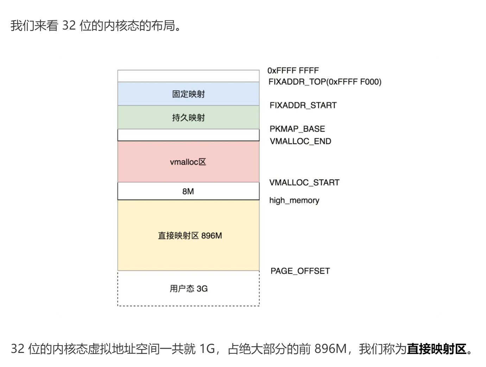

**直接映射区**：就是这一块空间是连续的，和物理内存是非常简单的映射关系

__pa(vaddr)返回与虚拟地址vaddr相关的物理地址

__va(paddr)计算出对应于物理地址paddr的虚拟地址

对于直接映射区，系统启动时，物理内存的前1M已经被占用了，从1M开始加载内核代码段，然后就是内核的全局变量、BSS等，具体内存布局可以查看/proc/iomem

在内核运行过程中，如果碰到系统调用创建进程，会创建task_struct这样的实例，内核的进程管理代码会将实例创建在3G至3G+896M的虚拟空间中，当然能也会被放在物理内存里面的前面896M，相应的页表也会被创建。

内核栈也被分配在896M的空间

* VMALLOC_START到VMALLOC_END之间称为内核动态映射空间，也即内核像用户进程一样malloc申请内存
* PKMAP_BASE到FIXADDR_START的空间称为持久内核映射。使用alloc_pages，在物理内存的高端内存得到struct page结构，可以调用kmap将其映射到这个区域
* FIXADDR_START到FIXADDR_TOP的空间，称为固定映射区域，主要用于满足特殊需求

最后一个区域可以通过kmap_atomic实现临时内核映射。把文件内容写入物理内存，需要内核来处理，只好通过kmap_atomic做一个临时映射，写入物理内存完毕后，在kunmap_atomic解映射即可。

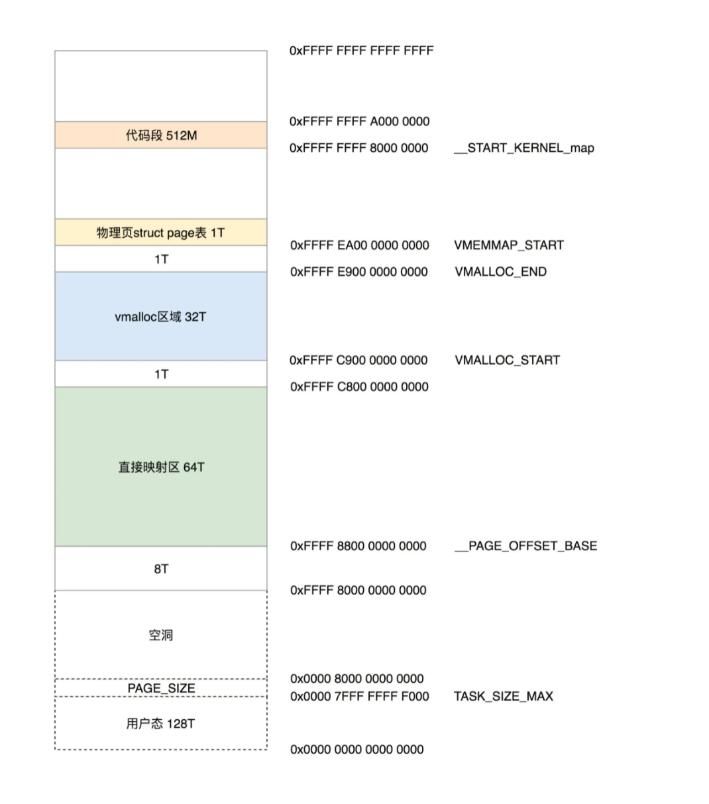


**物理内存的组织方式**

平坦内存模型：物理地址是连续的，页也是连续的。每个页有一个结构struct page

这种模式下，CPU会有多个，在总线的一侧，所有的内存条组成一大片内存，在总线的另一侧，所有的CPU访问都要过总线，而且距离都是一样的，这种模式称为**SMP**（对称多处理器）

为了提高性能和可扩展性，有了一种更高级的模式，**NUMA**（Non-uniform memory access）,非一致内存访问。

这种模式下，内存不再是一整块，每个CPU和内存在一起，称为一个NUMA节点。但是，本地内存不足的情况下，每个CPU都可以去另外的NUMA节点申请内存，这时访问延时就会比较长。

内存被分成了多个节点，每个节点再被分成一个个页面。由于页需要全局唯一定位，页还是需要有全局唯一的页号的。但是由于物理内存不连续，页号就不在连续，内存模型就变成了非连续内存模型。

NUMA往往是非连续内存模型，而非连续内存模型不一定就是NUMA

**稀疏内存模型** TODO:

```c++
typedef struct pglist_data{
    
    struct zone node_zones[MAX_NR_ZONES];
   	//备用节点和它的内存区域的情况
    struct zonelist node_zonelists[MAX_ZONELISTS];
    //当前节点的区域的数量
    int nr_zones;
    //节点的struct page数组，用于描述这个节点里的所有的页
    struct page *node_mem_map;
    //这个节点的起始页号
    unsigned long node_start_pfn;
    //这个节点中包含不连续的物理内存地址的页面数
    unsigned long node_present_pages;
    //真正可用的物理页面的数目
    unsigned long node_spanned_pages;
    //节点id
    int node_id;
}pg_data_t;
```

每一个节点分成一个个区域，放在数组node_zones里，zone的定义：

```c++
enum zone_type{
    #ifdef CONFIG_ZONE_DMA
    	//用作DMA
    	ZONE_DMA,
    #endif
   	//对于64位，有DMA、DMA32两个
    #ifdef CONFIG_ZONE_DMA32
    	ZONE_DMA32,
    #endif
    	//直接映射区
  		ZONE_NORMAL,
    #ifdef CONFIG_HIGHMEM
    	//高端内存区
    	ZONE_HIGHMEM,
    #endif
    	//可移动区域，通过将物理内存划分为可移动分配区域和不可移动分配区域来避免内存碎片
        ZONE_MOVABLE,
    	__MAX_NR_ZONES
 }
```

```c++
struct zone{
 struct pglist_data *zone_pgdat;
 //用于区分冷热页
 struct per_cpu_pageset __percpu *pageset;
 unsigned long zone_start_pfn;
 //这个zone被伙伴系统管理的所有的page数目
 unsigned long managed_pages = present_pages - reserved_pages;
 unsigned long spanned_pages = zone_end_pfn - zone_start_pfn;
 //这个zone在物理内存中真实存在的所有page数目
 unsigned long present_pages = spanned_pages - absent_pages;
 
 const char *name;
 struct free_area free_area[MAX_ORDER];
 unsigned long flags;
 spinlock_t lock;
} ____cacheline_internodealigned_in_
```

页的数据结构struct page,里面有很多union，同一块内存根据情况保存不同类型数据，是因为一个物理页面使用模式有多种。

##### 第一种模式

要用就用一整页。这一整页的内存，或者**直接和虚拟地址空间建立映射关系**，称为匿名页；或者用于**关联一个文件**，然后再和虚拟地址空间建立映射关系（称为内存映射文件）。

如果是这种模式，使用到union中以下变量：

* struct address_space *mapping,用于内存映射，如果是匿名页，最低位为1；如果是映射文件，最低位为0；
* pgoff_t index是在映射区的偏移量；
* atomic_t mapcount,每个进程都有自己的页表，这里指多少个页表项指向这个页
* struct list_head lru,表示这一页应该在一个链表上
* compound相关的变量用于复合页，就是将物理上连续的两个或多个页看成一个独立的大页

##### 第二种模式

仅需分配小块内存，为了满足小内存块的需求，Linux系统采用了**slab  allocator**的技术，用于分配称为slab的一小块内存。基本原理是从内存管理模块申请一整块页，然后划分成多个小块的存储池，用复杂的队列来维护这些小块的状态（被分配了 / 被放回池子 / 应该被回收）

如果某一页是用于分割成一小块一小块的内存进行分配的使用模式，则会使用union中以下变量：

* s_mem 已经分配了正在使用的slab的第一个对象
* freelist 池子中的空闲对象
* rcu_head 需要释放的列表

要分配比较大的内存，如分配页级别的，可以使用伙伴系统

把所有空闲页分组为11个页块链表，每个块链表分别包含很多个大小的页块，有1、2、4、8、16、32、64、128、256、512和1024个连续页的页块。最大可以申请1024个页，对应4MB大小。每个页块的第一个页的物理地址是该页块大小的整数倍。

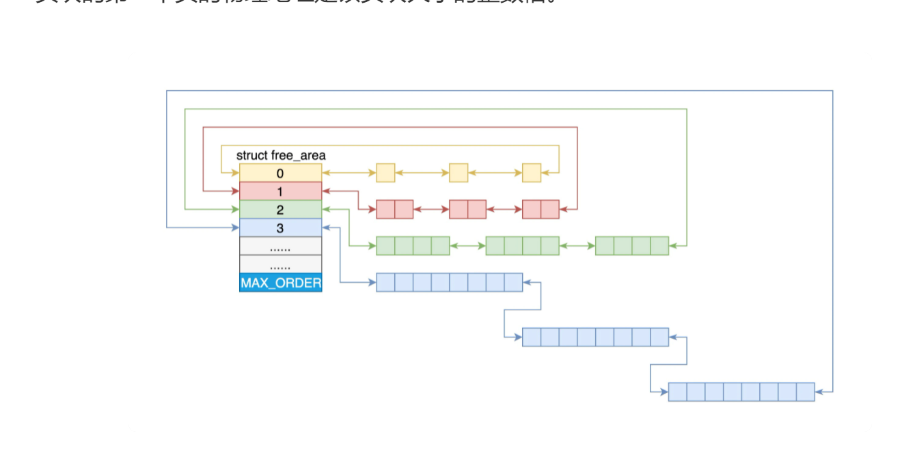


struct zone有以下定义：struct free_area free_area[MAX_ORDER]

```c++
static inline struct page *alloc_pages(gfp_t gfp_mask,unsigned int order){
    return alloc_pages_current(gfp_mask,order);
}
/**
 *alloc_pages_current - Allocate pages
 *@gfp
 *		//用于分配一个页映射到用户进程的虚拟地址空间，并且希望直接被内核或者硬件访问，主要用于一个用户进程希望通过内存映射的方式
 *		//，访问某些硬件的缓存
 *		%GFP_USER user allocation
 *		//用于内核分配页，主要ZONE_NORMAL区域，也即直接映射区
 *		%GFP_KERNEL kernel allocation
 *		//分配高端内存区域的内存
 *		%GFP_HIGHMEM highmem allocation
 *		%GFP_FS don't call back into a file system
 *		%GFP_ATOMIC don't sleep
 *@order：Power of two of allocation size in pages.0 is a single page.
 *
 *	Allocate a page from the kernel page pool.When not in interrupt context and apply then current process
 * 	NUMA policy.Returns NULL when no page can be allocated.
 */
struct page *alloc_pages_current(gfp_t gfp,unsigned order){
    struct mempolicy *pol=&default_policy;
    struct page *page;
 	//伙伴系统的核心方法
    page = __alloc_pages_nodemask(gfp,order,
                                 policy_node(gfp,pol,numa_node_id()),
                                  policy_nodemask(gfp,pol));
    return page;
}
```

```c++
//每一个zone，都有伙伴系统维护的各种大小的队列，rmqueue----就是找到合适大小的队列，把页面取下来
static struct page * get_page_from_freelist(gfp_t gfp_mask,unsigned int order,int alloc_flags,const struct alloc_context *ac){
    for_next_zone_zonelist_nodemask(zone,z,ac->zonelist,ac->high_zoneidx,ac->nodemask){
        struct page *page;
        page = rmqueue(ac->preferred_zoneref->zone,zone,order,gfp_mask,alloc_flags,ac->migratetype);
    }
}
rmqueue->__rmqueue->rmqueue_smallest
    
static inline struct page *__rmqueue_smallest(struct zone *zone,unsigned int order,int migratetype){
    unsigned int current_order;
    struct free_area * free_area;
    struct page * page;
    for(current_order = order;current_order < MAX_ORDER,++current_order){
        area = &(zone->free_area[current_order]);
        page = list_first_entry_or_null(&area->free_list[migratetype],struct page,lru);
        if(!page)
            continue;
        list_del(&page->lru);
        rmv_page_order(page);
        area->nr_free--;
        //TODO:此处的逻辑？？？
        expand(zone,page,order,current_order,area,migratetype);
        set_pcppage_migratetype(page,migratetype);
        return page
    }
    return NULL;
}
```

```c++
static struct kmem_cache *task_struct_cachep;
//task_struct缓存区域
task_struct_cachep = kmem_cache_create("task_struct",
                                      arch_task_struct_size,align,
                                      SLAB_PANIC | SLAB_NOTRACK | SLAB_ACCOUNT,NULL);

static inline struct task_struct *alloc_task_struct_node(int node){
    //从缓存区域取task_struct
    return kmem_cache_alloc_node(task_struct_cachep,GFP_KERNEL,node);
}

static inline void free_task_struct(struct task_struct *tsk){
    //将task_struct放回缓存区	
    kmem_cache_free(task_struct_cachep,tsk);
}

//对于缓存来讲，其实就是分配了连续几页的大内存块，然后根据缓存对象的大小，切成小内存块
struct kmem_cache{
    struct kmem_cache_cpu __percpu *cpu_slab;
    unsigned long flags;
    unsigned long min_partial;
    //包含这个指针的大小
    int size;
    //纯对象的大小
    int object_size;
    //把下一个空闲对象的指针存放在这一项里的偏移量
    int offset;
    #ifdef CONFIG_SLUB_CPU_PARTIAL
    	int cpu_partial;
    #endif
    //order,就是2的order次方个页面的，objects就是能够存放的缓存对象的数量
    struct kmem_cache_order_objects oo;
    struct kmem_cache_order_objects max;
    struct kmem_cache_order_objects min;
    gfp_t allocflags;
    int refcount;
    void (*ctor)(void *);
    const char *name;
    //双向链表，task_struct、mm_struct、fs_struct的缓存放到链表，LIST_HEAD(slab_caches)
    struct list_head list;
    struct kmem_cache_node *node[MAX_NUMNODES];
}
```

kmem_cache_cpu和kmem_cache_node,它们都是每个NUMA节点上有一个

分配缓存块时，要分两种路径，**fast path**和**slow path**。kmem_cache_cpu是快速通道，kmem_cache_node是普通通道。每次分配内存时，先从kmem_cache_cpu进行分配，如果kmem_cache_cpu没有空闲块，就到kmem_cache_node中进行分配，如果还是没有空闲的块，才去伙伴系统分配新的页。

```c++
struct kmem_cache_cpu{
    //指向大内存块里面第一个空闲的项（会有指针指向下一个空闲的项，最终所有空闲的项会形成一个链表）
    void **freelist;
    unsigned long tid;
    //指向大内存块的第一个页，缓存块就是里面分配。
    struct page *page;
    #ifdef CONFIG_SLUB_CPU_PARTIAL
    	//也是的也是大内存块的第一个页（它里面部分被分配出去了，部分是空的。这是一个备用列表，当page满了，就从这里找）
    	struct page *partial;
    #endif
}

struct kmem_cache_node{
    spinlock_t list_lock;
    #ifdef CONFIG_SLUB
    	unsigned long nr_partial;
    	//这个链表里存放的是部分空闲的内存块。这是kmem_cache_cpu里面的partial的备用列表，如果哪里没有，就到这里来找。
    	struct list_head partial;
    #endif
}
```

分配过程：

kmem_cache_alloc_node会调用slab_alloc_node

```c++
/**
 *	Inlined fastpath so that allocation functions (kmalloc,kmem_cache_alloc)
 *  have the fastpath folded into their functions.So no function call overhead 
 *  for requests that can be satisfied on the fastpath.
 *
 *	The fastpath works by first checking if the lockless freelist can be used.
 * 	if not then __slab_alloc is called for slow processing.
 *  
 *	Otherise we can simply pick the next object from the lockless free list.
 */
static __always_inline void *slab_alloc_node(struct kmem_cache *s,gfp_t gfpflags,int node,unsigned long addr){
    void *object;
    struct kmem_cache_cpu *c;
    struct page *page;
    unsigned tid;
    //快速通道，取出cpu_slab也即kmem_cache_cpu的freelist,这就是第一个空闲的项
    tid = this_cpu_read(s->cpu_slab->tid);
    c = raw_cpu_ptr(s->cpu_slab);
    object = c->freelist;
    page = c->page;
    if(unlikely(!object || !node_match(page,node))){
        //进入普通通道
        object = __slab_alloc(s,gfpflags,node,addr,c);
        stat(s,ALLOC_SLOWPATH)
    }
    return object;
}

static void *___slab_alloc(struct kmem_cache *s,gfp_t gfpflags,int node,unsigned long addr,struct kmem_cache_cpu *c){
    void *freellist;
    struct page *page;
    .......
    redo:
    .......
    //must check again c->freelist in case of cpu migration or IRQ
  	freelist = c->freelist;  
    if(freelist)
        goto load_freelist;
    freelist = get_freelist(s,page);
    
    if(!freelist){
        c->page = NULL;
        stat(s,DEACTIVATE_BYPASS);
        goto new_slab;
    }
    load_freelist:
    	c->freelist = get_freepointer(s,freelist);
    	c->tid = next_tid(c->tid);
    	return freelist;
    new_slab:
    	//先去kmem_cache_cpu的partial找，如果partial不为空，就将kmem_cache_cpu的page，也就是快速通道的那一大块内存
    	//替换为partial里的大块内存，然后redo
    	if(slub_percpu_partial(c)){
            page = c->page = slub_percpu_partial(c);
            slub_set_percpu_partial(c,page);
            stat(s,CPU_PARTIAL_ALLOC);
            goto redo;
        }
    //如果还没有，就new_slab_objects
    freelist = new_slab_objects(s,gfpflags,node,&c);
    return freelist;
} 

static inline void *new_slab_objects(struct kmem_cache *s,gfp_t flags,int node,struct kmem_cache_cpu **pc){
    void *freelist;
    struct kmem_cache_cpu *c = *pc;
    struct page *page;
    //根据node_id 找到对应的kmem_cache_node，然后调用get_partial_node开始在这个节点进行分配
    freelist = get_partial(s,flags,node,c);
    
    if(freelist)
        return freelist;
    //如果当前kmem_cache_node也没有空闲内存，则调用new_slab进行页面分配
    page = new_slab(s,flags,node);
    if(page){
        c = raw_cpu_ptr(s->cpu_slab);
        if(c->page)
            flush_slab();
        freelist = page->freelist;
        page->freelist = NULL;
        stat(s,ALLOC_SLAB);
        c->page = page;
        *pc =  c;
    }else{
        freelist = NULL;
    }
    return freelist;
}

//从当前kmem_cache_node，调用get_partial_node,在这个节点进行分配，如果这个节点没有，就需要调用new_slab进行分配
static void *get_partial_node(struct kmem_cache *s,struct kmem_cache_node *n,struct kmem_cache_cpu *c,gfp_t flags){
    struct page *page,*page2;
    void *object = NULL;
    int available = 0;
    int objects;
    .......
    list_for_each_safe(page,page2,&n->partial,lru){
        void *t;
        t = acquire_slab(s,n,page,object == NULL,&objects);
        if(!t)
            break;
        available += objects;
        if(!object){
            c->page = page;
            stat(s,ALLOC_FROM_PARTIAL);
            object = t;
        }else{
            put_cpu_partial(s,page,0);
            stat(s,CPU_PARTIAL_NODE);
        }
        if(!kmem_cache_has_cpu_partial(s) || available > slub_cpu_partial(s) / 2)
            break;
    }
    return object;
}

static struct page *allocate_slab(struct kmem_cache *s,gfp_t flags,int node){
    struct page *page;
    struct kmem_cache_order_objects oo =  s->oo;
    gfp_t alloc_gfp;
    void *start,*p;	
    int idx,order;
    bool shuffle;
    flags &=gfp_allowed_mask;
    
    page = alloc_slab_page(s,alloc_gfp,node,oo);
    if(unlikely(!page)){
        oo = s->min;
        alloc_gfp = flags;
        /**
         * Allocation may have failed due to fragmentation.
         * Try a lower order alloc if possible.
         */
        page = alloc_slab_page(s,alloc_gfp,node,oo);
        if(unlikefly(!page))
            goto out;
        stat(s,ORDER_FALLBACk);
    }
    return page;
}
```

**页面换出**

触发页面换出的情况：

* get_page_from_freelist->node_reclaim->shrink_node，页面换出也是以内存节点为单位的

* 内核线程kswapd，这个内核线程，在初始化的时候就被创建

  balance_pgdat->kswapd_shrink_node->shrink_node,也是以内存节点为单位的

```c++
/**
* The backgroundd pageout daemon,started as a kernel thread from the init process
*
* This basically trickles out pages so that we have some free memory available even if
* there is no other activity that frees anything up.This is needed for things like routing
* etc,where we otherwise might have all activity going on in asynchronous contexts that cannot 
* page things out.
*
* If there are applications that are active memory-allocators(most normal use),this basically
* shouldn'tmatter.
*/
static int kswapd(void *p){
    unsigned int alloc_order,reclaim_order;
    unsigned int classzone_idx = MAX_NR_ZONES - 1;
    pg_data_t *pgdat = (pa_data_t*)p;
    struct task_struct *tsk = current;
    for( ; ; ){
        kswapd_try_to_sleep(pgdat,alloc_order,reclaim_order,classzone_idx);
        reclaim_order = balance_pgdat(pgdat,alloc_order,classzone_idx);
    }
}
```

以上两种场景都是调用shrink_node

```c++
/**
 * This is a basic per-node page freer.Used by both kswapd and direct reclaim.
 */
static void shrink_node_memcg(struct pglist_data *pgdat,struct mem_cgroup *memcg,struct scan_control *sc,unsigned long *lru_pages){
 unsigned long nr[NR_LRU_LISTS];
 enum lru_list lru;
 while(nr[LRU_INACTIVE_ANON] || nr[LRU_ACTIVE_FILE] || nr[LRU_INACTIVE_FILE]){
     unsigned long nr_anon,nr_file,percentage;
     unsigned long nr_scanned;
     for_each_evictable_lru(lru){
         if(nr[lru]){
             nr_to_scan = min(nr[lru],SWAP_CLUSTER_MAX);
             nr[lru] -= nr_to_scan;
             
             nr_reclaimed += shrink_list(lru,nr_to_scan,lruvec,memcg,sc);
         }
     }
 }
}
```

内存也总共分两类，一类是**匿名页**，和虚拟地址空间进行关联；一类是**内存映射**，不但和虚拟地址空间关联，还和文件管理关联。

每一类都有两个列表，一个是active，一个是inactive。如果要换出内存，就是从不活跃的列表中找出最不活跃的。

```c++
enum lru_list {
    LRU_INACTIVE_ANON = LRU_BASE;
    LRU_ACTIVE_ANON = LRU_BASE + LRU_ACTIVE;
    LRU_INACTIVE_FILE = LRU_BASE + LRU_FILE;
    LRU_ACTIVE_FILE = LRU_BASE + LRU_FILE + LRU_ACTIVE;
    LRU_UNEVICTABLE,
    NR_LRU_LISTS
};

#define for_each_evictable_lru(lru) for(lru=0;lru <= LRU_ACTIVE_FILE;lru++)
static unsigned long shrink_list(enum lru_list lru,unsigned long nr_to_scan,
                                struct lruvec *lruvec,struct mem_cgroup *memcg,
                                struct scan_control *sc){
    if(is_active_lru(lru)){
        if(inactive_list_is_low(lruvec,is_file_lru(lru),memcg,sc,true))
            shrink_active_list(nr_to_scan,lruvec,sc,lru);
        return 0;
    }
    return shrink_inactive_list(nr_to_scan,lruvec,sc,lru);
}
//shrink_list会先缩减活跃页面列表，再压缩不活跃的页面列表。对于不活跃列表的缩减，shrink_inactive_list就需要对页面进行回收
//;对于匿名页，需要分配swap，将内存页写入文件系统；对于内存映射关联了文件的，需要将在内存中的修改写回文件中。
```

**用户态内存映射**

mmap系统调用

```c++
SYSCALL_DEFINE6(mmap,unsigned long,addr,unsigned long,len,unsigned long,prot,unsigned long,flags,unsigned long,fd,unsigned long,off){
    error = sys_map_pgoff(addr,len,prot,flags,fd,off >> PAGE_SHIFT);
}

SYSCALL_DEFINE6(mmap_pgoff,unsigned long,addr,unsigned long,len,unsigned long,prot,unsigned long,flags,unsigned long,fd,unsigned long,pgoff){
    struct file *file = NULL;
    .......
    file = fget(fd);
    .......
    retval = vm_mmap_pgoff(file,addr,len,prot,flags,pgoff);
    return retval;
}
```

vm_mmap_pgoff->do_mmap_pgoff->do_mmap,主要做了以下事:

* 调用get_unmapped_area找到一个没有映射的区域
* 调用mmap_region映射这个区域

```c++
unsigned long get_unmapped_area(struct file *file,unsigned long addr,unsigned long len,unsigned long pgoff,unsigned long flags){
   unsigned long (*get_area)(struct file *,unsigned long,unsigned long,unsigned long,unsigned long);
   //如果是匿名映射，调用mm_struct->get_unmapped_area,其实就是arch_get_unmapped_area,会调用find_vma_prev,在
   //表示虚拟内存区域的vm_area_struct红黑树找到相应的位置
   //如果不是匿名映射，而是映射到一个文件，如果是ext4文件系统，调用的是thp_get_unmapped_area,最终还是调用
   //mm_struct->get_unmapped_area
   get_area = current->mm->get_unmapped_area;
   if(file){
       if(file->f_op->get_unmapped_area){
           get_area = file->f_op->get_unmapped_area;
       }
   }
}

unsigned long mmap_region(struct file *file,unsigned long addr,unsigned long len,vm_flags_t vm_flags,unsigned long pgoff,struct list_head *uf){
    struct mm_struct *mm = current->mm;
    struct vm_area_struct *vma,*prev;
    struct rb_node **rb_link,*rb_parent;
    //是否能够基于虚拟内存区域的前一个vm_area_struct合并到一起
    vma = vma_merge(mm,prev,addr,addr + len,vm_flags,NULL,file,pgoff,NULL,NULL_VM_UEFD_CTX);
    if(vma)
        goto out;
    //在slub里创建一个新的vm_area_struct,然后设置参数
    vma = kmem_cache_zalloc(vm_area_cachep,GFP_KERNEL);
    if(!vma){
        error = -ENOMEM;
        goto unacct_error;
    }
    vma->vm_mm = mm;
    vma->vm_start = addr;
    vma->vm_end = addr + len;
    vma->vm_flags = vm_flags;
    vma->vm_page_prot = vm_get_page_prot(vm_flags);
    vma->vm_pgoff = pgoff;
    INIT_LIST_HEAD(&vma->anon_vma_chain);
    
    if(file){
        vma->vm_file = get_file(file);
        error = call_mmap(file,vma);
        addr = vma->vm_start;
        vm_flags = vma->vm_flags;
    }
    //将新创建的vm_area_struct挂载在mm_struct里面的红黑树上
    vma_link(mm,vma,prev,rb_link,rb_parent);
    return addr;
}
//对于打开的文件，有个struct file结构，file->address_space中有棵变量名为i_mmap的红黑树，vm_area_struct就挂在这棵树上

struct address_space {
    struct inode *host;/** owner: inode,block_device*/
    struct rb_root i_mmap;/** tree of private and shared mappings */
    const struct address_space_operations *a_ops;
}

static void __vma_link_file(struct vm_area_struct *vma){
    struct file *file;
    file = vma->vm_file;
    if(file){
        struct address_space *mapping = file->f_mapping;
        vma_interval_tree_insert(vma,&mapping->i_mmap);
    }
}
```

**用户态缺页异常**

一旦开始访问虚拟内存某个区域，如果物理页，就会触发缺页中断，do_page_fault

```c++
dotraplinkage void notrace do_page_fault(struct pt_regs,unsigned long error_code){
    unsigned long address = read_cr2();/** Get the faulting address */
    __do_page_fault(regs,error_code,address);
}

static noinline void __do_page_fault(struct pt_regs *regs,unsigned long error_code,unsigned long address){
    struct vm_area_struct *vma;
    struct task_struct *tsk;
    struct mm_struct *mm;
    tsk = current;
    mm = tsk->mm;
    //判断缺页中断是否发生在内核
    if(unlikely(fault_in_kernel_space(address))){
        //如果发生在内核则调用vmalloc_fault
        if(vmalloc_fault(address) >= 0){
            return;
        }
        //如果在用户空间，找到vm_area_struct,然后调用handle_mm_fault来映射这个区域
        vma = find_vma(mm,address);
        fault = handle_mm_fault(vma,address,flags);
    }
}

static int __handle_mm_fault(struct vm_area_struct *vma,unsigned long address,unsigned int flags){
    struct vm_fault vmf = {
        .vma = vma,
        .address = address & PAGE_MASK,
        .flags = flags,
        .pgoff = linear_page_index(vm,address),
        .gfp_mask = __get_fault_gfp_mask(vma),
    };
    struct mm_struct *mm = vma->vm_mm;
    //全局页目录项
    pgd_t *pgd;
    p4d_t *p4d;
    int ret;
    pgd = pgd_offset(mm,address);
    p4d = p4d_alloc(mm,pgd,address);
    //上层页目录项
    vmf.pud = pub_alloc(mm,p4d,address);
    //中间页目录项
    vmf.pmd = pmd_alloc(mm,vmf.pud,address);
    //直接页表项
    return handle_pte_fault(&vmf);
}
//每个进程都有独立的地址空间，为了这个进程独立完成映射，每个进程都有独立的进程页表，这个页表的最顶级的pgd存放在task_struct中的
//mm_struct的pgd变量里
```

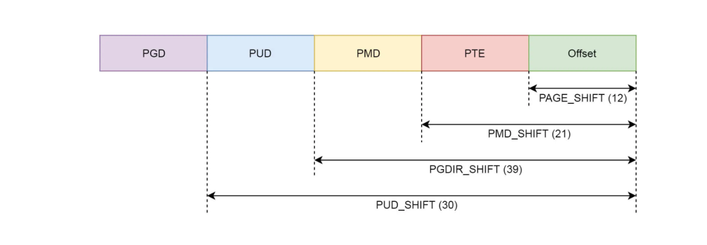

dup_mm->mm_init->mm_alloc_pgd->pgd_alloc->pgd_ctor

```c++
static void pgd_ctor(struct mm_struct *mm,pgd_t *pgd){
    if(CONFIG_PGTABLE_LEVELS == 2 ||
      (CONFIG_PGTABLE_LEVELS==3 && SHARED_KERNEL_PMD) ||
      CONFIG_PGTABLE_LEVELS >= 4){
        //拷贝了对于swapper_pg_dir的引用。swapper_pg_dir是内核页表最顶级的全局目录
        clone_pgd_range(pgd + KERNEL_PGD_BOUNDARY,
                        swapper_pg_dir + KERNEL_PGD_BOUNDARY,
                        KERNEL_PGD_PTRS);
    }
}
```

一个进程的虚拟地址空间包含用户态和内核态。为了从虚拟地址空间映射到物理页面，页表也分为用户地址空间的页表和内核页表。在内核里，映射靠内核页表，这里内核页表会拷贝一份到进程的页表。

一个进程fork完毕之后，有了内核页表，有了自己顶级的pgd，但是对于用户空间还没映射过，这需要等到这个进程在某个CPU上运行，并对内存访问的那一刻。

当这个进程被调度到某个CPU上运行时，调用context_switch进行上下文切换。对于内存方面的切换会调用switch_mm_irqs_off,这里会调用load_new_mm_cr3。

**cr3**

* cr3是CPU的一个寄存器，会指向当前进程的顶级pgd。如果CPU的指令要访问进程的虚拟内存，就会自动从cr3里得到pgd在物理内存的地址。然后根据里面的页表解析虚拟内存的地址为物理内存，从而访问真正的物理内存上的数据。

* 存放当前进程的顶级pgd，是硬件的要求。存放的是pgd在物理内存的地址，不能是虚拟地址。因而load_new_mm_cr3里面会使用__pa,将mm_struct里面的成员变量pgd变为物理地址，才能加载到cr3中。
* 用户态在运行过程中，访问虚拟内存中的数据，会被cr3里面指向的页表转换为物理地址后，才在物理内存中访问数据，这个过程是在用户态运行的

```c++
static int handle_pte_fault(struct vm_fault *vmf) {
    pte_t entry;
    vmf->pte = pte_offset_map(vmf->pmd,vmf->address);
    vmf->orig_pte = *vmf->pte;
    //页表项中从没出现过
    if(!vmf->pte){
        //匿名页
        if(vma_is_anonymous(vmf->vma))
            return do_anonymous_page(vmf)
        else
        //映射到文件
            return do_fault(vmf);
    }
 
    //原来出现过，被换到硬盘中
    if(!pte_present(vmf->orig_pte))
        return do_swap_page(vmf);
}

static int do_anonymous_page(struct vm_fault *vmf){
    struct vm_area_struct *vma = vmf->vma;
    struct mem_cgroup *memcg;
    struct page *page;
    int ret = 0;
    pte_t entry;
    //分配一个页表项
    if(pte_alloc(vma->vm_mm,vmf->pmd,vmf->address));
    	return VM_FAULT_OOM;
    //分配一个页，之后会调用alloc_pages_vma,最终调用__alloc_pages_nodemask
    //伙伴系统的核心方法
    page = alloc_zeroed_user_highpage_movable(vma,vmf->address);
    //将页表项指向新分配的物理页
    entry = mk_pte(page,vma->vm_page_prot);
    if(vma->vm_flags & VM_WRITE)
        entry = pte_mkwrite(pte_mkdirty(entry));
    vmf->pte = pte_offset_map_lock(vma->vm_mm,vmf->pmd,vmf->address,&vmf->ptl);
    //将页表项塞到页表
    set_pte_at(vma->vm_mm,vmf->address,vmf->pte,entry);
}

static int __do_fault(struct vm_fault *vmf) {
    struct vm_area_struct *vma = vmf->vma;
    int ret;
    ret = vma->vm_ops->fault(vmf);
    return ret;
}

static const struct vm_operations_struct ext4_file_vm_ops = {
    .fault = ext4_filemap_fault,
    .map_pages = filemap_map_pages,
    .page_mkwrite = ext4_page_mkwrite,
}

int ext4_filemap_fault(struct vm_fault *vmf){
    struct inode = file_inode(vmf->vma->vm_file);
    err = filemap_fault(vmf);
    return err;
}

int filemap_fault(struct vm_fault *vmf){
    int error;
    struct file *file = vmf->vma->vm_file;
    struct address_space *mapping = file->f_mapping;
    struct inode *inode = mapping->host;
    pgoff_t offset = vm->pgoff;
    struct page *page;
    int ret = 0;
    //对于文件映射，文件在物理内存有页面作为缓存，找到这个页
    page = find_get_page(mapping,offset);
    if(likely(page)&&!(vmf->flags & FAULT_FLAG_TRIED)) {
        //如果找到这个页，预读一些数据到内存，没有就跳到no_cached_page
        do_async_mmap_readahead(vmf->vma,ra,file,page,offset);
    } else if(!page) {
        goto no_cached_page;
    }
    vmf->page = page;
 	return ret | VM_FAULT_LOCKED;
 no_cached_page:
    error = page_cache_read(file,offset,vmf->gfp_mask);
}

static int page_cache_read(struct file *file,pgoff_t offset,gfp_t gfp_mask) {
    struct address_space *mapping = file->f_mapping;
    struct page *page;
    page = __page_cache_alloc(gfp_mask|__GFP_COLD);
    ret = add_to_page_cache_lru(page,mapping,offset,gfp_mask & GFP_KERNEL);
    ret = mapping->a_pos->readpage(file,page);
}

static const struct address_space_operations ext4_apos = {
    .readpage = ext4_readpage,
    .readpages = ext4_readpages,
}

static int ext4_read_inline_page(struct inode *inode,struct page *page) {
    void *kaddr;
    //将物理内存映射到内核的虚拟空间(临时映射到内核)
    kaddr = kmap_atomic(page);
    ret = ext4_read_inline_data(inode,kaddr,len,&iloc);
    flush_dcache_page(page);
    //取消内核的临时映射
    kunmap_atomic(kaddr);
}
```


```c++
int do_swap_page(struct vm_fault *vmf) {
    struct vm_area_struct *vma = vmf->vma;
    struct page *page,*swapcache;
    struct mem_cgroup *memcg;
    swp_entry_t entry;
    pte_t pte;
    entry = pte_do_swp_entry(vmf->orig_pte);
    //查找swap文件有没有缓存
    page = lookup_swap_cache(entry);
   	//如果没有缓存，调用swapin_readahead把swap文件读到内存，形成内存页，并通过mk_pte生成
   	//页表项。set_pte_at将页表项插入页表，swap_free将swap文件清理（因为重新加载回内存，不需要swap文件了）。
    if(!page) {
        //swapin_readahead最终也会调用swap_readpage,同样也需要用kmap_atomic做临时映射。
        page = swapin_readahead(entry,GFP_HIGHUSER_MOVABLE,vma,vmf->address);
    }
    swapcache = page;
    pte = mk_pte(page,vma->vm_page_prot);
    set_pte_at(vma->vm_mm,vmf->address,vmf->pte,pte);
    vmf->orig_pte = pte;
    swap_free(entry);
}
```

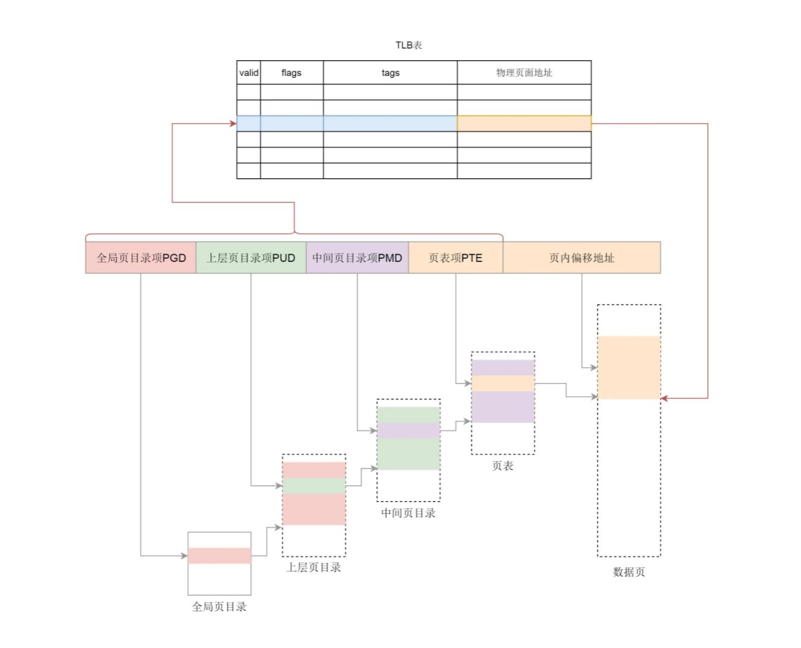


页表一般很大，只能放在内存中，操作系统每次访问内存，都要先查询页表得到物理地址，然后访问该物理地址读取指令、数据。

为了提高映射速度，引入了**TLB**(Translation Lookaside Buffer),专门用来做地址映射的硬件设备，不在内存中，存储的数据比较少，但是比内存快。是页表的Cache，其中存储了当前最可能被访问到的页表项。

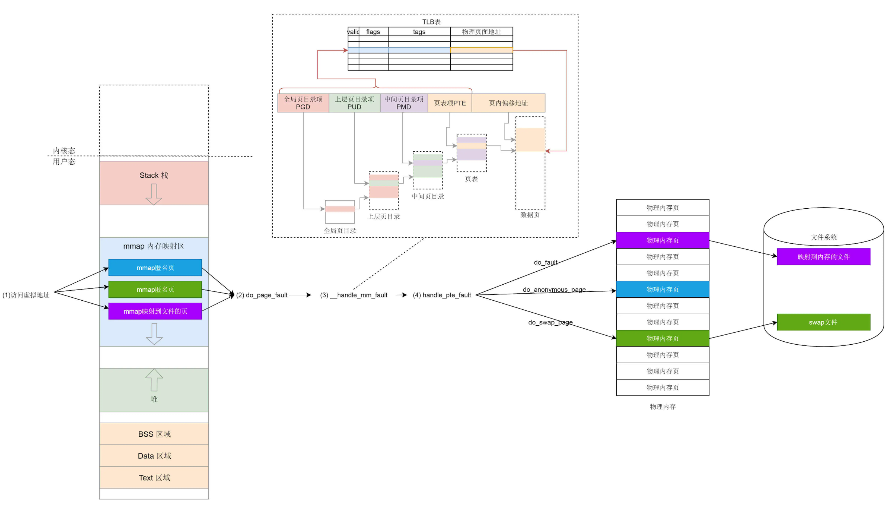

**内核态内存映射**

* 内核态内存映射函数vmalloc、kmap_atomic是如何工作的
* 内核态页表是放在哪里的，如果工作的？swapper_pg_dir是怎么回事
* 出现内核态缺页异常如何处理

//TODO:???????

## 文件系统

新的系统并不是只为了做同样的事情比老的系统快一点，还应该允许用以前完全不可能的方法处理事情。

用以前完全不可能的方法来处理事情

元数据：作为文件系统，一定要提供存储、查询和处理数据的功能。文件系统就保存了一个内部数据结构（VFS）

，使得这些操作成为可能，为文件系统提供特定的身份和性能特征。元数据是专门交给文件驱动程序用的。

**fsck**:

确保文件系统驱动程序要用的元数据是干净的。生效的时机：

* 每次Linux启动，没有挂接任何文件系统的时候，启动fsck扫描下/etc/fstab文件中列出的所有本地文件系统
* 每次Linux关闭，要把还在内存中的被称之为页面缓存或磁盘中缓存中的数据转送到磁盘，还要保证把已经挂接的文件系统卸载干净

当遇到异常关机，重启后fsck会全面审查元数据（时间会很长），修正一切可以修复的数据（会丢弃不可修复的数据）

针对于fsck，日志是一个更好的解决方案，文件系统的日志记录了它对元数据都干了些什么。

​	元数据出现问题后，**fsck**在遇到有日志的文件系统时，由文件系统驱动负责按照日志里的记载去恢复元数据（更快）

**ReiserFS**

一个最好的文件系统，不单能够管理好用户的文件，还能适应环境干点别的，比如代替数据库。

关注小文件的性能。常见的ext2、ext3等文件系统一遇到小文件就傻了（TODO:为什么傻了？？？），迫使开发者处理比较零碎的数据时，不得不考虑采用数据库或其他手段获取想要的性能指标。“针对问题进行创作”

ext2分析：比较擅长存储大量大小在20K以上的文件。最小存储单元是1K或4K。**ReiserFS**在处理小于1K的文件时，比ext快8到15倍，处理大于1K的文件时，也不会有什么性能损失。

ReiserFS技术：

采用**B*树**的数据结构，一种全新的经过特殊优化的树形数据结构。ReiserFS用它组织元数据，相当于整个磁盘分区是一个**B*树**。

**B树**是针对磁盘或其他存储介质而设计的一种多叉平衡查找树。实际文件系统并不使用B树，大多使用**B+树**。**B+树**是**B树**的一个变形，在降低磁盘读写代价的同时，提高了查询效率的稳定性。B*树是B+树的变形，B\*树分配新节点的概率比B+树要低，空间利用率更高。

利用B*树的特性，ReiserFS允许一个目录下可以容纳10万个子目录。ReiserFS可以根据需要动态的分配索引，也省去了固定索引，没有附加空间，提高了存储效率。ReiserFS不适用固定大小的数据块分配存储空间，采用精确分配原则。ReiserFS还提供了一种以尾文件（比系统文件块小的文件或文件的结尾部分）为中心的特殊优化，ReiserFS可以利用**B\*树**的叶子节点存储文件。

ReiserFS实际做了两件事：

* 显著提高小文件性能，把文件数据和索引信息放在一起，大多数只需要一次磁盘IO就能完成。
* 压缩尾文件，就可以节省大量磁盘空间。尾文件压缩是以牺牲速度为代价

**进程文件系统procfs**

启动时动态生成的文件系统，**用于用户空间通过内核访问进程信息**。经过不断演变，**如今Linux提供的procfs已经不单单用于访问进程信息，还是一个用户空间与内核交换数据修改系统行为的接口**。这个文件系统通常被挂接到/proc目录。

**procfs**源自UNIX世界，几乎所有类UNIX系统都有提供。最早在UNIX第8版实现，后来又移植到SVR4，最后由一个称为“**9号计划**”的项目做大量改进，使得/proc成为文件系统真正的一部分。

**proc目录下文件**

| 名称        | 功能                                                      | 名称       | 功能                       |
| ----------- | --------------------------------------------------------- | ---------- | -------------------------- |
| apm         | 高级电源管理信息                                          | loadavg    | 负载均衡信息               |
| buddyinfo   | Buddy算法内存分配信息                                     | locks      | 内核锁                     |
| compline    | 内核的命令行参数                                          | mdstat     | 磁盘阵列状态               |
| config.gz   | 当前内核的.config文件                                     | meminfo    | 内存信息                   |
| cpuinfo     | cpu信息                                                   | misc       | 杂项信息                   |
| devices     | 可以用到的设备（块设备/字符设备）                         | modules    | 系统已经加载的模块文本列表 |
| diskstats   | 磁盘I/O统计信息                                           | mounts     | 已挂接的文件系统列表       |
| dma         | 使用的DMA通道                                             | partitions | 磁盘分区信息               |
| execdomains | 执行区域列表                                              | pci        | 内核识别的PCI设备列表      |
| fb          | Frame buffer信息                                          | self       | 访问proc文件系统的进程信息 |
| filesystems | 支持的文件系统                                            | slabinfo   | 内核缓存信息               |
| Interrupt   | 中断的使用情况，记录中断产生次数                          | splash     | splash信息                 |
| iomem       | I/O内存映射关系                                           | stat       | 全面统计状态表             |
| ioports     | I/O端口分配情况                                           | swaps      | 交换空间使用情况           |
| kcore       | 内核核心映像，GDB可以利用它查看当前内核的所有数据结构状态 | uptime     | 系统正常运行时间           |
| key-users   | 密钥保留服务文件                                          | version    | 内核版本                   |
| kmsg        | 内核消息                                                  | vmstat     | 虚拟内存统计表             |
| ksyms       | 内核符号表                                                | zoneinfo   | 内存管理区信息             |

**/proc下子目录**

| 名称     | 功能                 | 名称    | 功能                           |
| -------- | -------------------- | ------- | ------------------------------ |
| [number] | 进程信息             | irq     | 中断请求设置接口               |
| acpi     | 高级配置与电源接口   | net     | 网络各种状态信息               |
| asound   | ALSA声卡驱动接口     | scsi    | SCSI设备信息                   |
| bus      | 系统中已安装总线信息 | sys     | 内核配置接口                   |
| driver   | 驱动信息             | sysvipc | 中断使用情况，记录中断产生次数 |
| fs       | 文件系统特别信息     | tty     | tty驱动信息                    |
| ide      | IDE设备信息          |         |                                |

[number]这些目录，里面包含的文件，描述了一个进程的方方面面，**是procfs最初目的的体现**。这些文件都是只读的，top、ps就是依据这些目录中文件所提供的内容进行工作的。

sys目录，包含的文件大多都是可以写的，通过改写这些文件的内容，可以起到修改内核参数的目的。系统命令sysctl就是利用这个目录实现的全部功能。

TODO:实战？？？？

**tmpfs文件系统**

**RamDisk**，将一部分固定大小的内存当作分区来使用。这是一种非常古老的技术（上世纪80年代初），MS-DOS在2.0版本就加入了对RamDisk的支持。Linux将这个技术直接编译进内核。

**RamDisk**的缺点：浪费物理内存空间（即使一个字节没有使用，所有RamDisk都需要进行格式化）；在不断的生产实践过程中，大量临时文件很影响程序性能。于是有人把程序产生的临时文件放入RamDisk来提高整体性能

鉴于上述需求，在Linux2.4内核中，引入了**tmpfs**。

类似于RamDisk,既可以使用内存，又可以使用交互分区。tmpfs文件系统使用虚拟内存子系统的页面存储文件，tmpfs不关心这些页面存储在物理内存还是交换分区。

**tmpfs**跟其他文件系统如：ext2、ext3、ReiserFS等是完全不一致的，它们在Linux中被称为块设备。tmpfs直接建立在**VM**之上的。tmpfs刚被挂接时只有很小的空间。随着文件的复制和创建，tmpfs文件系统驱动程序会分配更多的**VM**，并按需求动态地增加文件系统的空间。

**devfs和sysfs文件系统**

**类UNIX系统**最“酷”的地方在于：设备不是简单的隐藏在晦涩的API之后，而是真正的与普通文件、目录、符号链接一样，存在于文件系统之上。

devfs:提供一个新的、更合理的方式管理那些位于dev目录下的所有块设备和字符设备。典型的Linux系统以一种不太理想，而且麻烦的方式管理这些特殊文件。

传统的Linux设备驱动程序，要向系统提供一个文件映射，需要 提供一个主设备号，而且这个主设备号必须保证唯一。早期，这个主设备号被设计的只有8位。

devfs给驱动开发人员提供一个devfs_register的内核API，这个API可以接受一个设备名称作为参数，调用成功后，/dev目录下就会出现与设备名相同的文件名。而且devfs_register也支持主设备号的策略，这样可以保持向下兼容性。

工作方式：一旦所有设备驱动程序启动并向内核注册适当的设备，内核就启动/sbin/init进程，系统初始化脚本开始执行。启动过程初期，rc脚本将devfs文件系统安装到/dev中，这样/dev就包含了devfs所表达的所有设备映射关系，所有注册的设备依然可以通过/dev目录进行访问。

优点：所有需要的设备映射关系都由内核自动创建，就不用写死设备文件，/dev目录就不会充斥大量的无用设备文件。

devfsd       自定义dev    TODO:???????

**sysfs的由来**

Liunx下设备管理方式的演进：

* 静态/dev文件，将设备通过设备节点放入/dev目录下，每个设备节点是/dev根目录下的一个文件。Linux通过**主次设备号**来指定不同的设备节点。TODO:早期设备管理是怎样的一个流程。
* devfs，linux kernel2.4版本后引入。允许使用自定义的设备名称来注册设备节点，同时兼容老的设备号；所有的设备都有内核在系统启动时期创建并注册到/dev目录下
* udev，devfs解决了静态/dev管理的很多问题。基于devfs的一些缺陷，在linux kernel2.6.x版本后，引入了udev对其进行改进。udev是一个对/dev下设备节点进行**动态管理**的**用户空间程序**，它通过**自身的守护进程**和**自定义的一系列规则**来处理设备的加载、移除和热插拔等功能。

| devfs                          | udev                                                     |
| ------------------------------ | -------------------------------------------------------- |
| 命名不够灵活，设备名称不可预知 | 支持设备的固定命名                                       |
|                                | 设备热插拔时，用户程序有办法得到通知，udev运行在用户空间 |
| 只显示存在的设备列表           |                                                          |
| major、minor快被分配光了       |                                                          |

* sysfs，Linux2.6引入的一种虚拟文件系统，挂载在/sys目录下，这个文件系统把实际链接到系统上的设备，总线及其对应的驱动程序组织成分级的文件。从而将设备的层次结构映射到用户空间中，用户空间可以通过修改sysfs中文件属性来修改设备属性，从而与内核设备交互

sysfs是对devfs改进，udev也是对devfs的改进。udev就是利用sysfs提供的信息来实现的：udev会根据sysfs里的设备信息创建/dev目录下的相应设备节点。

devfs的缺点：

* 不确定的设备映射，有时一个设备映射的设备文件可能不同；
* 没有足够的主/辅设备号，没有给主/辅设备号太多的扩展余地；
* dev目录下文件太多而且不能表示当前系统上的实际设备；
* 命名不够灵活，不能任意指定。

意识到procfs的复杂度之后，开始将procfs中有关设备的部分独立出来。最开始采用ramfs(可以看作RamDisk和tmpfs的中间产品)作为基础，名为ddfs，后来发现driverfs更为贴切。这些都是在2.5版本中内核鼓捣的。driverfs把实际连接到系统上的设备和总线组织成一个分级的文件，和devfs相同，用户空间的程序同样可以利用这些信息以实现和内核的交互，该系统是当前实际设备树的一个直观反映。到了2.6内核，也就是2.5的最终成型版本，新设计了一个kobject子系统，它就改变了实现策略抛弃ramfs，利用kobject子系统来建立这些信息。

因为本身源于procfs的设计思路，提供的也是用户空间和系统空间交换信息的接口。用户空间工具udev就是利用了sysfs提供的信息在用户空间实现了与devfs完全相同的功能。

**其他特种文件系统**

RelayFS,专门用来从内核空间向用户空间反馈大量数据。是通过mmap来完成的。

debugfs，调试内核。基于relay技术实现

规划文件系统时，需要考虑以下几点：

* 文件系统要有严格的组织形式，使得文件能够以块为单位进行存储
* 文件系统中也要有索引区，用来方便查找一个文件分成的多个块都存放在什么位置
* 如果文件系统中有的文件是热点文件，近期经常被读取和写入，文件系统应该有缓存层
* 文件应该用文件夹形式组织起来，方便管理和查询
* Linux内核要在自己的内存里面维护一套数据结构，来保存那些文件被那些进程打开和使用。

```c++
struct ext4_inode {
    __lel16 i_mode;//File mode
    __lel16 i_uid;//Low 16 bits of Owner Uid 
    __lel32 i_size_lo;//Size in bytes
    __lel32 i_atime;//Access time
    __lel32 i_ctime;//Inode Change time
    __lel32 i_mtime;//Modification time
    __lel32 i_dtime;//Deletion time
    __lel16 i_gid;//Low 16 bits of Group Id.
    __lel16 i_links_count;//Links count
    __lel16 i_blocks_lo;//Blocks count
    __lel32 i_flags;//File flags
    __lel32 i_block[EXT4_N_BLOCKS];//Pointers to blocks
    __lel32 i_generation;//File version(for NFS)
    __lel32 i_file_acl_lo;//File ACL
    __lel32 i_size_high;
}
```

每个inode，4个字节记录一个block号码，inode关于block的记录：12直接、1间接、1双间接、1三间接

12直接：12 * 4kb = 48kb

1间接：1024 * 4kb = 4096kb

1双间接：1024 * 1024 * 4kb = 4096mb

1三间接：1024 * 1024 *1024 * 4 = 4096gb

但是有一个显著的问题，对于大文件，访问速度慢，引入了一个新的概念**Extents**,其实会保存成一棵树

如果使用ext4的extents特性，必须在挂载时指定该特性

树有一个个的节点，有叶子节点，也有分支节点，每个节点都有一个头。ext4_extent_header可以用来描述某个节点

```c++
struct ext4_extent_header {
    //probably will support different formats
    __le16 eh_magic;
    //number of valid entries
    //节点里有多少项，这里的项分为两种，如果是叶子节点，这一项直接指向硬盘上连续块的地址，称为数据节点ext4_extent;
    //如果是分支节点，这一项指向下一层的分支节点或叶子节点，称为索引节点ext4_extent_idx。两种类型的项大小都为12byte
    __le16 eh_entries;
    //capacity of store in entries
    __le16 eh_max;
    //has tree real underlying blocks
    __le16 eh_depth;
    //generation of the tree
    __le16 eh_generation;
}

struct ext4_extent {
    __le32 ee_block;//first logical block extent covers
    __le32 ee_len;//number of blocks coverd by extent
    __le32 ee_start_hi;//high 16 bits of physical block
    __le32 ee_start_lo;//low 32 bits of physical block
}

struct ext4_extent_idx {
    //index covers logical blocks form 'block'
    __le32 ei_block;
    //pointer to the physical block of the next level.leaf or next index could be here.
    __le32 ei_leaf_lo;
    //high 16 bits of physical block
    __le16 ei_leaf_hi;
    __u16 ei_unused;
}
//TODO:具体表现形式
如果文件不大，inode的i_block,可以放的下一个ext4_extent_header和4项ext4_extent。此时eh_depth为0，也即叶子节点
如果文件比较大，4个extent放不下，就会分裂成一棵树，eh_depth>0的节点就是索引节点。
除了根节点，其他的节点都保存在一个块4k里，4k扣除ext_extent_header的12byte，剩下能放340项，每个extent最大能表示128MB的数据
```

```c++
struct inode *__ext4_new_node(handle_t *handle,struct inode *dir,
                             umode_t mode,const struct qstr *qstr,
                             __u32 goal,uid_t *owner,__u32 i_flags,
                             int handle_type,unsigned int line_no,
                             int nblocks){
    //读取inode位图，找到空闲的inode
    inode_bitmap_bh = ext4_read_inode_bitmap(sb,group);
    ino = ext4_find_next_zero_bit((unsigned long *)inode_bitmap_bh->b_data,
                                 EXT_INODES_PER_GROUP(sb),ino);
}
```

“一个块的位图 + 一系列的块”，外加“一个块的inode位图 + 一系列的inode结构”，最多能表示128M。把这一整个称为一个块组。有N多块组，就能表示N大的文件。

对于块组，用ext4_group_desc来表示，这里面对于一个块组的里的inode位图bg_inode_bitmap_lo、块位图bg_block_bitmap_lo、inode列表bg_inode_table_lo，都有相应的成员变量。

块组有多个，快组描述符也同样组成一个列表，称为**块组描述符表**

还需要一个数据结构，对整个文件系统进行描述，就是**超级块**ext4_super_block

超级块和快组描述符表都有副本保存在每一个**块组中。**

**Meta Block Groups**：将块组分为多个组，称为元块组，每个元块组里的块组描述符表仅仅包括自己的，一个元块组包含64个块组，这样一个元块组中的块组描述符表最多64项

进程要想往文件系统里写数据，需要和其他层的组件一起合作：

* 应用层，进程可通过系统调用如sys_open、sys_open
* 在内核，每个进程都需要为打开的文件，维护数据结构
* 在内核，整个系统打开的文件，也需要维护一定的数据结构
* Linux可支持多达数十种不同的文件系统，实现各不相同，因此Linux内核向用户空间提供了虚拟文件系统这个统一接口，来对文件系统进行操作。提供了常见的文件系统对象模型，例如inode、directory entry、mount等，以及操作这些对象的方法，如inode operations、directory operations、file operations等
* 为了读写ext文件系统，要通过块设备I/O层

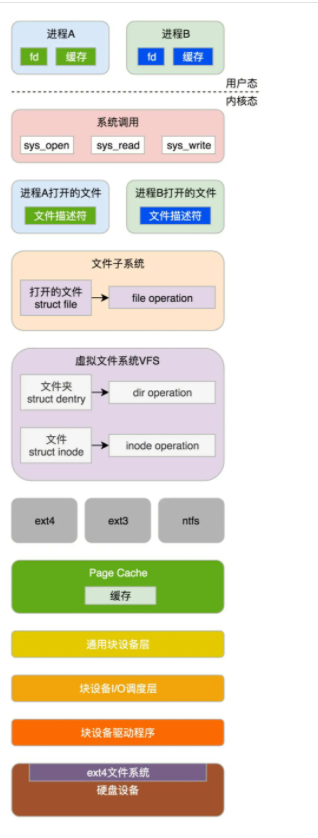

**挂载文件系统**

```c++
register_filesystem(&ext4_fs_type);

static struct file_system_type ext4_fs_type = {
    .owner = THIS_MODULE,
    .name = "ext4",
    .mount = ext4_mount,
    .kill_sb = kill_block_super,
    .fs_flags = FS_REQUIRES_DEV
}
```

mount系统调用链：do_mount->do_new_mount->vfs_kern_mount

```c++
struct mount {
    struct hlist_node mnt_hash;
    struct mount *mnt_parent;//装在点所在的父文件系统
    struct dentry *mnt_mountpoint;//装载点在父文件系统中dentry
    struct vfsmount mnt;
    union {
        struct rcu_head mnt_rcu;
        struct llist_node mnt_list;
    };
    struct list_head mnt_mounts;
    struct list_head mnt_child;
    struct list_head mnt_instance;
    const char *mnt_devname;
    struct list_head mnt_list;
} __randomize_layout
    
struct vfsmount {
    struct dentry *mnt_root;//当前文件系统根目录的dentry
    struct super_block *mnt_sb;//指向超级块的指针
    int mnt_flags;
} __randomize_layout

struct dentry * mount_fs(struct file_system_type *type,int flags,const char *name,void *data) {
    struct dentry *root;
    struct super_block *sb;
    
    root = type->mount(typee,flags,name,data);
    sb = root->d_sb;
}
```

在文件系统的实现中，每个在硬盘上的结构，在内存中也对应相同格式的结构。当所有的数据结构都读到内存里，内核就可以通过操作这些数据结构，来操作文件系统了。

**虚拟文件系统**

作为内核子系统，为**用户空间程序**提供了**文件和文件系统**相关的接口。系统中所有文件系统不但依赖VFS共存，而且也依靠VFS系统协同工作。通过虚拟文件系统，程序可以利用标准的Unix系统调用对不同的文件系统，甚至不同介质上的文件系统进行读写操作。

系统调用可以在这些不同的文件和介质之间执行。**老式的操作系统**（如DOS），是无力完成上述工作的，任何对非本地文件系统的访问都必须依靠特殊工具才能完成。正是由于现代操作系统引入抽象层，比如Linux通过虚拟接口访问文件系统，才使得这种协作性和泛型存取成为可能。

新的文件系统和新类型的存储介质都能找到进入linux之路。

VFS提供了一个通用文件系统模型，该模型囊括了**任何文件系统的常用功能集和行为**，该模型偏重于Unix风格的文件系。它定义了**所有文件系统**都支持的、**基本的、概念上的接口和数据结构**。同时，实际文件系统也将自身的诸如“如何打开文件”等概念在**形式上**与**VFS的定义**保持一致。因为实际文件系统的代码在统一的接口和数据结构下隐藏了具体的实现细节。

**Unix文件系统**

Unix使用了四种和文件系统相关的传统抽象概念：文件、目录项、索引节点和安装点。

从本质上讲，文件系统是**特殊的数据分层存储结构**，它包含文件、目录和相关的控制信息。**面向记录的文件系统**TODO:?????面向记录的文件系统提供更丰富、更结构化的表示，而简单的面向字节流抽象的Unix文件则以简单性和相当的灵活性为代价。

Unix系统将文件的相关信息和文件本身这两个概念加以区分，例如访问控制权限、大小、拥有者、创建时间等信息，这些数据被存储在一个单独的数据结构中，被称为索引节点inode

所有这些信息都和文件系统的控制信息密切相关。文本系统的控制信息存储在超级块中，超级块是一种包含文件系统信息的数据结构。

VFS其实采用面向对象的设计思路。使用一组数据结构来代表通用文件对象。这些对象包含数据的同时也包含操作这些数据的函数指针，其中的操作函数由具体文件系统实现。

* 超级块对象，代表一个具体的已安装文件系统；
* 索引节点对象，代表一个具体的文件；
* 目录项对象，代表一个目录项，是路径的一个组成部分；
* 文件对象，代表由进程打开的文件

VFS使用了大量结构体对象，除了上述主要对象，每个注册的文件系统都由file_system_type结构体来表示，描述了文件系统及其性能；每一个安装点也都用vfsmount结构体表示，包含安装点的相关信息，如安装位置和安装标志。

每种文件系统都必须实现超级块对象，该对象用于存储特定文件系统的信息。通常对应于存放在磁盘特定扇区中的文件系统超级块。对于并非基于磁盘的文件系统（如基于内存的文件系统，如sysfs），它们会在使用现场创建超级块对象并将其保存到内存中。

由super_block结构体表示，定义在<linux/fs.h>。创建、管理和撤销超级块对象的代码位于fs/super.c中。超级块对象通过alloc_super函数创建并初始化。**文件系统安装时**，文件系统会调用该函数以便从磁盘读取文件系统超级块，并且将其信息填充到内存的超级块中。

超级块对象中最重要的一个域就是s_op,指向超级块的操作函数表，由super_operations结构体表示，定义<linux/fs.h>中。超级快操作表中，文件系统可以将不需要的函数指针设置成NULL，如果VFS发现操作函数为null，要么会调用通用函数指向相应操作，要么什么也不做。

**索引节点对象包含了内核在操作文件或目录时需要的全部信息。对于Unix风格的文件系统，这些信息可以从磁盘索引节点直接读入。如果一个文件系统没有索引节点，那么不管这些相关信息在磁盘上如何存放，文件系统都必须从中提取这些信息。没有索引节点的文件系统通常将文件的描述信息作为文件系统的一部分存放。**这些文件系统没有将数据和控制信息分来存放。有些现代文件系统使用数据库来存储文件的数据（TODO:????）

一个索引节点代表文件系统中（索引节点仅当文件被访问时，才在内存中创建？？？TODO:）的一个文件，可以是设备或管道这样的特殊文件。因此索引节点结构体中有一些和特殊文件相关的项。比如i_pipe指向一个代表有名管道的数据结构，i_bdev指向块设备结构体，i_cdev指向字符设备结构体。

有时，某些文件系统可能并不能完整的包含索引节点结构体要求的所有信息。例如，有些文件可能并不记录文件的访问时间，这时，文件系统就可以在实现中选择任何合适的办法解决，例如 让i_atime=0

**目录项对象**。VFS把目录当成文件对待，在路径/bin/vi中，bin和vi都属于文件，路径中每个组成部分都由一个索引节点表示。虽然他们可以统一由索引节点表示，但是VFS经常需要执行目录相关的操作，比如路径名查找等。为了方便查找操作，引入目录项的概念dentry。

在路径中（包含普通文件），每一部分都是目录项对象，目录项也可以包含安装点。目录项对象没有对应的磁盘数据结构，VFS根据字符串形式的路径名现场创建。

目录项状态：被使用、未被使用和负状态

* 一个被使用的目录项对应一个有效的索引节点（即d_inode指向对应的索引节点）并且表明该对象存在一个或多个使用者（即d_count为正值）
* 一个未被使用的dentry对应一个有效的索引节点，但是VFS当前并未使用它。该对象被保留在缓存中以便需要时再使用它。
* 一个负状态的dentry没有对应的有效索引节点

**目录项缓存**

* “被使用的”目录项链表。该链表通过索引节点对象中的i_dentry项连接相关的索引节点。因为一个给定的索引节点可能有多个链接，所以就可能有多个目录项对象

* “最近被使用的”双向链表。该链表含有未被使用的和负状态的目录项对象。

* 散列表和相应的散列函数用来快速的将给定路径解析为相关目录项对象。

  散列表由数组dentry_hashtable表示，其中每一个元素都是一个指向具有相同键值的目录项对象链表的指针。实际的散列值由d_hash()函数计算，它是内核提供给文件系统的唯一的一个散列函数。查找散列表要通过d_lookup()函数。

而dcache在一定意义上也提供对索引节点的缓存，也就是icache。和目录对象相关的索引节点不会被释放，因为目录项会让相关索引节点的使用计数为正，这样就可以确保索引节点留在内存中。只要目录项被缓存，相应的索引节点也就被缓存了。

文件访问呈现空间和时间的局部性。

**文件对象**

文件对象没有对应的磁盘数据，文件对象通过f_dentry指针指向相关的目录项对象，目录项会指向相关的索引节点，索引节点会记录文件是否是脏的。因为多个进程可以同时打开和操作同一个文件，所以同一个文件也可能存在多个对应的文件对象。文件对象仅仅在进程观点上代表已打开文件，反过来指向目录项对象（反过来指向索引节点对象），其实只有目录项对象才表示已打开的实际文件。

**其他文件系统相关数据结构**

file_system_type 描述一个文件系统的功能和行为。每种文件系统不管有多少个实例安装到系统中，还是根本没有安装到系统中，都只有一个file_system_type结构。当文件系统被实际安装时，将有一个vfsmount结构体在安装点被创建。

```c++
struct vfsmount {
    struct list_head mnt_hash;//散列表
    struct vfsmount *mnt_parent;//父文件系统
    struct dentry *mnt_mountpoint;//安装点的目录项
    struct dentry *mnt_root;//该文件系统的根目录项
    struct super_block *mnt_sb;//该文件系统的超级块
    struct list_head mnt_mounts;
    struct list_head mnt_child;
    int mnt_flags;
    char *mnt_devname;
    struct list_head mnt_list;
    ......
}
```

理清文件系统和所有其他安装点间的关系，是维护所有安装点链表中最复杂的工作。所以vfsmount结构体中维护的各种链表就是为了能够跟踪这些关联信息。

**和进程相关的数据结构**

file_struct定义在<linux/fdtable.h>，由进程描述符中files指向，所有与单个进程相关的信息（如打开的文件及文件描述符）都包含在其中。

fs_struct定义在<linux/fs_struct.h>，由进程描述符中fs指向，包含文件系统和进程相关的信息，该结构包含了当前进程的当前工作目录和根目录。

namespace定义在<linux/mmt_namespace.h>，由进程描述符中mmt_namespace指向

系统能够随机访问固定大小数据片（chunks）的硬件设备称作块设备，最常见的是硬盘，除此之外，还有软盘驱动器、蓝光光驱和闪存等许多其他块设备，它们都是以安装文件系统的方式使用的---这也是块设备一般的访问方式。

另一种基本的设备类型是字符设备。字符设备按照字符流的方式被有序访问，像串口和键盘就属于字符设备。对于这两种设备。区别在于是否可以随机访问数据。

块设备中最小的可寻址单元是扇区，一般为2的整数倍，最常见的是512字节。扇区是所有块设备的基本单元---块设备无法对比它还小的单元进行寻址和操作。

```c++
SYSCALL_DEFINE3(open,const char __user,filename,int flags,umode_t,mode) {
    return do_sys_open(AT_FDCWD,filename,flags,mode);
}
long do_sys_open(int dfd,const char __user *filename,int flags,umode_t mdoe) {
    ....
    //task_struct->files->fd_array，默认情况下，0代表标准输入，1代表标准输出，2代表标准错误输出。
    //每一项都是指向struct file的指针
    fd = get_unsed_fd_flags(flags);
    if(fd >= 0){
        //首先初始化了struct nameidata这个结构，nameidata->path
        struct file *f = do_filp_open(dfd,tmp,&op);
        if(IS_ERR(f)){
            put_unused_fd(fd);
            fd = PTR_ERR(f);
        }else{
            fsnotity_open(f);
            fd_install(fd,f);
        }
    }
    putname(tmp);
    return fd;
}

struct file *do_filp_open(int dfd,struct filename *pathname,const struct open_flags *op) {
    ......
    set_nameidata(&nd,dfd,pathname);
    filp = path_openat(&nd,op,flags | LOOKUP_RCU);
    ......
    restore_nameidata();
    return filp;
}

static struct file *path_openat(struct nameidata *nd,const struct open_flags *op,unsigned flags) {
	//生成一个file结构
    file = get_empty_filp();
	//初始化nameidata
    s = path_init();
    //link_path_walk对路径名进行查找
    //do_last获取文件对应的inode对象，并且初始化file对象
    while(!(error = link_path_walk(s,nd))&&
         (error = do_last(nd,file,op,&opened)) > 0) {
        
    }
    terminate_walk(nd);
    return file;
}

static int do_last(struct nameidata *nd,struct file *file，const struct open_flags *op,int *opened) {
	//到dcache中找
    error =	lookup_fast(nd,&path,&inode,&seq);
    ........
        //如果缓存中没有，会创建一个新的dentry，并调用上级目录的inode->inode_operations->lookup
	    error = lookup_open(nd,&path,file,op,got_write,opened);
    ........
    //真正打开文件,最重要的一件事就是调用f_op->open,将文件信息填写到struct file这个结构
    error = vfs_open(&nd->path,file,current_cred());
}
```

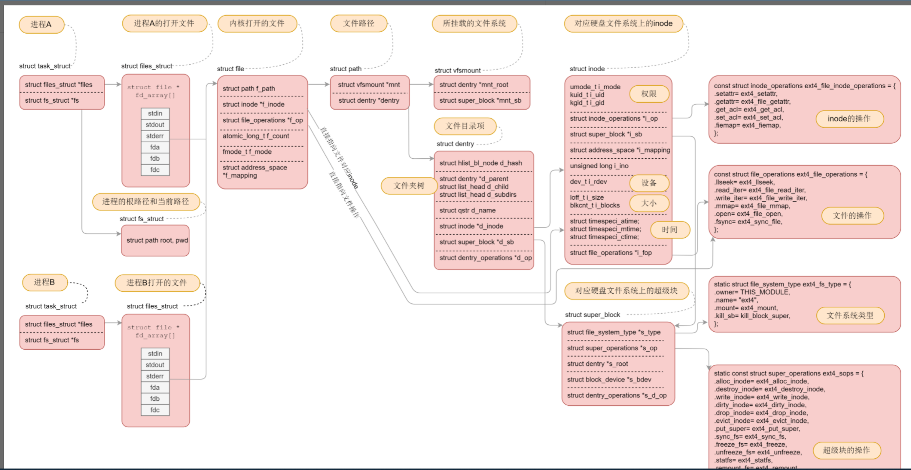

read系统调用

```c++
SYSCALL_DEFINE3(read,unsigned int,fd,char __user *,buf,size_t,count) {
    struct fd f = fdget_pos(fd);
    ....
    loff_t pos = file_pos_read(f.file);
    ....
    ret = vfs_read(f.file,buf,count,&pos);
}

ssize_t __vfs_read(struct file *file,char __user *buf,size_t count,loff_t *pos) {
    if (file->f_op->read)
      return file_op->read(file,buf,count,pos);
    else if (file->f_op->read_iter)
        return new_sync_read(file,buf,count,pos);
    else 
        return -EINVAL;
}
```

**ext4文件系统层**

```c++
const struct file_operations ext4_file_operations = {
......
    .read_iter = ext4_file_read_iter,
    .write_iter = ext4_file_write_iter
......
}
```

ext4_file_read_iter会调用generic_file_read_iter,ext4_file_write_iter会调用__generic_file_write_iter

```c++
ssize_t generic_file_read_iter(struct kiocb *iocb,struct iov_iter *iter) {
    if(iocb->ki-flags & IOCB_DIRECT) {
        struct address_space *mapping = file->f_mapping;
        //direct
        retval = mapping->a_pos->direct_IO(iocb,iter);
    }
    retval = generic_file_buffered_read(iocb,iter,retval);
}

ssize_t __generic_file_write_iter(struct kiocb *iocb,struct iov_iter * from) {
    if(iocb->ki_flags & IOCB_DIRECT) {
        written = generic_file_direct_write(iocb,from);
    }else{
        written = generic_perform_write(file,from,iocb->ki_pos);
    }
}
```

根据是否使用内存作为缓存，可以把文件I/O操作分为两种类型：

* 缓存I/O，大多数文件系统默认I/O操作都是缓存I/O。对于读，操作系统会先检查，内核的缓冲区有没有必要的数据，如果已经缓存了，直接从缓存返回，否则从磁盘读取，然后缓存；对于写，操作系统会先将数据从用户空间复制到内核空间的缓存中。
* 直接I/O，直接访问磁盘数据

**带缓存的写入操作**

```c++
ssize_t generic_perform_write(struct file *file,struct iov_iter *i,loff_t pos) {
    struct address_space *mapping = file->f_mapping;
    const struct address_space_operations *a_pos = mapping->a_pos;
    do{
        struct page *page;
        unsigned long offset;
        unsigned long bytes;
        status=a_ops->write_begin(file,mapping,pos,bytes,flags,&page,&fsdata);
		//将写入的内容从用户态拷贝到内核态的页中
        copied=iov_iter_copy_from_user_atomic(page,i,offset,bytes);
        flush_dcache_page(page);
        status=a_ops->write_end(file,mapping,pos,bytes,copied,page,fsdata);
        pos+=copied;
        written+=copied;
        //看脏页是否太多，是否需要写回到磁盘
        balance_dirty_pages_ratelimited(mapping);
    }while(iov_iter_count(i))
}
```

内核中，缓存以页为单位放到内存。file有个struct address_space用于关联文件和内存，就是在这个结构里，有一棵树，用于保存所有与这个文件相关的缓存页。 

* 块设备，将信息存储在固定大小的块中，
* 字符设备，发送接受的都是字节流，不用考虑任何块结构，没有办法寻址

由于块设备传输的数据量比较大，控制器往往有缓冲区，cpu与**设备控制器**的寄存器和数据缓冲区进行通信的方式：

* 每个控制寄存器被分配一个I/O端口，可以通过特殊的汇编指令（例如in/out，类似的指令）操作这些寄存器
* 数据缓冲区，可内存映射I/O，可以分配一段内存给它，就像读写内存一样读写数据缓冲区。ioremap

控制器的寄存器一般都会有状态标志位，可以通过检测状态标志位，来确定输入或者输出操作是否完成。第一种方式为轮询等待，第二种方式为中断。为了响应中断，一般会有一个**硬件的中断控制器**，当设备完成任务后触发中断到**中断控制器**，中断控制器就通知CPU。可分为**软中断**和**硬中断**。

有的设备需要读取或者写入大量数据，这种类型的设备就需要支持DMA功能。CPU只需要对DMA控制器下指令，说想要读取多少数据，放在内存的某个地方就可以了，接下来DMA控制器就会发指令给磁盘控制器，读取磁盘的数据到指定的内存位置，传输完成，DMA控制器发中断通知CPU指令完成，CPU就可以直接用内存里现成的数据。DMA区域

**设备控制器**不属于操作系统的一部分。但是设备驱动程序属于操作系统的一部分。操作系统的内核代码可以像调用本地代码一样调用设备驱动程序的代码，**而驱动程序的代码需要发出特殊的面向设备控制器的指令，才能操作设备控制器**。

一般的流程：设备驱动程序初始化的时候，要先注册一个该设备的中断处理函数。中断的时候，触发的函数是do_IRQ,这个函数是中断处理的统一入口。

对于块设备，在驱动程序之上，文件系统之下，还需要一层**通用设备层**，里面的逻辑和硬盘设备没有什么关系，是通用的逻辑。

**用文件系统接口屏蔽驱动程序的差异**

所有设备在/dev/下创建一个特殊的设备文件，这个特殊设备文件也有inode，它不关联到硬盘或其他任何存储介质上的数据，而是建立了与某个设备驱动程序的连接。

假设/dev/sdb,这是一个设备文件，这个文件本身和硬盘上的文件系统没有任何关系，本身也不对应硬盘的上的任何一个文件，/dev/sdb其实是在一个特殊的文件系统devtmpfs中

主设备号定位设备驱动程序，次设备号作为参数传递给启动程序，选择相应的单元

Linux的驱动程序已经被写成和操作系统有标准接口的代码，可以看成一个标准的内核模块。在linux里，安装驱动程序，其实就是加载一个内核模块。

lsmod   insmod  mknod可以手动加载驱动

sysfs和udev服务，当一个设备新插入系统时，内核会检测到这个设备，并会创建一个内核对象kobject。这个对象通过sysfs文件系统展现到用户层，同时内核还向用户空间发送一个热插拔消息。udevd会监听这些信息，在/dev中创建对应的文件。

**构建一个内核模块**：

第一，头文件部分，一般都有<linux/module.h>和<linux/init.h>

第二，定义一些函数，处理内核模块的主要逻辑，例如打开、关闭、中断

第三，定义一个file_operations结构，设备想被文件系统的接口操作就需要定义

第四，定义整个模块的初始化和退出函数

第五，调用module_init和module_exit

第六，声明license，调用MODULE_LICENSE

lp.c的初始化函数:

```c++
static int __init lp_init(void) {
    if(register_chrdev(LP_MAJOR,"lp",&lp_fpos)) {
        printk(KERN_ERR "lp:unable to get major %d\n",LP_MAJOR);
        return -EIO;
    }
}

int __register_chrdev(unsigned int major,unsigned int baseminor,
                      unsigned int count,const char *name,const struct file_operations *fops)
{
    struct char_device_struct *cd;
    struct cdev *cdev;
    int err = -ENOMEM;
    cd = __register_chrdev_region(major,baseminor,count,name);
    cdev = cdev_alloc();
    cdev->owner = fops->owner;
    cdev->ops = fops;
    kobject_set_name(&cdev->kobj,"%s",name);
    //将这个字符设备添加到内核中一个kobj_map的结构，来统一管理所有字符设备
    err = cdev_add(cdev,MKDEV(cd->major,baseminor),count);
    cd->cdev = cdev;
    return major? 0 : cd->major;
}
int cdev_add(struct cdev *p,dev_t dev,unsigned count){
    int error;
    p->dev = dev;
    p->count = count;
    error = kobj_map(cdev_map,dev,count,NULL,exact_match,exact_lock,p);
    kobject_get(p->kobj.parent);
    return 0;
}
```

**mknod系统调用**

```c++
SYSCALL_DEFINE3(mknod,const char __user *,filename,umode_t,mode,unsigned,dev){
    return sys_mknodat(AT_FDCWD,filename,mode,dev);
}
SYSCALL_DEFINE4(mknodat,int,dfd,const char __user *,filename,umode_t,mode,unsigned,dev){
    struct dentry *dentry;
    struct path path;
    dentry = user_path_create(dfd,filename,&path,lookup_flags);
    switch(mode & S_IFMT){
        case S_IFCHR:case S_IFBLK:
            error = vfs_mknod(path.dentry->d_inode,dentry,mode,new_decode_dev(dev));
            break;
    }
}
```

vfs_mknod会调用相应文件系统的inode_operations

```c++
/dev-devtmpfs
static struct dentry *dev_mount(struct file_system_type *fy_type,int flags,const char *dev_name,void *data)
{
#ifdef CONFIG_TMPFS
	return mount_single(fs_type,flags,data,shmem_fill_super);
#else
	return mount_single(fs_type,flags,data,ramfs_fill_super);
#endif
}

static struct file_system_type dev_fs_type = {
    .name = "devtmpfs",
    .mount = dev_mount,
    .kill_sb = kill_litter_super,
}

static const struct inode_operations ramfs_dir_inode_operations = {
    .mknod = ramfs_mknod,
}

static const struct inode_operations shmem_dir_inode_operations = {
    #ifdef CONFIG_TMPFS
    .mknod = shemem_mknod,
}
这两个实现都会调用init_specail_inode
void init_special_inode(struct inode *inode,umode_t mode,dev_t rdev){
    inode->i_mode = mode;
    if(S_ISCHR(mode)){
        inode->i_fop = &def_chr_fops;
        inode->i_rdev = rdev;
    }else if(S_ISBLK(mode)){
        inode->i_fop = &def_blk_fops;
        inodec->i_redv = rdev;
    }else if(S_ISFIFO(mode)){
        inode->i_fop = &pipefifo_fops;
    }else if(S_ISSOCK(mode));
}

static int chrddev_open(struct inode *inode,struct file *filp){
    const struct file_operations *fpos;
    struct cdev *p;
    struct cdev *new = NULL;
    int ret = 0;
    p = inode->i_cdev;
    if(!p){
        struct kobject *kobj;
        int idx;
        kobj = kobj_lookup(cdev_map,inode->i_rdev,&idx);
        new = container_of(kobj,struct cdev,kobj);
        p = inode->i_cdev;
        if(!p){
            inode->i_cdev = p = new;
            list_add(&inode->i_devices,&p->list);
            new = NULL;
        }
    }
    fops = fops_get(p->ops);
    replace_fops(filp,fops);
    if(filp->f_op->open){
        ret = filp->f_op->open(inode,filp);
    }
}
```

**使用IOCTL控制设备**

ioctl是一个系统调用，可以通过这个调用做一些特殊的I/O操作

```c++

SYSCALL_DEFINE3(ioctl, unsigned int, fd, unsigned int, cmd, unsigned long, arg)
{
  int error;
  struct fd f = fdget(fd);
......
  error = do_vfs_ioctl(f.file, fd, cmd, arg);
  fdput(f);
  return error;
}


int do_vfs_ioctl(struct file *filp, unsigned int fd, unsigned int cmd,
       unsigned long arg)
{
  int error = 0;
  int __user *argp = (int __user *)arg;
  struct inode *inode = file_inode(filp);


  switch (cmd) {
......
  case FIONBIO:
    error = ioctl_fionbio(filp, argp);
    break;


  case FIOASYNC:
    error = ioctl_fioasync(fd, filp, argp);
    break;
......
  case FICLONE:
    return ioctl_file_clone(filp, arg, 0, 0, 0);


  default:
    if (S_ISREG(inode->i_mode))
      error = file_ioctl(filp, cmd, arg);
    else
      //最终会调用file_operations的unlocked_ioctl
      error = vfs_ioctl(filp, cmd, arg);
    break;
  }
  return error;
```

注册中断和处理中断：

```c++
static int logibm_open(struct input_dev) {
	//注册中断
    if(request_irq(logbim_interrupt,0,"logibm",NULL)) {
        return -EBUSY;
    }
}

static irqreturn_t logibm_interrupt(int irq,void *dev_id) {
    //进行一些处理
    return IRQ_HANDLED;
}

static request _irq(....) {
    return request_threaded_irq(...);
}

int request_threaded_irq(unsigned int irq,irq_handler_t handler,irq_handler_t thread_fn,unsigned long irqflags,const char *devname,void *dev_id) {
    struct irqaction *action;
    struct irq_desc *desc;
    int retval;
    //根据中断号查找中断描述结构
    desc = irq_to_desc(irq);
    action = kzalloc(sizeof(struct irqaction),GFP_KERNEL);
    action->handler=handler;
    action->thread_fn;
    action->flags=irqflags;
    action->name=devname;
    action->dev_id=dev_id;
    retval=__setup_irq(irq,desc,action);
}

struct irq_desc {
    struct irqaction *action;/**irq action list*/
    struct module *owner;
    const char *name;
}

struct irqaction {
    irq_handler_t handler;
    void *dev_id;
    void __percpu *percpu_dev_id;
    struct irqaction *next;
    //如果中断函数在单独的线程执行，thread_fn,thread
    irq_handler_t thread_fn;
    struct task_struct *thread;
    struct irqaction *seconfary;
    unsigned int irq;
    unsigned int flags;
    unsigned long thread_flags;
    unsigned long thread_mask;
    const char *name;
    struct proc_dir_entry *dir;
}

#idef CONFIG_SPARSE_IRQ
static RADIX_TREE(irq_desc_tree,GFP_KERNEL);
struct irq_desc *irq_to_desc(unsigned int irq){
    return radix_tree_lookup(&irq_desc_tree,irq);
}
#else
struct irq_desc irq_desc[NR_IRQS] __cacheline_aligned_in_smp = {
    [0...NR_IRQS-1]={}
}
struct irqdesc *irq_to_desc(unsigned int irq){
    return (irq < NR_IRQS) ? irq_desc + irq : NULL;
}
#endif

static int _setup_irq(unsigned int irq,struct irq_desc *desc,struct irqaction *new) {
    struct irqaction *old,**old_ptr;
    unsigned long flags,thread_mask = 0;
    int ret,nested,shared = 0;
    new->irq=irq;
   	//create a handler when a thread function is supplied and the interrupt does not nest into another interrupt thread
    if(new->threads_fn && !nested) {
        ret = setup_irq_thread(new,irq,false);
    }
    old_ptr = &desc->action;
   	old = *old_ptr;
    if(old){
        do{
            thread_mask |=old->thread_mask;
            old_ptr = &old->next;
            old = *old_ptr;
        }while(old)
    }
    *old_ptr=new;
    if(new->thread){
        wake_up_process(new->thread);
    }
}

static int setup_irq_thread(struct irqaction *new,unsigned int irq,bool secondary) {
    struct task_struct *t;
    struct sched_param param = {
        .sched_priority = MAX_USER_RT_PRIO/2;
    }
    t = kthread_create(irq_thread,new,"irq/%d-%s",irq,new->name);
    sched_setscheduler_nocheck(t,SCHED_FIFO,&param);
    get_task_struct(t);
    new->thread=t;
    return 0;
}
```

中断发生的流程：

* 外部设备给中断控制器发送**物理中断信号**
* 中断控制器将**物理中断信号**转换为中断向量**interrupt vector**，发给CPU
* CPU都会有个中断向量表，根据**interrupt vector**调用**IRQ**函数
* **IRQ**函数中，将**interrupt vector**转化为**抽象中断层的中断信号irq**

数据结构**interrupt vector**的解析

```css
Linux IRQ vector layout.

There are 256 IDT entires(per CPU - each entry is 8 bytes)which can be defined by Linux.They are used as a jump table by the CPU
when a gived vector is triggered - by a CPU-external,CPU-internal or software-triggered event.

Linux sets the kernel code address each entry jumps to early during bootup,and never changes them.This is the general layout of the IDT entries:
Vectors 0...  31:system traps and exceptions - hardcoded events
Vectors 32...127:device interrupts
Vectors 128     :legacy int80 syscall interface
Vectors 129...  :INVALIDATE_TLB_VECTOR_START-1 except 204:device interrupts
Vectors INVALIDATE_TLB_VECTOR_START...255:special interrupts

64-bit x86 has per CPU IDT tables,32-bits has one shared IDT table.

arch/x86/kernel/traps.c中
gate_desc_idt_table[NR_VECTORS] __page_aligned_bss;

start_kernel->trap_init，其中有很多set_intr_gate,其最终都会调用到_set_gate,在其中设置中断处理函数并放到中断向量表中
设置好前32位中断后，会单独设置IA32_SYSCALL_VECTOR,也即128
最后会把idt_table放到一个固定的虚拟地址
start_kernel调用完trap_init后，还会调用init_IRQ->native_IRQ来初始化其他设备中断
void __init native_init_IRQ(void){
    int i;
    i=FIRST_EXTERNA_VECTOR;
    #ifndef CONFIG_X86_LOCAL_APIC
    #define first_system_vector NR_VECTORS
    #endif
    for_each_clear_bit(i,used_vectors,first_system_vector) {
        set_intr_gate(i,irq_entries_start + 8*(i-FIRST_EXTERNAL_VECTOR));
    }
}

irq_entires_start是个表，定义了FIRST_SYSTEM_VECTOR - FIRST_EXTERNAL_VEXTOR项。每一项都是中断处理函数，会跳到common_interrupt执行，调用完毕后，就从中断返回，调用完毕后，会从中断返回，这里会区分返回用户态还是内核态

//do_IRQ hadles all normal device IRQ's(the special SMP cross-CPU interrupts have their own specific hadlers)
__visible unsigned int __irq_entry do_IRQ(struct pt_regs *regs) {
    struct pt_regs *old_regs = set_irq_regs(regs);
    struct irq_desc *desc;
    unsigned vector = ~regs->orig_ax;
    desc = __this_cpu_read(vector_irq[vector])
    if(!handle_irq(desc,regs)){
        
    }
    set_irq_regs(old_regs);
    return 1;
}
vector_irq 这个Per CPU变量负责维护每个CPU对应中断控制器传递的物理中断号与全局统一的虚拟中断号的对应关系（在系统初始化调用_assign_irq_vector,将虚拟中断号分配到某个CPU上的中断向量）

do_IRQ->handle_irq->generic_handle_irq_desc,然后会调用irq_desc的handle_irq->__handle_irq_event_percpu
irqreturn_t __handle_irq_event_percpu(struct irq_desc *desc,unsigned int *flags) {
    irqreturn_t retval = IRQ_DONE;
    unsigned int irq = desc->irq_data.irq;
    struct irqaction *action;
    record_irq_time(desc);
    for_each_action_of_desc(desc,action) {
        irqreturn_t desc;
        res = action->handler(irq,action->dev_id);
        switch(res){
            case IRQ_WAKE_THREAD:
                __irq_wake_thread(desc,action);
            case IRQ_HANDLED:
                *flags|=action->flags;
            	break;
            default:
                break;
        }
        retval |= res;
    }
}
```

块设备在mknod命令会根据主/次设备号创建一个特殊inode，其中打开设备文件用的是blkdev_open,里面调用blkdev_get打开这个设备

将一个块设备mount成ext4文件系统：

```c++
ext_mount->mount_bdev {
    //找到设备并打开它
    block_device bdev=blkdev_get_by_path();
	//根据打开的设备文件，填充ext4文件系统
    s=sget(bdev);   
}
blkdev_get_by_path{
    block_device bdev = lookup_dev();
    blkdev_get(bdev);
}

blkdev_get_by_path->lookup_dev{
    kern_path(pathname,LOOKUP_FOLLOW,&path);
    bdev=bd_acquire(inode);
}
//bd根据传进来的dev_t在blockdev_superblock中找到bdev中的inode（根据devtmpfs中inode找到bdev中inode）
bd_acquire->bdget(inode->i_rdev);
//bdev系统中的inode和block_device进行关联
struct bdev_inode {
    struct block_device bdev,
    struct inode vfs_inode;
}
```

block_device结构：

```c++
struct block_device {
    dev_t bd_dev;
    int bd_openers;
    struct super_block * bd_super;
	//整块设备的block_device
    struct block_device * bd_contains;
    unsigned bd_block_size;
    struct hd_struct * bd_part;
    unsigned bd_part_count;
    int bd_invalidated;
    //整块块设备
    struct gendisk *bd_disk;
    struct request_queue * bd_queue;
    struct backing_dev_info *bd_bdi;
    struct list_head bd_list;
}
struct gendisk {
    //主设备号
    int major;
    //第一个分区的的从设备号
    int first_minor;
    //分区数
    int minors;
    //磁盘块设备名称
    char disk_name[DISK_NAME_LEN];
    char *(*devnode)(struct gendisk *gd,umode_t *mode);
	//hd_struct数组
    struct disk_part_tbl __rcu *part_tbl;
    struct hd_struct part0;
	//对于这个块设备的各种操作
    const struct block_device_operations *fpos;
	//这个块设备上的请求队列
    struct request_queue *queue;
    void *private_data;
    int flags;
    struct kobject *slave_dir;
}
struct hd_struct {
	sector_t start_sect;
    sector_t nr_sects;
    struct device __dev;
    struct kobject *holder_dir;
    int policy,partno;
    struct partition_meta_info *info;
    struct disk_stats;
    struct percpu_ref ref;
    struct rcu_head rcu_head;
}

block_device 既可以表示整个块设备，也可以表示某个分区
```


**虚拟化**

为了区分内核态和用户态，CPU专门设置了4个特权等级，0（内核态），1，2，3（用户态）

三种虚拟化方式：

* **完全虚拟化**，虚拟化软件模拟假的的CPU、内存、网络、硬盘
* **硬件辅助虚拟化**，Intel的VT -x和AMD-V从硬件层面提供**新的标志位**，对于虚拟机内核，只要将标志位设置为虚拟机状态，就可以直接在CPU上执行大部分指令，而不需要**虚拟化软件转述**
* **半虚拟化**,Guest OS加载特殊的驱动，IO操作时在驱动里可以采用排队、缓存的方式加速效率

服务器上的虚拟化软件，多使用qemu，单纯使用qemu，采用的是**完全虚拟化的模式**

Qemu将KVM整合，将有关CPU的指令叫给内核模块来做，就是qemu-kvm，（硬件辅助虚拟化）

Qemu采用半虚拟化的方式，让Guest OS加载特殊的驱动，如网络需要加载virtio_net，存储需要加载virtio_blk,数据会直接发送给这些特殊驱动，经过特殊处理（例如排队、缓存、批量处理等性能优化方式），最终发送给真正的硬件。


# 操作系统实战45讲

**宏内核结构**:将诸如进程管理 内存管理 IO设备管理 文件系统管理等这些模块的代码经过编译,最后链接到一起.

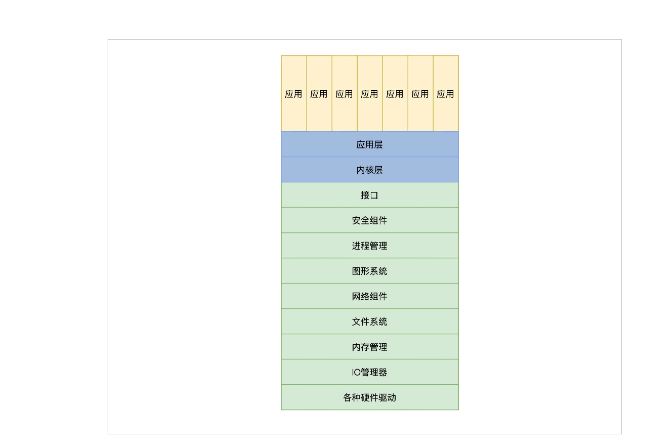

**微内核结构**:

提倡内核功能**尽可能少**,仅仅只有**进程调度 处理中断 内存空间映射 进程间通信**

把实际的进程管理 内存管理 设备管理 文件管理等服务功能,做成一个个**服务进程**

微内核定义了一种良好的进程间通信机制--**消息**.应用程序要请求相关服务,就**向微内核发送**一条与此服务对应的消息,微内核在把这条消息转发给相关的服务进程

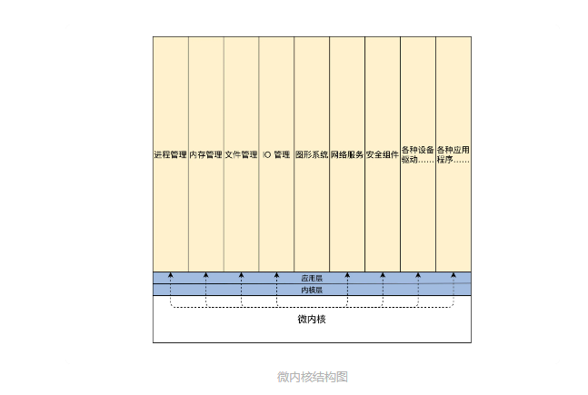

系统结构清晰利于协作开发,具有良好的移植性,微内核代码量少,有相当好的伸缩性 扩展性

代表有:**MACH MINIX L4**系统,它们都不是商业级的系统,商业级的系统不采用微内核主要还是因为**性能差**

**分离硬件的相关性**:把**操作硬件和处理硬件功能差异**的代码抽离出来,形成一个独立的**软件抽象层**

比如**进程管理**:

* 进程调度,从众多进程选择一个,有各种算法,这个算法在不同平台一般是不会变的
* 进程切换,保存当前进程上下文,装载新进程的上下文,不同硬件平台一般是不同的

因此,最好将进程切换的代码放到一个独立的层实现,比如硬件平台相关层.

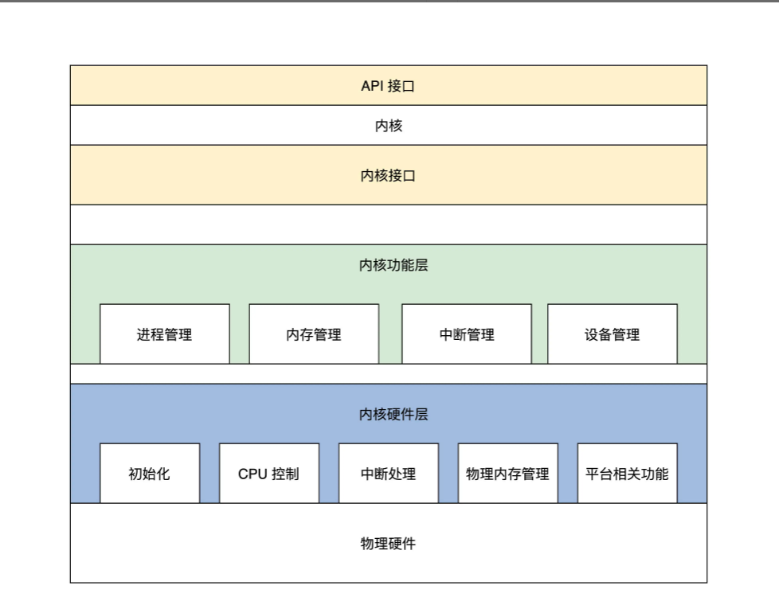

**linux内核架构**:各个组件之间的通信主要是函数调用,函数调用之间也没有一定的层次关系,模块之间没有隔离,但是性能极高

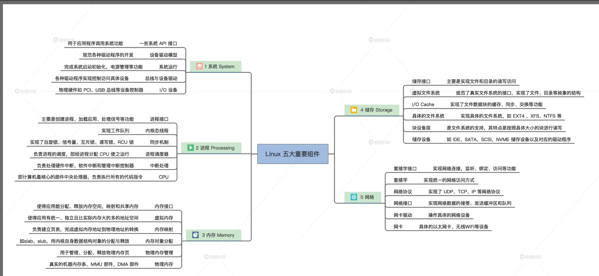

**Darwin-XNU**内核:macOs和IOS的核心,从技术角度,必须要支持PowerPC x86 ARM架构的处理器.Darwin使用了一种**微内核(Mach)**和相应的固件来支持不同的处理器平台,并提供了操作系统原始的基础服务.

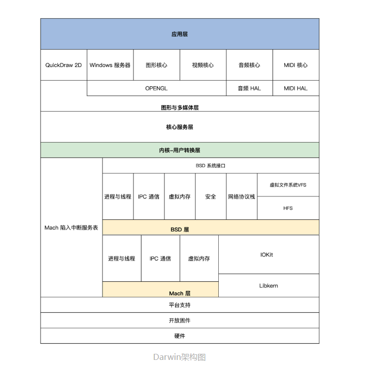

有两个内核层,最开始使用MACH,单纯的MACH出现了性能瓶颈,但是为了兼容之前为MACH开发的应用和设备驱动,就保留了mach内核,同时加入了BSD内核.

**mach内核仍然提供了十分简单的进程 线程 IPC通信 虚拟内存设备驱动相关的功能服务;BSD则提供强大的安全特性,完善的网络服务,各种文件系统的支持,同时对mach的进程 线程 ipc 虚拟内核组件进行细化 扩展延伸**

https://github.com/apple/darwin-xnu

调用Darwin系统API,传入一个API号码,用这个号码去索引Mach陷入中断服务表中的函数,如果号码小于0,则表示请求Mach内核服务,如果大于0,则表明请i求BSD内核服务

**Windows NT内核**

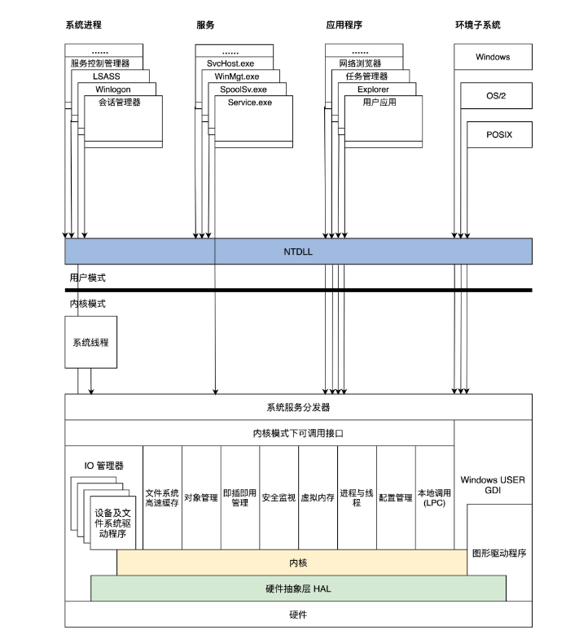


**cpu的工作模式**


# 庖丁解牛linux内核分析

# 一个64位操作系统的设计与实现

## 组成结构

### 引导启动

从BIOS上电自检后到内核执行前用于执行一段或几段程序。用于检测计算机硬件、配置内核参数。曾经分为Boot、Loader两部分，现在通常把两种功能合一，统称为BootLoader。**Grub**、**Uboot**。

### 设备驱动

操作系统一般都为驱动程序提供一套或几套成熟的驱动框架

### 文件系统

用于将硬盘的部分或全部扇区组织成一个便于管理的结构化单元（此处的扇区也可以是一个内存块）。

## 前置知识

### 硬件方面

处理器和外围设备构成及通信。对于ARM,一般是复杂的片上系统

### 软件方面

#### C语言、汇编

##### GCC编译器

常被认为是跨平台编译器的标准，最开始是1985年开始，扩展一个旧的编译器(pastel语言编写，只能编译pastel)，使其能编译c。后来1987年以C语言重写称为GNU专案的编译器。

##### NASM

为可移植化与模块化设计的一个80x86汇编器

编译环境选择**CentOS 6**，开发初期使用**bochs**调试

**Intel**格式汇编书写简洁，支持的编译器有**MASM、NASM、YASM**。

**AT&T**格式相对复杂，支持的编译器有**GNU**的**GAS**编译器。

|            | Intel格式              | AT&T格式         |
| ---------- | ---------------------- | ---------------- |
| 书写格式   |                        | 关键字必须小写   |
| 赋值方向   | 从右向左               | 从左向有         |
| 操作数前缀 | 操作数、寄存器无需前缀 | 需要使用各种前缀 |
| ......     |                        |                  |

#### 函数调用约定

描述了执行函数时返回地址和参数的出入栈规律。

* **stdcall**调用约定。
  * 参数从右向左入栈。
  * 参数出栈由**被调用函数**完成。通常**retn x**。
  * 编译器会在函数名前用**下划线**修饰，其后用符号**@**修饰，并加上入栈的字节数。
* **cdcel**调用约定。
  * 参数从右向左。
  * 参数出栈由**调用函数**完成，通常**leave、pop**。
* **fastcall**调用约定。
  * 要求函数尽可能使用通用寄存器**ecx、edx**传递参数，剩余参数在按照从右向左的顺序逐个压入栈中。
  * 出栈由**被调用函数**负责完成。
* 其他还有**thiscall、nakedcall、pascal**等调用约定。

**cdedl**是**CUN C**编译器默认调用约定。但**GNU C**在**64位**系统环境下，使用寄存器作为参数的传递方式，函数调用者按照从左向右依次将前6个整型参数放在**rdi、rsi、rdx、rcx、r8和r9**；寄存器**XMM0~XMM7**用来保存浮点变量，而**rax**寄存器则用于保存函数返回值，函数调用者平衡栈。

#### 参数传递方式

* **寄存器传递方式**。执行速度快，只有少数调用约定默认使用寄存器传递参数，绝大部分编译器需要**特殊指定传递参数的寄存器**。

  基于x86的linux内核，系统调用API一般使用寄存器传递

* **内存传递方式**。大多数以压栈的形式传递。x86体系结构的linux内核，中断和异常处理过程都会使用内存传递。

在x64体系结构下，大多数编译器选择寄存器传递参数。

#### GNU C内嵌汇编

```c++
#define nop() __asm__ __volatile__ ("nop   \n\t");
__asm__，声明这块代码是一个内嵌汇编表达式
__volatile__,通知编译器这行代码不能被优化
```

嵌入前要确定寄存器分配情况、与C程序的统合情况等细节，这内容大部分都要在**内嵌的汇编表达式中显式标明**。

**指令部分：输出部分：输入部分：损坏部分**

* **指令部分**：汇编代码，格式与**AT&T**格式基本部分，但也有部分不同。当指令表达式中存在多条汇编代码。可全部书写在一对双引号中，亦可放在多对双引号中。引用寄存器时，必须在寄存器名前再添加一个%符。
* **输出部分**："输出操作约束"(输出表达式)
* **输入部分**：
* **损坏部分**：描述了指令执行的过程中，将**被修改的寄存器、内存空间或标志寄存器**，并且这些修改部分**并未在**输出部分和输入部分出现过。

**GNU C语言对标准C语言的扩展**

**本文的实验代码从3.3开始，代码都有自己的注解，详细介绍在readme.md**

### BootLoader

Boot程序主要负责开机启动和加载Loader程序，Loader则用于完成配置硬件工作环境、引导加载内核等任务。

bximage使用

bochs配置文件查找规则：

[Search order for the configuration file (sourceforge.io)](https://bochs.sourceforge.io/doc/docbook/user/search-order.html)

[Bochs配置(ing) - 简书 (jianshu.com)](https://www.jianshu.com/p/31591c5191e4)

windows上使用bochs时遇到的问题：照抄bochs配置文件，由于linux配置问题，iodebug，display_library无法识别读懂（**可能是2.6和2.7版本之间的差别**）

[bochs: The Open Source IA-32 Emulation Project (Bochs News/History) (sourceforge.io)](https://bochs.sourceforge.io/news.html)

#### loader

##### 检测硬件信息

主要是通过BIOS中断服务程序来获取和检测硬件信息。

其中最重要的莫过于**物理地址空间信息**

##### 处理器模式切换

实模式->保护模式->长模式，loader必须手动创建各个运行模式的**临时数据**，并按照**标准流程**完成跳转。

##### 向内核传递数据

两类数据，一类是控制信息，一类是硬件数据信息。

* 控制信息，纯软件逻辑，和内核程序早已协定好的协议，如启动模式等。
* 硬件数据信息，检测出来的硬件数据信息多半会保存在固定的内存地址中，并将数据起始内存长度和数据长度作为参数传递给内核。

### FAT12文件系统

#### 引导扇区

不仅包含引导程序，还有FAT12文件系统的整个组成结构信息。

| 名称               | 偏移 | 长度 | 描述                                      | 内容                      |
| ------------------ | ---- | ---- | ----------------------------------------- | ------------------------- |
| BS_jmpBoot         | 0    | 3    | 跳转指令                                  | jmp short Label_Start nop |
| BS_OEMName         | 3    | 8    | 生产厂商名                                | 'MINEboot'                |
| BPB_BytesPerSec    | 11   | 2    | 每扇区字节数                              | 512                       |
| **BPB_SecPerClus** | 13   | 1    | 每簇扇区数                                | 1                         |
| **BPB_RsvdSecCnt** | 14   | 2    | 保留扇区数                                | 1                         |
| BPB_NumFATs        | 16   | 1    | FAT表的份数                               | 2                         |
| BPB_RootEntCnt     | 17   | 2    | 根目录可容纳的目录项数                    | 224                       |
| BPB_TotSec16       | 19   | 2    | 总扇区数                                  | 2880                      |
| BPB_Media          | 21   | 1    | 介质描述符                                | 0xF0                      |
| BPB_FATSz16        | 22   | 2    | 每FAT扇区数                               | 9                         |
| BPB_SecPerTrk      | 24   | 2    | 每磁道扇区数                              | 18                        |
| BPB_NumHeads       | 26   | 2    | 磁头数                                    | 2                         |
| BPB_HiddSec        | 28   | 4    | 隐藏扇区数                                | 0                         |
| BPB_TotSec32       | 32   | 4    | 如果BPB_TotSec16为0，则由这个值记录扇区数 | 0                         |
| BS_DrvNum          | 36   | 1    | int 13h的驱动器号                         | 0                         |
| BS_Reserved1       | 37   | 1    | 未使用                                    | 0                         |
| BS_BootSig         | 38   | 1    | 扩展引导标记（29h）                       | 0x29                      |
| BS_VolID           | 39   | 4    | 卷序列号                                  | 0                         |
| BS_VolLab          | 43   | 11   | 卷标                                      | 'boot loader'             |
| BS_FileSysType     | 54   | 8    | 文件系统类型                              | 'FAT12'                   |
| 引导代码           | 62   | 448  | 引导代码、数据及其他信息                  |                           |
| 结束标志           | 510  | 2    | 结束标志                                  | 0xAA55                    |

**BPB_SecPerClus**:每簇扇区数，一个扇区只有512B,过小容易导致软盘读写次数过于频繁。簇将**2的整数次方个扇区作为一个"原子"数据**存储单元。

**BPB_RsvdSecCnt**:保留扇区数量，起始于FAT12文件系统的第一个扇区，对于FAT12,这个值必须为1（引导扇区包含在保留扇区内）。

**BPB_NumFATs**:指定FAT12表的份数，任何FAT类文件系统都建议将此值设置为2，主要为了备份

**BPB_RootEntCnt**:根目录可容纳的目录项数。

**BPB_TotSec16**:总扇区数，包括保留扇区（内含引导扇区）、FAT表，根目录区以及数据区

**BPB_FATSz16**:记录FAT表占用的扇区数。

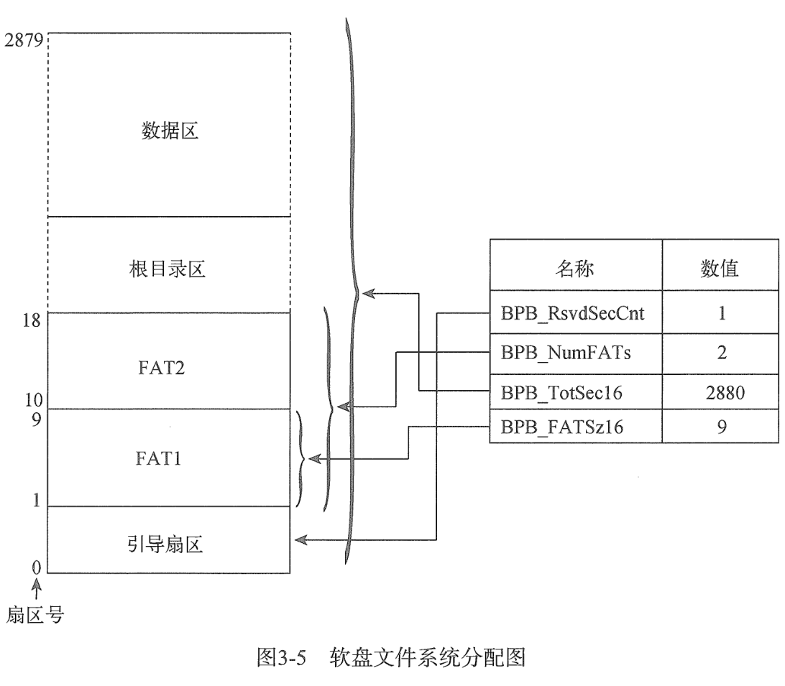

#### FAT表

FAT12文件系统以簇为单位分配数据区的存储空间。**文件在FAT类文件系统存储单位是簇**。FAT表项位宽与FAT类型有关。

#### 根目录区和数据区

根目录区只能保存目录项信息，数据区不但可以保存目录项信息，也可以保存文件内数据。

| 名称         | 偏移 | 长度 | 描述                  |
| ------------ | ---- | ---- | --------------------- |
| DIR_Name     | 0x00 | 11   | **文件名8B,扩展名3B** |
| DIR_Attr     | 0x0B | 1    | 文件属性              |
| 保留         | 0x0C | 10   | 保留位                |
| DIR_WrtTime  | 0x16 | 2    | 最后一次写入时间      |
| DIR_WrtDate  | 0x18 | 2    | 最后一次写入日期      |
| DIR_FstClus  | 0x1A | 2    | 起始簇号              |
| DIR_FileSize | 0x1C | 4    | 文件大小              |

一个目录项**32B**

#### BIOS中断

不同硬件使用不同的**中断号**，为了区分同一硬件的不同功能，使用寄存器**AH**指定具体的功能编号。

[BIOS int 13H中断介绍_jena_wy的博客-CSDN博客_int13h](https://blog.csdn.net/wyyy2088511/article/details/118943195)

#### 实模式内存布局

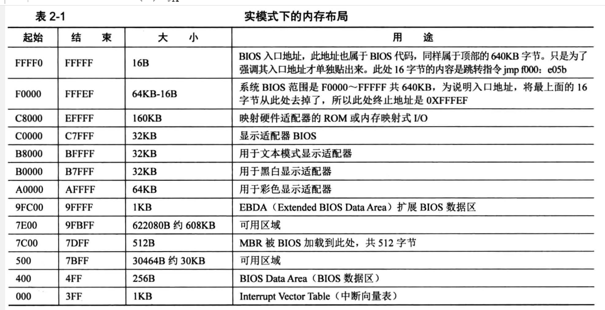

| FAT项 | 实例值 | 描述                                                         |
| ----- | ------ | ------------------------------------------------------------ |
| 0     | FF0h   | 磁盘标识，低字节与BPB_Media保持一致                          |
| 1     | FFFh   | 现在大部分操作系统的FAT类文件系统驱动都直接跳过TODO:为什么？？？ |
| 2     | 003h   | **X**                                                        |
| 3     | 004h   | **X**                                                        |
| n     | FFFh   | **X**                                                        |
| n+1   | 000h   | **X**                                                        |

TODO:此处扩展，一个簇多个扇区

**X**取值范围:

* 000h，可用簇
* 002h~FEFh，已用簇，标识下一个簇的簇号
* FF0h~FF6h，保留簇
* FF7h，坏簇
* FF8h~FFFh，文件最后一个簇

**zlib**：一种事实上的工业标准，以至于在标准文档中。zlib和DEFLATE常常互换使用，数以千计的应用程序直接或间接依靠zlib压缩函式库，包括：

* linux核心
* libpng
* apache
* OpenSSH、OpenSSL
* FFmpeg
* rsync
* dpkg、rpm包管理器
* Subversion、Git

因为代码的可移植性、宽松的软件许可及较小的内存占用，zlib在许多嵌入式设备。

### A20的历史原因

打开a20的方式和原理

### VBE标准

#### VGA

PC图形显示领域早期，IBM退出的**VGA（Video Graphics Array）**为行业标准

图形处理中如果采用传统的**数据传输方式（什么是传统的方式）**来使高分辨率图像实时显示在显示器上，要求晶振频率达到40MHZ以上，传统电子电路难以达到此速度，若采用专用的图像处理芯片，设计难度大并且成本高（**TODO:所以，到底解决了什么问题？**）

CRT显示器因为设计制造的原因，只能接受模拟信号，VGA接口就是显卡上输出**模拟信号**的接口。

计算机内部以数字方式生成图像信息，大部分显卡为了兼容VGA，内部提供的数字/模拟转换器转变为R、G、B三原色和行、场同步信号。

#### Super-VGA

根据VGA标准，其他厂商兼容了IBM VGA的BIOS和寄存器，却加入了扩展功能。却又有新的问题：

没有硬件设计标准，软件开发者面对各种不同的Super VGA硬件架构

#### VBE

作为各种Super VGA显示卡的统一软件接口，可以使应用软件和系统软件在较大的范围内利用扩展VGA可用的优势。

| HDMI                                 | VGA                            |
| ------------------------------------ | ------------------------------ |
| High Definition Multimedia Interface | Video Graphics Array           |
| 2002年底退出，日立、索尼、东芝       | IBM                            |
| 数字数据信号                         | 模拟信号                       |
| 对串扰不敏感，可能会受到电磁场干扰   | 很容易受到串扰和干扰           |
| 一根电缆传输视频、音频信号           | 不能一根电缆传输视频、音频信号 |

[BIOS中断大全,小甲鱼 - 鱼C论坛 - Powered by Discuz! (fishc.com.cn)](https://fishc.com.cn/blog-9-810.html)


# 深入理解Linux内核

## 绪论

### 1.linux特点

所有商业版本都是**SRV4或4.4BSD**的变体，并且都**趋向于遵循某些通用标准**，诸如**IEEE的POSIX**（Portable Operating Systems based on Unix）和X/Open的CAE（Common Applications Environment）(TODO：实际发展应用场景)

现有标准仅仅指定了API，**即指定了用户程序应当运行的一个已定义好的环境**。并没有对**内核的内部设计**施加任何限制。

Linux内核2.6版本的目标是遵循**IEEE POSIX**。这意味着在Linux下，**很容易编译和运行**目前现有的大多数Unix程序。此外，Linux包括了现代Unix操作系统的全部特点，诸如虚拟存储、虚拟文件系统、轻量级进程、Unix信号量、SVR4进程间通信，支持对称多处理器。

Linux设计上的特点：

* Monolithic kernel，庞大的、自我完善的的程序，由几个逻辑上独立的成分构成。大多数商用Unix变体也是**单体结构**。
* 编译并静态连接的传统Unix内核，大部分现代操作系统可以动态地装载和卸载部分内核代码（如驱动程序），通常叫做模块。**Linux能自动装载和卸载模块**。主要地商用Unix变体，只有SVR4.2和Solaris内核有此特点。
* 内核线程，一些Unix内核，如Solaris和SVR4.2/MP，被组织成一组内核线程（什么意思）。内核线程是一个能被独立调度地执行环境，也许与用户程序有关，也许仅仅执行一些内核函数。Linux内核以一种**十分有限的形式**（TODO:什么意思）使用内核线程来周期性地执行几个内核函数。
* 多线程应用程序，用户程序是根据很多**相对独立的执行流**来设计的，而这些执行流之间共享应用程序的大部分数据结构。一个多线程应用程序由很多的轻量级进程（**LWP**）组成，可能对共同的地址空间、共同的物理内存页、共同打开的文件进行操作等等。Linux定义了**自己的轻量级进程版本**，与SVR4、Solaris等其他操作系统上所使用的类型有所不同。当LWP的所有商用变体都基于内核线程时，Linux却把轻量级进程当作基本的**执行上下文**。**多线程有多种实现方式**
* 抢占式内核
* 多处理器支持，几种Unix变体都利用了多处理器系统，Linux2.6支持不同存储模式的对称多处理SMP，包括NUMA。
* 文件系统，有了强大的**面向对象虚拟文件系统技术**（为Solaris和SVR4所采用），把外部文件系统移植到Linux比移植到其他内核相对容易。
* STREAMS,尽管大部分的Unix内核包含了SRV4引入的Streams I/O子系统，并且已变成编写设备驱动程序、终端驱动程序以及网络协议的首选接口，但是Linux没有（**TODO**:是否因为效率）

Linux的优势：

* Linux的**所有成分**可以充分的**定制**；
* Linux可以运行在**低档、便宜的硬件平台**上；
* 充分的挖掘了硬件部分的特点，Linux的主要目标是效率，所以，商用系统的许多设计选择由于有降低性能的隐患而被舍弃，如**STREAMS I/O子系统**
* Linux内核非常小和紧凑
* Linux与很多通用操作系统高度兼容

### 2.硬件依赖性

Linux试图在硬件无关的源代码与硬件相关的源代码之间保持清晰的界限，为了做到这点，**在arch和include目录下包含了23个子目录**，以对应Linux所支持的不同硬件平台。

### 3.linux的版本管理

**TODO:**

### 4.操作系统基本概念

* 多用户系统，操作系统必须利用**CPU特权模式相关的硬件保护机制**，否则，用户程序将能直接访问系统电路并克服强加于它的这些限制。
* 用户、用户组
* 进程，一些操作系统只允许有非抢占式进程，意味着只有当进程自愿放弃CPU时，调度程序才被调用；而多用户系统中的进程必须时抢占式的，操作系统记录每个进程占有的CPU时间，并周期性地激活调度程序。
* 内核体系结构，大部分Unix内核是单体结构：每一个内核层都被集成到整个内核程序中，并代表当前进程在内核态运行。相反，微内核只需要内核有一个很小的函数集，通常包括**几个同步原语、一个简单的调度程序和进程间通信机制**。尽管所有学术研究都是面向微内核的，但是这样的操作系统比单块内核效率低。微内核迫使程序必须通过定义**明确而清晰的接口**与其他层交互，并且微内核能更加充分的利用RAM。**为了达到微内核的效果而又不影响性能**，linux提供了模块，模块是一个目标文件，其代码可以运行时链接到内核或从内核解除链接。**这种目标代码通常由一组函数组成，用来实现文件系统、驱动程序或其他内核上层功能。**

### 5.Unix内核概述

进程是动态的实体，在系统内通常只有有限的生存期。**创建、撤销及同步现有进程的任务都委托和内核中一组例程**完成。

除了用户进程，Unix系统还包括几个特权进程，具备以下特点：

* 以内核态运行在内核地址空间
* 不与用户直接交互，因此不需要终端设备
* 通常在系统启动时创建，然后一直处于活跃状态知道系统关闭。
* 可重入内核，所有的Unix内核都是可重入的。意味着若干个进程可以同时在内核态下执行。
  * 提供可重入的一种方式是编写函数（**可重入函数**），这些函数只能修改局部变量，而不能修改全局数据结构。但是可重入内核应该可以包含**非重入函数**，并且利用**锁机制保证一次只有一个进程执行一个非重入函数**。
  * **内核控制路径**表示内核处理系统调用、异常或中断所执行的指令序列，当
* 进程地址空间，每个进程运行在它的私有地址空间。在用户态下运行的进程涉及到私有栈、数据区和代码区。在内核态运行时，进程访问内核的数据区和代码区，但使用另外的私有栈。
* 同步和临界区。同步的方法：
  * 非抢占式内核
  * 禁止中断
  * 信号量，在单处理器和多处理器系统都有效。信号量仅仅是与一个数据结构相关的计数器。所有内核线程在试图访问这个数据结构之前，都要检查这个信号量。一个整数变量、一个等待进程的链表、两个原子方法（down、up）。**TODO:信号量的问题**
  * 自旋锁，单处理器环境无效
* 信号和进程间通信。
  * **Unix信号**提供了把**系统事件**报告给进程的一种机制。每种事件都有自己的信号编号。
  * 系统事件分为两种类型：异步通知（ctrl+c）、同步通知（进程访问非法内存时，内核会发送sigsegv）
  * POSIX定义了大约20种不同的信号，**有两种是用户自定义的**（用户态下**进程通信和同步**的原语机制）
  * 进程可以以两种方式对信号做出反应：忽略该信号、异步地执行一个指定的过程。
  * 如果进程不指定处理方式，内核会根据信号的编号执行一个默认操作，默认操作有以下5种：
    * 终止进程
    * 将执行上下文进程地址空间的内容写入一个文件（core dump）,并终止进程
    * 忽略信号
    * 挂起进程
    * 如果进程被暂停，则恢复它的执行
  * sigkill、sigstop不能直接由进程处理，也不能由进程忽略
  * AT&T的Unix System V引入了用户态下其他种类的进程间通信机制：**信号量、消息队列、共享内存**，统称为**System V IPC**。
  * 内核把它们作为IPC资源来实现：进程要获取一个资源，可以调用shmget、semget或msgget系统调用。与文件一样，**IPC资源是持久不变的**，进程创建者、进程拥有者或超级用户进程必须显式释放这些资源。
  * POSIX标准定义了一种基于消息队列的IPC机制（**即POSIX消息队列**，对应用程序提供一个**更简单基于文件**的接口）。
  * 共享内存为进程之间交换和共享数据提供了**最快**的方式。共享内存的实现依赖**于内存对进程地址空间**的实现。
* 进程管理。
  * 僵死进程，当子进程执行exit调用之后（变成僵尸进程），会发送sigchild给父进程，父进程调用wait来清理残存的东西，但是如果父进程忽略了这个信号，子进程占用的残存资源就永远得不到释放。
  * 当一个进程终止时，内核改变其所有子进程的进程描述符指针，使其称为init的孩子，会定期调用wait来清理。
  * 进程组概念，**ls | sort | more**。每个进程描述符包括一个包含**进程组ID**,每一个进程组可以有一个领头进程（**其PID和进程组ID相同**），新创建的进程最初被插入到其父进程的进程组中。
  * **登录会话**。进程组中所有进程必须在同一登录会话中。一个登录会话可以让几个进程组同时处于活动状态，其中，只有一个进程组一直处于前台。
* 内存管理。
  * 虚拟内存（逻辑层），处于应用程序的**内存请求**与**硬件内存管理单元**（MMU）之间。现代CPU包含了能自动把虚拟地址转换为物理地址的**硬件电路**。
  * 所有Unix操作系统都将RAM划分为两部分，**其中若干字节**用于存放内核映像（**内核代码和内核静态数据结构**），其余部分通常由虚拟内存管理，可能用于以下几个方面:
    * 内核对缓冲区、描述符及其他动态内核数据结构的请求
    * 进程对一般内存区的请求及对文件内存映射的请求
    * 作为磁盘的缓存来提高读写性能
  * 虚拟内存系统必须解决的一个主要问题是**内存碎片**。
  * **Kernel Memory Allocator**
  * 所有现代Unix系统都采用请求调页（**demand paging**）的内存分配策略。即当进程访问一个不存在的页时，触发缺页异常，异常处理程序找到影响的内存区，分配空闲页，并用适当的数据初始化。
  * 虚拟地址空间也采用了其他更有效的策略，如**写时复制**，例如进程创建时，内核仅仅把父进程的页框赋给子进程的地址空间，但是把这些页框标记为**只读**，一旦父或子进程试图修改页的内容时，一个异常就会产生，异常处理程序把新页框赋给受影响的进程，并用原来页的内容初始化新页框。
  * 物理内存用作磁盘和其他设备的高速缓存。
* 设备驱动程序

## 内存寻址

**如今的微处理器包含的硬件线路使内存管理既高效又健壮，所以编程错误就不会对该程序外的内存产生非法访问。**

### 1.linux中的分段

linux设计的目标是可以移植到绝大多数流行的处理器上，而RISC体系结构对分段支持很有限

2.6版本的linux只有在x86结构下才使用分段

### 2.linux GDT

单处理器系统只有一个GDT，而多处理器系统中每个CPU对应一个GDT。

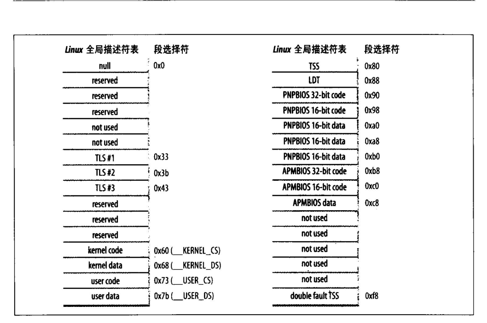

包含18个段，14个空的、未使用的或保留的项（**插入未使用的项是为了使经常一起访问的描述符能够处于同一个32字节的硬件高速缓存**）。其中18段：

* 用户态、内核态的代码段、数据段
* TSS段，每个处理器一个
* LDT,通常被所有进程共享
* 3个局部线程存储，允许多线程应用使用最多3个局部于线程的数据段
* 与高级电源管理（**APM**）相关的3个段，APM驱动程序调用bios功能时，可以使用的段
* 与支持即插即用（**PnP**）功能的BIOS服务程序相关的5个段
* 被内核用来处理"双重错误"异常的页数TSS段

系统中每个处理器都有一个GDT副本，除少数几种情况以外，所有GDT副本都存放相同的表项。

### 3.Linux LDT

**大多数用户态程序都不使用LDT**

### 4.硬件提供的分页

把线性地址映射到物理地址的数据结构称为页表，页表存放在主存中，并在启用分页单元之前必须**由内核对页表进行适当的初始化**。从80386开始，所有的x86处理器都支持分页。

* 常规分页，从80386开始，Intel处理器分页单元处理4KB的页。**32位线性地址 = 目录（10位） + 页表（10位） + 偏移（12位，即4KB）**。

  使用这种2级模式的目的在于减少每个进程页表所有内存。二级模式通过只为进程使用实际的那些虚拟内存请求页表来减少内存容量。正在使用的页目录的物理地址存放在控制寄存器**cr3**中。

  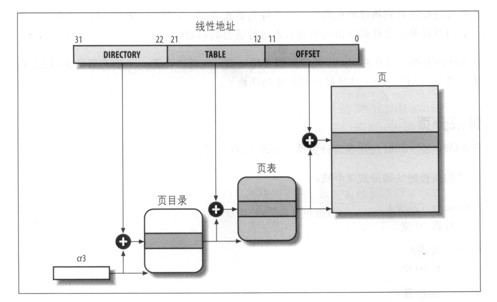

  * 页目录项和页表项都有同样的结构
    * present标志，如果为1，所指的页（或页表）就在主存中，如果为0，分页单元就把该线性地址存放在cr2寄存器中，并产生14号缺页异常。**如果这个字段指向一个页目录项，相应的页框就含有一个页表，如果指向一个页表，对应的页框就含有一页数据**。
    * accessed标志，每当分页单元对相应页框进行寻址时就设置这个标志。由操作系统重置此标志。
    * dirty标志，只用于页表项，对一个页框进行些操作时就设置这个标志。由操作系统重置。
    * read/write标志，页或页表的存取权限。
    * user/supervisor标志，访问页或页表所需的特权级
    * pcd和pwt标志，控制硬件高速缓存处理页或页表的方式
    * page size标志，TODO:
    * global标志，TODO:

* 扩展分页，从Pentium模型开始，x86处理器引入**扩展分页**，允许页框大小为**4MB**

  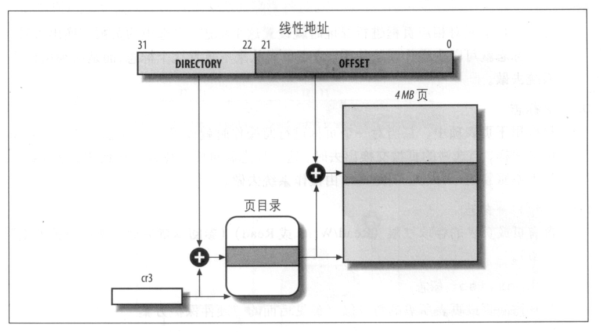

  这种情况下，内核可以不用中间页表进行地址转换，从而节省内存并保留TLB项。通过设置页目录项**page size**标志启用扩展分页功能。**32位线性地址 = 目录项（10位）+ 偏移（22位）**。

  **通过设置cr4寄存器的PSE标志能使扩展分页于常规分页共存**（怎么个共存法？？？TODO:）

* 物理地址扩展分页（**PAE**）机制。**处理器所支持的RAM容量受连接到地址总线上的地址管脚数限制**。Intel通过在它的处理器上把管脚数从32增加到36位，从Pentium Pro开始，Intel所有处理器寻址能力达64GB。**此时只有引入一种新的分页机制把32位线性地址转换为36位物理地址才能使用增加的物理地址**。

  从Pentium Pro开始，Intel引入一种PAE的机制（另外一种叫PSE-36的机制从Pentium II引入，但**linux中没有采用**）。

  通过设置cr4寄存器的PAE位激活PAE，页目录项中page size启用大尺寸页（**3MB**）

  Intel为了支持PAE已经改变了分页机制：

  * TODO:

* 64位系统中的分页。32位微处理器**普遍采用两级分页**，然而两级分页并不适用64位系统。所有64位处理器的硬件分页系统都使用了额外的分页级别，使用的级别的数量取决于处理器的类型：

  | 平台   | 页大小 | 寻址位数 | 分页级别数 | 线性地址分级      |
  | ------ | ------ | -------- | ---------- | ----------------- |
  | alpha  | 8kb    | 43       | 3          | 10 + 10 + 10 + 13 |
  | ia64   | 4kb    | 39       | 3          | 9 + 9 + 9 + 12    |
  | ppc64  | 4kb    | 41       | 3          | 10 + 10 + 9 + 12  |
  | sh64   | 4kb    | 41       | 3          | 10 + 10 + 9 + 12  |
  | x86_64 | 4kb    | 48       | 4          | 9 + 9 + 9 +9 + 12 |

  **linux提供了一种通用分页模型，适合于绝大多数所支持的硬件分页系统**。

### 5.硬件高速缓存

当今微处理器时钟频率接近几个GHZ,是DRAM芯片时钟周期的数百倍。为了缩短速度不匹配，引入了硬件高速缓存内存。

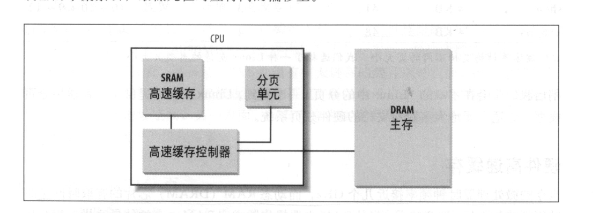

为此，X86体系结构引入了一个行的新单位，行由几十个连续的字节组成，以**脉冲突发模式**在慢速DRAM和快速的用来实现高速缓存的片上SRAM之间传送（TODO:什么是脉冲突发模式，burst mode???）

**高速缓存内存**存放内存中真正的行；**高速缓存控制器**存放一个表项数组，每个表项对应**高速缓存内存**中一个行。

每个表项由一个标签（**tag**，这个缓存行映射的内存单元的信息（高速缓存控制器用））和描述高速缓存行状态的标志（**flag**）组成。

访问一个RAM存储单元时，CPU从物理地址中**提取出子集的索引号**，然后把**子集中所有行标签与物理地址的高几位**相比较,

命中缓存后，对于写操作，控制器可能采取两种策略：**write-through**、**write-back**。

* **write-through**，既写RAM，也写高速缓存行
* **write-back**,只更新高速缓存行，不改变RAM。只有当**CPU执行一条要求刷新高速缓存表项的指令**或者当一个**flush硬件信号**（高速缓存不命中）产生，会把高速缓存行写回到RAM.

没有命中缓存时，**高速缓存行被写回到内存**（是否是子集的所有缓存行TODO:？？？）,如果有必要，会把正确的行从RAM中取出并放到高速缓存的表项中。


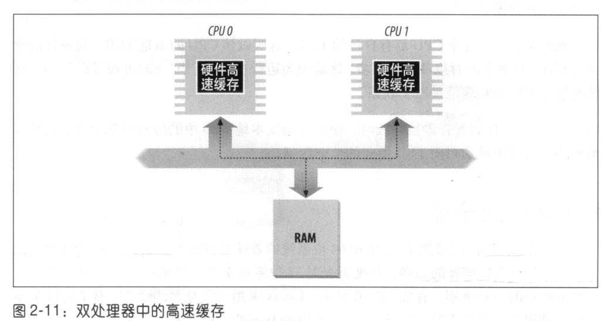

多处理器系统的每一个处理器都有一个单独的硬件高速缓存。只要有一个CPU修改了它的硬件高速缓存，就必须检查同样的数据是否包含在其他核心的硬件高速缓存中（**这一切在硬件层面做**）。

高速缓存技术发展，L2-cache、L3-cache出现。**多级高速缓存之间的一致性由硬件实现**。**Linux忽略硬件细节并假定只有一个单独的高速缓存**。

处理器的cr0寄存器的**CD**标志位用来启用或禁用高速缓存。**NW**标志指明是通写还是回写。

Pentinum处理器让操作系统把不同的高速缓存策略和每一个页框相关联。每个页目录项、页表项都有这两个标志Page Cache Disablt、Page Write-through。

Linux清除了所有页目录项和页表项的**PCD、PWT**标志。

**TLB**:当一个线性地址被第一次使用时，通过慢速访问RAM的页表计算出相应的物理地址，物理地址被存放在一个TLB表项。多处理器系统中，每个CPU都有自己的TLB,TLB中的对应项不必同步。但是当CR3寄存器被修改时，硬件自动使本地TLB所有项无效（TODO:???）.

### 6.linux中分页

**采用了一种同时适用于32位和64位的普通分页模型**。两级页表对32位系统已经足够，但64位系统需要更多数量的分页级别。直到2.6.10版本，都采用三级分页，从2.6.11版本之后，采用四级分页模型。

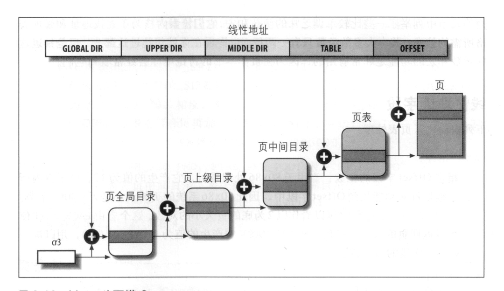

* Page Global Directory
* Page Upper Directory
* Page Middle Directory
* Page Table

其中每一部分的大小都和具体的计算机结构有关

* 对于没有启用PAE的32位系统，两级页表足够了，Linux通过使得PUD、PMD位全为0。内核为PUD、PMD保留了一个位置，通过把它们的页目录项设置为1，并把这两个目录项映射到全局目录的一个适当目录项而实现
* 对于PAE，使用三级页表，PGD对应x86的PDPT，取消了PUD，PMD对应页目录
* 64位系统使用三级还是四级页表取决于硬件对线性地址的位的划分

### 7.linux中页表处理相关宏

**PAGE_SHIFT**:指定offset字段的位数，如4k页就是12位

**PMD_SHIFT**：offset和table字段的总和，例如两级页表就是22位

**PUD_SHIFT**：,,,

**PGD_SHIFT**：,,,

PTRS_PER_PTE，PTRS_PER_PMD，PTRS_PER_PUD，PTRS_PER_PGD：分别用于计算页表、页中间目录项，页上级目录和页全局目录中表项的个数。

### 8.物理化内存布局


# X86_64体系探索和编程

## **1.大端序与小端序**

**LSB**(Least Significant Bit)最低有效位

**MSB**(Most Significant Bit)最高有效位,可用作符号位

计算机组织存放中,地址由低到高对应两种排列

由LSB到MSB,为**小端序**;由MSB到LSB,为**大端序**.x86/x64使用小端序

## **2.数据类型**

x86/64体系中,指令处理的数据分为**fundamental**和**numeric**两种大类.

**基础类型**包括byte word dobuleword quadword,**代表指令一次性处理的数据宽度**.

**numeric**使用在运算类指令上,有以下四类:

* **Integer**,整数会区分**signed**和**unsigned**.计算机无法判断,而是根据不同的场景.做出假定,按假定的执行.

  x86机器上,对机器的加减法运算过程不会识别signed和unsigned,而是根据两种的运算结果进行相应eflags设置

  x86的乘法和除法指令进行了区分(mul imul  div idiv).所有的条件转移,条件传送,条件设置指令会对指令运算的结果进行signed与unsigned的区分

  RISC体系机器,普遍会在指令层做假定运算,如add  addu

* **floating-point数**  TODO:???

* **BCD码**,一个十进制数的每一位,用8位的二进制编码  (**TODO**:为什么有BCD码???)

* **SIMD数据**   TODO:???

## **3.探测处理器**

**CPUID**指令,80486才开始支持,**eflags**的21位,标识是否支持此指令.

leaf,如01号功能;**sub-leaf**,对于一些复杂的查询,需要一个辅助的子号.**EAX**输入主叶号,**ECX**提供子叶号.

从CPUID指令获得的信息有两大类,basIc(**基本**)和extended**(扩展**),每一类信息都有最大功能号限制.

返回的相应信息放在eax,ebx,ecx以及edx寄存器中,这些信息是**32位**的.

**CPUID**指令被用来查询处理器所支持的特性,因此CPUID所支持的**leaf数量是与处理器相关的**.

**00H** leaf查询,最大的基本功能号返回在**EAX**寄存器

最大扩展功能号也能查询,同样是**EAX**返回

功能号0也返回处理器厂商名,从Intel机器返回,ebx-"Genu",ecx-"ntel",edx-"inel",组合就是GenuineIntel,AMD则是"AuthenticAMD"

如果eax输入的leaf超过了最大功能号,则返回最大功能号查询的结果

**处理器型号**(family model与stepping)

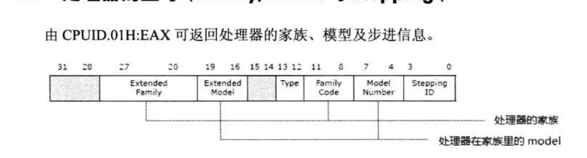

```
if(Family == 0FH){	
	DisplayFamily = ExtendedFamily + Family
}else{
	DisplayFamily = Family
}
```

只在**Pentium4**以后处理器才支持ExtendedFamily

```
if(Family == 06H || Family == OFH){
	DispalyModel = ExtendedModel << 4 + Model;
}else{
	DisplayModel = Model;
}
```

**DisplayFamily_DisplayModel**这种描述的方式区别处理器型号

在**Intel**的机器上,**06H家族和0FH**家族是两大派系,**0FH**家族典型指Pentinum4处理器系列;**06H**家族很庞大,从早期的Pentium Pro,PentinumII到今天Westmere/SandyBridge微架构的i7/i5/i3处理器都属于06H家族,05H则属于Pentium处理器.

**CPUID.80000008H叶**,可以获取处理器所支持的最大物理地址和线性地址的宽度

**处理器扩展状态信息**

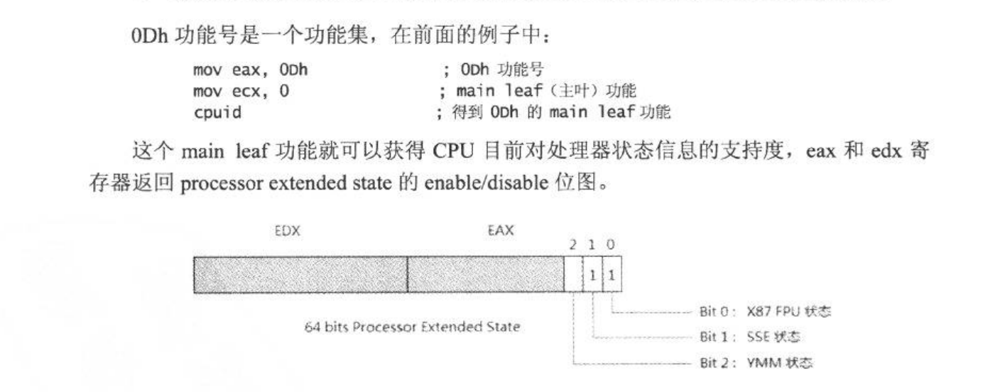

这个**Processor Extended State**值将影响到**XCR0**(**Extended Control Register**)的值

目前x86处理器中(包括Intel和AMD),仅使用低3位.阴影部分为保留位,未来的处理器可能会使用这些位来支持更多处理器状态信息.

XCR0是一个功能开关,用来开启和关闭某些state的保存,OS可以通过**XSETBV**指令对**XCR0**进行相应的设置.

**EAX=01H**号功能将获得处理器的基本信息,eax返回处理器的Model,Family,Stepping等信息.**ecx,edx返回CPU支持的种类繁多的特性**.

其中有些特性是由软件设置的,还有部分特性受到**MSR(Model Specific Register**)的设置影响

**EAX=02H**用来获取CPU的Cache与TLB信息.

## 4.Flags寄存器

在X86/64上,除非使用Pentium4和Athlon64之前的机器,否则Flags都应该被扩展为**64位**

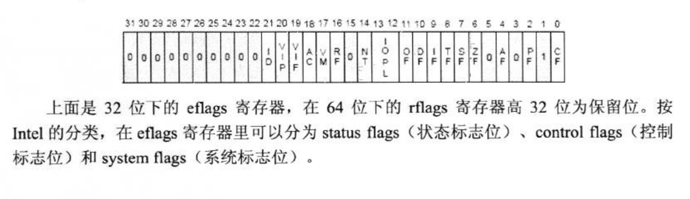

* **控制标志位**:只有一个DF(**Direction Flag**),使用在LODSx,STOSx,MOVSx,SCASx,OUTSx以及INSx这类**串指令**,用于指示串指令的指针方向.

* **状态标志位**:这些标志位反映了指令执行结果的标志值.

  **PF**,奇偶标志位,判断结果值的最低**字节**(低8位),1的个数为偶数被置位(**TODO:有什么用???**)

  **AF**,调整位标志位,当运算时bit3向上借位或进位时,被置位(**TODO:有什么用???**)

  **OF**(溢出)和**SF**(符号)用于**signed数**运算

  **ZF**(零标志位)和**CF**(进位或借位)被用在unsigned数相关的运算中,不会使用**OF**和**SF

* **系统标志位**

  **IOPL**(I/O Privilege Level)标志位,指示I/O地址空间所需要的权限,仅在CPL=0权限下可以修改,**CPL< =IOPL**时,才可以改变**IF**值.

  IOPL控制着程序的**I/O地址空间**访问权,只有在足够的权限下才能访问I/O地址.但是,即使**CPL>IOPL**,也可以在**TSS中I/O Bitmap**,对某些port进行设置,从而访问.

  **TF**和**RF(恢复)**是配合一起使用的,当TF被置位,**执行完**下一条指令时,处理器进入**#DB**处理,因为single-debug属于trap类型的#DB异常

  处理器在进入#DB异常处理程序时,会将TF清0,**以防止在中断处理程序内发生single-debug**,**RF**标志也会被清零,但是进入**#DB**中断处理程序前还是会将**eflags**压入栈中,在**#DB**处理程序中,在iret返回前,应该将stack中RF置为1,以确保返回到被中断的指令时能顺利执行

  由于引发#DB的异常不止single-debug,可以是fault类型或trap类型,因此在#DB处理程序中,有责任确保返回返回被中断的执行能得到正常执行,**通过设置stack中eflags中RF为1,让iret返回前更新eflags寄存器**.

  处理器会在每一条指令执行完毕后将RF标志清0

  **RF**控制处理器对指令断点的响应,置1则暂时禁用,**fault类型的异常会返回中断指令在尝试重新执行,而trap类型的异常,会返回到被中断指令的下一条指令.**

  **NT**(Nested Task),被用于处理器提供的task switch场景中.一般由处理器自动维护,但是可以在任何权限下被软件修改(**基本不被linux使用**,64位长模式也不支持)

  **AC**,Align Check,地址对齐检查,只在ring3才会产生#AC异常,属于**fault类型**

  **VM**,标识处理器进入和离开virtual-8086模式,64位模式,处理器不支持virtual-8086

处理器初始化时efalgs值为00000002H,对于某些标志位,可以使用专门指令设置,

## 5.控制寄存器

x64上**CR**(控制寄存器)被扩展为64位,CR0~CR15,但是在整个体系的使用中,只使用了CR0,CR2,CR3,CR4以及CR8,其他都是保留的.

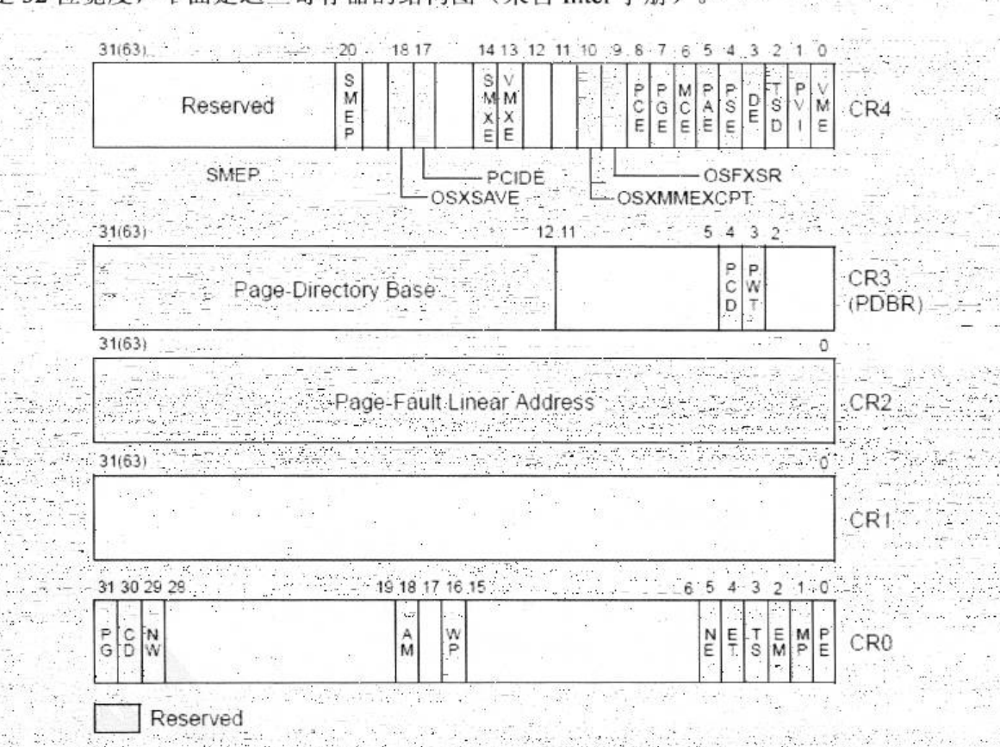


**CR2,CR3**被使用在保护模式的页管理机制,CR3提供整个页转换结构表的基地址.**CR8**被称为**Task Priority Register**,只有**64模式**才有效.

**CR8**

低四位提供一个Priority level,范围为**0~15**,控制**处理器可响应的中断级别**.这个中断属于maskable硬件中断.

在X86/64体系中断向量有256个,因此使用了16个中断级别.

软件不能使用0~15作为硬件中断vector值,否则产生错误,所以实际优先级只使用了**1~15**.

CR8是**local APIC**的TPR对外的编程接口,对CR8的更改会影响到local APIC的TPR.

**CR3**   TODO:???

**CR0**

​	**PE**,保护模式标志位

​	x87 FPU单元执行环境涉及的控制位:

​		**NE**,决定异常处理方式

​		**EM**,执行单元模拟位,用软件模拟x87 FPU指令的执行.**如果被置位**,执行x87 FPU指令时,产生#NM(Device Not Availale)异常,指示x87 FPU单元或不可用,由软件在#NM处理程序模拟执行x87 FPU指令.

​		**TS**,Task Switched,当处理器发生task switch,会对efalgs.NT置位,还会对CR0.TS置位,此位的清除是软件的职责,可以使用clts清除

​		**MP**,Monitor Coprocessor控制位,为了监控wait/fwait指令的执行.

​		OS系统在切换进程时,需要保存被切换进程的context,**但是并不包括x87 FPU和SSE指令**(部分软件根本不会使用)

​	**PG**:页管理模式,开启页式管理**必须要打开保护模式**,应该要先**构造好整个页表转换结构**

​	**CD**:Cache Disable

​	**NW**:Not Write-through,不维护内存的一致性

**MESI协议**   TODO:

​	**WP**,Write Protect,WP=1时,即使拥有**supervisor**权限(**0,1,2**)也不能修改read-only页

​	**AM**,CR0.AM=1且eflags.AC=1时,可以使处理器开启地址边界对齐检查机制

**CR4**

**EFER**寄存器:为了支持long mode而引入

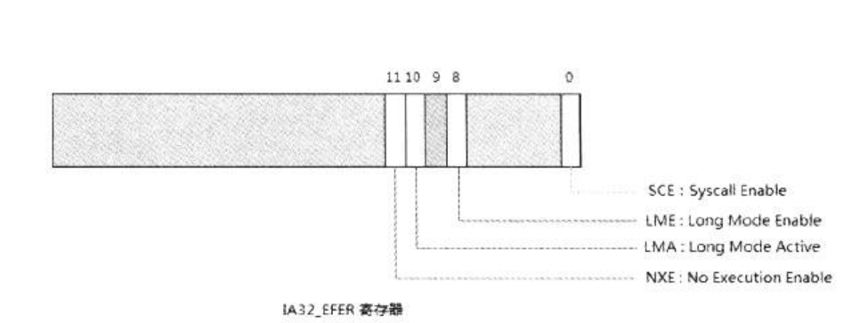

EFER是由AMD首先引进的,是MSR的一员,地址是C0000080H,是x64的基石.

当**LME**置1且**CR0.PG=1**时,处理器才置**LMA**为1,标识long mode处于激活状态

**NXE**=1时,给某些页定义为不可执行的页面

**SCE**=1可以使用syscall/sysret指令快速切换到kernel组件

## 6.MSR

Model-Specific Register,这类寄存器数量庞大,**Intel和AMD实现程度也不相同**,并且在Intel的不同架构上也可能不同,因此**MSR是与处理器model相关的**.

MSR提供对**硬件和软件相关功能**的一些控制.能提供对一些**硬件和软件运行环境的设置**,许多MSR在**BIOS运行期间**设置.

* performance-monitoring counters(性能监视计数器)
* debug extensions(调试扩展的支持)
* machine-check exception capability(机器检查的能力)
* MTRR(实现memory类型与范围定义的寄存器)
* thermal and power management(功耗与温控管理)
* instruction-specific support(特殊指令支持)
* processor feature/mode support(处理器特色和模型管理支持)

AMD部分的MSR与Intel是兼容的,但是少了许多特色功能

每个MSR都有它的地址值

## 7.实地址模式

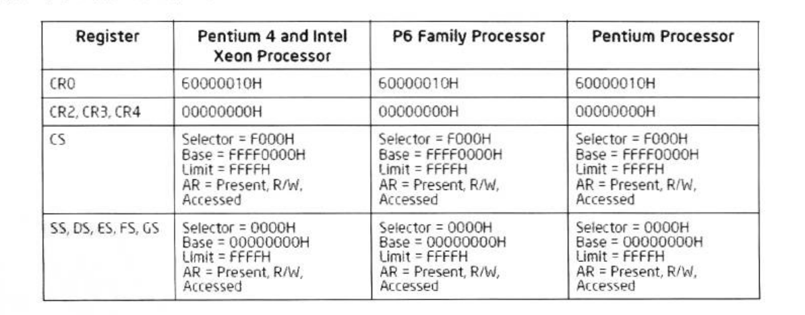

CR0被初始化为60000010H,段的dpl=0,G=0(段限为64k),D/B=1(默认操作数都是16位),p=1,等等

这些属性限制了处理器在实模式下的访问能力.由于在实模式下,处理器并不使用GDT和paging这些系统数据结构进行管理,处理器无法改变这些属性.

## 8.SMM模式

**System Management Mode**,特别的处理器工作模式。运行在独立空间里，具有自己独立的运行环境。

**SMM**用来处理一些例如power管理、hardware控制这些这些比较底层，比较紧急的事件，独立于OS运行。

这些事件使用**SMI**（System Managment Interrupt）来进行处理，因此进入SMI处理程序也就是进入了SMM。SMI是不可屏蔽的外部中断，并且不可被重入。

Intel明确说明SMM只能通过接受到SMI信号，SMI信号有两种产生途径。

* 处理器从SMI# pin上接受到SMI信号。
* 处理器从system bus上接受到SMI message。

SMI信号可以从硬件产生，也可以从软件发起。在BIOS初始化期间一般会由BIOS主动发起一个SMI#信号主动进入SMM，进行一些必要的处理。

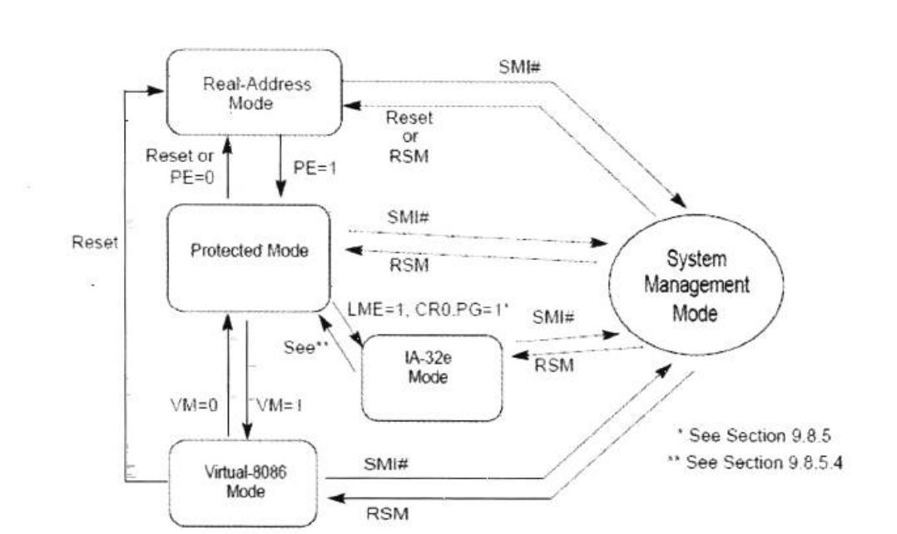


## 9.保护模式

保护模式下实施了种种访问限制,对一些违例访问的行为处理器长生相应的异常进行提示和处理。

x86的**段式**管理和**分页**管理是实施保护措施的手段和途径。而分段机制和分页机制下实现了**不同的内存管理模式和访问控制**。

在**x64体系**下，long mode刻意弱化了一些段机制的限制行为，**将重点放在分页模式**。

保护模式的权限检查中使用3种权限类型：

* **CPL**(Current Privilege Level)，当前权限级别，指示**当前运行代码在哪个权限级别**。
* **DPL**(Descriptor Privilege Level)，指示访问segment所需要的权限级别。**Gate描述符的DPL值指示访问Gate的权限**，并不代表由Gate所引用Segment的。
* **RPL**(Requested Privilege Level)，RPL存放在访问者所使用Selector的位0和位1，指示着发起访问的访问者使用什么样的权限对目标进行访问。

段式管理用到硬件资源：

* CR0、CR4控制寄存器
* GDTR与LDTR（可选），段描述符表寄存器
* IDTR，中断描述符表寄存器
* TR，任务寄存器，linux没有使用硬件切换任务的机制
* 段选择子寄存器，

段式管理用到的系统数据结构：

* GDT和LDT（可选），描述符表
* IDT,中断描述符表
* TSS，任务状态段
* Segment Descriptor,包括System Segment Descriptor，Code/Data Segment Descriptor
* Gate Descriptor,包括Call-Gate,Interrupt-Gate,Trap-Gate以及Task-Gate
* Selector:选择子

用于页式管理用到的资源:

* 4个控制寄存器，CR0,CR2,CR3,CR4
* IA32_EFER
* PML4T(Page Map Level 4 Table),用于long mode
* PDPT(Page Directory Pointer Table)
* PDT(Page Directory Table)
* PT(Page Table)

**PT**（页表）是最低一级的页转换表，最上面的页转换表取决于使用哪种转换模式。

物理地址空间从36位到**MAXPHYADDR**值，MAXPHYADDR一般都会是36位（**TODO:为什么？？？**），**Intel64和AMD64实现了最高为52位**的物理地址。

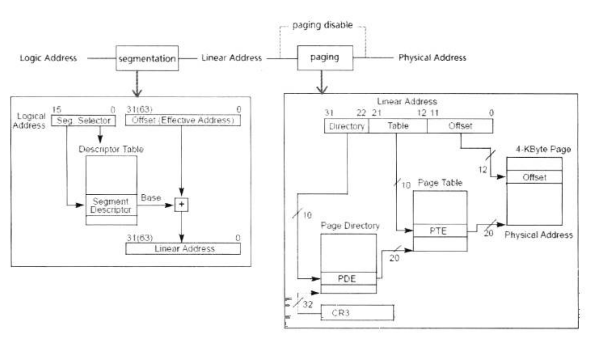

典型的ROM设备映射到物理地址空间的高端和低端地址，处理器第1条指令的指令存放在这个ROM设备里。Video和IGD设备的buffer映射到**A0000H到BFFFFH**的物理地址空间上。**PCIe**等设备映射到物理地址空间的**E0000000H**位置上，**I/O APIC**设备映射到**FEC00000H**以上的位置。经过页式转换形成的物理地址，可以映射到DRAM或外部存储设备Disk上，可以实现更多的memory访问。

当所有段的**base为0，limit为FFFFFFFFH**时，被称为**flat mode**内存管理模式。

Null selector不允许加载到CS及SS寄存器，会产生#GP异常。允许被加载到ES、DS、FS以及GS寄存器中，但是这些寄存器使用Null Selector进行访问时会产生#GP异常。

64位模式下，处理器对Null Selector的使用不检查，允许加载Null Selector到除了cs寄存器外的任何一个段寄存器，以及使用这些Null Selector进行访问。**在3级权限下，允许为SS寄存器加载一个Null Selector**。

处理器隐式为SS寄存器或其他Data Segment寄存器加载一个Null Selector,这些时候是有用的。

* 在retf或iret时，如果发生了权限的改变（**从高权限切换到低权限**），如果ES、DS、FS以及GS寄存器内的DPL低于CPL，那么处理器会加载一个Null Selector,是为了防止低权限代码里对高权数据段进行访问
* long mode下，使用call gate进行调用，发生权限改变（**从低权限切换到高权限**）时
* long mode下，使用INT进行中断调用（或发生中断/异常），发生权限改变（**从低权限切换到高权限**）

后两种情形中，目的是为了在64位代码调用其他更高权限的64位例程时，在返回时可以判断调用者是64位的高权限代码。（TODO:???）

(从0级返回1级，ss为null，从2级返回3级，此时就会**#GP**，这就可以作为一些条件判断的移据)

lgdt指令在**0级权限**执行，必须为他提供一个**内存操作数**,低16位是GDT的limit，高32位是base值

段寄存器：


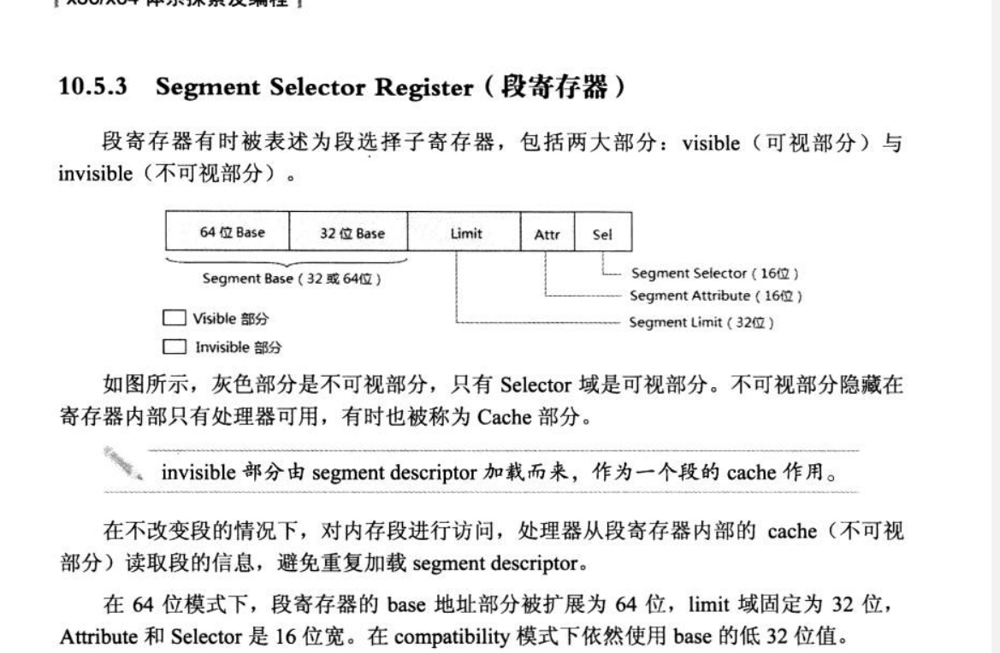

实质上，在x64体系（Intel64和AMD64）的机器上，寄存器宽度本来就是64位，在实模式下低16位可用，在32位保护模式和compatibility模式下，低32位可用

使用mov、pop、lds、les、lss、lfs、lgs可以对DataSegment进行加载

使用jmp、call、retf、iret，int指令，TSS/Task-gate进行切换，使用sysenter/sysexit、syscall/sysret指令会对cs或ss寄存器进行隐式的加载。

在64位模式下，lds、les指令无效，pop ds 、pop es、pop ss指令无效（**TODO:为什么**），使用TSS机制进行任务切换将不再支持。

* 系统描述符
  * 系统段描述符，LDT描述符和TSS描述符
  * 门描述符，call-gate、interrupt-gate、Trap-gate、task-gate
* 非系统描述符
  * 代码段
  * 数据段

**S**域指示了是不是系统描述符

* legacy模式

  每个描述符都是8字节

* long mode模式

  code、data是8字节宽，所有gate描述符是16字节，LDT/TSS是16字节

**code/data段描述符结构**

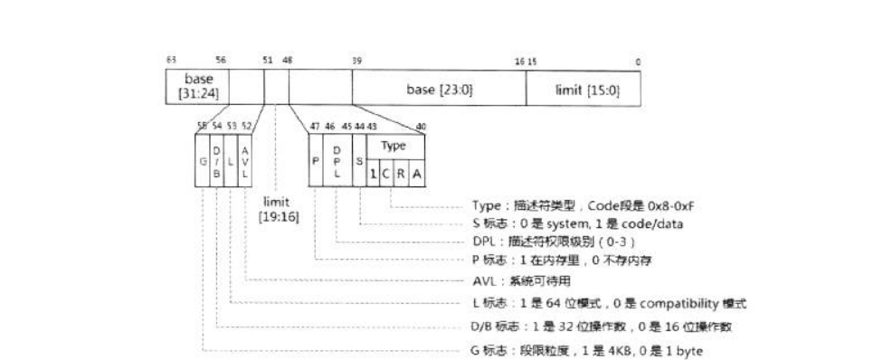

**type域**中**ICRA**，1标识该段可执行并且不可写。**C**=1时代表是**confirm**类型。**A**指示段是否被加载过。**R**指示代码段是否能被读。

当处理器加载descriptor到段寄存器时，处理器会对descriptor执行**自动加lock的行为**。

**confirm**类型代码段**强迫使用低权限或相等权限**（禁止高权限）来运行，进入confirm段不改变当前CPL。

需要保护的代码和数据应该使用non-confirm，反之

**D/B域**，在不同的段有不同的意义，对于代码段，指示默认操作数大小，被称为D标志位（是32位还是16位）。操作数大小可以通过**operand size override**操作改变(**编译器处理，加上指令前缀**)

**L域**，L=1标识64位模式，否则就是compatibilty模式，**L域**需要配合**D域**来使用。

**G域**，指示段界限的粒度，为1标识段限的粒度为4KB，否则为1byte。配合limit域使用，**20位的limit配合G产生32位limit**

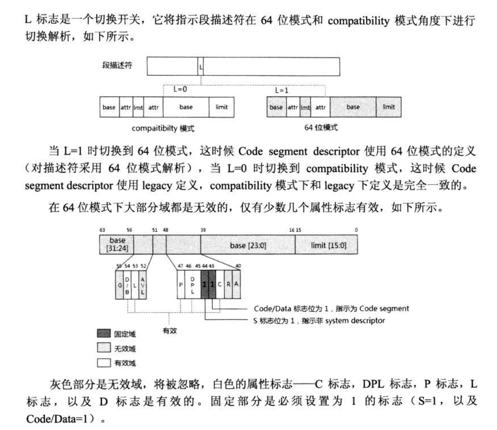

当OS开启了long mode并激活，OS的kernel及其executive组件运行在64位模式，而应用程序可以是32位或64位，运行在32位的应用程序处理器将转入compatibility模式运行。

**代码段寄存器加载**

不像ds寄存器，cs寄存器不能使用mov或pop指令进行直接加载，必须通过**控制权的转移形式**隐式加载(**不但涉及控制权的转移，也涉及权限的检查，以及stack的切换，某些情况还涉及任务的切换**)。

加载代码段寄存器的常规检查：

* 检查selector是否为Null Selector,处理器不允许加载Null Selector
* limit检查，64位不检查selector是否超过limit值
* type域的检查

加载CS寄存器的方式：

* jmp、call跳转，64位模式下，不允许直接使用**far pointer**,需要间接给出，call QWORD far [FAR_POINTER],该内存地址依次存放64位的offset和16位的selector（TODO:为什么不改变CPL）

* call gate加载cs寄存器，可以放在GDT或LDT,但是不能放在IDT

  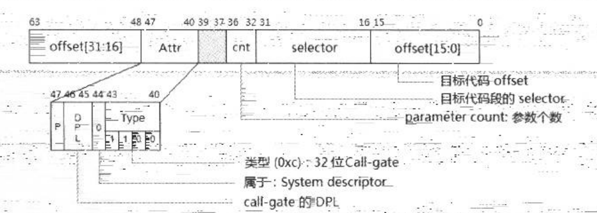

cnt域，5位，指示参数个数，调用者向被调用者传递参数。调用者在自己的栈中压入参数，**处理器根据cnt将调用者的stack中的参数复制被调用者的stack**。

使用**call指令**加载call-gate到cs寄存器之前的检查：		

* CPL <=Call-gate(门描述符)的DPL，RPL<=Call-gate(门描述符)的DPL。**当前运行的代码段必须有权限**访问Call-gate描述符。

* CPL>=Code Segment的DPL(**由低权限进入高权限**)

如果目标代码段是confirm类型，进入高权限代码后，CPL不变

CS.selector.RPL会更新为目标Code segment descriptor的DPL值

当目标代码段是confirm类型时，cs.selector.RPL不会被更新

**DPL--存在于描述符，RPL--存在段选择子，CPL--cs寄存器**

当目标代码是高权限时，CPL会更新为目标代码段的DPL

在long mode下，call指令调用call-gate而引发权限切换，如果处于compatibility模式，**处理器将会切换到64位模式执行**

使用**jmp指令**切换cs段：

如果是non-confirm段，要求CPL===目标代码段的DPL（jmp跳转始终不会发生cpl的切换）

* 使用TSS Selector,TSS描述符只能存放在GDT中

* 使用Task-gate加载cs寄存器

  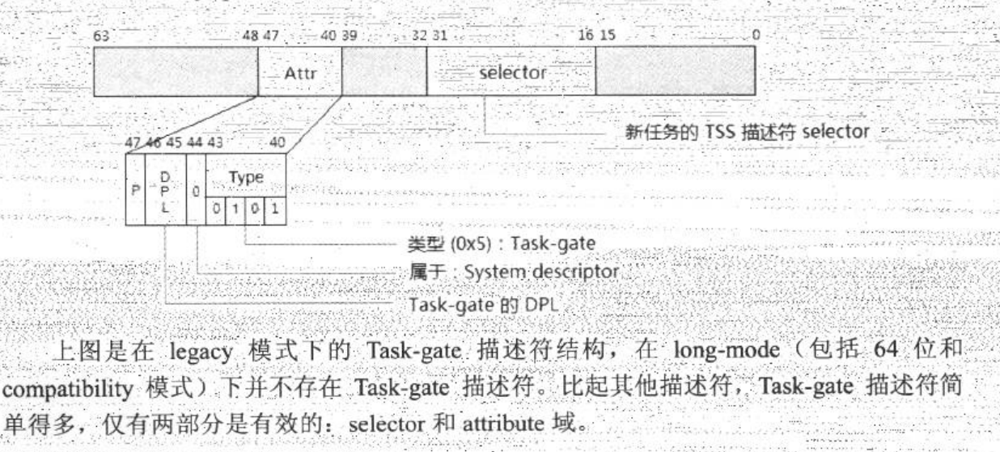

**处理器提供的任务切换机制比较繁琐耗时，现代OS都不使用这种方式切换任务。TSS段的主要作用是为了Stack的切换提供各级权限的stack指针。**

* int指令主动发起调用中断服务例程

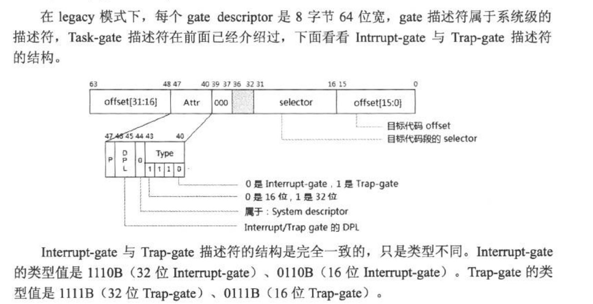

**Interrupt/Trap-gate与Call-gate的异同**：

* 前者不检查RPL，其他都相同
* 前者只能放在IDT，后者只能放在GDT/LDT，不能放在IDT中
* **Interrupt/Trap-gate通过int、int3、into、bound以及发生中断和异常访问。而call-gate通过call/jmp访问**。

在long mode下，只有64位的Interrupt/Gate描述符，类型值我1110B、1111B，**不存在32位和16位**

Interrupt/Trap新增了**IST域**，3位宽，定义一个Interrupt Stack Table指针，**对应于64位TSS的IST1到IST7域**

当IST域为0时，不使用IST机制，将从64位TSS段里相应的RSP0、RSP1以及RSP2域获取RSP指针。

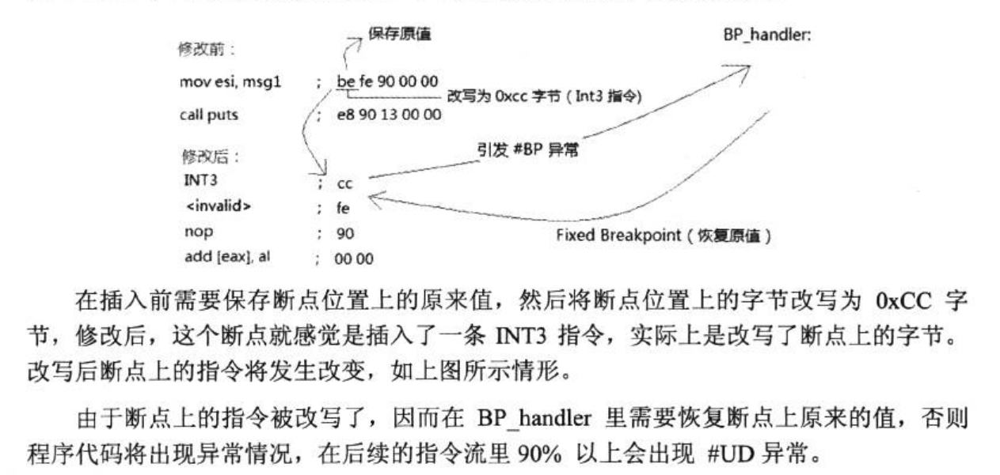

* 使用retf指令

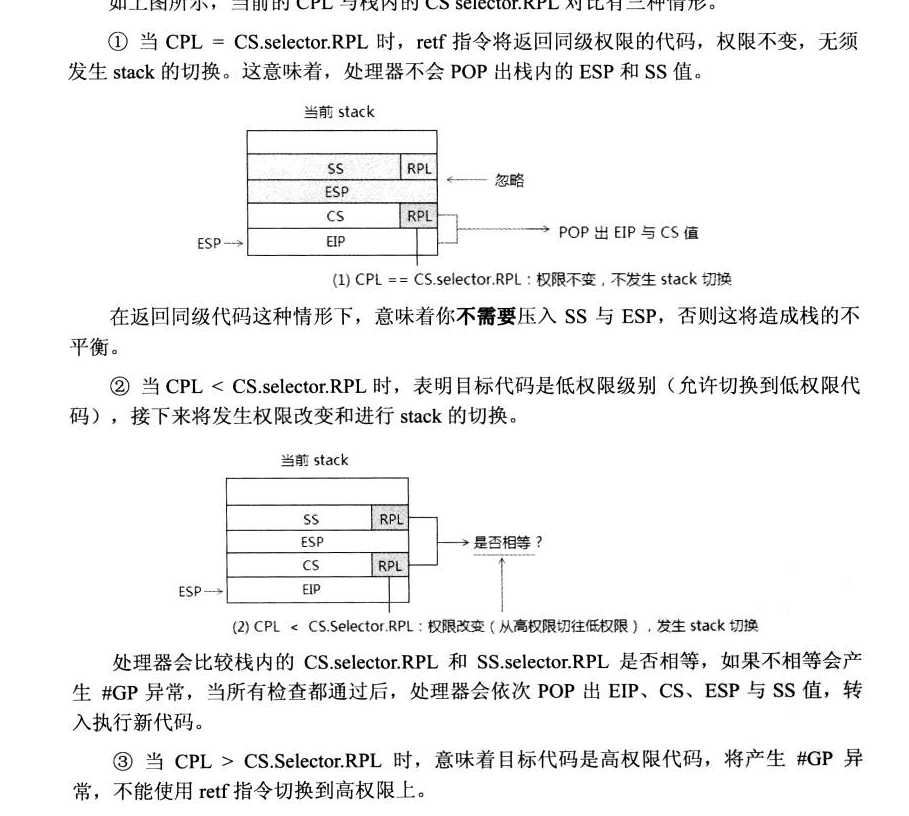

* 使用iret指令，会弹出efalgs寄存器

* sysenter/sysexit指令

  sysenter指令可以执行于任何权限中，进入0级权限代码，处理器会强制性的对cs和ss寄存器进行一些处理

  sysexit指令只能执行在0级权限代码里，处理器同样对cs和ss进行强制的设置。

  **会使用ecx和edx寄存器，3级代码的esp值放在ecx寄存器；3级代码的EIP值放在了edx寄存器**

  # 分页机制

  #### x64体系

处理器通过paging机制可以在32位和48位的虚拟地址上使用36位、40位甚至52位宽的物理地址，**由paging机制提供的各级page-translation table**实现。

| 分页模式                                                    | 小页面 | 大页面 | 巨型页 |
| ----------------------------------------------------------- | ------ | ------ | ------ |
| **32-bit paging**(32位页转换模式)                           | 4K     | 4M     | -      |
| **PAE paging**(Physical Address Extensions)                 | 4K     | 2M     | -      |
| **IA-32e paging**（IA-32e页转换模式，对应AMD64的long-mode） | 4K     | 2M     | 1G     |

**《X86_64体系结构探索与编程》像一坨狗屎一样，让人一点读下去的欲望都没有。**

#### 任务2.熟悉linux命令行操作

[Vmware虚拟化概念原理_曹世宏的博客-CSDN博客_vmware虚拟化](https://blog.csdn.net/qq_38265137/article/details/80370524)


